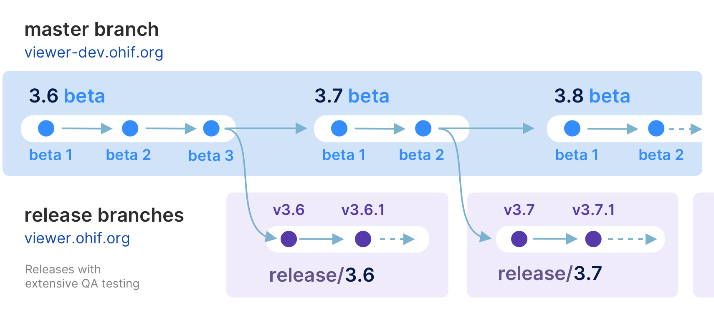

<!-- prettier-ignore-start -->
<div align="center">
  <h1>OHIF Medical Imaging Viewer</h1>
  <p><strong>The OHIF Viewer</strong> is a zero-footprint medical image viewer
provided by the <a href="https://ohif.org/">Open Health Imaging Foundation (OHIF)</a>. It is a configurable and extensible progressive web application with out-of-the-box support for image archives which support <a href="https://www.dicomstandard.org/using/dicomweb/">DICOMweb</a>.</p>
</div>


<div align="center">
  <a href="https://docs.ohif.org/"><strong>Read The Docs</strong></a>
</div>
<div align="center">
  <a href="https://viewer.ohif.org/">Live Demo</a> |
  <a href="https://ui.ohif.org/">Component Library</a>
</div>
<div align="center">
  📰 <a href="https://ohif.org/news/"><strong>Join OHIF Newsletter</strong></a> 📰
</div>
<div align="center">
  📰 <a href="https://ohif.org/news/"><strong>Join OHIF Newsletter</strong></a> 📰
</div>


<hr />

[![NPM version][npm-version-image]][npm-url]
[![MIT License][license-image]][license-url]
[![This project is using Percy.io for visual regression testing.][percy-image]](percy-url)
<!-- [![NPM downloads][npm-downloads-image]][npm-url] -->
<!-- [![Pulls][docker-pulls-img]][docker-image-url] -->
<!-- [](https://app.fossa.io/projects/git%2Bgithub.com%2FOHIF%2FViewers?ref=badge_shield) -->

<!-- [![Netlify Status][netlify-image]][netlify-url] -->
<!-- [![CircleCI][circleci-image]][circleci-url] -->
<!-- [![codecov][codecov-image]][codecov-url] -->
<!-- [](#contributors) -->
<!-- prettier-ignore-end -->


|     |  | |
| :-: | :---  | :--- |
|  | Measurement Tracking | [Demo](https://viewer.ohif.org/viewer?StudyInstanceUIDs=1.3.6.1.4.1.25403.345050719074.3824.20170125095438.5) |
|  | Labelmap Segmentations  | [Demo](https://viewer.ohif.org/viewer?StudyInstanceUIDs=1.3.12.2.1107.5.2.32.35162.30000015050317233592200000046) |
|  | Fusion and Custom Hanging protocols  | [Demo](https://viewer.ohif.org/tmtv?StudyInstanceUIDs=1.3.6.1.4.1.14519.5.2.1.7009.2403.334240657131972136850343327463) |
|  | Volume Rendering  | [Demo](https://viewer.ohif.org/viewer?StudyInstanceUIDs=1.3.6.1.4.1.25403.345050719074.3824.20170125095438.5&hangingprotocolId=mprAnd3DVolumeViewport) |
|  | PDF  | [Demo](https://viewer.ohif.org/viewer?StudyInstanceUIDs=2.25.317377619501274872606137091638706705333) |
|  | RT STRUCT  | [Demo](https://viewer.ohif.org/viewer?StudyInstanceUIDs=1.3.6.1.4.1.5962.99.1.2968617883.1314880426.1493322302363.3.0) |
|  | 4D  | [Demo](https://viewer.ohif.org/dynamic-volume?StudyInstanceUIDs=2.25.232704420736447710317909004159492840763) |
|  | Video  | [Demo](https://viewer.ohif.org/viewer?StudyInstanceUIDs=2.25.96975534054447904995905761963464388233) |
|  | Slide Microscopy  | [Demo](https://viewer.ohif.org/microscopy?StudyInstanceUIDs=2.25.141277760791347900862109212450152067508) |

## About

The OHIF Viewer can retrieve
and load images from most sources and formats; render sets in 2D, 3D, and
reconstructed representations; allows for the manipulation, annotation, and
serialization of observations; supports internationalization, OpenID Connect,
offline use, hotkeys, and many more features.

Almost everything offers some degree of customization and configuration. If it
doesn't support something you need, we accept pull requests and have an ever
improving Extension System.

## Why Choose Us

### Community & Experience

The OHIF Viewer is a collaborative effort that has served as the basis for many
active, production, and FDA Cleared medical imaging viewers. It benefits from
our extensive community's collective experience, and from the sponsored
contributions of individuals, research groups, and commercial organizations.

### Built to Adapt

After more than 8-years of integrating with many companies and organizations,
The OHIF Viewer has been rebuilt from the ground up to better address the
varying workflow and configuration needs of its many users. All of the Viewer's
core features are built using it's own extension system. The same extensibility
that allows us to offer:

- 2D and 3D medical image viewing
- Multiplanar Reconstruction (MPR)
- Maximum Intensity Project (MIP)
- Whole slide microscopy viewing
- PDF and Dicom Structured Report rendering
- Segmentation rendering as labelmaps and contours
- User Access Control (UAC)
- Context specific toolbar and side panel content
- and many others

Can be leveraged by you to customize the viewer for your workflow, and to add
any new functionality you may need (and wish to maintain privately without
forking).

### Support

- [Report a Bug 🐛](https://github.com/OHIF/Viewers/issues/new?assignees=&labels=Community%3A+Report+%3Abug%3A%2CAwaiting+Reproduction&projects=&template=bug-report.yml&title=%5BBug%5D+)
- [Request a Feature 🚀](https://github.com/OHIF/Viewers/issues/new?assignees=&labels=Community%3A+Request+%3Ahand%3A&projects=&template=feature-request.yml&title=%5BFeature+Request%5D+)
- [Ask a Question 🤗](community.ohif.org)
- [Slack Channel](https://join.slack.com/t/cornerstonejs/shared_invite/zt-1r8xb2zau-dOxlD6jit3TN0Uwf928w9Q)

For commercial support, academic collaborations, and answers to common
questions; please use [Get Support](https://ohif.org/get-support/) to contact
us.


## Developing

### Branches

#### `master` branch - The latest dev (beta) release

- `master` - The latest dev release

This is typically where the latest development happens. Code that is in the master branch has passed code reviews and automated tests, but it may not be deemed ready for production. This branch usually contains the most recent changes and features being worked on by the development team. It's often the starting point for creating feature branches (where new features are developed) and hotfix branches (for urgent fixes).

Each package is tagged with beta version numbers, and published to npm such as `@ohif/ui@3.6.0-beta.1`

### `release/*` branches - The latest stable releases
Once the `master` branch code reaches a stable, release-ready state, we conduct a comprehensive code review and QA testing. Upon approval, we create a new release branch from `master`. These branches represent the latest stable version considered ready for production.

For example, `release/3.5` is the branch for version 3.5.0, and `release/3.6` is for version 3.6.0. After each release, we wait a few days to ensure no critical bugs. If any are found, we fix them in the release branch and create a new release with a minor version bump, e.g., 3.5.1 in the `release/3.5` branch.

Each package is tagged with version numbers and published to npm, such as `@ohif/ui@3.5.0`. Note that `master` is always ahead of the `release` branch. We publish docker builds for both beta and stable releases.

Here is a schematic representation of our development workflow:




### Requirements

- [Yarn 1.20.0+](https://yarnpkg.com/en/docs/install)
- [Node 18+](https://nodejs.org/en/)
- Yarn Workspaces should be enabled on your machine:
  - `yarn config set workspaces-experimental true`

### Getting Started

1. [Fork this repository][how-to-fork]
2. [Clone your forked repository][how-to-clone]
   - `git clone https://github.com/YOUR-USERNAME/Viewers.git`
3. Navigate to the cloned project's directory
4. Add this repo as a `remote` named `upstream`
   - `git remote add upstream https://github.com/OHIF/Viewers.git`
5. `yarn install` to restore dependencies and link projects

#### To Develop

_From this repository's root directory:_

```bash
# Enable Yarn Workspaces
yarn config set workspaces-experimental true

# Restore dependencies
yarn install
```

## Commands

These commands are available from the root directory. Each project directory
also supports a number of commands that can be found in their respective
`README.md` and `package.json` files.

| Yarn Commands                | Description                                                   |
| ---------------------------- | ------------------------------------------------------------- |
| **Develop**                  |                                                               |
| `dev`              | Default development experience for Viewer                     |
| `dev:fast`             | Our experimental fast dev mode that uses rsbuild instead of webpack                     |
| `test:unit`                  | Jest multi-project test runner; overall coverage              |
| **Deploy**                   |                                                               |
| `build`\*                    | Builds production output for our PWA Viewer                   |  |

\* - For more information on different builds, check out our [Deploy
Docs][deployment-docs]

## Project

The OHIF Medical Image Viewing Platform is maintained as a
[`monorepo`][monorepo]. This means that this repository, instead of containing a
single project, contains many projects. If you explore our project structure,
you'll see the following:

```bash
.
├── extensions               #
│   ├── _example             # Skeleton of example extension
│   ├── default              # basic set of useful functionalities (datasources, panels, etc)
│   ├── cornerstone       # image rendering and tools w/ Cornerstone3D
│   ├── cornerstone-dicom-sr # DICOM Structured Report rendering and export
│   ├── cornerstone-dicom-sr # DICOM Structured Report rendering and export
│   ├── cornerstone-dicom-seg # DICOM Segmentation rendering and export
│   ├── cornerstone-dicom-rt # DICOM RTSTRUCT rendering
│   ├── cornerstone-microscopy # Whole Slide Microscopy rendering
│   ├── dicom-pdf # PDF rendering
│   ├── dicom-video # DICOM RESTful Services
│   ├── measurement-tracking # Longitudinal measurement tracking
│   ├── tmtv # Total Metabolic Tumor Volume (TMTV) calculation
|

│
├── modes                    #
│   ├── _example             # Skeleton of example mode
│   ├── basic-dev-mode       # Basic development mode
│   ├── longitudinal         # Longitudinal mode (measurement tracking)
│   ├── tmtv       # Total Metabolic Tumor Volume (TMTV) calculation mode
│   └── microscopy          # Whole Slide Microscopy mode
│
├── platform                 #
│   ├── core                 # Business Logic
│   ├── i18n                 # Internationalization Support
│   ├── ui                   # React component library
│   ├── docs                 # Documentation
│   └── viewer               # Connects platform and extension projects
│
├── ...                      # misc. shared configuration
├── lerna.json               # MonoRepo (Lerna) settings
├── package.json             # Shared devDependencies and commands
└── README.md                # This file
```

## Acknowledgments

To acknowledge the OHIF Viewer in an academic publication, please cite

> _Open Health Imaging Foundation Viewer: An Extensible Open-Source Framework
> for Building Web-Based Imaging Applications to Support Cancer Research_
>
> Erik Ziegler, Trinity Urban, Danny Brown, James Petts, Steve D. Pieper, Rob
> Lewis, Chris Hafey, and Gordon J. Harris
>
> _JCO Clinical Cancer Informatics_, no. 4 (2020), 336-345, DOI:
> [10.1200/CCI.19.00131](https://www.doi.org/10.1200/CCI.19.00131)
>
> Open-Access on Pubmed Central:
> https://www.ncbi.nlm.nih.gov/pmc/articles/PMC7259879/

or, for v1, please cite:

> _LesionTracker: Extensible Open-Source Zero-Footprint Web Viewer for Cancer
> Imaging Research and Clinical Trials_
>
> Trinity Urban, Erik Ziegler, Rob Lewis, Chris Hafey, Cheryl Sadow, Annick D.
> Van den Abbeele and Gordon J. Harris
>
> _Cancer Research_, November 1 2017 (77) (21) e119-e122 DOI:
> [10.1158/0008-5472.CAN-17-0334](https://www.doi.org/10.1158/0008-5472.CAN-17-0334)

**Note:** If you use or find this repository helpful, please take the time to
star this repository on GitHub. This is an easy way for us to assess adoption
and it can help us obtain future funding for the project.

This work is supported primarily by the National Institutes of Health, National
Cancer Institute, Informatics Technology for Cancer Research (ITCR) program,
under a
[grant to Dr. Gordon Harris at Massachusetts General Hospital (U24 CA199460)](https://projectreporter.nih.gov/project_info_description.cfm?aid=8971104).

[NCI Imaging Data Commons (IDC) project](https://imaging.datacommons.cancer.gov/) supported the development of new features and bug fixes marked with ["IDC:priority"](https://github.com/OHIF/Viewers/issues?q=is%3Aissue+is%3Aopen+label%3AIDC%3Apriority),
["IDC:candidate"](https://github.com/OHIF/Viewers/issues?q=is%3Aissue+is%3Aopen+label%3AIDC%3Acandidate) or ["IDC:collaboration"](https://github.com/OHIF/Viewers/issues?q=is%3Aissue+is%3Aopen+label%3AIDC%3Acollaboration). NCI Imaging Data Commons is supported by contract number 19X037Q from
Leidos Biomedical Research under Task Order HHSN26100071 from NCI. [IDC Viewer](https://learn.canceridc.dev/portal/visualization) is a customized version of the OHIF Viewer.

This project is tested with BrowserStack. Thank you for supporting open-source!

## License

MIT © [OHIF](https://github.com/OHIF)

<!--
  Links
  -->

<!-- prettier-ignore-start -->
<!-- Badges -->
[lerna-image]: https://img.shields.io/badge/maintained%20with-lerna-cc00ff.svg
[lerna-url]: https://lerna.js.org/
[netlify-image]: https://api.netlify.com/api/v1/badges/32708787-c9b0-4634-b50f-7ca41952da77/deploy-status
[netlify-url]: https://app.netlify.com/sites/ohif-dev/deploys
[all-contributors-image]: https://img.shields.io/badge/all_contributors-0-orange.svg?style=flat-square
[circleci-image]: https://circleci.com/gh/OHIF/Viewers.svg?style=svg
[circleci-url]: https://circleci.com/gh/OHIF/Viewers
[codecov-image]: https://codecov.io/gh/OHIF/Viewers/branch/master/graph/badge.svg
[codecov-url]: https://codecov.io/gh/OHIF/Viewers/branch/master
[prettier-image]: https://img.shields.io/badge/code_style-prettier-ff69b4.svg?style=flat-square
[prettier-url]: https://github.com/prettier/prettier
[semantic-image]: https://img.shields.io/badge/%20%20%F0%9F%93%A6%F0%9F%9A%80-semantic--release-e10079.svg
[semantic-url]: https://github.com/semantic-release/semantic-release
<!-- ROW -->
[npm-url]: https://npmjs.org/package/@ohif/app
[npm-downloads-image]: https://img.shields.io/npm/dm/@ohif/app.svg?style=flat-square
[npm-version-image]: https://img.shields.io/npm/v/@ohif/app.svg?style=flat-square
[docker-pulls-img]: https://img.shields.io/docker/pulls/ohif/viewer.svg?style=flat-square
[docker-image-url]: https://hub.docker.com/r/ohif/app
[license-image]: https://img.shields.io/badge/license-MIT-blue.svg?style=flat-square
[license-url]: LICENSE
[percy-image]: https://percy.io/static/images/percy-badge.svg
[percy-url]: https://percy.io/Open-Health-Imaging-Foundation/OHIF-Viewer
<!-- Links -->
[monorepo]: https://en.wikipedia.org/wiki/Monorepo
[how-to-fork]: https://help.github.com/en/articles/fork-a-repo
[how-to-clone]: https://help.github.com/en/articles/fork-a-repo#step-2-create-a-local-clone-of-your-fork
[ohif-architecture]: https://docs.ohif.org/architecture/index.html
[ohif-extensions]: https://docs.ohif.org/architecture/index.html
[deployment-docs]: https://docs.ohif.org/deployment/
[react-url]: https://reactjs.org/
[pwa-url]: https://developers.google.com/web/progressive-web-apps/
[ohif-viewer-url]: https://www.npmjs.com/package/@ohif/app
[configuration-url]: https://docs.ohif.org/configuring/
[extensions-url]: https://docs.ohif.org/extensions/
<!-- Platform -->
[platform-core]: platform/core/README.md
[core-npm]: https://www.npmjs.com/package/@ohif/core
[platform-i18n]: platform/i18n/README.md
[i18n-npm]: https://www.npmjs.com/package/@ohif/i18n
[platform-ui]: platform/ui/README.md
[ui-npm]: https://www.npmjs.com/package/@ohif/ui
[platform-viewer]: platform/app/README.md
[viewer-npm]: https://www.npmjs.com/package/@ohif/app
<!-- Extensions -->
[extension-cornerstone]: extensions/cornerstone/README.md
[cornerstone-npm]: https://www.npmjs.com/package/@ohif/extension-cornerstone
[extension-dicom-html]: extensions/dicom-html/README.md
[html-npm]: https://www.npmjs.com/package/@ohif/extension-dicom-html
[extension-dicom-microscopy]: extensions/dicom-microscopy/README.md
[microscopy-npm]: https://www.npmjs.com/package/@ohif/extension-dicom-microscopy
[extension-dicom-pdf]: extensions/dicom-pdf/README.md
[pdf-npm]: https://www.npmjs.com/package/@ohif/extension-dicom-pdf
[extension-vtk]: extensions/vtk/README.md
[vtk-npm]: https://www.npmjs.com/package/@ohif/extension-vtk
<!-- prettier-ignore-end -->

[](https://app.fossa.com/projects/git%2Bgithub.com%2FOHIF%2FViewers?ref=badge_large&issueType=license)
