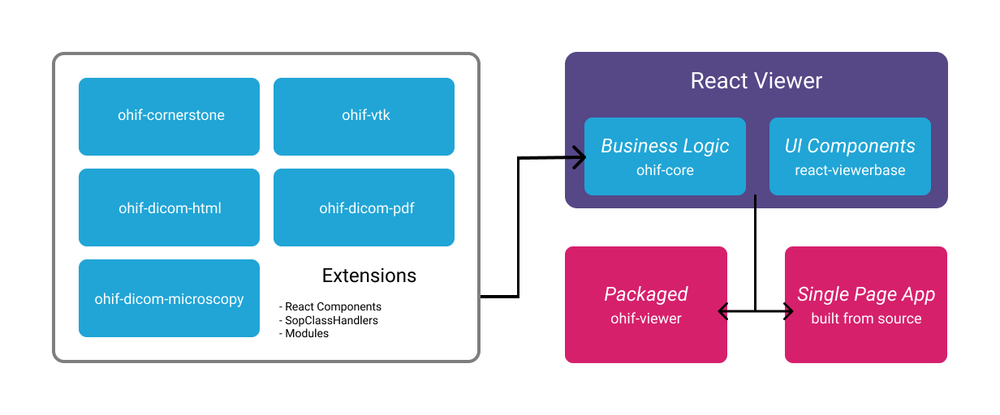

# Architecture

Looking to extend your instance of the OHIF Viewer? Want learn how to reuse _a
portion_ of the Viewer in your own application? Or maybe you want to get
involved and draft or suggest a new feature? Regardless, you're in the right
place!

The OHIF Viewer aims to be decoupled, configurable, and extensible; while this
allows our code to be used in more ways, it also increases complexity. Below, we
aim to demistify that complexity by providing insight into how our Viewer is
architected, and the role each of it's dependent libraries plays.

## Overview

The [`OHIF/Viewers`][viewers-project] project contains the source code for the
OHIF Medical Imaging Viewer. It is effectively a React [progressive web
app][pwa] (PWA) that combines the business logic housed in
[`OHIF/ohif-core`][core] and the components in our React Component library
[`OHIF/react-viewerbase`][component-library]. It provides customization for
common use cases through [configuration][configuration] and for adding
functionality via [extensions][extensions].

### Business Logic

Our goal is to maintain the majority of our business logic in
[`OHIF/ohif-core`](https://github.com/OHIF/ohif-core). `ohif-core` offers
pre-packaged solutions for features common to Web-based medical imaging viewers.
For example:

- Hotkeys
- DICOM Web
- Hanging Protocols
- Managing a study's measurements
- Managing a study's DICOM metadata
- A flexible pattern for extensions
- [And many others](https://github.com/OHIF/ohif-core/blob/master/src/index.js#L49-L69)

It does this while remaining decoupled from any particular view library or
rendering logic. While we use it to power our React Viewer, it can be used with
Vue, React, Vanilla JS, or any number of other frameworks.

### React Component Library

[`OHIF/react-viewerbase`](https://github.com/OHIF/react-viewerbase) is a React
Component library that contains the reusable components that power the OHIF
Viewer. It allows us to build, compose, and test components in isolation; easing
the development process by reducing the need to stand-up a local PACS with test
case data.

[Check out our component library!](https://react.ohif.org/)

### Misc. Extensions

Want to add custom logic or UI Components to the OHIF Viewer, but don't want to
maintain a fork? We expose common integration points via
[extensions](./extensions.md) to make that possible. For a list of extensions
maintained by OHIF,
[check out this helpful table](./extensions.html#ohif-maintained-extensions).

If you find yourself thinking "I wish the Viewer could do X", and you can't
accomplish it with an extension today, create a GitHub issue! We're actively
looking for ways to improve our extensibility ^\_^

[Click here to read more about extensions!](./extensions.md)

### Diagram

This diagram is a conceptual illustration of how the Viewer is architected.

1. (optional) `extensions` can be registered with `ohif-core`'s extension
   manager
2. `ohif-core` provides bussiness logic and a way for `viewer` to access
   registered extensions
3. The `viewer` composes and provides data to components from our component
   library (`react-viewerbase`)
4. The `viewer` can be built and served as a stand-alone PWA, or as an
   embeddable package
   ([`ohif-viewer`](https://www.npmjs.com/package/ohif-viewer))

<i>architecture diagram</i>

## Common Questions

> When should I use the packaged source `ohif-viewer` versus building a PWA from
> the source?

...

> Can I create my own Viewer using Vue.js or Angular.js?

You can, but you will not be able to leverage as much of the existing code and
components. `ohif-core` could still be used for business logic, and to provide a
model for extensions. `react-viewerbase` would then become a guide for the
components you would need to recreate.

<!--
  Links
  -->

<!-- prettier-ignore-start -->
[viewers-project]: https://github.com/OHIF/Viewers
[pwa]: https://developers.google.com/web/progressive-web-apps/
[core]: https://github.com/OHIF/ohif-core
[component-library]: https://github.com/OHIF/react-viewerbase
[configuration]: ../essentials/configuration.md
[extensions]: ./extensions.m
<!-- prettier-ignore-end -->
