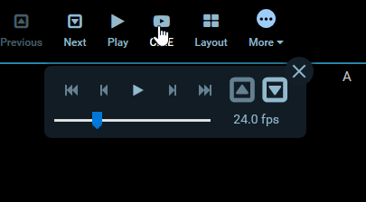

# Extensions

Extensions add new functionality to the viewer by registering one or more
modules. They go one step further than configuration in that they allow us to
inject custom React components, so long as they adhere to the module's
interface. This can be something as simple as adding a new button to the
toolbar, or as complex as a new viewport capable of rendering volumes in 3D.

- [Overview](#overview)
- [Modules](#modules)
  - [Viewport](#viewport)
  - [Toolbar](#toolbar)
  - [SOP Class Handler](#sopclasshandler)
  - [Panel](#panel)
  - [Commands](#commands)
  - [Hotkeys](#hotkeys)

## Overview

At a glance, an extension is a class or object that has a `getExtensionId()`
method, and one or more "module" methods. You can find an abbreviated extension
below, or
[view the source](https://github.com/OHIF/Viewers/blob/react/extensions/ohif-cornerstone-extension/src/OHIFCornerstoneExtension.js#L32-L65)
of our `cornerstone` viewport extension.

```js
class myCustomExtension {

    /** Required */
    getExtensionId: () => 'my-extension-id';

    /** React component that receives props from ConnectLayoutManager
     *  If more than one viewport module is registered, SopClassHandler
     *  is used to help determine which component is used */
    getViewportModule: () => reactViewportComponent;

    /** React component that adds buttons/behavior to the viewer Toolbar */
    getToolbarModule: () => reactToolbarComponent;

    /** Provides a whitelist of SOPClassUIDs the viewport is capable of rendering.
     *  Can modify default behavior for methods like `getDisplaySetFromSeries` */
    getSopClassHandler: () => {
        id: 'some-other-unique-id',
        type: PLUGIN_TYPES.SOP_CLASS_HANDLER,
        sopClassUids: ['string'],
        getDisplaySetFromSeries: (series, study, dicomWebClient, authorizationHeaders) => ...
    };

    // Not yet used
    getPanelModule: () => null;
}
```

### Modules

There are a few different kinds of modules. Each kind of module allows us to
extend the viewer in a different way, and provides a consistent API for us to do
so. You can find a full list of the
[different types of modules `in ohif-core`](https://github.com/OHIF/ohif-core/blob/43c08a29eff3fb646a0e83a03a236ddd84f4a6e8/src/plugins.js#L1-L6).
Information on each type of module, it's API, and how we determine when/where it
should be used is included below:

#### Viewport

An extension can register a Viewport Module by providing a `getViewportModule()`
method that returns a React Component. The React component will receive the
following props:

```js
children: PropTypes.arrayOf(PropTypes.element)
studies: PropTypes.object,
displaySet: PropTypes.object,
viewportData: PropTypes.object, // { studies, displaySet }
viewportIndex: PropTypes.number,
children: PropTypes.node,
customProps: PropTypes.object
```

Viewport components are managed by the `LayoutManager`. Which Viewport component
is used depends on:

- The Layout Configuration
- Registered SopClassHandlers
- The SopClassUID for visible/selected datasets


<center><i>An example of three Viewports</i></center>

For a complete example implementation,
[check out the OHIFCornerstoneViewport](https://github.com/OHIF/Viewers/blob/react/extensions/ohif-cornerstone-extension/src/OHIFCornerstoneViewport.js).

#### Toolbar

An extension can register a Toolbar Module by providing a `getToolbarModule()`
method that returns a React Component. The component does not receive any props.
If you want to modify or react to state, you will need to connect to the redux
store.



<center><i>A toolbar extension example</i></center>

Toolbar components are rendered in the `ToolbarRow` component.

For a complete example implementation,
[check out the OHIFCornerstoneViewport's Toolbar Module](https://github.com/OHIF/Viewers/blob/react/extensions/ohif-cornerstone-extension/src/ToolbarModule.js).

#### SopClassHandler

...

#### Panel

> The panel module is not yet in use.

#### Commands

...

#### Hotkeys

...

### Registering Extensions

Extensions are registered for the application at startup. The
`ExtensionManager`, exposed by `ohif-core`, registers a list of extensions with
our application's store. Each module provided by the extension becomes available
via `state.plugins.availablePlugins`, and consists of three parts: id, type
([PLUGIN_TYPE](https://github.com/OHIF/ohif-core/blob/43c08a29eff3fb646a0e83a03a236ddd84f4a6e8/src/plugins.js#L1-L6)),
and the return value of the module method.

In a future version, we will likely expose a way to provide the extensions you
would like included at startup.

_app.js_

```js
import { createStore, combineReducers } from 'redux';
import OHIF from 'ohif-core';
import OHIFCornerstoneExtension from 'ohif-cornerstone-extension';

const combined = combineReducers(OHIF.redux.reducers);
const store = createStore(combined);
const extensions = [new OHIFCornerstoneExtension()];

// Dispatches the `addPlugin` action to the store
// Adding extension modules to `state.plugins.availablePlugins`
ExtensionManager.registerExtensions(store, extensions);
```

## OHIF Maintained Extensions

A small number of powerful extensions for popular use cases are maintained by
OHIF. They're co-located in the
[`OHIF/Viewers`](https://github.com/OHIF/Viewers/tree/react/) repository, in the
top level [`extensions/`](https://github.com/OHIF/Viewers/tree/react/extensions)
directory.


