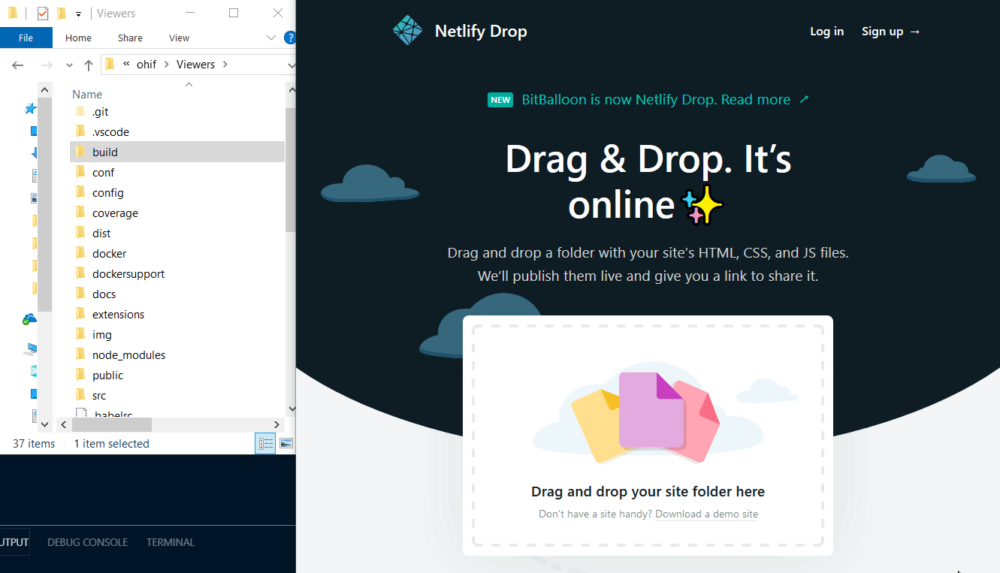

# Deploy Static Assets

There are a lot of options for deploying static assets. Some services, like
`netlify` and `surge.sh`, specialize in static websites. You'll notice that
deploying with them requires much less time and effort, but comes at the cost of
less product offerings.

While not required, it can simplify things to host your Web Viewer alongside
your image archive. Services with more robust product offerings, like
`Google Cloud`, `Microsoft's Azure`, and `Amazon Web Services (AWS)`, are able
to accomodate this setup.

_Drag-n-drop_

- [Netlify: Drop](#netlify-drop)

_Easy_

- [Surge.sh](#surgesh)
- [GitHub Pages](#github-pages)

_Advanced_

- [AWS S3 + Cloudfront](#aws-s3--cloudfront)
- [GCP + Cloudflare](#gcp--cloudflare)
- [Azure](#azure)

## Drag-n-drop

### Netlify: Drop

> Build, deploy, and manage modern web projects. An all-in-one workflow that
> combines global deployment, continuous integration, and automatic HTTPS. And
> that’s just the beginning.



_GIF demonstrating deployment with Netlify Drop_

1. https://app.netlify.com/drop
2. Drag your `build/` folder on to the drop target
3. ...
4. _annnd you're done_

**Features:**

- Custom domains & HTTPS
- Instant Git integration
- Continuous deployment
- Deploy previews
- Access to add-ons

(Non-free tiers include identity, FaaS, Forms, etc.)

Learn more about [Netlify on their website](https://www.netlify.com/)

## Easy

### Surge.sh

> Static web publishing for Front-End Developers. Simple, single-command web
> publishing. Publish HTML, CSS, and JS for free, without leaving the command
> line.


_GIF demonstrating deployment with surge_

```shell
yarn add global surge

# In the build directory
surge
```

**Features:**

- Free custom domain support
- Free SSL for surge.sh subdomains
- pushState support for single page apps
- Custom 404.html pages
- Barrier-free deployment through the CLI
- Easy integration into your Grunt toolchain
- Cross-origin resource support
- And more…

Learn more about [surge.sh on their website](https://surge.sh/)

### GitHub Pages

> WARNING! While great for project sites and light use, it is not advised to use
> GitHub Pages for production workloads. Please consider using a different
> service for mission critical applications.

https://pages.github.com/

## Advanced

### AWS S3 + Cloudfront

...

Reference:
[Use Cloudfront to Serve Static Website](https://aws.amazon.com/premiumsupport/knowledge-center/cloudfront-serve-static-website/)

### GCP + Cloudflare

...

References:

- https://cloud.google.com/storage/docs/hosting-static-website
- https://hackernoon.com/hosting-a-free-static-website-on-google-cloud-storage-d0d83704173b
- https://code.luasoftware.com/tutorials/google-cloud-storage/things-to-know-before-hosting-static-website-on-google-cloud-storage/

### Azure

...

- https://docs.microsoft.com/en-us/azure/storage/blobs/storage-blob-static-website
