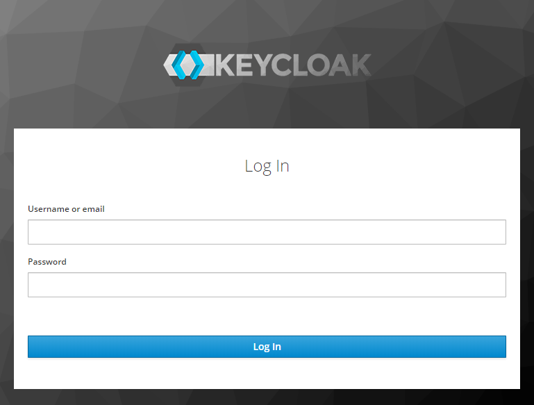
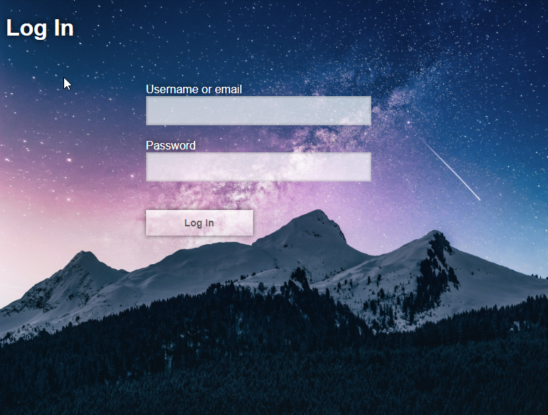

# User Account Control

> DISCLAIMER! We make no claims or guarantees of this approach's security. If in
> doubt, enlist the help of an expert and conduct proper audits.

Making a viewer and its medical imaging data accessible on the open web can
provide a lot of benefits, but requires additional security to make sure
sensitive information can only be viewed by authorized individuals. Most image
archives are equipped with basic security measures, but they are not
robust/secure enough for the open web.

This guide covers one of many potential production setups that secure our
sensitive data.

## Overview

This guide builds on top of our
[Nginx + Image Archive guide](/deployment/recipes/nginx--image-archive.md),
wherein we used a [`reverse proxy`](https://en.wikipedia.org/wiki/Reverse_proxy)
to retrieve resources from our image archive (Orthanc).

To add support for "User Account Control" we introduce
[Keycloak](https://www.keycloak.org/about.html). Keycloak is an open source
Identity and Access Management solution that makes it easy to secure
applications and services with little to no code. We improve upon our
`reverse proxy` setup by integrating Keycloak and Nginx to create an
`authenticating reverse proxy`.

> An authenticating reverse proxy is a reverse proxy that only retrieves the
> resources on behalf of a client if the client has been authenticated. If a
> client is not authenticated they can be redirected to a login page.

This setup allows us to create a setup similar to the one pictured below:



- All web requests are routed through `nginx` on our `OpenResty` image
- `/pacs` is a reverse proxy for `orthanc`'s `DICOM Web` endpoints
  - Requires valid `Authorization: Bearer <token>` header
- `/pacs-admin` is a reverse proxy for `orthanc`'s Web Admin
- `/auth` is a reverse proxy for `keycloak`
- All static resources for OHIF Viewer are unprotected and accessible. We have
  application logic that will redirect unauthenticated users to the appropriate
  `keycloak` login screen.

## Getting Started

### Requirements

- Docker
  - [Docker for Mac](https://docs.docker.com/docker-for-mac/)
  - [Docker for Windows](https://docs.docker.com/docker-for-windows/)

_Not sure if you have `docker` installed already? Try running `docker --version`
in command prompt or terminal_

### Setup

_Spin Things Up_

- Navigate to `<project-root>/docker/OpenResty-Orthanc-Keycloak` in your shell
- Run `docker-compose up`

_Create Your First User_

- Navigate to: `http://127.0.0.1/auth/admin`
- Sign in with: `admin`/`password`
- From the top left dropdown, select the `Ohif` realm
- From the left sidebar, under `Manage`, select `Users`
- Click `Add User`
  - Username: `test`
  - Email Verified: `ON`
  - Click `Save`
- Click the `Credentials` Tab
  - New Pasword: `test`
  - Password Confirmation: `test`
  - Temporary: `OFF`
  - Click: `Reset Password`
- From the top right dropdown, select `Admin`, then `Sign Out`

_Sign In_

- Navigate to `http://127.0.0.1/`
- Username: `test`, Password: `test`
- Click `Log In`

_Upload Your First Study_

- Navigate to `http://127.0.0.1/pacs-admin`
- If you're not already logged in, use `test`/`test`
- From the top right, select "Upload"
- Click "Select files to upload..." (DICOM)
- Click "Start the upload"
- Navigate back to `http://127.0.0.1/` to view your studies in the Study List

### Troubleshooting

_Exit code 137_

This means Docker ran out of memory. Open Docker Desktop, go to the `advanced`
tab, and increase the amount of Memory available.

_Cannot create container for service X_

Use this one with caution: `docker system prune`

_X is already running_

Stop running all containers:

- Win: `docker ps -a -q | ForEach { docker stop $_ }`
- Linux: `docker stop $(docker ps -a -q)`

### Configuration

After verifying that everything runs with default configuration values, you will
likely want to update:

- The domain: `http://127.0.0.1`
- Set secure, non-default passwords
- Regenerate Keycloak Client Secrets

#### OHIF Viewer

The OHIF Viewer's configuration is imported from a static `.js` file. The
configuration we use is set to a specific file when we build the viewer, and
determined by the env variable: `APP_CONFIG`. You can see where we set its value
in the `dockerfile` for this solution:

`ENV APP_CONFIG=config/docker_openresty-orthanc-keycloak.js`

You can find the configuration we're using here:
`/public/config/docker_openresty-orthanc-keycloak.js`

To rebuild the `webapp` image created by our `dockerfile` after updating the
Viewer's configuration, you can run:

- `docker-compose build` OR
- `docker-compose up --build`

#### Other

All other files are found in: `/docker/OpenResty-Orthanc-Keycloak/`

| Service           | Configuration                                    | Docs                                        |
| ----------------- | ------------------------------------------------ | ------------------------------------------- |
| OHIF Viewer       | [dockerfile][dockerfile] / [config.js][config]   | You're reading them now!                    |
| OpenResty (Nginx) | [`/nginx.conf`][config-nginx]                    | [lua-resty-openidc][lua-resty-openidc-docs] |
| Orthanc           | [`/orthanc.json`][config-orthanc]                | [Here][orthanc-docs]                        |
| Keycloak          | [`/ohif-keycloak-realm.json`][config-keycloak]\* |                                             |

\* These are the seed values for Keycloak. They can be manually updated at
`http://127.0.0.1/auth/admin`

#### Keycloak Themeing

The `Login` screen for the `ohif-viewer` client is using a Custom Keycloak
theme. You can find the source files for it in
`/docker/OpenResty-Orthanc-Keycloak/volumes/keycloak-themes/`. You can see how
we add it to Keycloak in the `docker-compose` file, and you can read up on how
to leverage custom themes in
[Keycloak's own docs](https://www.keycloak.org/docs/latest/server_development/index.html#_themes).

| Default Theme                                                          | OHIF Theme                                                       |
| ---------------------------------------------------------------------- | ---------------------------------------------------------------- |
|  |  |

## Next Steps

### Deploying to Production

While these configuration and docker-compose files model an environment suitable
for production, they are not easy to deploy "as is". You can either:

- Manually recreate this environment and deploy built application files **OR**
- Deploy to a cloud kubernetes provider like
  [Digital Ocean](https://www.digitalocean.com/products/kubernetes/) **OR**
  - [See a full list of cloud providers here](https://landscape.cncf.io/category=cloud&format=card-mode&grouping=category)
- Find and follow your preferred provider's guide on setting up
  [swarms and stacks](https://docs.docker.com/get-started/)

### Adding SSL

Adding SSL registration and renewal for your domain with Let's Encrypt that
terminates at Nginx is an incredibly important step toward securing your data.
Here are some resources, specific to this setup, that may be helpful:

- [lua-resty-auto-ssl](https://github.com/GUI/lua-resty-auto-ssl)
- [Let's Encrypt + Nginx](https://www.nginx.com/blog/using-free-ssltls-certificates-from-lets-encrypt-with-nginx/)

While we terminate SSL at Nginx, it may be worth using self signed certificates
for communication between services.

- [SSL Termination for TCP Upstream Servers](https://docs.nginx.com/nginx/admin-guide/security-controls/terminating-ssl-tcp/)

### Use PostgresSQL w/ Orthanc

Orthanc can handle a large amount of data and requests, but if you find that
requests start to slow as you add more and more studies, you may want to
configure your Orthanc instance to use PostgresSQL. Instructions on how to do
that can be found in the
[`Orthanc Server Book`](http://book.orthanc-server.com/users/docker.html), under
"PostgreSQL and Orthanc inside Docker"

### Improving This Guide

Here are some improvements this guide would benefit from, and that we would be
more than happy to accept Pull Requests for:

- SSL Support
- Complete configuration with `.env` file (or something similar)
- Keycloak Theme improvements
- Any security issues
- One-click deploy to a cloud provider

## Resources

### Misc. Helpful Commands

_Check if `nginx.conf` is valid:_

```bash
docker run --rm -t -a stdout --name my-openresty -v $PWD/config/:/usr/local/openresty/nginx/conf/:ro openresty/openresty:alpine-fat openresty -c /usr/local/openresty/nginx/conf/nginx.conf -t
```

_Interact w/ running container:_

`docker exec -it CONTAINER_NAME bash`

_List running containers:_

`docker ps`

_Clear Keycloak DB so you can re-seed values:_

- `docker volume prune` OR
- `docker volume ls` and `docker volume rm VOLUME_NAME VOLUME_NAME`

### Referenced Articles

The inspiration for our setup was driven largely by these articles:

- [Securing Nginx with Keycloak](https://edhull.co.uk/blog/2018-06-06/keycloak-nginx)
- [Authenticating Reverse Proxy with Keycloak](https://eclipsesource.com/blogs/2018/01/11/authenticating-reverse-proxy-with-keycloak/)
- [Securing APIs with Kong and Keycloak](https://www.jerney.io/secure-apis-kong-keycloak-1/)

For more documentation on the software we've chosen to use, you may find the
following resources helpful:

- [Orthanc for Docker](http://book.orthanc-server.com/users/docker.html)
- [OpenResty Guide](http://www.staticshin.com/programming/definitely-an-open-resty-guide/)
- [Lua Ngx API](https://openresty-reference.readthedocs.io/en/latest/Lua_Nginx_API/)
- [Auth0: Picking a Grant Type](https://auth0.com/docs/api-auth/which-oauth-flow-to-use)

We chose to use a generic OpenID Connect library on the client, but it's worth
noting that Keycloak comes packaged with its own:

- [redux-oidc](https://github.com/maxmantz/redux-oidc) (Which wraps
  [oidc-client-js](https://github.com/IdentityModel/oidc-client-js/wiki))
- [Keycloak JavaScript Adapter](https://www.keycloak.org/docs/latest/securing_apps/index.html#_javascript_adapter)

If you're not already drowning in links, here are some good security resources
for OAuth:

- [Diagrams of OpenID Connect Flows](https://medium.com/@darutk/diagrams-of-all-the-openid-connect-flows-6968e3990660)
- [KeyCloak: OpenID Connect Flows](https://www.keycloak.org/docs/latest/securing_apps/index.html#authorization-code)

For a different take on this setup, check out the repositories our community
members put together:

- [mjstealey/ohif-orthanc-dimse-docker](https://github.com/mjstealey/ohif-orthanc-dimse-docker)
- [trypag/ohif-orthanc-postgres-docker](https://github.com/trypag/ohif-orthanc-postgres-docker)

<!--
  Links
  -->

<!-- prettier-ignore-start -->
<!-- DOCS -->
[orthanc-docs]: http://book.orthanc-server.com/users/configuration.html#configuration
[lua-resty-openidc-docs]: https://github.com/zmartzone/lua-resty-openidc
<!-- SRC -->
[config]: https://github.com/OHIF/Viewers/blob/master/platform/viewer/src/config.js
[dockerfile]: https://github.com/OHIF/Viewers/blob/master/platform/viewer/.recipes/OpenResty-Orthanc-Keycloak/dockerfile
[config-nginx]: https://github.com/OHIF/Viewers/blob/master/platform/viewer/.recipes/OpenResty-Orthanc-Keycloak/config/nginx.conf
[config-orthanc]: https://github.com/OHIF/Viewers/blob/master/platform/viewer/.recipes/OpenResty-Orthanc-Keycloak/config/orthanc.json
[config-keycloak]: https://github.com/OHIF/Viewers/blob/master/platform/viewer/.recipes/OpenResty-Orthanc-Keycloak/config/ohif-keycloak-realm.json
<!-- prettier-ignore-end -->
