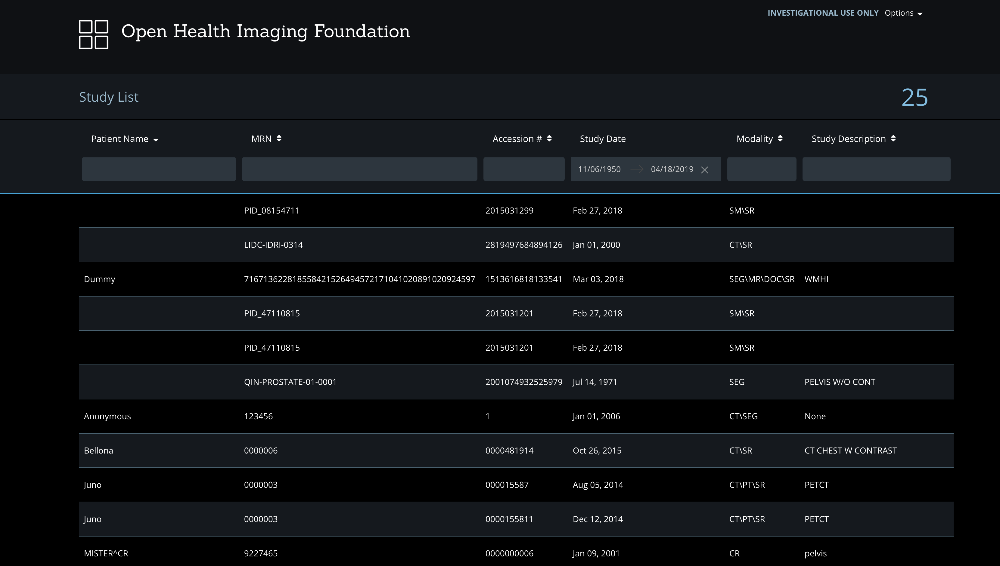

# Getting Started

## Setup

### Fork & Clone

If you intend to contribute back changes, or if you would like to pull updates
we make to the OHIF Viewer, then follow these steps:

- [Fork][fork-a-repo] the [OHIF/Viewers][ohif-viewers-repo] repository
- [Create a local clone][clone-a-repo] of your fork
  - `git clone https://github.com/YOUR-USERNAME/Viewers`
- Add OHIF/Viewers as a [remote repository][add-remote-repo] labled `upstream`
  - Navigate to the cloned project's directory
  - `git remote add upstream https://github.com/OHIF/Viewers.git`

With this setup, you can now [sync your fork][sync-changes] to keep it
up-to-date with the upstream (original) repository. This is called a "Triangular
Workflow" and is common for Open Source projects. The GitHub blog has a [good
graphic that illustrates this setup][triangular-workflow].

### Private

Alternatively, if you intend to use the OHIF Viewer as a starting point, and you
aren't as concerned with syncing updates, then follow these steps:

1. Navigate to the [OHIF/Viewers/tree/react][ohif-viewers-react-repo] repository
   and branch
2. Click `Clone or download`, and then `Download ZIP`
3. Use the contents of the `.zip` file as a starting point for your viewer

> NOTE: It is still possible to sync changes using this approach. However,
> submitting pull requests for fixes and features are best done with the
> separate, forked repository setup described in "Fork & Clone"

## Develop

### Requirements

- [Node.js & NPM](https://nodejs.org/en/)
- [Yarn](https://yarnpkg.com/en/)

### Kick the tires

Navigate to the root of the project's directory in your terminal and run the
following commands:

```bash
# Restore dependencies
yarn install

# Start local development server
yarn start
```

You should see the following output:

```bash
Compiled successfully!

You can now view ohif-viewer in the browser.

  Local:            http://localhost:5000/
  On Your Network:  http://10.74.20.83:5000/

Note that the development build is not optimized.
To create a production build, use yarn build.
```

### Configuring

Note: This will connect to our public DICOMWeb server so you can verify your
installation. Follow the next section to connect to your own local or remote
DICOMWeb server.

4. Launch the OHIF Viewer Study List. By default the address is
   [http://localhost:3000/](http://localhost:3000/). The port may vary so check
   the start up output messages such as:

**If everything is working correctly, you should see the studies from our public
archive when you visit the Study List.**



5. Double-click on a Study in the Study List to launch it in the Viewer

   **If everything is working correctly, you should see your study load into the
   Viewer.**


## Set up a local DICOM server

1. Choose and install an Image Archive
2. Upload some data into your archive (e.g. with DCMTK's
   [storescu](http://support.dcmtk.org/docs/storescu.html) or your archive's web
   interface)
3. Keep the server running

#### Open Source DICOM Image Archive Options

| Archive                                                                     | Installation                                                                                     |
| --------------------------------------------------------------------------- | ------------------------------------------------------------------------------------------------ |
| [DCM4CHEE Archive 5.x](https://github.com/dcm4che/dcm4chee-arc-light)       | [Installation with Docker](https://github.com/dcm4che/dcm4chee-arc-light/wiki/Running-on-Docker) |
| [Orthanc](https://www.orthanc-server.com/)                                  | [Installation with Docker](http://book.orthanc-server.com/users/docker.html)                     |
| [DICOMcloud](https://github.com/DICOMcloud/DICOMcloud) (**DICOM Web only**) | [Installation](https://github.com/DICOMcloud/DICOMcloud#running-the-code)                        |
| [OsiriX](http://www.osirix-viewer.com/) (**Mac OSX only**)                  |
| [Horos](https://www.horosproject.org/) (**Mac OSX only**)                   |

_Feel free to make a Pull Request if you want to add to this list._

#### Orthanc with Docker

Depending on whether or not you want uploaded studies to persist in Orthanc
after Docker has been closed, there are two different methods for starting the
Docker image:

##### Temporary data storage

This command will start an instance of the jodogne/orthanc-plugins Docker image.
_All data will be removed when the instance is stopped!_

```
docker run --rm -p 4242:4242 -p 8042:8042 jodogne/orthanc-plugins
```

##### Persistent data storage

In order to allow your data to persist after the instance is stopped, you first
need to create an image and attached data volume with Docker. The steps are as
follows:

1. Create a persistent data volume for Orthanc to use

   ```
   docker create --name sampledata -v /sampledata jodogne/orthanc-plugins
   ```

   **Note: On Windows, you need to use an absolute path for the data volume,
   like so:**

   ```
   docker create --name sampledata -v '//C/Users/erik/sampledata' jodogne/orthanc-plugins
   ```

2. Run Orthanc from Docker with the data volume attached

   ```
   docker run --volumes-from sampledata -p 4242:4242 -p 8042:8042 jodogne/orthanc-plugins
   ```

3. Upload your data and it will be persisted

### Setting up OHIF Viewer with Orthanc as an example

Once you have Orthanc running with docker either with temporary data storage or
persistent data storage we con move forward with the next steps.

1. Load orthanc with a dataset you might want to use. To upload data use
   [http://localhost:8042/app/explorer.html](http://localhost:8042/app/explorer.html).

   **orthanc is the username and password for orthanc docker**

2. Go under
   [http://localhost:8042/app/explorer.html#upload](http://localhost:8042/app/explorer.html#upload)
   and upload your DICOM files there

3. After you load the data, open a new terminal tab in the `ohif-viewer`
   directory and install all dependency packages via Yarn

```bash
yarn install
```

3. Run the application using one of the available configuration files. **the
   following command assumes you are under the `root` folder**

```bash
export REACT_APP_CONFIG=$(cat ./config/local_orthanc.js)
yarn start
```

This uses the
[Custom Environment Variables of Create-React-App](https://facebook.github.io/create-react-app/docs/adding-custom-environment-variables)
to pass in your configuration. The example above will not work on Windows.
Please visit the link to read about how to set environment variables on Windows.

4. Launch the OHIF Viewer Study List by visiting
   [http://localhost:3000/](http://localhost:3000/) in a web browser.

   **If everything is working correctly, you should see the Study List from your
   archive when you visit the Study List.**

5. Double-click on a Study in the Study List to launch it in the Viewer

   **If everything is working correctly, you should see your study load into the
   Viewer.**

#### Troubleshooting

- If you receive a _"No Studies Found"_ message and do not see your studies, try
  changing the Study Date filters to a wider range.
- If you see a 'Loading' message which never resolves, check your browser
  JavaScript console inside the Developer Tools to identify any errors.
- If you receive `exit code 137`, increase the amount of memory available to
  your docker instances.
- If you see any errors in your server console, check the
  [Troubleshooting](./troubleshooting.md) page for more in depth advice.

<!--
  Links
  -->

<!-- prettier-ignore-start -->
[fork-a-repo]: https://help.github.com/en/articles/fork-a-repo
[clone-a-repo]: https://help.github.com/en/articles/fork-a-repo#step-2-create-a-local-clone-of-your-fork
[add-remote-repo]: https://help.github.com/en/articles/fork-a-repo#step-3-configure-git-to-sync-your-fork-with-the-original-spoon-knife-repository
[sync-changes]: https://help.github.com/en/articles/syncing-a-fork
[triangular-workflow]: https://github.blog/2015-07-29-git-2-5-including-multiple-worktrees-and-triangular-workflows/#improved-support-for-triangular-workflows
[ohif-viewers-repo]: https://github.com/OHIF/Viewers
[ohif-viewers-react-repo]: https://github.com/OHIF/Viewers/tree/react
<!-- prettier-ignore-end -->

```

```
