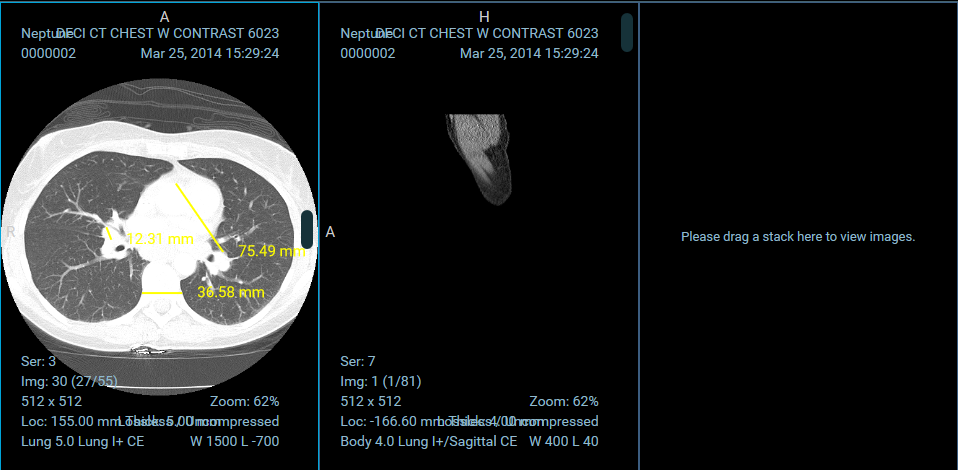

# Module: Viewport

An extension can register a Viewport Module by defining a `getViewportModule`
method that returns a React component. Currently, we use viewport components to
add support for:

- 2D Medical Image Viewing (cornerstone ext.)
- Structured Reports as HTML (dicom html ext.)
- Encapsulated PDFs as PDFs (dicom pdf ext.)
- Whole Slide Microscopy Viewing (whole slide ext.)
- etc.

The general pattern is, the [`sopClassHandlerModule`](#) helps us determine
which Viewport Component a set of `sopClassUIDs` should default to. The Viewport
Component receives props containing a display set it should know how to render.

## Viewport Component Props

Each `ViewportComponent` will receive the following props:

```html
<viewportComponent
  viewportData="{viewportData}"
  viewportIndex="{viewportIndex}"
  children="{[children]}"
/>
```

| Property        | Type            | Description                       |
| --------------- | --------------- | --------------------------------- |
| `children`      | React.element[] |                                   |
| `viewportData`  | object          | `viewportSpecificData` (probably) |
| `viewportIndex` | number          |                                   |

### `@ohif/viewer`

Viewport components are managed by the `ViewportGrid` Component. Which Viewport
component is used depends on:

- The Layout Configuration
- Registered SopClassHandlers
- The SopClassUID for visible/selected datasets



<center><i>An example of three cornerstone Viewports</i></center>
