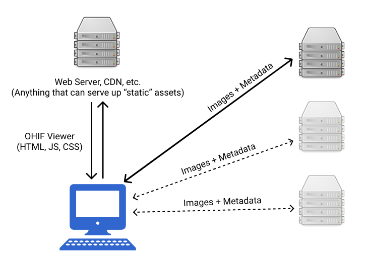

# Scope of Project

The OHIF Viewer is a web based medical imaging viewer. This allows it to be used
on almost any device, anywhere. The OHIF Viewer is what is commonly reffered to
as a ["Dumb Client"][simplicable]

> A dumb client is software that fully depends on a connection to a server or
> cloud service for its functionality. Without a network connection, the
> software offers nothing useful. - [simplicable.com][simplicable]

While the Viewer persists some data, it's scope is limited to caching things
like user preferences and previous query paramaters. Because of this, the Viewer
has been built to be highly configurable to work with almost any web accessible
data source.

To be more specific, the OHIF Viewer is a collection of HTML, JS, and CSS files.
These can be delivered to your end users however you would like:

- From the local networok
- From a remote web server
- From a CDN (content delivery network)
- From a service-worker's cache
- etc.

These "static asset" files are referred to collectively as a "Progressive Web
Application" (PWA), and have the same capabilities and limitations that all PWAs
have.

All studies, series, images, imageframes, metadata, and the images themselves
must come from an external source. There are many, many ways to provide this
information, the OHIF Viewer's scope **DOES NOT** encompass providing _any_
data; only the configuration necessary to interface with one or more of these
many data sources. The OHIF Viewer's scope **DOES** include configuration and
support for services that are protected with OpenID-Connect.

In an effort to aide our users and contributors, we attempt to provide several
[deployment and hosting recipes](./deployment/index.md) as potential starting
points. These are not meant to be rock solid, production ready, solutions; like
most recipes, they should be augmented to best fit you and your organization's
taste, preferences, etc.

## FAQ

_Am I able to cache studies for offline viewing?_

Not currently. A web page's offline cache capabilities are limited and somewhat
volatile (mostly imposed at the browser vendor level). For more robust offline
caching, you may want to consider a server on the local network, or packaging
the OHIF Viewer as a desktop application.

_Does the OHIF Viewer work with the local filesystem?_

It is possible to accomplish this through extensions; however, for an user
experience that accomodates a large number of studies, you would likely need to
package the OHIF Viewer as an [Electron app][electron].

<!--
  Links
  -->

<!-- prettier-ignore-start -->
[simplicable]: https://simplicable.com/new/dumb-client
[electron]: https://electronjs.org/
<!-- prettier-ignore-end -->
