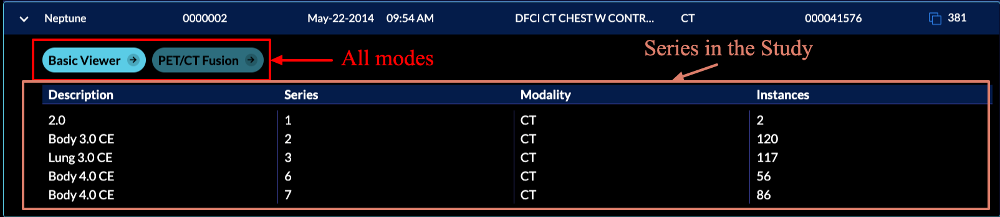

# Modes

- [Modes](#modes)
  - [Overview](#overview)
  - [Anatomy](#anatomy)
    - [Consuming Extensions](#consuming-extensions)
    - [routes](#routes)
    - [extensions](#extensions)
    - [hangingProtocols](#hangingprotocols)
    - [sopClassHandlers](#sopclasshandlers)
    - [hotkeys](#hotkeys)
  - [Registration](#registration)

## Overview
A mode can be thought of as a viewer app configured to perform a specific task,
such as tracking measurements over time, 3D segmentation, a guided radiological workflow, etc.
Addition of modes enables *application* with many *applications* as each mode become
a mini *app configuration* behind the scene.

Upon initialization the viewer will consume extensions and modes and build up the route desired, these can then be accessed via the study list, or directly via url parameters.

<!-- > Modes make extensions (features) more reusable and powerful. -->

OHIF-v3 architecture can be seen in the following:


>Note: Templates are now a part of “extensions”
>Routes are configured by modes and/or app


As mentioned, modes are tied to a specific route in the viewer, and multiple modes/routes can be present within a single application. This allows for tremendously more flexibility than before you can now:

- Simultaneously host multiple viewers with for different use cases from within the same app deploy.
- Make radiological viewers for specific purposes/workflows, e.g.:
  - Tracking the size of lesions over time.
  - PET/CT fusion workflows.
  - Guided review workflows optimized for a specific clinical trial.
- Still host one single feature-rich viewer if you desire.


## Anatomy
A mode configuration has a `route` name which is dynamically transformed into a viewer route on initialization of the application. Modes that are available to a study will appear in the study list.




The mode configuration specifies which `extensions` the mode requires, which `LayoutTemplate` to use, and what props to pass to the template. For the default template this defines which `side panels` will be available, as well as what `viewports` and which `displaySets` they may hang.

Mode's config is actually a function that return a config object with certain properties, the high-level view of this config object is:


```js
// modes/example/src/index.js

export default function mode() {
  return {
    id: '',
    displayName: '',
    onModeEnter: () => {},
    onModeExit: () => {},
    validationTags: {},
    isValidMode: () => {},
    routes: [
      {
        path: '',
        init: () => {},
        layoutTemplate: () => {},
      },
    ],
    extensions: [],
    hangingProtocols: [],
    sopClassHandlers: [],
    hotkeys: [],
  }
}
```




### Consuming Extensions
As mentioned in the [Extensions](../extensions/index.md) section, in `OHIF-v3` developers
write their extensions to create re-usable functionalities that later can be used by `modes`.
Now, it is time to describe how the registered extensions will get utilized for a workflow mode
via its `id`.

To use a module element you can use the `${extensionId}.${moduleType}.${element.name}` schema.
For instance, if a mode requires the left panel with name of `AIPanel` that is added by the `myAIExtension` via the following `getPanelModule` code, it should address it as `myAIExtension.panelModule.AIPanel` inside the mode configuration file.
In the background `OHIF` will handle grabbing the correct panel via `ExtensionManager`.


```js
// extensions/myAIExtension/getPanelModule.js

import PanelAI from './PanelAI.js';


function getPanelModule({
  commandsManager,
  extensionManager,
  servicesManager,
}) {
  const wrappedAIPanel = () => {
    return (
      <PanelAI
        commandsManager={commandsManager}
        servicesManager={servicesManager}
      />
    );
  };

  return [
    {
      name: 'AIPanel',
      iconName: 'list-bullets',
      iconLabel: '',
      label: 'AI Panel',
      isDisabled: studies => {}, // optional
      component: wrappedAIPanel,
    },
  ];
}

```


Now, let's look at `longitudinal` mode which consumes various functionalities from different extensions.
Note that, you don't need to have `org.ohif.extensionName`, this is a pattern we chose to
name our [OHIF-maintained](../extensions/index.md#ohif-maintained-extensions) extensions, you can simply
have `extensionName` as the `id` for yours and refer to it inside your modes.


```js
export default function mode({ modeConfiguration }) {
  return {
    /*
    ...
    */
   routes: [
     {
       /*
       ...
       */
        layoutTemplate: ({ location, servicesManager }) => {
          return {
            id: ohif.layout,
            props: {
              leftPanels: [
                'org.ohif.measurement-tracking.panelModule.seriesList',
              ],
              rightPanels: [
                'org.ohif.measurement-tracking.panelModule.trackedMeasurements',
              ],
              viewports: [
                {
                  namespace:
                    'org.ohif.measurement-tracking.viewportModule.cornerstone-tracked',
                  displaySetsToDisplay: [
                    'org.ohif.default.sopClassHandlerModule.stack',
                  ],
                },
                {
                  namespace: 'org.ohif.dicom-sr.viewportModule.dicom-sr',
                  displaySetsToDisplay: [
                    'org.ohif.dicom-sr.sopClassHandlerModule.dicom-sr',
                  ],
                },
              ],
            },
          }
        },
      },
    ],
    extensions: [
      'org.ohif.default',
      'org.ohif.cornerstone',
      'org.ohif.measurement-tracking',
      'org.ohif.dicom-sr',
    ],
    hangingProtocols: ['org.ohif.default.hangingProtocolModule.petCT'],
    sopClassHandlers: [
      'org.ohif.default.sopClassHandlerModule.stack',
      'org.ohif.dicom-sr.sopClassHandlerModule.dicom-sr',
    ],
    /*...*/
  }
}
```

### routes
routes config is an array of route settings, and the overall look and behavior of the viewer at the designated route is  defined by the `layoutTemplate` and `init` functions for the route. We will learn more about each of the above properties inside the [route documentation](./routes.md)

### extensions
Currently `extensions` property in the mode config is used to add *contextModule* of the mentioned extensions to the list of contexts and  provide them through out the app. Since extensions are registered by the ExtensionManager, modes have access to the them even if they have not been referred in the mode config file inside *extensions* property. [Read more about extension registration](../extensions/index.md#registering-an-extension)

```js
// platform/viewer/src/routes/Mode/Mode.jsx

const { extensions } = mode;

extensions.forEach(extensionId => {
  const allRegisteredModuleIds = Object.keys(extensionManager.modulesMap);
  const moduleIds = allRegisteredModuleIds.filter(id =>
    id.includes(`${extensionId}.contextModule.`)
  );

  const modules = moduleIds.map(extensionManager.getModuleEntry);
  contextModules = contextModules.concat(modules);
});
```

### hangingProtocols
Currently, you can pass your defined hanging protocols inside the `hangingProtocols` property of
the mode's config. This will get used inside the `Mode.jsx` to configure the `HangingProtocolService`.

```js
// platform/viewer/src/routes/Mode/Mode.jsx

const { hangingProtocols } = mode;

hangingProtocols.forEach(extentionProtocols => {
  const { protocols } = extensionManager.getModuleEntry(extentionProtocols);
  HangingProtocolService.addProtocols(protocols);
});
```

### sopClassHandlers
Mode's configuration also accepts the `sopClassHandler` modules that have been added by the extensions.
This information will get used inside the `Mode.jsx` to initialize the `DisplaySetService` with the provided
SOPClass modules which handles creation of the displaySets.

```js
// platform/viewer/src/routes/Mode/Mode.jsx

const { sopClassHandlers } = mode;

DisplaySetService.init(extensionManager, sopClassHandlers);
```

### hotkeys
`hotkeys` is another property in the configuration of a mode that can be defined to add the specific hotkeys to the viewer at all routes.

```js
// default hotkeys
import { hotkeys } from '@ohif/core';


const myHotkeys = [
  {
    commandName: 'setToolActive',
    commandOptions: { toolName: 'Zoom' },
    label: 'Zoom',
    keys: ['z'],
    isEditable: true,
  },
  {
    commandName: 'scaleUpViewport',
    label: 'Zoom In',
    keys: ['+'],
    isEditable: true,
  },
]

export default function mode() {
  return {
    id: '',
    displayName: '',
    /*
    ...
    */
    hotkeys: [..hotkeys.defaults.hotkeyBindings, ...myHotkeys],
  }
}
```


```js
// platform/viewer/src/routes/Mode/Mode.jsx

hotkeysManager.setDefaultHotKeys(hotkeys);
hotkeysManager.setHotkeys(hotkeys);
```


## Registration
Upon release modes will also be plugged into the app via configuration, but this is still an area which is under development/discussion, and they are currently pulled from the `window` in beta.


```js
// modes/longitudinal/src/index.js

export default function mode() {
  return {
    id: 'viewer',
    displayName: 'Basic Viewer',
    onModeEnter: () => {/**...**/},
    onModeExit: () => {/**...**/},
    validationTags: {/**...**/},
    isValidMode: () => {/**...**/},
    routes: [
      {
        path: 'longitudinal',
        init: () => {/**...**/},
        layoutTemplate: () => {/**...**/},
      },
    ],
    extensions: [/**...**/],
    hangingProtocols: [/**...**/],
    sopClassHandlers: [/**...**/],
    hotkeys: [/**...**/],
  }
}

window.longitudinalMode = mode({});

```

and inside `@ohif/viwer` we have:

```js
// platform/viewer/src/appInit.js

if (!appConfig.modes.length) {
    appConfig.modes.push(window.longitudinalMode);
    // appConfig.modes.push(window.segmentationMode);
}
```
