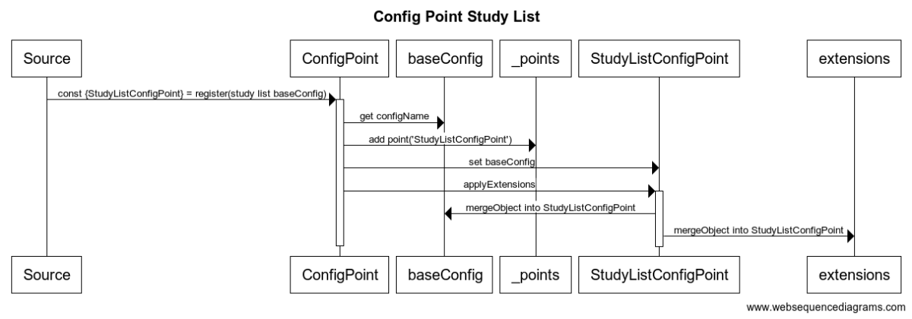
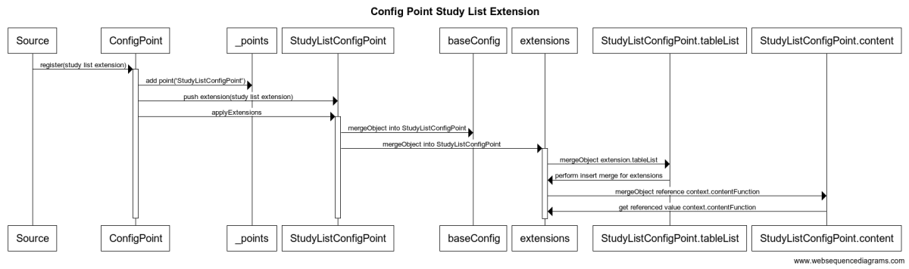
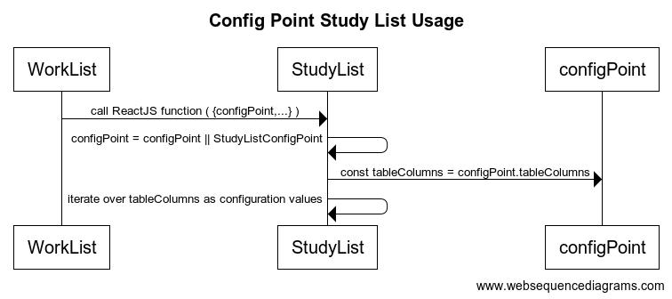

# Config Point Service


## Overview
`ConfigPointService` is the central location that stores the configuration points for
both GUI and service elements. This is a declarative service in that it is possible to
use pure JSON files to configure the GUI elements.  However, it is also functional in that
non-JSON declarations of configuration points can include functional elements such as ReactJS
GUI elements.  This combination allows extensions to define a new base configuration point,
while the use of that can be provided by just configuring the system using JSON files.

The intent of the value of a configuration point object is to be a simple JavaScript
value, thus being used with property access etc, exactly as though the object
was configured as a simple JSON object already containing the full definition
as used in the current context.  It is the construction of the object which the
ConfigPointService facilitates, so that the object can be constructed with an initial
default set of values, and then later on extended or updated with a change to
a deeply nested value.

It is the fact that the configuration values can be changed in a very small/specific
area which is the useful part of the framework.  For example, suppose an icon
for a tool was the only thing needing to be changed, and each tool was defined
in a ConfigPoint, then it would be possible to change the icon by something like:
```json
[{
  'configName':'Icons',
  extension: {
    'toolIconToChange':'/icons/myNewToolIcon.svg'
  }
}]
```

This requires knowledge of the ConfigPoint used to define these paths, but does
not require modifying the actual code.

## Events
There are currently no events fired for the configuration elements.
The current expectation is that the ConfigPoint definitions and changes will
have been completed by the time the system has completed loading.

The expectation is that when two or more GUI elements are provided, for example
a patient search versus a study search, the standard ReactJS data model will
be used, and the config point used for a given element will be changed entirely
rather than the internal details of the config point being changed.

### Future
It seems likely that a configuration setting could be done by the user, and
this may require events to notify components that their configuration has changed.


## API

### Declaring API
The declaration of a new ConfigPoint object is quite simple.  An array of objects
is provided, each of which is a declaration of a ConfigPoint, in the format:
```js
const {ConfigPointName} = ConfigPointService.register([{
  configName: 'ConfigPointName',
  configBase: {
    myConfigurationValue1: 'myValue1',
    myConfigurationObject2: { arbitraryObject },
    myConfigurationList3: ['value1', 'value2', ...]
  }
}]);
```

This then assigns to ConfigPointName, a copy of the current configuration values,
starting with configBase, combined with all the extension values.  The sequence
for the study list config point is:



### Extending API
An extension to a ConfigPoint is just an additional declaration, but assigning
the value to extension instead of configBase.  Note that extensions can be added
before or after the ConfigPoint itself is declared, but that the order of the
extensions may matter, as each extension modifies the previously applied values.

An example extension, showing a list modification, plus a reference value
modification is shown below.  Note the this contains a simple over-ride
value that sets the default column width to '12ex', as well as a more
complex list insertion that inserts someting at position 4, and that
assigns the value content from a reference instance tooltipClipboardFunction,
which is discovered in the 'context' for the config point being declared.
The referenced values allow assigning fixed
```js
ConfigPointService.register([{
    // Creates the config point StudyListConfigPoint
    configName: 'StudyListConfigPoint',
    // The base configuration is PatientListConfigPoint, so this declaration
    // declares AND extends StudyListConfigPoint
    configBase: 'PatientListConfigPoint',
    // And then modify the extension point
    extension: {
      // Modify the tableColumns list
      defaultColumnWidth: '12ex',
      tableColumns: [
        {
          _extendOp: 'insert',
          position:4,
          value: {
            key: 'description',
            // This is a way to reference an exsiting function, as long
            // as it is available in the context.  This may still change TBD
            content: { _reference: 'tooltipClipboardFunction' },
            gridCol: 4,
          }
        },
        ...
  ```



#### Future
There are a number of possibilities for more complex extension of ConfigPoints.

##### Delete and Replace
A delete operation is certainly a required operation in order to allow removal
of items.  Similarly, a replace operation is a useful combination of delete +
add in the same location.

#### Sorted Lists and Indexed keys
Instead of referencing simple list values, the ability to create a sorted list
from a set of objects is quite useful.  This allows directly applying values to
named sets, instead of having to know about positional values.  For example:
```js
// Indexed delete
{ _extendOp: 'delete',
  key: { title: 'Title to delete' }
}
// Source object to create a list from
someSource: {a: {priority:2}, b: {priority:1} };
// Sorted object is on priority and produces [{priority:1}, {priority:2}]
sortedList: { _extendOp: 'sorted', _reference: 'someSource', sortKey: 'priority' }
```

### Usage API
The actual usage of the API is quite simple, a value is declared based on a
registration request, and then is simply used as a straight/simple value.  This
can occur as a ReactJS props argument, or directly in other code such as service
code.  When used as a props argument, the recommended usage is to get the value
and then default to a declared instance.  For example:
```js
const {MyConfigPoint} = ConfigPointService.register([....]);

const myReactFunction = ({configPoint,...}) => {
  // Set a default value if one isn't provided by the parent application
  configPoint = configPoint || MyConfigPoint;
  // Setup the config point for a child function - note this one is a member
  // value of the parent config point, but it could just as easily have been
  // based on an effect/setting elsewhere.
  const {childConfigPoint} = configPoint;
  // Use the config point to determine values directly
  return (<td style=`width:${configPoint.colWidth}`>
     // And have the config point itself contain the choice of what config point
     // a child should use
     {childConfigPoint.reactFunction({configPoint:childConfigPoint})}
     </td>);
```



Note how in the above usage, there isn't anything that is actualy ConfigPoint
api specific - it could have been an arbitrary bag of values provided
to the child element, it just happens to be useful to declare it this way
to allow future extensions.  In fact, if the react function is entirely
ignorant of the config point, but has a set of properties around how it is
displayed, then those values can just directly be applied to the child creation.

### Future
Consider just extracting config point service into it's own library.  There
isn't anything OHIF specific about it, and it would be perfectly possible to
use it for other projects/areas.

Should the config points deliver promises rather than direct values?  That would
allow loading values from settings values, and would allow updates to anyone
listening for a config point when the value had finished loading.

#### Theme and Service Selection Loader
One type of theme implementation could be a theme loader that, on startup
loads a provided set of theme values into the ConfigPoint service.  These can
be simple JSON files, which are deployed with the application, for example,
a dark theme could be provided as /theme/dark.json, while a large font theme
might be provided as /theme/large.json.  Then, the user might specify:
https://myapp?theme=dark,large
and this would display the application in the dark and the large themes.
The system would know it was safe to load because the JSON files were vetted
and provided from, for example:
/public/theme/theme.json
/public/theme/dark.json

If the keyword and path are both specified by the using application, then this
can also be used to select from a service.  For example, service=google
or service=aws might load from the source files /public/service/aws.json, defining
how to connect to the AWS cloud services.

#### Self Documenting Configuration
It is additionally useful to allow the application configuration to self-document
the settings which can be modified.  This should document both the structure
of the values, as well as the permissions/safety of the values.  This can then
be used to validate whether user settings are safe to apply, as well as to guide
the user into what settings are available.

## Memory Layout
TODO

```js
```

## Storage in JSON files
The storage in JSON files is identical to that in the register operation,
except that JSON may not contain function declarations.  To alleviate this,
the reference operation is provided, to allow access to pre-declared functions
from within the JSON.
