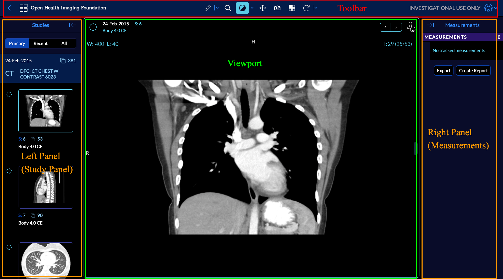

# Viewer
- [Viewer](./index.md)
  - [Overview](./index.md#overview)
  - [Study Panel](./studyPanel/study-panel.md)
  - [Measurement Panel](./measurementPanel/measurement-panel.md)
  - [Toolbar](./toolbar/toolbar.md)
  - [HotKeys](./hotkeys/hotkeys.md)

# Overview
When you open a mode, viewport, toolbar and panels of the mode get shown.
It is important to note that each mode has a different UI, which serves its purpose.
Here we explain various components of `Basic Viewer` mode which includes measurement
tracking functionalities.

Basic viewer mode (longitudinal):

Let's break different aspects of the viewer to the main components:

- Left Panel (study panel): displays series thumbnails with series details
- Viewport: renders the image and displays annotations
- Right Panel (measurements): displays annotations details
- Toolbar: displays tools and logo

Now, we explain each component and its sub-elements in detail.
