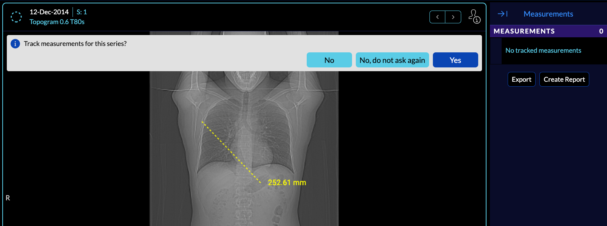
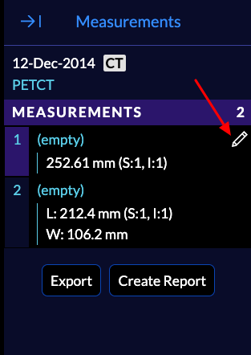

# Measurement panel

In `Basic Viewer` mode, right panel is the `Measurement Panel`. When you use an annotation tool, a pop up will show up and asks the user if they want to track measurements for the
series on which the annotation was drawn.

If you select `yes`, the series becomes a `tracked series`, and the current drawn measurement and next measurements will get shown up on the measurement panel on the right.

# Renaming Measurements
You can edit the measurement name by hovering over the measurement and selecting the edit icon.

Result:

# Deleting a Measurement
A measurement can be deleting by dragging it outside the image in the viewport. You can
take a look at the overview video to see this behavior.

# Jumping to a Measurement
Measurements that appear on the measurement panel are linked directly to their original
tool on the viewport. This enables the user to click on a measurement and the viewport will jump to the slice that the measurement has been drawn. You can
take a look at the overview video to see this behavior.

# Prev/Next Measurement
Measurement navigation inside the top viewport can be used to move to previous and next measurement.

# Export Measurements
You can export the measurements by clicking on the `Export`. A CSV file will get downloaded to your local computer containing the drawn measurements.

# Overview video
An overview of measurement drawing and exporting can be seen below:

<iframe src="https://player.vimeo.com/video/545986384?badge=0&amp;autopause=0&amp;player_id=0&amp;app_id=58479" frameborder="0" allow="autoplay; fullscreen; picture-in-picture" allowfullscreen style="position:absolute;top:0;left:0;width:100%;height:100%;" title="measurement-report"></iframe>

