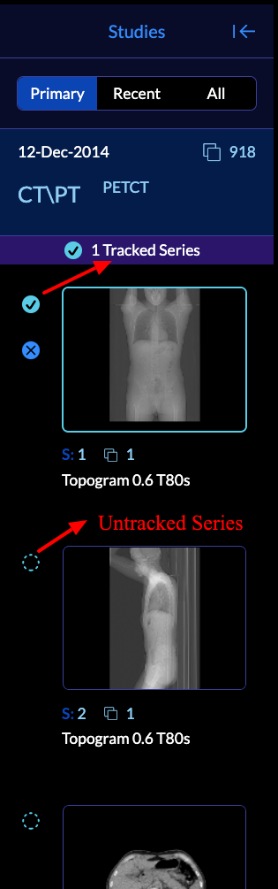
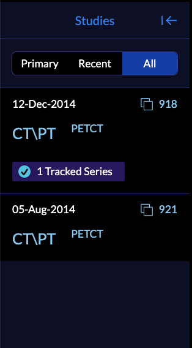

# Study panel

In `Basic Viewer` mode, the left panel includes Studies related to the current patient.
You can see three main type of studies below

- Primary: The opened study from the study list
- Recent: Other studies for this patient
- All: Includes both primary and recent studies

This is a new feature that we have added to `OHIF-v3`, that shows all the studies that the patient with the specific MRN had and are available from the data storage.

As you can see the first picture, the dashed circle on the left side of each series demonstrates whether the series is being tracked for measurement or not.
