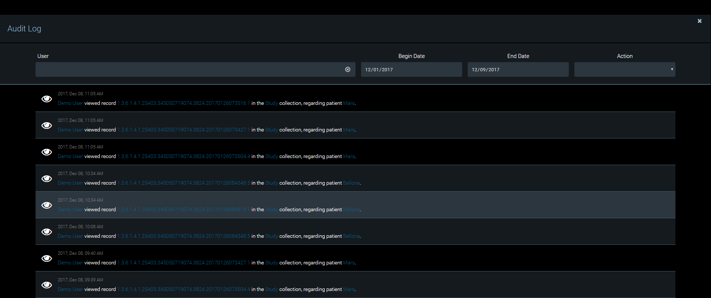

# Lesion Tracker - Audit Trail

1. To view Audit Trails, select **View Audit Log** on the Configuration menu.
2. To filter audit logs for a column or multiple Columns, type or select in the related column or Columns.

