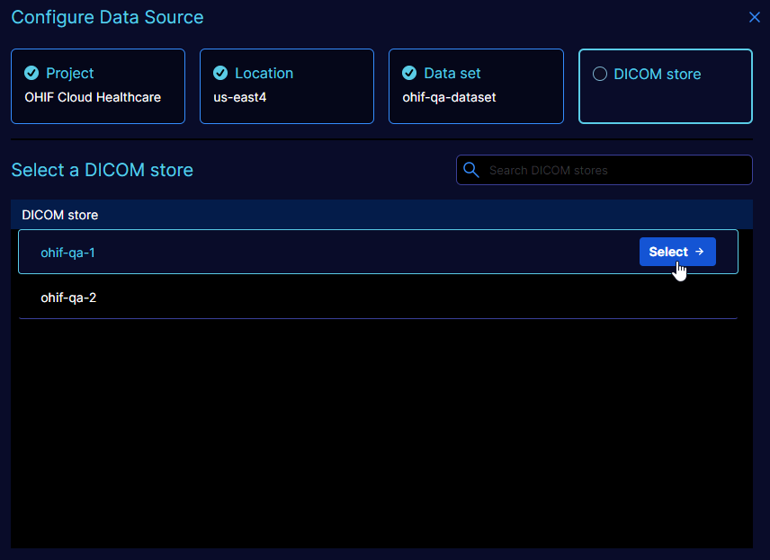

# Configuration UI

OHIF provides for a generic mechanism for configuring a data source. This is
most useful for those organizations with several data sources
that share common (path) hierarchies. For example, an organization may have several DICOM stores
in the Google Cloud Healthcare realm where each is organized into various projects,
location, data sets and DICOM stores.

By implementing the `BaseDataSourceConfigurationAPI` and
`BaseDataSourceConfigurationAPIItem` in an [OHIF extension](../../platform/extensions/index.md), a data source can
be made configurable via the generic UI as is depicted below for a
Google Cloud Healthcare data source.



:::tip
A datasource root URI can be [fully or partially specified](../../deployment/google-cloud-healthcare.md#configuring-google-cloud-healthcare-as-a-datasource-in-ohif)
in the OHIF configuration file.
:::

## `BaseDataSourceConfigurationAPIItem` interface

Each (path) item of a data source is represented by an instance of this interface.
At the very least each of these items must expose two properties:

|Property |Description|
|---------|-----------|
|id|a string that uniquely identifies the item|
|name|a human readable name for the item|

Note that information such as where in the path hierarchy the item exists
has been omitted, but can be added in any concrete class that might implement this
interface. For example, the the Google Cloud Healthcare implementation of this
interface (`GoogleCloudDataSourceConfigurationAPIItem`) adds an `itemType`
(i.e. projects, locations, datasets, or dicomStores) and `url`.

## `BaseDataSourceConfigurationAPI` interface

The implementation of this interface is at the heart of the configuration process.
It possesses several methods for building up a data source path based on various
`BaseDataSourceConfigurationAPIItem` objects that are set via calls to the `setCurrentItem`
method.

The constructor for the concrete class implementation should accept whatever
parameters are necessary for configuring the data source. One argument
to the constructor must be the string identifying the name of the data source
to be configured. Furthermore, considering that the `ExtensionManager` possesses
API to configure and update data sources, it too will likely be an argument to
the constructor. See [Creation via Customization Module](#creation-via-customization-module)
for more information on how the constructor is invoked via a factory method.

For an example implementation of this interface see `GoogleCloudDataSourceConfigurationAPI`.

### Interface Methods

Each of the following subsections lists a method of the interface with a description
detailing what the method should do.

#### `getItemLabels`

Gets the i18n labels (i.e. the i18n lookup keys) for each of the configurable items
of the data source configuration API.  For example, for the Google Cloud Healthcare
API, this would be `['Project', 'Location', 'Data set', 'DICOM store']`.

Besides the configurable item labels themselves, several other string look ups
are used base on EACH of the labels returned by this method.
For instance, for the label `{itemLabel}`, the following strings are fetched for
translation...
1. No `{itemLabel}` available
   - used to indicate no such items are available
   - for example, for Google, No Project available would be 'No projects available'
2. Select `{itemLabel}`
   - used to direct selection of the item
   - for example, for Google, Select Project would be 'Select a project'
3. Error fetching `{itemLabel}` list
   - used to indicate an error occurred fetching the list of items
   - usually accompanied by the error itself
   - for example, for Google, Error fetching Project list would be 'Error fetching projects'
4. Search `{itemLabel}` list
   - used as the placeholder text for filtering a list of items
   - for example, for Google, Search Project list would be 'Search projects'

#### `initialize`

Initializes the cloud server API and returns the top-level sub-items
that can be chosen to begin the process of configuring a data source.
For example, for the Google Cloud Healthcare API, this would perform the initial request
to fetch the top level projects for the logged in user account.

#### `setCurrentItem`

Sets the current path item that is passed as an argument to the method and
returns the sub-items of that item
that can be further chosen to configure a data source.
When setting the last configurable item of the data source (path), this method
returns an empty list AND configures the active data source with the selected
items path.

For example, for the Google Cloud Healthcare API, this would take the current item
(say a data set) and queries and returns its sub-items (i.e. all of the DICOM stores
contained in that data set). Furthermore, whenever the item to set is a DICOM store,
the Google Cloud Healthcare API implementation would update the OHIF data source
associated with this instance to point to that DICOM store.

#### `getConfiguredItems`

Gets the list of items currently configured for the data source associated with
this API instance. The resultant array must be the same length as the result of
`getItemLabels`. Furthermore the items returned should correspond (index-wise)
with the labels returned from `getItemLabels`.

## Creation via Customization Module

The generic UI (i.e. `DataSourceConfigurationComponent`) uses the
[OHIF UI customization service](../../platform/services/customization-service/customizationService.md) to
instantiate the `BaseDataSourceConfigurationAPI` instance to configure a data source.

A UI configurable data source should have a `configurationAPI` field as part of
its `configuration` in the OHIF config file. The `configurationAPI` value is the
customization id of the customization module that provides the factory method
to instantiate the `BaseDataSourceConfigurationAPI` instance.

For example, the following is a snippet of a Google Cloud Healthcare data source configuration.

```js
  dataSources: [
    {
      namespace: '@ohif/extension-default.dataSourcesModule.dicomweb',
      sourceName: 'google-dicomweb',
      configuration: {
        name: 'GCP',
        wadoUriRoot: 'https://healthcare.googleapis.com/v1/projects/ohif-cloud-healthcare/locations/us-east4/...',
        ...
        configurationAPI: 'ohif.dataSourceConfigurationAPI.google',
        ...
      },
    },
  ]
```

This suggests that the factory method is provided by the `'ohif.dataSourceConfigurationAPI.google'`
customization module. That customization module is provided by the `default` extension's
`getCustomizationModule` and looks something like the following snippet of code. Notice that
the factory method's name MUST be `factory` and accept one argument - the data source name.
Furthermore note how the constructor is invoked with anything required by the concrete configuration
API class.

```js
export default function getCustomizationModule({
  servicesManager,
  extensionManager,
}) {
  return [
    {
      name: 'default',
      value: [
        {
          // The factory for creating an instance of a BaseDataSourceConfigurationAPI for Google Cloud Healthcare
          id: 'ohif.dataSourceConfigurationAPI.google',
          factory: (dataSourceName: string) =>
            new GoogleCloudDataSourceConfigurationAPI(
              dataSourceName,
              servicesManager,
              extensionManager
            ),
        },
      ],
    },
  ];
}

```
