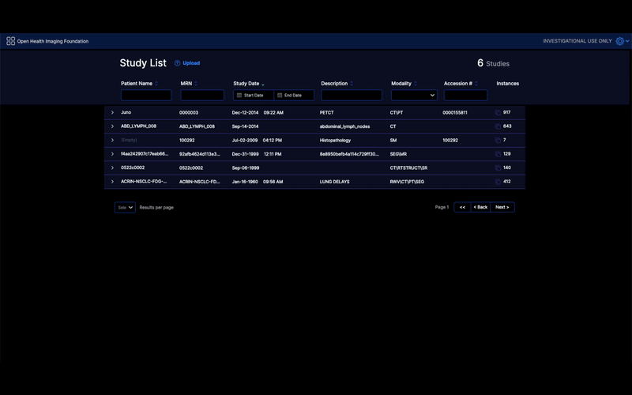

# DICOMweb

## Set up a local DICOM server

ATTENTION! Already have a remote or local server? Skip to the
[configuration section](#configuration-learn-more) below.

While the OHIF Viewer can work with any data source, the easiest to configure
are the ones that follow the [DICOMWeb][dicom-web] spec.

1. Choose and install an Image Archive
2. Upload data to your archive (e.g. with DCMTK's [storescu][storescu] or your
   archive's web interface)
3. Keep the server running

For our purposes, we will be using `Orthanc`, but you can see a list of
[other Open Source options](#open-source-dicom-image-archives) below.

### Requirements

- Docker
  - [Docker for Mac](https://docs.docker.com/docker-for-mac/)
  - [Docker for Windows (recommended)](https://docs.docker.com/docker-for-windows/)
  - [Docker Toolbox for Windows](https://docs.docker.com/toolbox/toolbox_install_windows/)

_Not sure if you have `docker` installed already? Try running `docker --version`
in command prompt or terminal_

> If you are using `Docker Toolbox` you need to change the _PROXY_DOMAIN_
> parameter in _platform/app/package.json_ to http://192.168.99.100:8042 or
> the ip docker-machine ip throws. This is the value [`WebPack`][webpack-proxy]
> uses to proxy requests

## Open Source DICOM Image Archives

There are a lot of options available to you to use as a local DICOM server. Here
are some of the more popular ones:

| Archive                                       | Installation                       |
| --------------------------------------------- | ---------------------------------- |
| [DCM4CHEE Archive 5.x][dcm4chee]              | [W/ Docker][dcm4chee-docker]       |
| [Orthanc][orthanc]                            | [W/ Docker][orthanc-docker]        |
| [DICOMcloud][dicomcloud] (**DICOM Web only**) | [Installation][dicomcloud-install] |
| [OsiriX][osirix] (**Mac OSX only**)           | Desktop Client                     |
| [Horos][horos] (**Mac OSX only**)             | Desktop Client                     |

_Feel free to make a Pull Request if you want to add to this list._

Below, we will focus on `DCM4CHEE` and `Orthanc` usage:

### Running Orthanc

_Start Orthanc:_

```bash
# Runs orthanc so long as window remains open
yarn run orthanc:up
```

_Upload your first Study:_

1. Navigate to
   [Orthanc's web interface](http://localhost:8042/ui/app/index.html#/) at
   `http://localhost:8042/ui/app/index.html#/` in a web browser.
2. In the left you can see the upload button where you can drag and drop your DICOM files

#### Orthanc: Learn More

You can see the `docker-compose.yml` file this command runs at
[`<project-root>/platform/app/.recipes/Nginx-Orthanc`][orthanc-docker-compose], and more on
Orthanc for Docker in [Orthanc's documentation][orthanc-docker].

#### Connecting to Orthanc

Now that we have a local Orthanc instance up and running, we need to configure
our web application to connect to it. Open a new terminal window, navigate to
this repository's root directory, and run:

```bash
# If you haven't already, enable yarn workspaces
yarn config set workspaces-experimental true

# Restore dependencies
yarn install

# Run our dev command, but with the local orthanc config
yarn run dev:orthanc
```

#### Configuration: Learn More

> For more configuration fun, check out the
> [Essentials Configuration](../index.md) guide.

Let's take a look at what's going on under the hood here. `yarn run dev:orthanc`
is running the `dev:orthanc` script in our project's `package.json` (inside
`platform/app`). That script is:

```js
cross-env NODE_ENV=development PROXY_TARGET=/dicom-web PROXY_DOMAIN=http://localhost:8042 APP_CONFIG=config/docker_nginx-orthanc.js webpack-dev-server --config .webpack/webpack.pwa.js -w
```

- `cross-env` sets three environment variables
  - PROXY_TARGET: `/dicom-web`
  - PROXY_DOMAIN: `http://localhost:8042`
  - APP_CONFIG: `config/docker_nginx-orthanc.js`
- `webpack-dev-server` runs using the `.webpack/webpack.pwa.js` configuration
  file. It will watch for changes and update as we develop.

`PROXY_TARGET` and `PROXY_DOMAIN` tell our development server to proxy requests
to `Orthanc`. This allows us to bypass CORS issues that normally occur when
requesting resources that live at a different domain.

The `APP_CONFIG` value tells our app which file to load on to `window.config`.
By default, our app uses the file at
`<project-root>/platform/app/public/config/default.js`. Here is what that
configuration looks like:

```js
window.config = {
  routerBasename: '/',
  extensions: [],
  modes: [],
  showStudyList: true,
  dataSources: [
    {
      namespace: '@ohif/extension-default.dataSourcesModule.dicomweb',
      sourceName: 'dicomweb',
      configuration: {
        friendlyName: 'dcmjs DICOMWeb Server',
        name: 'DCM4CHEE',
        wadoUriRoot: 'https://server.dcmjs.org/dcm4chee-arc/aets/DCM4CHEE/wado',
        qidoRoot: 'https://server.dcmjs.org/dcm4chee-arc/aets/DCM4CHEE/rs',
        wadoRoot: 'https://server.dcmjs.org/dcm4chee-arc/aets/DCM4CHEE/rs',
        qidoSupportsIncludeField: true,
        supportsReject: true,
        imageRendering: 'wadors',
        thumbnailRendering: 'wadors',
        enableStudyLazyLoad: true,
        supportsFuzzyMatching: true,
        supportsWildcard: true,
      },
    },
  ],
  defaultDataSourceName: 'dicomweb',
};
```

### Data Source Configuration Options

The following properties can be added to the `configuration` property of each data source.

##### `dicomUploadEnabled`
A boolean indicating if the DICOM upload to the data source is permitted/accepted or not. A value of true provides a link on the OHIF work list page that allows for DICOM files from the local file system to be uploaded to the data source

:::tip
The [OHIF plugin for Orthanc](https://book.orthanc-server.com/plugins/ohif.html) by default utilizes the DICOM JSON data
source and it has been discovered that only those studies uploaded to Orthanc AFTER the plugin has been installed are
available as DICOM JSON. As such, if the OHIF plugin for Orthanc is desired for studies uploaded prior to installing the plugin,
then consider switching to using [DICOMweb instead](https://book.orthanc-server.com/plugins/ohif.html#using-dicomweb).
:::



Don't forget to add the customization to the config as well

```js
customizationService: {
  dicomUploadComponent:
    '@ohif/extension-cornerstone.customizationModule.cornerstoneDicomUploadComponent',
},
```


#### `singlepart`
A comma delimited string specifying which payloads the data source responds with as single part. Those not listed are considered multipart. Values that can be included here are `pdf`, `video`, `bulkdata`, `thumbnail` and `image`.

For DICOM video and PDF it has been found that Orthanc delivers multipart, while DCM4CHEE delivers single part. Consult the DICOM conformance statement for your particular data source to determine which payload types it delivers.

To learn more about how you can configure the OHIF Viewer, check out our
[Configuration Guide](../index.md).

### DICOM Upload
See the [`dicomUploadEnabled`](#dicomuploadenabled) data source configuration option.

Don't forget to add the customization to the config as well

```js
customizationService: {
  dicomUploadComponent:
    '@ohif/extension-cornerstone.customizationModule.cornerstoneDicomUploadComponent',
},
```

### DICOM PDF
See the [`singlepart`](#singlepart) data source configuration option.

### DICOM Video
See the [`singlepart`](#singlepart) data source configuration option.

### BulkDataURI

The `bulkDataURI` configuration option allows the datasource to use the
bulkdata end points for retrieving metadata if originally was not included in the
response from the server. This is useful for the metadata information that
are big and can/should be retrieved in a separate request. In case the bulkData URI
is relative (instead of absolute) the `relativeResolution` option can be used to
specify the resolution of the relative URI. The possible values are `studies`, `series` and `instances`.
Certainly the knowledge of how the server is configured is required to use this option.

```js
bulkDataURI: {
  enabled: true,
  relativeResolution: 'series',
},
```


### Running DCM4CHEE

dcm4che is a collection of open source applications for healthcare enterprise
written in Java programming language which implements DICOM standard. dcm4chee
(extra 'e' at the end) is dcm4che project for an Image Manager/Image Archive
which provides storage, retrieval and other functionalities. You can read more
about dcm4chee in their website [here](https://www.dcm4che.org/)

DCM4chee installation is out of scope for these tutorials and can be found
[here](https://github.com/dcm4che/dcm4chee-arc-light/wiki/Run-minimum-set-of-archive-services-on-a-single-host)

An overview of steps for running OHIF Viewer using a local DCM4CHEE is shown
below:

<div style={{padding:"56.25% 0 0 0", position:"relative"}}>
    <iframe src="https://player.vimeo.com/video/843233881?badge=0&amp;autopause=0&amp;player_id=0&amp;app_id=58479" frameBorder="0" allow="autoplay; fullscreen; picture-in-picture" allowFullScreen style= {{ position:"absolute",top:0,left:0,width:"100%",height:"100%"}} title="measurement-report"></iframe>
</div>

[dcm4chee]: https://github.com/dcm4che/dcm4chee-arc-light
[dcm4chee-docker]:
  https://github.com/dcm4che/dcm4chee-arc-light/wiki/Running-on-Docker
[orthanc]: https://www.orthanc-server.com/
[orthanc-docker]: http://book.orthanc-server.com/users/docker.html
[dicomcloud]: https://github.com/DICOMcloud/DICOMcloud
[dicomcloud-install]: https://github.com/DICOMcloud/DICOMcloud#running-the-code
[osirix]: http://www.osirix-viewer.com/
[horos]: https://www.horosproject.org/
[default-config]:
  https://github.com/OHIF/Viewers/blob/master/platform/app/public/config/default.js
[html-templates]:
  https://github.com/OHIF/Viewers/tree/master/platform/app/public/html-templates
[config-files]:
  https://github.com/OHIF/Viewers/tree/master/platform/app/public/config
[storescu]: http://support.dcmtk.org/docs/storescu.html
[webpack-proxy]: https://webpack.js.org/configuration/dev-server/#devserverproxy
