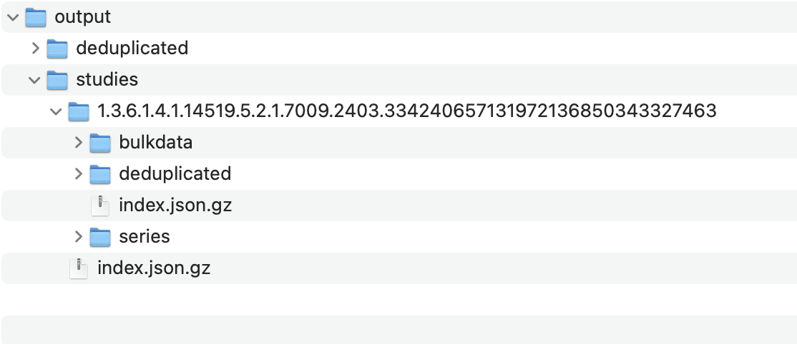

# Static DICOMweb Files for Enhanced Performance

This section describes how to generate and serve static DICOMweb files, significantly improving the performance of your OHIF Viewer setup. These files are pre-processed and compressed, minimizing storage space and reducing serving time to the bare minimum (disk read and HTTP stream write).

## Static-DICOMWeb Project

The core tool for this process is the `static-wado` project, available on GitHub:

[static-wado]: https://github.com/RadicalImaging/Static-DICOMWeb

This project contains two main components:

*   **`static-wado-creator`:**  Converts raw DICOM files into a DICOMweb-compliant directory structure, optimizing them for efficient serving.
*   **`static-wado-webserver`:** A simple web server specifically designed to serve the generated static DICOMweb files.

## Prerequisites

-   Node.js and npm (or yarn) installed on your system.

## Installation

1. **Clone the Repository:**

    ```bash
    git clone https://github.com/RadicalImaging/Static-DICOMWeb
    cd Static-DICOMWeb
    ```

2. **Install Dependencies:**

    ```bash
    yarn install
    ```

## Generating Static DICOMweb Files

1. **Prepare your DICOM data:** Organize your DICOM files into a directory. For example `/Users/alireza/dicom/test-static-script/ACRIN-CT`.

2. **Convert to DICOMweb Structure:**
    Use the `mkdicomweb.js` script from the `static-wado-creator` package to create the DICOMweb directory:

    ```bash
    node packages/static-wado-creator/bin/mkdicomweb.js '/Users/alireza/dicom/test-static-script/ACRIN-CT' -o '/Users/alireza/dicom/test-static-script/output'
    ```

    *   **Replace:**
        *   `/Users/alireza/dicom/test-static-script/ACRIN-CT` with the path to your directory of DICOM files.
        *   `/Users/alireza/dicom/test-static-script/output` with your desired output directory for the DICOMweb structure.

    This command will generate a directory structure similar to this in your output location:

    

## Serving Static Files with the Web Server

1. **Start the Server:**

    Run the `dicomwebserver.mjs` script from the `static-wado-webserver` package, specifying the port and the DICOMweb directory:

    ```bash
    node packages/static-wado-webserver/bin/dicomwebserver.mjs -p 3001 -o /Users/alireza/dicom/test-static-script/output
    ```

    *   **`-p 3001`:** Sets the server to listen on port 3001. You can change this if needed.
    *   **`-o /Users/alireza/dicom/test-static-script/output`:**  Specifies the path to your generated DICOMweb directory.

    :::info
    The `-p` (port) and `-o` (output directory) flags are used to configure the server.
    :::

## Running OHIF Viewer with Static Data

1. **Use the `local_static.js` Configuration:**

    Start the OHIF Viewer in development mode using the provided `local_static.js` configuration file:

    ```bash
    yarn dev:static
    ```

2. **Configuration Details:**

    The `local_static.js` configuration file is pre-configured to point to:

    ```js
    qidoRoot: 'http://localhost:3001/dicomweb',
    wadoRoot: 'http://localhost:3001/dicomweb',
    ```

    This matches the default port (3001) used by the `static-wado-webserver`.

    :::info
    If you change the port or output directory when running the `static-wado-webserver`, you **must** also update the `qidoRoot` and `wadoRoot` values in your `local_static.js` configuration file accordingly to ensure the OHIF Viewer can access the data.
    :::
