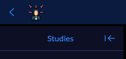

# UI & Appearance

OHIF's user interface is built on **ui-next**, a component library purpose-built
for medical imaging workflows. It provides a consistent set of React components,
a token-based theming system, a curated icon set, and a collection of UI services
that manage runtime behavior like modals, notifications, and viewport layout.

This page gives a high-level map of how these pieces fit together and where to
find detailed documentation for each.

## Component Library

The [component library](/components) is the foundation of every panel, toolbar, dialog, and
control in the viewer. Components are organized into three tiers:

- **Simple components** — atomic building blocks like Button, Checkbox, Input,
  Label, Slider, and Switch. These are styled with the design system's tokens and
  are the smallest interactive units.

- **Compound components** — composed from simple components to handle more
  complex interactions: Select, Dialog, DropdownMenu, Tabs, Table, Popover,
  Tooltip, Toast, and others. These manage their own state (open/close, selection,
  focus) via headless patterns.

- **OHIF-specific components** — built for medical imaging workflows and not
  found in general-purpose libraries: AllInOneMenu, CinePlayer, DataRow,
  DataTable, Numeric, PanelSection, SmartScrollbar, ToolButton, and
  ToolButtonList. These integrate directly with OHIF's services and extension
  system.

Every component renders live in the interactive
[Components](/components) section of this documentation site, where you
can see props, variants, and copy usage examples.

## Appearance Dialog

The Appearance dialog is an optional UI that lets end users switch presets,
apply custom CSS overrides, and share themes via URL. It is not enabled by
default, but deployers can
[opt in via configuration](../platform/services/customization-service/appearance-theming.md#enabling-the-theme-module).
See [Appearance & Theming](../platform/services/customization-service/appearance-theming.md)
for the full setup and developer guide.

## Colors & Theming

OHIF uses a **token-based color system** built on CSS custom properties with HSL
values. The base theme (dark mode) is defined in `:root` via Tailwind CSS, and
theme presets override specific tokens by applying a CSS class to `document.body`.

The theming system covers:

- **[Design tokens](/colors-and-theming#color-tokens-and-roles)** — a set of semantic color variables (`--background`,
  `--primary`, `--card`, `--border`, etc.) that every component references. Tokens
  are defined as HSL triplets and consumed via Tailwind's `hsl(var(...))` pattern.

- **Theme presets** — six built-in themes (three tonal, three neutral) that shift
  the entire interface's color palette. Presets are defined as JSON files and
  applied via CSS classes. Also see:
  [Creating Themes](/colors-and-theming#creating-themes) and
  [Adding a Theme Preset](../platform/services/customization-service/appearance-theming.md#adding-a-theme-preset).

- **Accessibility** — foreground tokens are paired with every surface token to
  maintain contrast ratios across themes. When adding custom themes,
  [test colors to match accessibility standards](/colors-and-theming#accessibility).

Explore the live token swatches and theme picker in the interactive
[Colors & Theming](/colors-and-theming) page, and see
[Appearance & Theming](../platform/services/customization-service/appearance-theming.md)
for the full configuration and developer guide.

## Iconography

OHIF ships a curated set of icons designed specifically for medical imaging interfaces.
Icons are SVG-based, registered via `addIcon()`, and rendered through the `Icons`
component. They follow the same token system as the rest of the UI, so icon colors
respond to the active theme.

Browse the full set with search and click-to-copy in the
[Iconography](/components/icons) page.

## White Labeling

OHIF supports replacing the header logo with custom branding via the
`whiteLabeling` configuration key. This lets you rebrand the viewer without
modifying source code.

Add a `whiteLabeling` entry to your configuration file with a
`createLogoComponentFn` that returns a React element:

```js
window.config = {
  /** .. **/
  whiteLabeling: {
    createLogoComponentFn: function(React) {
      return React.createElement(
        'a',
        {
          target: '_self',
          rel: 'noopener noreferrer',
          className: 'text-purple-600 line-through',
          href: '/',
        },
        React.createElement('img', {
          src: './customLogo.svg',
        })
      );
    },
  },
  /** .. **/
};
```



You can use Tailwind CSS utility classes in the `className` property to style
your custom logo component.

## UI Services

While the component library handles what gets rendered, **UI services** handle
the runtime behavior: opening modals, showing notifications, managing viewport
layout, and coordinating dialogs. These services use a pub/sub architecture and
are accessed through the `servicesManager`:

| Service | What it manages |
|---------|----------------|
| [Modal Service](../platform/services/ui/ui-modal-service.md) | Full-screen and contained modals (including the Appearance dialog) |
| [Dialog Service](../platform/services/ui/ui-dialog-service.md) | Lightweight dialogs with form inputs and confirmations |
| [Notification Service](../platform/services/ui/ui-notification-service.md) | Toast notifications (success, warning, error, info) |
| [Viewport Grid Service](../platform/services/ui/viewport-grid-service.md) | Viewport layout, grid arrangement, and active viewport tracking |
| [Viewport Dialog Service](../platform/services/ui/ui-viewport-dialog-service.md) | Dialogs anchored to specific viewports |
| [Viewport Action Menu](../platform/services/ui/viewport-action-menu.md) | Context menus and action buttons on viewport corners |
| [Cine Service](../platform/services/ui/cine-service.md) | Cine playback controls and frame rate |

UI services are documented in the [Services > UI](../platform/services/ui/index.md)
section.

## Customization Service

The [Customization Service](../platform/services/customization-service/customizationService.md)
is the mechanism that ties everything together. It allows deployers and
extension authors to override, extend, or replace UI components and behaviors
without modifying core code. Customizations can be scoped to a specific mode, set
globally via configuration, or provided as defaults by extensions.

The Appearance dialog itself is delivered as a customization module. Deployers
enable it by adding a single reference to their config's `customizationService`
array. This pattern means that any part of the UI that supports customization
can be configured the same way.

See the full customization guide at
[Customization Service](../platform/services/customization-service/customizationService.md),
including the syntax reference for `$set`, `$push`, `$merge`, `$filter`, and
other operations.
