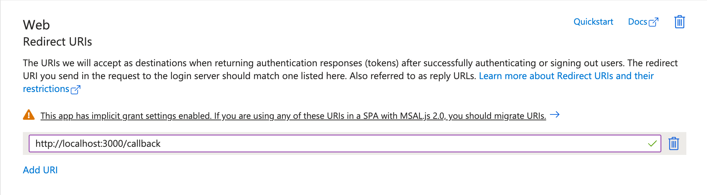
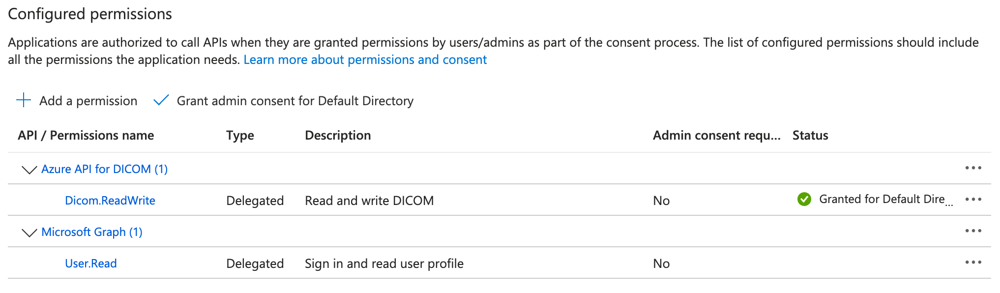
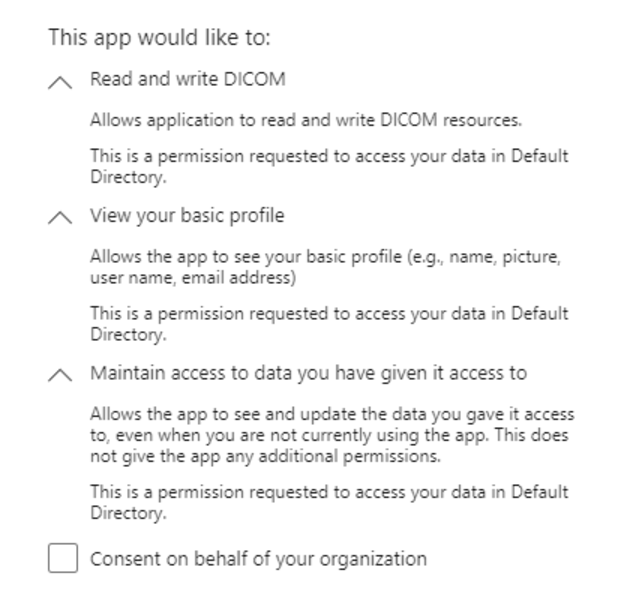
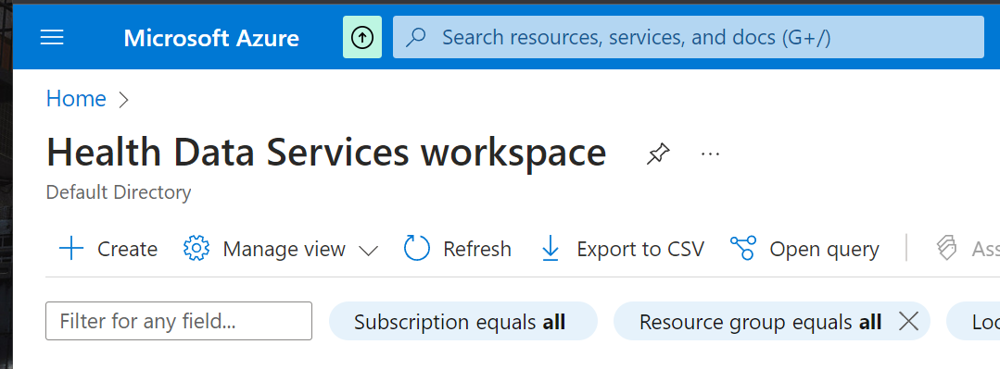
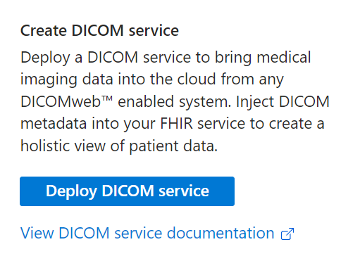
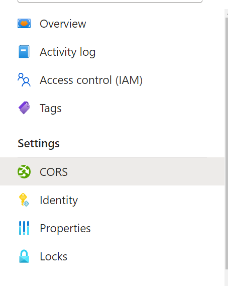
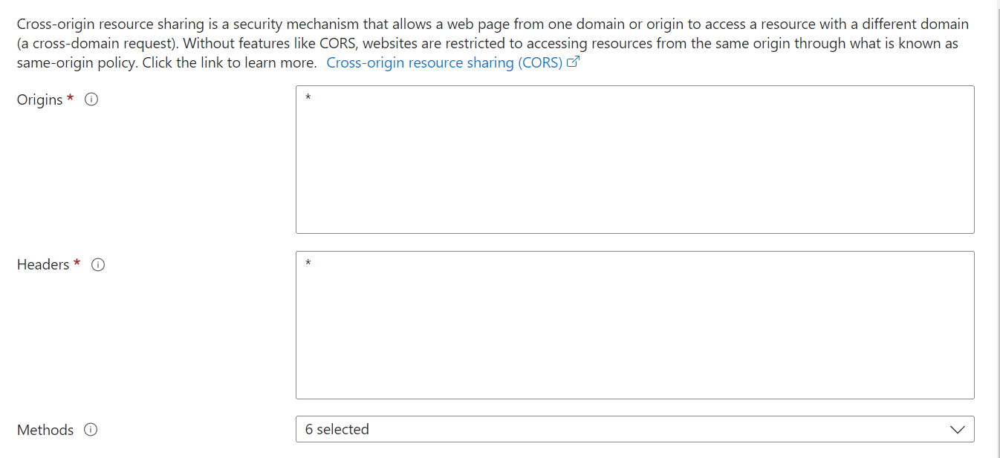
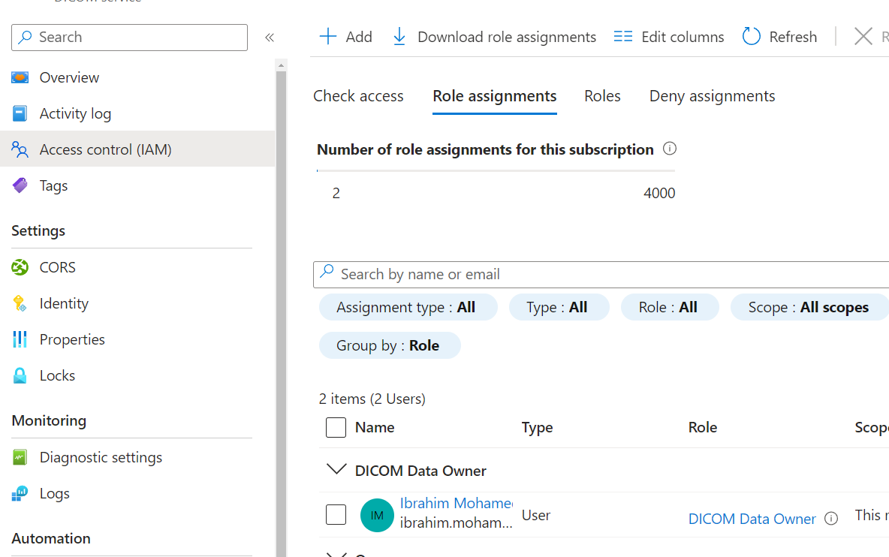
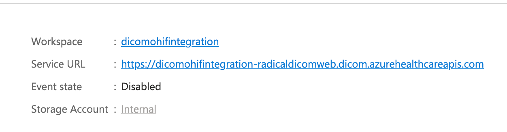

# Microsoft Azure

This guide explains how to configure a DICOM datasource in OHIF using Azure Healthcare APIs. It focuses on the configuration details and parameters necessary for integration.

---

## Configuring Azure Healthcare APIs as a DICOMweb Data Source

Follow these steps to set up Azure as a DICOM datasource for the OHIF Viewer.

---

### Azure AD Registration:

1. Navigate to the Azure Portal.
2. Select **"Azure Active Directory"** > **"App registrations"** > **"New registration"**.
3. Name your application.
4. Under **"Supported account types"**, select **"Accounts in any organizational directory (Any Azure AD directory - Multitenant) and personal Microsoft accounts (e.g. Skype, Xbox)"**.
5. Enter the following values in your redirect URI tab:

   

---

### API Permissions:

1. Under your registered application, go to **"API permissions"**.
2. Click **"Add a permission"**.
3. Choose the Azure API for DICOM (**Dicom.ReadWrite**). If you can't find it, refer to the "Configure Azure DICOMWEB Service" section and then return to this step.

   

---

### Authentication:

1. Under **"Authentication"**, check the **"ID tokens"** box since we are using OpenID Connect.

---

### App Client ID and Tenant ID:

1. Copy your app client ID and tenant ID to prepare for use in configuring an OHIF datasource.

---

### Consent:

1. The first time a user logs in, they will be prompted to consent to the permissions your application has requested.
2. Once they grant consent, your application can use the obtained access token to call the specific Microsoft API on behalf of the user.

   

---

### Configure Azure DICOMWEB Service:

1. **Create a Health Data Services workspace**:

   

2. Visit the newly created workspace and press **"Deploy DICOM Service"**:

   

3. After the DICOM service is deployed, visit the **"CORS headers"** section:

   

4. Set the headers and origins to `*` and specify the HTTP methods you'd like to use:

   

5. Save the changes.

6. Add the Microsoft emails of the users you'd like to grant access to your DICOM service in the **"Access control"** section and assign them the **"DICOM Data Owner"** role (or other roles depending on your requirements):

   

7. Copy your DICOM service URL to prepare it for usage in OHIF as a datasource:

   

8. Upload your DICOM files to your service.

---

## 1. Configure OIDC Authentication

Azure uses OpenID Connect (OIDC) for authentication. Update the OIDC section in your configuration file with the following parameters:

```json
"oidc": [
  {
    "redirect_uri": "/callback",
    "response_type": "id_token token",
    "scope": "openid https://dicom.healthcareapis.azure.com/Dicom.ReadWrite",
    "post_logout_redirect_uri": "/logout-redirect.html",
    "automaticSilentRenew": false,
    "revokeAccessTokenOnSignout": true,
    "loadUserInfo": false,
    "authority": "https://login.microsoftonline.com/{tenant-id}/v2.0/",
    "client_id": "{client-id}"
  }
]
```

#### Parameters:
- **redirect_uri**: The URL where users are redirected after successful authentication.
- **response_type**: Specifies the authentication response type (id_token and token).
- **scope**: Defines the level of access. Use `Dicom.ReadWrite` to allow read and write access to DICOM data.
- **post_logout_redirect_uri**: The URL users are redirected to after logout.
- **automaticSilentRenew**: Automatically renews tokens without user interaction. Set to `false` for manual renewal.
- **revokeAccessTokenOnSignout**: Revokes access tokens upon logout for added security.
- **loadUserInfo**: Disables loading additional user information; set to `false` for Azure as it is not supported.
- **authority**: The Azure AD tenant URL for OIDC authorization.
- **client_id**: The application’s client ID from Azure AD.

---

## 2. Add the Data Source Configuration

Update the data source configuration file with your Azure Healthcare APIs details:

```json
{
  "namespace": "@ohif/extension-default.dataSourcesModule.dicomweb",
  "sourceName": "ohif_azure",
  "friendlyName": "ohif_azure",
  "configuration": {
    "singlepart": "bulkdata,pdf,video",
    "imageRendering": "wadors",
    "thumbnailRendering": "wadors",
    "supportsWildcard": true,
    "enableStudyLazyLoad": true,
    "supportsFuzzyMatching": false,
    "supportsStow": true,
    "qidoRoot": "https://{your-dicom-instance}.dicom.azurehealthcareapis.com/v2",
    "wadoUriRoot": "https://{your-dicom-instance}.dicom.azurehealthcareapis.com/v2",
    "wadoRoot": "https://{your-dicom-instance}.dicom.azurehealthcareapis.com/v2"
  }
}
```

#### Parameters:
- **qidoRoot**: Base URL for QIDO-RS queries.
- **wadoUriRoot**: Base URL for WADO-URI requests.
- **wadoRoot**: Base URL for WADO-RS requests.

---

## 3. Running the Viewer with Azure Configuration

1. Save the above configurations in your OHIF Viewer configuration file.
2. Run the viewer:

   ```bash
   cd OHIFViewer
   yarn install
   APP_CONFIG=config/azure.js yarn run dev
   ```

   Replace `config/azure.js` with the path to your configuration file.

---

### Additional Notes
- Ensure that the Azure Healthcare API is enabled for your subscription and that the necessary permissions (e.g., `Dicom.ReadWrite`) are assigned to the OIDC client.
- The `qidoRoot`, `wadoUriRoot`, and `wadoRoot` should point to your Azure DICOM service URL. Replace `{your-dicom-instance}` with your actual instance name.

This setup allows OHIF to interact seamlessly with Azure's Healthcare APIs, enabling robust DICOM management and visualization.

