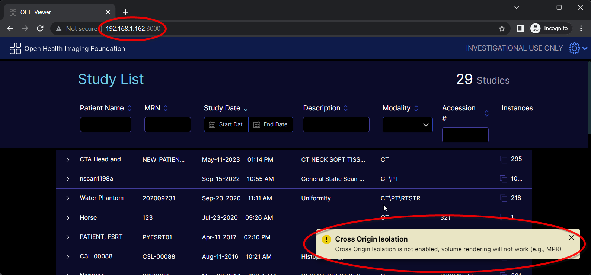
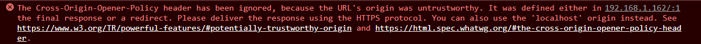
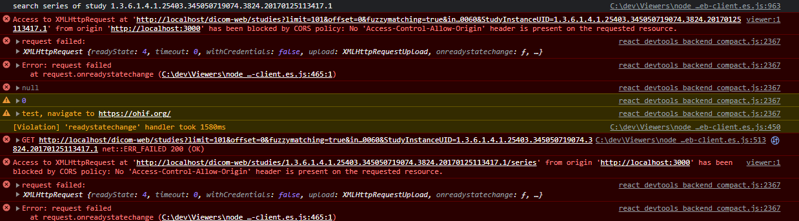
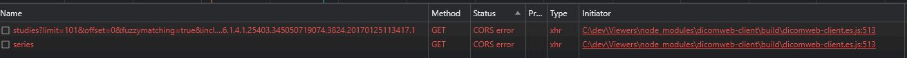

# Cross-Origin Information for OHIF

This document describes various security configurations, settings and environments/contexts needed to fully leverage OHIF’s capabilities. One may need some configurations while others might need ALL of them - it all depends on the environment OHIF is expected to run in.

In particular, three of OHIF’s features depend on these configurations:
- [OHIF’s use of SharedArrayBuffer](#sharedarraybuffer)
- [Embedding OHIF in an iframe](#embedding-ohif-in-an-iframe)
- [XMLHttpRequests to fetch data from data sources](#cors-in-ohif)


## SharedArrayBuffer
A `SharedArrayBuffer` is a JavaScript object that is similar to an `ArrayBuffer` but can be shared between web workers and the window that spawned them via the `postMessage` API. See [SharedArrayBuffer in MDN](https://developer.mozilla.org/en-US/docs/Web/JavaScript/Reference/Global_Objects/SharedArrayBuffer) for more information.

:::tip
To turn off Shared Array Buffer completely, just set `useSharedArrayBuffer` to `false` in the [OHIF configuration](../configuration/configurationFiles.md). But keep in mind that you will not get the performance boost that Shared Array Buffer offers for decoding and rendering big volumes where web workers write to the same memory space.
:::

### Security Requirements

In order to use `SharedArrayBuffer` objects in the browser, the following security conditions must be met:

- The page must be served in a [secure context](#secure-context).
- The page must have [cross-origin isolation](#cross-origin-isolation) enabled.

### `SharedArrayBuffer` in OHIF

OHIF uses `SharedArrayBuffer` in its volume loader (from Cornerstone3D). It comes with the benefit of improved performance and optimization at the cost of some configuration to use it.

As such, if the following popup is shown when launching OHIF then the OHIF server will have to be configured to permit the loading of volumetric images and data. Note that stack viewports are still available and functional even when this error is present.



To better determine which (if not all) of the [security requirements](#security-requirements) are lacking, have a look at the browser console.

Output in the console similar to the following indicates that OHIF is not running in a [secure context](#secure-context).



Absence of the above error in the console together with the presence of the Cross Origin Isolation popup warning, likely indicates that either or both of the [COOP](#coop---cross-origin-opener-policy) and/or [COEP](#coep---cross-origin-embedder-policy) headers are not set for OHIF.

## Embedding OHIF in an iframe

As described [here](./iframe.md), there are cases where OHIF will be embedded in an iframe. The following links provide more information for setting up and configuring OHIF to work in an iframe:

- [OHIF iframe documentation](./iframe.md#static-build)
- [OHIF as a Cross-origin Resource in an iframe](#ohif-as-a-cross-origin-resource-in-an-iframe)

## Secure Context

MDN defines a secure context as [“a Window or Worker for which certain minimum standards of authentication and confidentiality are met.“](https://developer.mozilla.org/en-US/docs/Web/Security/Secure_Contexts)

Any local URL is considered secure. The following are some examples of local URLs that are considered secure…
- http://localhost
- http://127.0.0.1:3000

URLs that are NOT local must be delivered over `https://` or `wss://` (i.e. TLS) to be considered secure. See [When is a context considered secure](https://developer.mozilla.org/en-US/docs/Web/Security/Secure_Contexts#when_is_a_context_considered_secure) in MDN for more information.

### iframes

A page embedded in an iframe is considered secure if it itself and every one of its embedding ancestors are delivered securely. Otherwise it is deemed insecure.

### Why does OHIF require a secure context?

Beyond all of the inherent benefits of a secure connection, OHIF requires a secure context so that it can utilize [SharedArrayBuffer](#sharedarraybuffer) objects for volume rendering.

### Configuring/setting up a secure context

[Local URLs are considered secure](https://developer.mozilla.org/en-US/docs/Web/Security/Secure_Contexts#when_is_a_context_considered_secure), and as such whenever OHIF is accessed via a local URL (e.g. http://localhost:3000) it is running in a secure context. For example, in a development environment using the default webpack setup, OHIF can be deployed and accessed in a secure context at http://localhost:3000.

The best alternative is to host OHIF over HTTPS.

:::tip
OHIF can be served over HTTPS in a variety of ways (these are just some examples).
- Website hosting services that offer HTTPS deployment (e.g,. Netlify) or offer HTTPS load balancers (AWS, Google Cloud etc.)
- Setting up a reverse proxy (e.g. `nginx`) with a self-signed certificate that forwards requests to the OHIF server
    - [An OHIF Docker image can be set up this way](./docker.md#ssl).
:::

## Origin Definition

According to [MDN](https://developer.mozilla.org/en-US/docs/Glossary/Origin), a Web content’s origin is defined by the scheme (protocol), hostname (domain), and port of the URL used to access it. Two objects have the same origin only when the scheme, hostname, and port all match.

## CORS - Cross-Origin Resource Sharing

A cross-origin resource is a resource (e.g. image, JSON, etc) that is served by one origin and used/referenced by a different origin.

CORS is the protocol utilized by web servers and browsers whereby a server of one origin identifies and/or restricts which of its resources that other origins (i.e. other than its own) a browser should allow access to. By default a browser does not permit cross-origin resource sharing.

The CORS mechanism relies on the HTTP response headers from the server to indicate if a resource can be shared with a different origin.

See the [MDN CORS article](https://developer.mozilla.org/en-US/docs/Web/HTTP/CORS) for more information.

### CORS HTTP Headers

The header that mostly concerns OHIF is listed below and should be configured accordingly on the DICOMweb server or any data source that OHIF would make XMLHttpRequests to for its data.

```http
Access-Control-Allow-Origin: `<origin>` | *
```

:::tip
The `Access-Control-Allow-Origin` header specifies which origins can access the served resource embedded in the response.

Either a single, specific origin (i.e. `<origin>`) can be specified or ALL origins (i.e. *)

See [MDN](https://developer.mozilla.org/en-US/docs/Web/HTTP/CORS#access-control-allow-origin) for more information.
:::

### CORS in OHIF

OHIF fetches and displays data and images from data sources. It invokes XMLHttpRequests to some data sources such as DICOMweb data sources to fetch the information to render. Typically, a DICOMweb server is hosted on a completely different origin than the one serving OHIF. As such, those XMLHttpRequests use CORS.

### Troubleshooting CORS in OHIF

The following is an example screenshot of the browser console when one of OHIF’s DICOMweb data source servers is not configured for CORS.



And the following is what is in the accompanying network tab.



:::info
Setting the appropriate CORS header varies per server or service that is hosting the data source. What follows below is just one example to remedy the problem.
:::

:::tip
If Orthanc is the data source running in a Docker container composed with/behind nginx. And OHIF is being served at localhost:3000. The issue can be remedied by adding either of the following to Orthanc’s Docker container nginx.conf file.

```nginx
add_header 'Access-Control-Allow-Origin' 'http://localhost:3000' always;
```

Or

```nginx
add_header 'Access-Control-Allow-Origin' '*' always;
```
:::

## COOP - Cross-Origin Opener Policy

The COOP HTTP response header restricts the global, root document of the page from being referenced and accessed by another cross-origin document that might open the page in a window. See [MDN](https://developer.mozilla.org/en-US/docs/Web/HTTP/Headers/Cross-Origin-Opener-Policy) for more information.

### Header Values Pertinent to OHIF (see [MDN](https://developer.mozilla.org/en-US/docs/Web/HTTP/Headers/Cross-Origin-Opener-Policy#syntax) for more information)

|Value|Description|
|-----|-----------|
|same-origin|Restricts the document to be referenced by openers of the same origin only.|

### COOP in OHIF

COOP is required for [SharedArrayBuffer](#sharedarraybuffer) usage in OHIF. See also [Troubleshooting Cross-origin Isolation in OHIF](#troubleshooting-cross-origin-isolation-in-ohif).

## COEP - Cross-Origin Embedder Policy

The COEP HTTP response header restricts cross-origin documents from being embedded into a document (e.g. in an iframe, video, image, etc). See [MDN](https://developer.mozilla.org/en-US/docs/Web/HTTP/Headers/Cross-Origin-Embedder-Policy) for more information.

### Header Values Pertinent to OHIF (see [MDN](https://developer.mozilla.org/en-US/docs/Web/HTTP/Headers/Cross-Origin-Embedder-Policy#syntax) for more information)

|Value|Description|
|-----|-----------|
|require-corp|Permits the document to load either of the following embedded resources: <ul><li>Those from the same origin</li><li>Cross-origin resources embedded by a DOM element that has the appropriate [crossorigin attribute](https://developer.mozilla.org/en-US/docs/Web/HTML/Attributes/crossorigin) set</li><li>Cross-origin resources with the appropriate [CORP response header](#corp---cross-origin-resource-policy)</li></ul>
|credentialless|See [MDN](https://developer.mozilla.org/en-US/docs/Web/HTTP/Headers/Cross-Origin-Embedder-Policy#syntax) for more information|

### COEP in OHIF

COEP is required for [SharedArrayBuffer](#sharedarraybuffer) usage in OHIF. See also [Troubleshooting Cross-origin Isolation in OHIF](#troubleshooting-cross-origin-isolation-in-ohif).

## Cross-origin Isolation

Cross-origin isolation is [enabled](https://web.dev/cross-origin-isolation-guide/#enable-cross-origin-isolation) for a web page when the following COOP and COEP headers are set.
- [COOP](#coop---cross-origin-opener-policy) with `same-origin`
- [COEP](#coep---cross-origin-embedder-policy) with `require-corp` or `credentialless`

### iframe

An iframe is considered to have cross-origin isolation enabled if it itself has the appropriate COOP and COEP headers set as well as every one of its embedding ancestors.

### Troubleshooting Cross-origin Isolation in OHIF

The [SharedArrayBuffer in OHIF](#sharedarraybuffer-in-ohif) section describes how to determine if there are problems with cross-origin isolation in OHIF. If it is determined that COOP and/or COEP is indeed an issue, then the COOP and COEP headers must be set for OHIF. How to accomplish this varies per server or service that is hosting OHIF. The following are just a few examples.

:::tip
In the default dev environment, the following can be set in the webpack.pwa.js file…

```javascript
devServer: {
  headers: {
    "Cross-Origin-Opener-Policy": "same-origin",
    "Cross-Origin-Embedder-Policy": "require-corp"
  }
}
```
:::

:::tip
If deploying OHIF using Netlify, the Netlify configuration [file](https://docs.netlify.com/configure-builds/file-based-configuration/) can be used to configure the headers as such…

```
[[headers]]
  # Define which paths this specific [[headers]] block will cover.
  for = "/*"

  [headers.values]
    Cross-Origin-Opener-Policy =  "same-origin"
    Cross-Origin-Embedder-Policy = "require-corp"
```
:::

:::tip
If OHIF is served behind nginx, then the headers can be set in the nginx.conf file as follows. The [template nginx configuration file](https://github.com/OHIF/Viewers/blob/master/.docker/Viewer-v3.x/default.conf.template) for creating a [OHIF Docker image](./docker.md#building-the-docker-image) has an example of this too.
```nginx
server {
  location / {
    add_header Cross-Origin-Opener-Policy same-origin;
    add_header Cross-Origin-Embedder-Policy require-corp;
  }
}
```
:::

## CORP - Cross-Origin Resource Policy

The CORP HTTP response header indicates which origins can read and use a resource. See [MDN](https://developer.mozilla.org/en-US/docs/Web/HTTP/Cross-Origin_Resource_Policy) for more information.

### Header Values (see [MDN](https://developer.mozilla.org/en-US/docs/Web/HTTP/Cross-Origin_Resource_Policy#usage) for more information)

|Value|Description|
|-----|-----------|
|same-site|Only requests from the same site can read the resource.|
|same-origin|Only requests from the same origin can read the resource.|
|cross-origin|Requests from any origin can read the resource. The value is useful and [exists](https://developer.mozilla.org/en-US/docs/Web/HTTP/Cross-Origin_Resource_Policy#relationship_to_cross-origin_embedder_policy_coep) primarily for letting documents with the [COEP require-corp value](#header-values-pertinent-to-ohif-see-mdn-for-more-information-1) know that the resource is ok to be embedded|

### OHIF and CORP

There are two scenarios where the CORP header is relevant to OHIF:

- [PDF from a Cross Origin DICOMweb Data Source](#pdf-from-a-cross-origin-dicomweb-data-source)
- [OHIF as a Cross-origin Resource in an iframe](#ohif-as-a-cross-origin-resource-in-an-iframe)

Both these scenarios stem from the fact that OHIF has to be served with the [COEP](#coep---cross-origin-embedder-policy) header to support [SharedArrayBuffer](#sharedarraybuffer).

#### PDF from a Cross Origin DICOMweb Data Source

There are some DICOMweb data sources (e.g. dcm4chee) whereby OHIF uses the data source’s `/rendered` endpoint to embed a DICOM PDF document in the OHIF DOM using an `<object>` tag.

As specified for the [COEP require-corp value](#header-values-pertinent-to-ohif-see-mdn-for-more-information-1), a page like OHIF with COEP header `require-corp` can embed cross-origin resources in DOM elements that have the [`crossorigin` attribute](https://developer.mozilla.org/en-US/docs/Web/HTML/Attributes/crossorigin) OR the resource is delivered with an appropriate CORP header. The `<object>` tag does NOT support the `crossorigin` attribute. As such, the PDF must be delivered with a CORP header.

:::tip
Setting the CORP header varies per server or service that is hosting the data source. The following is just one example.

For a dcm4chee DICOMweb data source composed in Docker behind nginx, the CORP header can be configured in the nginx.conf file as such:

```nginx
add_header 'Cross-Origin-Resource-Policy' 'cross-origin' always;
```

If the dcm4chee server and the OHIF server are hosted on the same site, then the following would also work:
```nginx
add_header 'Cross-Origin-Resource-Policy' 'same-site' always;
```
:::

#### OHIF as a Cross-origin Resource in an iframe

There are cases where [OHIF is embedded in an iframe](./iframe.md) and the embedding page is from a different origin. Again due to the [security requirements for SharedArrayBuffer](#security-requirements), [both OHIF and the embedding page](#iframe) must have the appropriate COEP header. In this scenario, OHIF is the cross-origin resource and since the `<iframe>` tag does not support the `crossorigin` attribute, OHIF must be served with the appropriate CORP header.

:::info
Setting the CORP header such that OHIF can be embedded in an iframe varies per server or service hosting OHIF. What follows are just a few examples. Note that whenever the embedding page is hosted on the same site as OHIF, consider using the `same-site` value instead of `cross-origin`.
:::

:::tip
In the default dev environment, the following can be set in the webpack.pwa.js file…

```javascript
devServer: {
  headers: {
    "Cross-Origin-Resource-Policy": "cross-origin",
  }
}
```
:::

:::tip
If deploying OHIF using Netlify, the Netlify configuration [file](https://docs.netlify.com/configure-builds/file-based-configuration/) can be used to configure the header as such…

```
[[headers]]
  # Define which paths this specific [[headers]] block will cover.
  for = "/*"

  [headers.values]
    Cross-Origin-Resource-Policy = "cross-origin"
```
:::

:::tip
If OHIF is served behind nginx, then the header can be set in the nginx.conf file as follows.

```nginx
server {
  location / {
    add_header Cross-Origin-Resource-Policy cross-origin;
  }
}
```
:::
