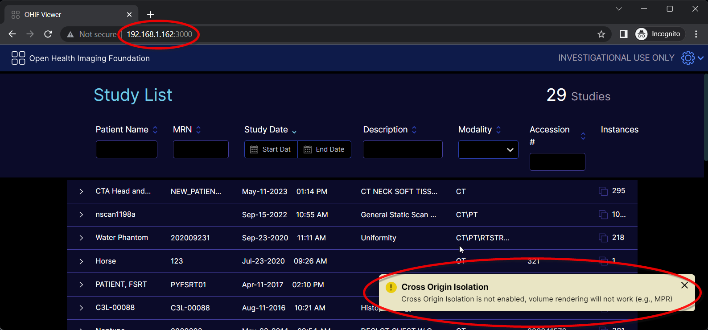
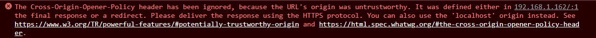

# Docker

The OHIF source code provides a [Dockerfile](https://github.com/OHIF/Viewers/blob/master/Dockerfile) to create and run a Docker image that containerizes an [nginx](https://www.nginx.com/) web server serving the OHIF Viewer.

:::info
This Dockerfile is the same used to generate the [OHIF image(s) on Docker Hub](https://hub.docker.com/r/ohif/app/tags).
:::


## Prerequisites
The machine on which to build and run the Docker container must have:
1. All of the [requirements](./build-for-production.md#build-for-production) for building a production version of OHIF.
2. A checked out branch of the OHIF Viewer.
3. [Docker](https://docs.docker.com/get-docker/) installed.

## Building the Docker Image
The docker image can be built from a terminal window as such:
1. Switch to the OHIF Viewer code root directory.
2. Issue the following Docker command. Note that what follows `-t` flag is the `{name}:{tag}` for the Docker image and is arbitrary when creating a local Docker image.

    ```sh
    docker build . -t ohif-viewer-image
    ```

:::tip
Building a Docker image comes in handy when OHIF has been customized (e.g. with custom extensions, modes, hanging protocols, etc.). For convenience, there are basic OHIF images built in Docker Hub. Find the latest [release](https://hub.docker.com/r/ohif/app/tags?page=1&name=latest) and [dev](https://hub.docker.com/r/ohif/app/tags?page=1&name=beta) images all in Docker Hub.
:::

## Running the Docker Container
Once the Docker image has been built, it can be run as a container from the command line as in the block below. Note that the last argument to the command is the name of the Docker image and the table below describes the other arguments.

|Flag|Description|
|----|-----------|
|-d|Run the container in the background and print the container ID|
|-p {host-port}:{nginx-port}/tcp|Publish the `nginx` listen port on the given host port|
|--name|An arbitrary name for the container.|


```sh
docker run -d -p 3000:80/tcp --name ohif-viewer-container ohif-viewer-image
```

:::tip
Any of the [Docker Hub images](https://hub.docker.com/r/ohif/app/tags) can be easily run as a Docker container.

The following is the command to run the Docker container using the latest released OHIF Docker Hub image.

```sh
docker run -d -p 3000:80/tcp --name LatestReleasedOHIF ohif/app:latest
```

Simply replace `latest` at the end of the command with any of the tags for a specific version.
:::

### Configuring the `nginx` Listen Port

The Dockerfile and entry point use the `${PORT}` environment variable as the port that the `nginx` server uses to serve the web server. The default value for `${PORT}` is `80`. One way to set this environment variable is to use the `-e` switch when running the container with `docker run`. The block below gives an example where the listen port is set to `8080` and published on the host as `3000`.

```sh
docker run -d -e PORT=8080 -p 3000:8080/tcp --name ohif-viewer-container ohif-viewer-image
```

### Specifying the OHIF config File

There are two approaches for specifying the OHIF configuration file for a Docker container:

- [Volume Mounting](#volume-mounting)
- [Environment Variable](#environment-variable)

#### Volume Mounting

The OHIF [config file](../configuration/configurationFiles.md) can be specified by mounting it as a volume for the Docker container using the `-v` flag. If the OHIF config file is on the local file system then it can be specified as below.

```sh
docker run -d -p 3000:80/tcp -v /path/to/config/file.js:/usr/share/nginx/html/app-config.js --name ohif-viewer-container ohif-viewer-image
```
:::tip
 Depending on the version of Docker, an absolute path to the local source config file might be required.
:::
#### Environment Variable

In certain scenarios, such as deploying the Docker container to Google Cloud, it might be convenient to specify the configuration file (contents) as an environment variable. That environment variable is `${APP_CONFIG}` and it can be set in the `docker run` command using the `-e` switch.

:::tip
It is important to stress here that the environment variable is the contents of the configuration file and NOT the path to the config file as is [typically specified](https://docs.ohif.org/configuration/configurationFiles#configuration-files) for development and build environments or for the [volume mounting method](#volume-mounting).
:::

Below the `cat` command is used to convert the configuration file to a string and its result set as the `${APP_CONFIG}` environment variable.

```sh
docker run -d -p 3000:80/tcp -e APP_CONFIG="$(cat /path/to/the/config/file)" --name ohif-viewer-container ohif-viewer-image
```

:::tip
To be safe, remove single line comments (i.e. `//`) from the configuration file because the presence of these comments might cause the configuration file to be prematurely truncated when it is served to the OHIF client.
:::

:::tip
As an alternative to the `cat` command, convert the configuration file to a single line and copy and paste it as the value to the `${APP_CONFIG}` environment variable on the `docker run` line. Editors such as [Visual Studio Code](https://stackoverflow.com/questions/46491061/shortcut-for-joining-two-lines) and [Notepad++](https://superuser.com/questions/518229/how-do-i-remove-linebreaks-in-notepad) have 'Join Lines' commands to facilitate this.
:::

:::tip
If both the [volume mounting method](#volume-mounting) and the [environment variable method](#environment-variable) are used, the volume mounting method will take precedence.
:::

### Embedding in an iframe

If the OHIF instance served by the Docker image is to be embedded in an `iframe`, and if  [cross-origin isolation](./cors.md#cross-origin-isolation) is required, then the [Cross Origin Resource Policy (CORP) header value](https://github.com/OHIF/Viewers/blob/8a8ae237d26faf123abeb073cbf0cd426c3e9ef2/.docker/Viewer-v3.x/default.conf.template#L10) that OHIF is served with will have to be updated accordingly. More information on CORP and `iframe`s can be found [here](./cors.md#ohif-as-a-cross-origin-resource-in-an-iframe).

:::tip
For SSL Docker deployments, the CORP header value is set [here](https://github.com/OHIF/Viewers/blob/8a8ae237d26faf123abeb073cbf0cd426c3e9ef2/.docker/Viewer-v3.x/default.ssl.conf.template#L12).
:::

## SSL

:::caution
We make no claims or guarantees regarding this section concerning security. If in doubt, enlist the help of an expert and conduct proper audits.
:::

### Why SSL?
As described [here](./cors.md), OHIF must be used in a [secure context](./cors.md#secure-context) in order to fully leverage all of OHIF's capabilities. Whenever OHIF is not running in a secure context and is navigated to using the OHIF's server IP address (e.g. `http://192.168.1.162:3000`) or domain name (e.g. `http://my.ohif.server`) then the following popup message will be displayed in OHIF



and the following message will appear in the browser console.



:::info
The above indicate that OHIF is not running in a secure context. Among other things, this means information transferred to/from OHIF is not encrypted and certain capabilities such as 3D volume loading will NOT work. However, basic stack viewport functionality will continue to function.

Consideration must be given as to whether OHIF should be deployed in a secure context over SSL.
:::

### Specifying the SSL Port, Certificate and Private Key

For convenience, the [built Docker image](#building-the-docker-image) can be run over SSL by
- setting the `${SSL_PORT}` environment variable
- volume mounting the SSL certificate
- volume mounting the SSL private key

:::info
The volume mounted SSL certificate and private key are mapped to the [`ssl_certificate`](http://nginx.org/en/docs/http/ngx_http_ssl_module.html#ssl_certificate) and [`ssl_certificate_key`](http://nginx.org/en/docs/http/ngx_http_ssl_module.html#ssl_certificate_key) `nginx` directives respectively.
:::

Similar to the [`nginx` listen port](#configuring-the-nginx-listen-port), the `${SSL_PORT}` environment variable is the internal port that `nginx` listens on to serve the OHIF web server over SSL and has to be likewise published via the `-p` switch.

The following is an example command running the Docker container over SSL. Note that depending on the version of Docker, an absolute path to the certificate and private key files might be required.

```sh
docker run -d -e SSL_PORT=443 -p 3003:443/tcp -v /path/to/certificate:/etc/ssl/certs/ssl-certificate.crt -v /path/to/private/key:/etc/ssl/private/ssl-private-key.key --name ohif-viewer-container ohif-viewer-image
```

:::caution
The above deploys OHIF over SSL using `nginx`'s default SSL configuration. For further OHIF server hardening and security configuration, consider enlisting an expert and then editing OHIF's `nginx` [SSL template configuration file](https://github.com/OHIF/Viewers/blob/8a8ae237d26faf123abeb073cbf0cd426c3e9ef2/.docker/Viewer-v3.x/default.ssl.conf.template) with further [security settings](https://nginx.org/en/docs/http/ngx_http_ssl_module.html) and [tweaks](http://nginx.org/en/docs/http/configuring_https_servers.html) and then [build a new Docker image](#building-the-docker-image) from there.
:::

:::caution
The private key is a secure entity and should have restricted access. Keep it safe!
:::

:::caution
The presence of the `${SSL_PORT}` environment variable is used to trigger to deploy over SSL as opposed to HTTP. If `${SSL_PORT}` is NOT defined, then HTTP is used even if the certificate and private key volumes are mounted.
:::

:::tip
The read and write permissions of the source, mounted volumes are preserved in the Docker container. The volume mounted certificate and private key require read permission.

One way to ensure both are readable is to issue the following on the host system terminal prior to running the Docker container and mounting the certificate and private key volumes.

```sh
sudo chmod 644 /path/to/certificate /path/to/private/key
```
:::

:::tip
The SSL certificate and private key can be either [CA issued](#ca-signed-certificates) or [self-signed](#self-signed-certificates).
:::


### CA Signed Certificates

According to [SSL.com](https://www.ssl.com/faqs/what-is-a-certificate-authority/), a global certificate authority (CA) is a trusted authority and organization that guarantees the identity of other, third-party entities and guarantees the integrity of the electronic information (e.g. web site data) those third-party entities provide and deliver.

There are many globally trusted CAs. Below is a non-exhaustive list of some CAs including links to some documentation for creating and installing certificates and keys from those authorities to be used with `nginx`.
- [GoDaddy](https://ca.godaddy.com/help/nginx-install-a-certificate-6722)
- [Let's Encrypt](https://www.nginx.com/blog/using-free-ssltls-certificates-from-lets-encrypt-with-nginx/)
- [digicert](https://www.digicert.com/kb/csr-ssl-installation/nginx-openssl.htm)


### Self-Signed Certificates

According to [Entrust](https://www.entrust.com/resources/faq/what-is-a-self-signed-certificate), a self-signed certificate is one that is NOT signed by a trusted, public [CA authority](#ca-signed-certificates), but instead (typically) signed by the developer or individual or organization responsible for a web site.

Browsers will treat self-signed certificates as not secure because the signer is not publicly recognized and trusted. When visiting a site encrypted with a self-signed certificate, the browser will present a screen similar to the following warning about the potential risk.


For a self-signed certificate this is normal and expected. Clicking the `Advanced` button displays further information as well as a link for proceeding to site that the certificate is encrypting.


Self-signed certificates might be appropriate for testing or perhaps deploying a site within an organization's internal LAN. In any case, consult an expert prior to deploying OHIF over SSL.

:::tip
A self-signed certificate can be generated using [`openssl`](https://www.openssl.org/) on the command line.
:::

To create a self-signed certificate:
1. Open a command prompt.
2. Issue the following command:
    ```sh
    sudo openssl req -x509 -nodes -days 365 -newkey rsa:2048 -keyout /desired/key/directory/self-signed-private.key -out /desired/cert/directory/self-signed.crt
    ```

    The chart below describes each of the items in the command.

    |Command Item|Description|
    |------------|-----------|
    |sudo|temporarily grant access as the root/super user to run the `openssl` command|
    |openssl|the command line tool for creating and managing certificates and keys|
    |req|this together with the subsequent `-x509` indicates to request to generate a self-signed certificate|
    |-x509|this together with the `req` indicates to request to generate a self-signed certificate|
    |-nodes|skip the option to secure the certificate with a passphrase; this allows `nginx` to start up with without intervention to enter a passphrase each time|
    |-days 365|the number of days the certificate will be valid for|
    |-newkey rsa:2048|create the a new certificate and key together and make an RSA key that is 2048 bits long|
    |-keyout|the path and file name where the private key will be written to|
    |-out|the path and file name where the certificate will be written to|

3. Answer the prompts that follow. The table below lists the various prompts. The default value for each prompt is shown within the square brackets. The most important prompt is `Common Name (e.g. server FQDN or YOUR name)`. For this enter the IP address of the OHIF server being secured.

    |Prompt|
    |------|
    |Country Name (2 letter code) [AU]|
    |State or Province Name (full name) [Some-State]|
    |Locality Name (eg, city) []|
    |Organization Name (eg, company) [Internet Widgets Pty Ltd]|
    |Organizational Unit Name (eg, section) []|
    |Common Name (e.g. server FQDN or YOUR name) []|
    |Email Address []|

4. Once completed, the self-signed certificate and private key will be in the locations specified by the `-keyout` and `-out` flags and can be [volume mounted](#specifying-the-ssl-port-certificate-and-private-key) accordingly to the OHIF Docker container.

:::tip
Windows' users can access `openssl` using [Windows Subsystem for Linux (WSL)](https://learn.microsoft.com/en-us/windows/wsl/).
:::
