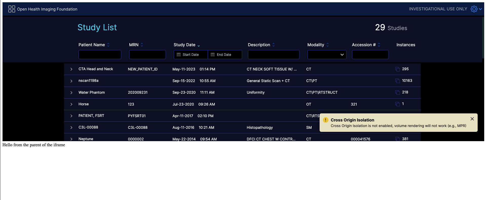
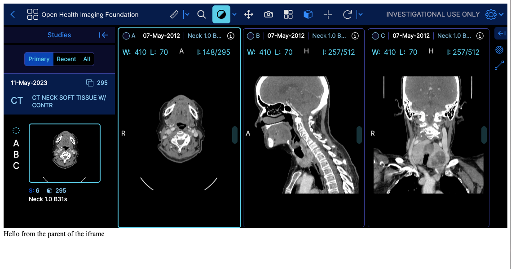

# iframe

ith the transition to more advanced visualization, loading, and rendering techniques using WebWorkers, WASM, and WebGL, the script tag usage of the OHIF viewer v3 has been deprecated.
An alternative option for script tag usage is to employ an iframe. You can utilize the iframe element to load the OHIF viewer and establish communication with it using the postMessage API if needed.

We recommend utilizing modern development practices and incorporating OHIF viewer within your application using a more modular and integrated approach, such as leveraging bundlers, other UI
components, and frameworks.

## Static Build

You can use the iframe element to load the OHIF viewer as a child element of your application if you need the
viewer to be embedded within your application. The iframe element can be used as follows (use your custom styles)

```html
<iframe src="./path-to-ohif-build" style="width: 100%; height: 500px; border: none"/>
```

The important thing to note here is that the iframe element is loading the OHIF viewer from the `./path-to-ohif-build`. This path can be
named anything you want, but it should be the path to the OHIF viewer build directory. The build directory is the directory that
contains the `index.html` file (See [build for production](./build-for-production.md) for more information).

You need to make sure that the viewer is also built with PUBLIC_URL set to the same path. For example, if you using
`<iframe src="./ohif" />` (which means there is a `ohif` folder containing the build in your main app), then you need to:

1. use a config file that is using the `routerBasename` of `/ohif` (note the one / - it is not /ohif/).
2. build the viewer with `PUBLIC_URL=./ohif/ APP_CONFIG=config/myConfig.js yarn build`, replace the config file with your own config file which has
    the `routerBasename` set to `/ohif` (note the one / - it is not /ohif/).

:::tip
Make sure the `app-config.js` in the build is reflecting the correct routerBasename.
:::

:::tip
The PUBLIC_URL will tell the application where to find the static assets and the routerBasename will tell the application how to handle the rouets
:::

### Try it locally

Download the index.html and the build (against the /ohif/ path) from [here](https://ohif-assets.s3.us-east-2.amazonaws.com/iframe-basic/Archive.zip)

Then run the

```
npx http-server unzipped-folder
```

You should be able to see



:::info
As you see the Cross Origin Isolation Warning is showing up which means we can't render volumes since the volume viewports
use SharedArrayBuffer which is not allowed non cross origin isolated apps. You can read more about Cross Origin Isolation here
https://web.dev/coop-coep/ or follow the steps below to enable it.
:::

### Fixing the Cross Origin Isolation Warning to enable volume rendering

For that we need a more sophisticated setup, since we need to add the Cross Origin Embedder Policy and Cross Origin Opener Policy headers
to make the parent app cross origin isolated. For that we can use a express server. (Note: you can use any other method
to add the headers, this is just one of the ways)

Download files from [here](https://ohif-assets.s3.us-east-2.amazonaws.com/iframe-express/Archive.zip)

```js
const express = require("express")
const app = express()

app.use((req, res, next) => {
  res.setHeader("Cross-Origin-Opener-Policy", "same-origin")
  res.setHeader("Cross-Origin-Embedder-Policy", "require-corp")
  next()
})

app.use(express.static("public")) // 'public' should be your folder with static files

app.listen(8080, () => console.log("Listening on port 8080!"))
```




:::tip
if you are using webpack with react you can set

```js
devServer: {
  headers: {
    "Cross-Origin-Opener-Policy": "same-origin",
    "Cross-Origin-Embedder-Policy": "require-corp"
  }
}
```

:::

:::tip
If you are using Angular, you should modify the `angular.json` file to add the headers

```js
"serve": {
  //
  "configurations": {
    //
    "development": {
      //
      "headers": {
        "Cross-Origin-Opener-Policy": "same-origin",
        "Cross-Origin-Embedder-Policy": "require-corp"
      }
    }
  },
  //
},
```
:::


## Development Server

If you are not using the static build, you can use the iframe to load the viewer from the development server. For example, if you are running the viewer locally on port 3000, you can use the following iframe element to load the viewer:

```html
// e.g., app running on 3001 and iframe loading the viewer from 3000
<iframe src="http://localhost:3000" style="width: 100%; height: 500px; border: none"/>
```

You need to notice that not including the static build removes the need for
the PUBLIC_URL and the routerBasename. However, you need to take care of the Cross Origin Resource Policy (CORP)
headers since the viewer will be loaded from a different port. You can read more about CORP [here](https://developer.mozilla.org/en-US/docs/Web/HTTP/Cross-Origin_Resource_Policy), but basically in the development server that is serving the viewer, you need to add the following headers:

```js
"Cross-Origin-Opener-Policy": "same-site"
or
"Cross-Origin-Opener-Policy": "cross-origin"
```

:::info
You can't set the `Cross-Origin-Resource-Policy` to `same-origin` since the viewer is loaded from a different port.
:::

:::tip
If you are using webpack to serve the viewer it would be

```js
devServer: {
  headers: {
    "Cross-Origin-Opener-Policy": "same-site"
  }
}
```
