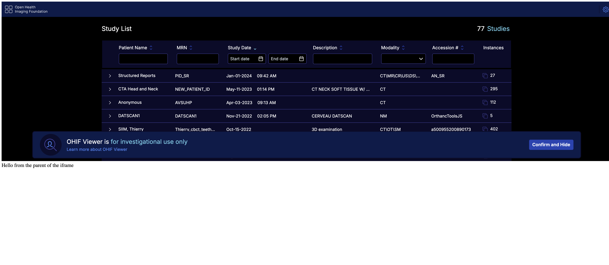

# iframe

With the transition to more advanced visualization, loading, and rendering techniques using WebWorkers, WASM, and WebGL, the script tag usage of the OHIF viewer v3 has been deprecated.
An alternative option for script tag usage is to employ an iframe. You can utilize the iframe element to load the OHIF viewer and establish communication with it using the postMessage API if needed.

We recommend utilizing modern development practices and incorporating OHIF viewer within your application using a more modular and integrated approach, such as leveraging bundlers, other UI
components, and frameworks.

## Static Build

You can use the iframe element to load the OHIF viewer as a child element of your application if you need the
viewer to be embedded within your application. The iframe element can be used as follows (use your own custom styles)

```html
<iframe src="./path-to-ohif-build" style="width: 100%; height: 500px; border: none"/>
```

The important thing to note here is that the iframe element is loading the OHIF viewer from the `./path-to-ohif-build`. This path can be
named anything you want, but it should be the path to the OHIF viewer build directory. The build directory is the directory that
contains the `index.html` file (See [build for production](./build-for-production.md) for more information).

It is also required that the PUBLIC_URL environment variable is set to the same path. For example, if the iframe is
`<iframe src="./ohif" />` (which means there is a `ohif` folder containing the build in your main app), then you need to:

1. use a config (e.g. config/myConfig.js) file that is using the `routerBasename` of `/ohif` (note the one / - it is not /ohif/).
2. build the viewer with `PUBLIC_URL=/ohif/ APP_CONFIG=config/myConfig.js yarn build` (note the two / - it is not /ohif).

:::tip
Check to make sure the `app-config.js` in the build is reflecting the correct routerBasename.
:::

:::tip
The PUBLIC_URL tells the application where to find the static assets and the routerBasename will tell the application how to handle the rouets
:::

### Try it locally

Download the index.html and the build (against the /ohif/ path) from [here](https://ohif-assets.s3.us-east-2.amazonaws.com/iframe-basic/Archive.zip)

Then run the

```bash
npx http-server unzipped-folder

# you can use npx serve ./dist -c ../public/serve.json as an alternative to http-server
```

You should be able to see



:::info
Notice the Cross Origin Isolation Warning. It is present to indicate that OHIF cannot render volumes because the volume viewports
use SharedArrayBuffer which is not allowed for non cross origin isolated apps. You can read more about Cross Origin Isolation here
https://web.dev/coop-coep/ or follow the steps below to enable it.
:::

### Fixing the Cross Origin Isolation Warning to enable volume rendering

For that we need a more sophisticated setup, since we need to add the Cross Origin Embedder Policy and Cross Origin Opener Policy headers
to make the parent app cross origin isolated. For that we can use an Express server. (Note: you can use any other method
to add the headers, this is just one of the methods)

Download files from [here](https://ohif-assets.s3.us-east-2.amazonaws.com/iframe-express/Archive.zip)

```js
const express = require("express")
const app = express()

app.use((req, res, next) => {
  res.setHeader("Cross-Origin-Opener-Policy", "same-origin")
  res.setHeader("Cross-Origin-Embedder-Policy", "require-corp")
  next()
})

app.use(express.static("public")) // 'public' should be the folder with the static OHIF build files

app.listen(8080, () => console.log("Listening on port 8080!"))
```


:::tip
if you are using webpack with react you can set

```js
devServer: {
  headers: {
    "Cross-Origin-Opener-Policy": "same-origin",
    "Cross-Origin-Embedder-Policy": "require-corp"
  }
}
```

:::

:::tip
If you are using Angular, you should modify the `angular.json` file to add the headers

```js
"serve": {
  //
  "configurations": {
    //
    "development": {
      //
      "headers": {
        "Cross-Origin-Opener-Policy": "same-origin",
        "Cross-Origin-Embedder-Policy": "require-corp"
      }
    }
  },
  //
},
```
:::


## Development Server

If you are not using the static build, you can use the iframe to load the viewer from the local development server. For example, if you are running the viewer locally on port 3000, you can use the following iframe element to load the viewer:

```html
// e.g., app running on 3001 and iframe loading the viewer from 3000
<iframe src="http://localhost:3000" style="width: 100%; height: 500px; border: none"/>
```

Notice that not including the static build removes the need for
the PUBLIC_URL and the routerBasename. However, the Cross Origin Resource Policy (CORP)
headers must be set because the viewer will be loaded from a different port. You can read
more about CORP [here](https://developer.mozilla.org/en-US/docs/Web/HTTP/Cross-Origin_Resource_Policy).
Basically in the development server that is serving the viewer, add the following headers:

```js
// use this if the embedding app is running on the same site as OHIF
// (e.g. parent/embedding app is http://localhost:3001 and OHIF is http://localhost:3000)
"Cross-Origin-Resource-Policy": "same-site"
or

// use this if the embedding app is a completely different origin than OHIF (e.g.
// parent/embedding app is http://192.168.1.2 and OHIF is http://localhost:3000)
"Cross-Origin-Resource-Policy": "cross-origin"
```

:::info
You can't set the `Cross-Origin-Resource-Policy` to `same-origin` since the viewer is loaded from a different port.
:::

:::tip
If you are using webpack to serve the viewer it would be

```js
devServer: {
  headers: {
    "Cross-Origin-Resource-Policy": "same-site" // cross-origin is also valid
  }
}
```

:::tip
Take a look at how other people have integrated OHIF in their react app

example1: https://github.com/OHIF/Viewers/issues/3371#issuecomment-1630405255
:::
