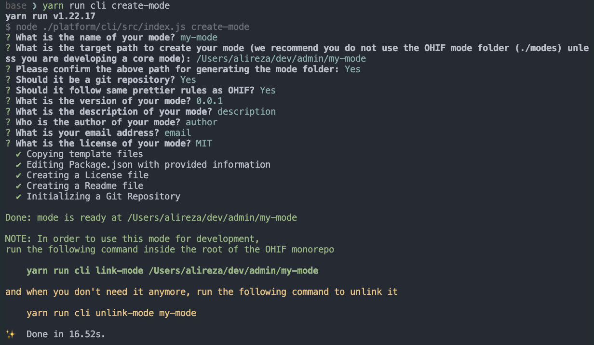
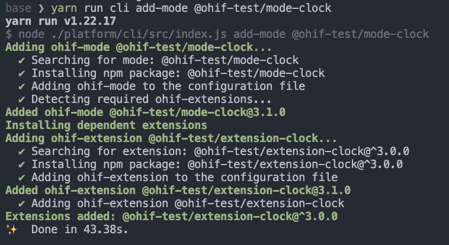
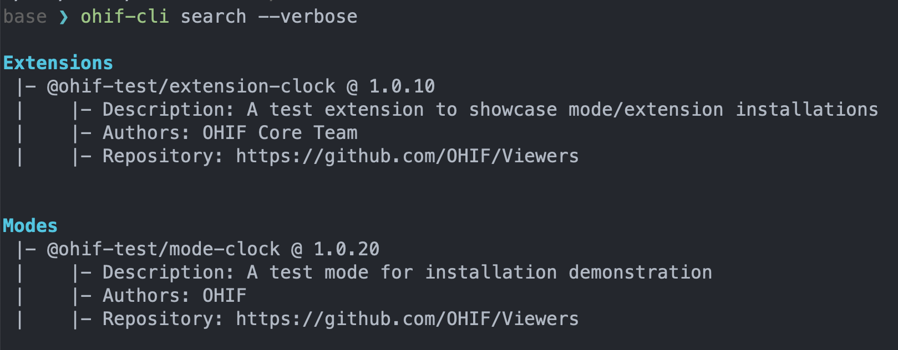

# OHIF Command Line Interface

OHIF-v3 architecture has been re-designed to enable building applications that
are easily extensible to various use cases (Modes) that behind the scene would
utilize desired functionalities (Extensions) to reach the goal of the use case.
Now, the question is _how to create/remove/install/uninstall an extension and/or
mode?_

You can use the `cli` script that comes with the OHIF monorepo to achieve these
goals.

:::note Info
In the long-term, we envision our `cli` tool to be a separate installable
package that you can invoke anywhere on your local system to achieve the same
goals. In the meantime, `cli` will remain as part of the OHIF monorepo and needs
to be invoked using the `yarn` command.
:::


## CLI Installation

You don't need to install the `cli` currently. You can use `yarn` to invoke its
commands.

## Commands

:::note Important
All commands should run from the root of the monorepo.
:::


There are various commands that can be used to interact with the OHIF-v3 CLI. If
you run the following command, you will see a list of available commands.

```
yarn run cli --help
```

which will output

```
OHIF CLI

Options:
  -V, --version                          output the version number
  -h, --help                             display help for command

Commands:
  create-extension                       Create a new template extension
  create-mode                            Create a new template Mode
  add-extension <packageName> [version]  Adds an ohif extension
  remove-extension <packageName>         removes an ohif extension
  add-mode <packageName> [version]       Removes an ohif mode
  remove-mode <packageName>              Removes an ohif mode
  link-extension <packageDir>            Links a local OHIF extension to the Viewer to be used for development
  unlink-extension <extensionName>       Unlinks a local OHIF extension from the Viewer
  link-mode <packageDir>                 Links a local OHIF mode to the Viewer to be used for development
  unlink-mode <extensionName>            Unlinks a local OHIF mode from the Viewer
  list                                   List Added Extensions and Modes
  search [options]                       Search NPM for the list of Modes and Extensions
  help [command]                         display help for command
```

As seen there are commands for you such as: `create-extension`, `create-mode`,
`add-extension`, `remove-extension`, `add-mode`, `remove-mode`,
`link-extension`, `unlink-extension`, `link-mode`, `unlink-mode`, `list`,
`search`, and `help`. Here we will go through each of the commands and describe
them.

### create-mode

If you need to create a new mode, you can use the `create-mode` command. This
command will create a new mode template in the directory that you specify.
The command will ask you couple of information/questions in order
to properly create the mode metadata in the `package.json` file.

```bash
yarn run cli create-mode
```

<div style={{textAlign: 'center',}}>




</div>

Note 1: Some questions have a default answer, which is indicated inside the
parenthesis. If you don't want to answer the question, just hit enter. It will
use the default answer.

Note 2: As you see in the questions, you can initiate a git repository for the
new mode right away by answering `Y` (default) to the question.

Note 3: Finally, as indicated by the green lines at the end, `create-mode` command only
create the mode template. You will need to link the mode to the Viewer in order
to use it. See the [`link-mode`](#link-mode) command.

If we take a look at the directory that we created, we will see the following
files:

<div style={{maxWidth:"500px"}}>


</div>


### create-extension

Similar to the `create-mode` command, you can use the `create-extension`
command to create a new extension template. This command will create a new
extension template in the directory that you specify the path.

```bash
yarn run cli create-extension
```


Note: again similar to the `create-extension` command, you need to manually link
the extension to the Viewer in order to use it. See the
[`link-mode`](#link-mode) command.


### link-extension

`link-extension` command will link a local OHIF extension to the Viewer. This
command will utilize `yarn link` to achieve so.

```bash
yarn run cli link-extension <extensionDir>
```

### unlink-extension

There might be situations where you want to unlink an extension from the Viewer
after some developments. `unlink-extension` command will do so.

```bash
ohif-cli unlink-extension <extensionName>
```


### link-mode

Similar to the `link-extension` command, `link-mode` command will link a local
OHIF mode to the Viewer.

```bash
yarn run cli link-mode <modeDir>
```

### unlink-mode

Similar to the `unlink-extension` command, `unlink-mode` command will unlink a
local OHIF mode from the Viewer.

```bash
ohif-cli unlink-mode <modeName>
```

### add-mode

OHIF is a modular viewer. This means that you can install (add) different modes
to the viewer if they are published online . `add-mode` command will add a new mode to
the viewer. It will look for the mode in the NPM registry and installs it. This
command will also add the extension dependencies that the mode relies on to the
Viewer (if specified in the peerDependencies section of the package.json).

:::note Important
`cli` will validate the npm package before adding it to the Viewer. An OHIF mode
should have `ohif-mode` as one of its keywords.
:::

Note: If you don't specify the version, the latest version will be used.

```bash
yarn run cli add-mode <packageName> [version]
```

For instance `@ohif-test/mode-clock` is an example OHIF mode that we have
published to NPM. This mode basically has a panel that shows the clock :)

We can add this mode to the Viewer by running the following command:

```bash
yarn run cli add-mode @ohif-test/mode-clock
```

After installation, the Viewer has a new mode!





Note: If the mode has an extension peerDependency (in this case @ohif-test/extension-clock),
`cli` will automatically add the extension to the Viewer too.

The result


### add-extension

This command will add an OHIF extension to the Viewer. It will look for the
extension in the NPM registry and install it.

```bash
yarn run cli add-extension <packageName> [version]
```


### remove-mode

This command will remove the mode from the Viewer and also remove the extension
dependencies that the mode relies on from the Viewer.

```bash
yarn run cli remove-mode <packageName>
```


### remove-extension

Similar to the `remove-mode` command, this command will remove the extension
from the Viewer.

```bash
yarn run cli remove-extension <packageName>
```

### list

`list` command will list all the installed extensions and modes in
the Viewer. It uses the `PluginConfig.json` file to list the installed
extensions and modes.

```bash
yarn run cli list
```

an output would look like this:

<div style={{maxWidth:"500px"}}>


</div>

### search

Using `search` command, you can search for OHIF extensions and modes
in the NPM registry. This tool can accept a `--verbose` flag to show more
information about the results.

```bash
yarn run cli search [--verbose]
```

<div style={{maxWidth:"600px"}}>


</div>

with the verbose flag `ohif-cli search --verbose` you will achieve the following
output:

<div style={{maxWidth:"600px"}}>



</div>


## PluginConfig.json

To make all the above commands work, we have created a new file called `PluginConfig.json` which contains the
information needed to run the commands. You **don't need to (and should not)**
edit/update/modify this file as it is automatically generated by the CLI. You
can take a look at what this file contains by going to
`platform/app/PluginConfig.json` in your project's root directory. In short,
this file tracks and stores all the extensions/modes and the their version that
are currently being used by the viewer.

## Private NPM Repos

For the `yarn cli` to view private NPM repos, create a read-only token with the
following steps and export it as an environmental variable. You may also export
an existing npm token.
```
npm login
npm token create --read-only
export NPM_TOKEN=<your readonly token>
```

## External dependencies
The ohif-cli will add the path to the external dependencies to the webpack config,
so that you can install them in your project and use them in your custom
extensions and modes. To achieve this ohif-cli will update the webpack.pwa.js
file in the platform/app directory.

## Video tutorials
See the [Video Tutorials](./video-tutorials.md) for videos of some the above
commands in action.
