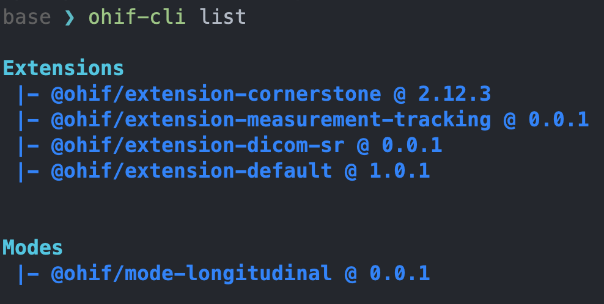
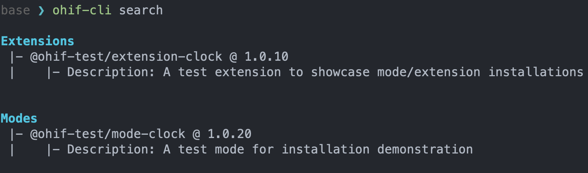

# OHIF Command Line Interface

OHIF-v3 architecture has been re-designed to enable building applications that
are easily extensible to various use cases (Modes) that behind the scene would
utilize desired functionalities (Extensions) to reach the goal of the use case.
Now, the question is _how to create/remove/install/uninstall an extension and
mode?_

To answer this question, we have created a new command line interface (CLI)
which allows you to interact with the OHIF-v3.

## PluginConfig.json

In order to create/remove/install/uninstall an extension, we have created a
command line interface (CLI) which runs commands in the background. To make this
happen, we have created a new file called `PluginConfig.json` which contains the
information needed to run the commands. You **don't need to (and should not)**
edit/update/modify this file as it is automatically generated by the CLI. You
can take a look at what this file contains by going to
`platform/viewer/PluginConfig.json` in your project's root directory. In short,
this file tracks and stores all the extensions/modes and the their version that
are currently being used by the viewer.

## CLI Installation

You can install the CLI by running the following command. This will install the
CLI in your system as a global command.

```
npm install -g @ohif/cli
```

## Commands

There are various commands that can be used to interact with the OHIF-v3 CLI. If
you run the following command, you will see a list of available commands.

```
ohif-cli --help
```

which will output

```
OHIF CLI

Options:
  -V, --version                          output the version number
  -h, --help                             display help for command

Commands:
  create-extension                       Create a new template extension
  create-mode                            Create a new template Mode
  add-extension <packageName> [version]  Adds an ohif extension
  remove-extension <packageName>         removes an ohif extension
  add-mode <packageName> [version]       Removes an ohif mode
  remove-mode <packageName>              Removes an ohif mode
  link-extension <packageDir>            Links a local OHIF extension to the Viewer to be used for development
  unlink-extension <extensionName>       Unlinks a local OHIF extension from the Viewer
  link-mode <packageDir>                 Links a local OHIF mode to the Viewer to be used for development
  unlink-mode <extensionName>            Unlinks a local OHIF mode from the Viewer
  list                                   List Added Extensions and Modes
  search [options]                       Search NPM for the list of Modes and Extensions
  help [command]                         display help for command
```

As seen there are commands for you such as: `create-extension`, `create-mode`,
`add-extension`, `remove-extension`, `add-mode`, `remove-mode`,
`link-extension`, `unlink-extension`, `link-mode`, `unlink-mode`, `list`,
`search`, and `help`. Here we will go through each of the commands and describe
them.

### create-mode

If you need to create a new mode, you can use the `create-mode` command. This
command will create a new mode template in the directory that you have run the
command from. The command will ask you couple of information/question in order
to properly create the mode metadata in the `package.json` file.

```bash
ohif-cli create-mode
```

<div style={{textAlign: 'center', width:"500px"}}>


</div>

Note 1: Some questions have a default answer, which is indicated inside the
parenthesis. If you don't want to answer the question, just hit enter. It will
use the default answer.

Note 2: As you see in the questions, you can initiate a git repository for the
new mode right away by answering `Y` (default) to the question.

Note 3: As you see in the green message line at then end, this command only
create the mode template. You will need to link the mode to the Viewer in order
to use it. See the [`link-mode`](#link-mode) command.

If we take a look at the directory that we created, we will see the following
files:

<div style={{maxWidth:"500px"}}>


</div>

### create-extension

Similar to the `create-extension` command, you can use the `create-extension`
command to create a new extension template. This command will create a new
extension template in the directory that you have run the command from.

<div style={{textAlign: 'center', width:"500px"}}>


</div>

Note: again similar to the `create-extension` command, you need to manually link
the extension to the Viewer in order to use it. See the
[`link-mode`](#link-mode) command.

<div style={{maxWidth:"500px"}}>


</div>

### link-extension

`link-extension` command will link a local OHIF extension to the Viewer. This
command will create utilize `yarn link` command to link the extension to the
Viewer. This command should run from the root directory of the viewer.

```bash
ohif-cli link-extension <extensionDir>
```

### unlink-extension

There might be situations where you want to unlink an extension from the Viewer
after some developments. `unlink-extension` command will unlink a local OHIF
extension from the Viewer.

```bash
ohif-cli unlink-extension <extensionName>
```

### link-mode

Similar to the `link-extension` command, `link-mode` command will link a local
OHIF mode to the Viewer. This command will create utilize `yarn link` command to
link the mode to the Viewer. This command should run from the root directory of
the viewer.

```bash
ohif-cli link-mode <modeDir>
```

### unlink-mode

Similar to the `unlink-extension` command, `unlink-mode` command will unlink a
local OHIF mode from the Viewer. This command should run from the root directory
of the viewer.

```bash
ohif-cli unlink-mode <modeName>
```

### add-mode

OHIF is a modular viewer. This means that you can install (add) different modes
to the viewer if they are published online . This command will add a new mode to
the viewer. It will look for the mode in the NPM registry and install it. This
command will also add the extension dependencies that the mode relies on to the
Viewer.

Note 1: this command can be run from the root directory of the viewer or from
the platform/viewer directory. In the movie below, we are using the
platform/viewer directory.

Note 2: If you don't specify the version, the latest version will be used.

```bash
ohif-cli add-mode <packageName> [version]
```

<div style={{maxWidth:"800px"}}>


</div>

For instance `@ohif-test/mode-clock` is an example OHIF mode that we have
published to NPM. This mode basically has a panel that shows the clock :)

We can add this mode to the Viewer by running the following command:

```bash
ohif-cli add-mode @ohif-test/mode-clock
```

After installation, the Viewer has a new mode!

<div style={{maxWidth:"600px"}}>


</div>

### add-extension

This command will add an OHIF extension to the Viewer. It will look for the
extension in the NPM registry and install it. This command can also be run from
the root directory of the viewer or from the platform/viewer directory.

```bash
ohif-cli add-extension <packageName> [version]
```

<div style={{maxWidth:"500px"}}>


</div>

### remove-mode

This command will remove the mode from the Viewer and also remove the extension
dependencies that the mode relies on from the Viewer. This command can also be
run from the root directory of the viewer or from the platform/viewer directory.

```bash
ohif-cli remove-mode <packageName>
```

<div style={{maxWidth:"800px"}}>


</div>

### remove-extension

Similar to the `remove-mode` command, this command will remove the extension
from the Viewer.

```bash
ohif-cli remove-extension <packageName>
```

### list

`ohif-cli` `list` command will list all the installed extensions and modes in
the Viewer. It uses the `PluginConfig.json` file to list the installed
extensions and modes.

```bash
ohif-cli list
```

an output would look like this:

<div style={{maxWidth:"500px"}}>



</div>

### search

Using `ohif-cli` `search` command, you can search for OHIF extensions and modes
in the NPM registry. This tool can accept a `--verbose` flag to show more
information about the results.

```bash
ohif-cli search [--verbose]
```

<div style={{maxWidth:"600px"}}>



</div>

with the verbose flag `ohif-cli search --verbose` you will achieve the following
output:

<div style={{maxWidth:"600px"}}>


</div>

### help

The `ohif-cli` `help` command will show you the help for all the commands.

```bash
ohif-cli help
```
