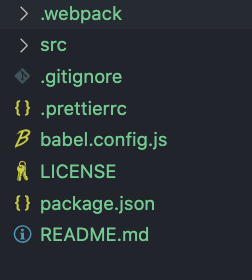

# OHIF Command Line Interface

OHIF-v3 architecture has been re-designed to enable building applications that
are easily extensible to various use cases (Modes) that behind the scene would
utilize desired functionalities (Extensions) to reach the goal of the use case.
Now, the question is _how to create/remove/install/uninstall an extension and
mode?_

To answer this question, we have created a new command line interface (CLI)
which allows you to interact with the OHIF-v3.

## CLI Installation

You can install the CLI by running the following command. This will install the
CLI in your system as a global command.

```
npm install -g @ohif/cli
```

## CLI Commands Overview

There are various commands that can be used to interact with the OHIF-v3 CLI. If
you run the following command, you will see a list of available commands.

```
ohif-cli --help
```

which will output

```
OHIF CLI

Options:
  -V, --version                          output the version number
  -h, --help                             display help for command

Commands:
  create-extension                       Create a new template extension
  create-mode                            Create a new template Mode
  add-extension <packageName> [version]  Adds an ohif extension
  remove-extension <packageName>         removes an ohif extension
  add-mode <packageName> [version]       Removes an ohif mode
  remove-mode <packageName>              Removes an ohif mode
  link-extension <packageDir>            Links a local OHIF extension to the Viewer to be used for development
  unlink-extension <extensionName>       Unlinks a local OHIF extension from the Viewer
  link-mode <packageDir>                 Links a local OHIF mode to the Viewer to be used for development
  unlink-mode <extensionName>            Unlinks a local OHIF mode from the Viewer
  list                                   List Added Extensions and Modes
  search [options]                       Search NPM for the list of Modes and Extensions
  help [command]                         display help for command
```

As seen there are commands for you such as: `create-extension`, `create-mode`,
`add-extension`, `remove-extension`, `add-mode`, `remove-mode`,
`link-extension`, `unlink-extension`, `link-mode`, `unlink-mode`, `list`,
`search`, and `help`. Here we will go through each of the commands and describe
them.

### create-mode

If you need to create a new mode, you can use the `create-mode` command. This
command will create a new mode template in the directory that you have run the
command from. The command will ask you couple of information/question in order
to properly create the mode metadata in the `package.json` file.

```bash
ohif-cli create-mode
```

<div style={{textAlign: 'center', width:"500px"}}>


</div>

Note 1: Some questions have a default answer, which is indicated inside the
parenthesis. If you don't want to answer the question, just hit enter. It will
use the default answer.

Note 2: As you see in the questions, you can initiate a git repository for the
new mode right away by answering `Y` (default) to the question.

Note 3: As you see in the green message line at then end, this command only
create the mode template. You will need to link the mode to the Viewer in order
to use it. See the [`link-mode`](#link-mode) command.

If we take a look at the directory that we created, we will see the following
files:

<div style={{maxWidth:"500px"}}>



</div>

### create-extension

Similar to the `create-extension` command, you can use the `create-extension`
command to create a new extension template. This command will create a new
extension template in the directory that you have run the command from.

<div style={{textAlign: 'center', width:"500px"}}>


</div>

Note: again similar to the `create-extension` command, you need to manually link
the extension to the Viewer in order to use it. See the
[`link-mode`](#link-mode) command.

<div style={{maxWidth:"500px"}}>


</div>

### link-extension

### unlink-extension

### link-mode

### unlink-mode

### list

### search

### help

### add-mode

### remove-mode
