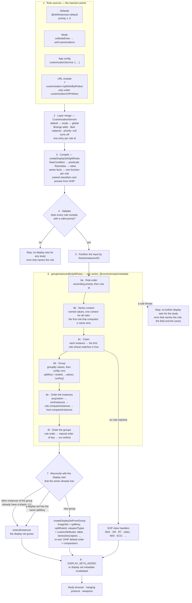
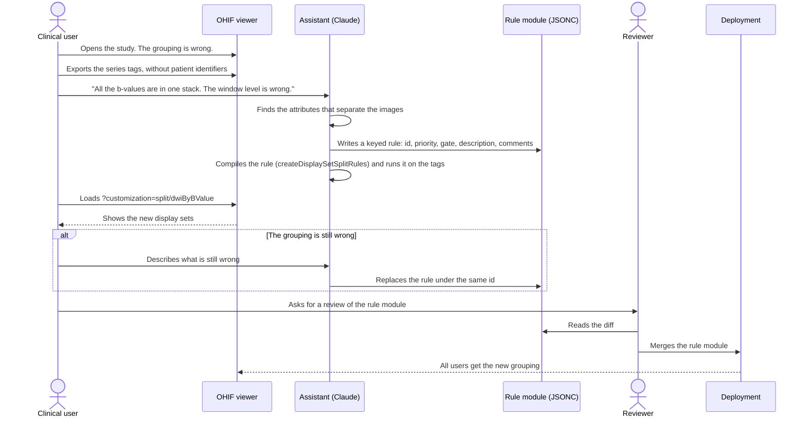
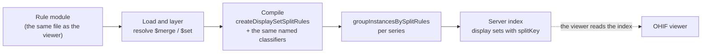

# Display set splitting — requirements

**Prefix:** `SP` (split rules) — *proposed, not yet reserved in the specification register.*
**Source:** [OHIF/Viewers#6137](https://github.com/OHIF/Viewers/pull/6137) — *feat: Add ability to
use new display set split rules*.
**Status:** Draft. §4 is under review. §5 is the recommended approach, and it can change.
**Affects:** `@ohif/core` (`DisplaySetService`, `CustomizationService`), `@ohif/extension-default`,
`@cornerstonejs/metadata`.
**Related:** [Display Set Splitting](../../../platform/services/customization-service/displaySetSplitting.md)
— the reference documentation for the rule format.
[Split Rule Expressions](../../../platform/services/customization-service/functionExpressions.md)
— the reference documentation for the expression language.

---

## 1. Purpose

**The goal: allow users to fix the grouping of images into display sets for their specific
data.**

A display set is the unit that the study browser shows and that a viewport displays. The OHIF
defaults group the images of a series well for most data. Some data needs a different grouping:

- a CT series that holds a scout image and an axial volume,
- an MR diffusion series that mixes b-values,
- an ultrasound series that mixes single images and clips,
- a vendor series that puts two acquisitions in one series.

Before this work, a change to the grouping needed a new SOP class handler in TypeScript and a new
build of OHIF. This specification defines a different route. A **split rule** is a short,
declarative text entry. A person can read the rule, a reviewer can check the rule in a diff, and
OHIF applies the rule the same way every time.

Two kinds of person write rules:

1. **An experienced rule author** writes the rule directly.
2. **A clinical user** describes the problem to an AI assistant, for example Claude, in clinical
   words: "the first image of every CT is the scout, and the scout breaks the MPR". The assistant
   writes the rule. The clinical user tests the rule on the study, and a reviewer adds the rule to
   the deployment.

The second route is the more likely route. The rule format is therefore designed so that an
assistant can write a correct rule, and so that a person who did not write the rule can still
read and check it.

The same rule must also work outside the viewer. A server that builds a study index must be able
to read the rule and produce the same display sets. A tool must be able to generate rules again
and again, and each new generation must replace the earlier rule safely.

> The motivating consequence is clinical. A wrong grouping is not only untidy. A scout image in a
> volume makes the volume non-reconstructable, so MPR is not available. Mixed b-values in one
> stack give one window level for images with very different intensities. The user sees a
> problem, but today the user cannot fix it.

## 2. Scope

### 2.1 How to read this specification

§4 states the **user requirements**: what the user must be able to do, or must be able to
determine, to work safely. §5 states the **implementation requirements**: how the work was done,
or the recommended approach.

You can change §5 freely when a better approach appears. You change §4 in two cases only: a
requirement describes the behaviour wrongly, or the intended user-facing behaviour changes. An
implementation that is inconvenient is never a reason to change §4.

### 2.2 In scope

- Split rules for the image instances that the stack SOP class handler owns today.
- The layering of rules from the defaults, a mode, the app config, and a URL module.
- The rule format: the `@cornerstonejs/metadata` raw selector form (`RawDisplaySetSelector`).
  This form is the one definitive rule format.
- The stability of display sets when instances arrive later, or when the rules change during a
  session.
- The authoring route through an AI assistant (§4.2, §5.5).
- Reuse of rules by a server (§4.6, §5.6). The server implementation itself is future work.

### 2.3 Out of scope

- **Secondary objects** — SEG, SR, RT Structure Set, Parametric Map, PDF, video, whole-slide, and
  ECG. Their dedicated extensions keep their SOP class handlers. The result-set specification
  (`RS-DS`) covers display sets for secondary results.
- **One display set from two or more series.** This is intended functionality, and it is future
  work. The engine splits one series at a time today. See `SP-FIX-7` and §6 item 2.
- **A split of the frames of one multiframe instance** — for example, an MR instance that holds
  interleaved echo 1 and echo 2 frames. This is intended functionality for a follow-up pull
  request. See `SP-FIX-8` and §6 item 6.
- **A graphical rule editor** in the viewer.
- **Automatic deployment of a generated rule.** A person always applies the rule (`SP-DESC-5`).
- **Hanging protocols.** A hanging protocol selects display sets. A split rule creates display
  sets. The two stay separate, although a rule can set attributes that a hanging protocol reads.

## 3. Definitions

**Display set.** A group of instances that the study browser shows as one item and that one
viewport displays.

**Split rule** (or **rule**). One declarative entry that states which instances it claims, how it
groups them, how it orders them, and what attributes the resulting display sets get.

**Rule set.** The rules that apply to a deployment, keyed by rule id.

**Rule id.** The key of a rule in the rule set. One id names one rule.

**Priority.** A number that sets the evaluation order of the rules. `null` turns a rule off.

**Claim.** An instance is claimed by the first rule, in priority order, that matches the instance.

**Series fact.** A value that a rule computes once from all of the instances of a series, for
example the frame count of the series. All rules of a split share the series facts. The
[series context](./series-context.md) specification defines them.

**Split key.** The identity of the group that created a display set. The split key holds the rule
id and the rule's grouping values. The split key holds no position.

**Rule layer.** One source of rule changes: the defaults, a mode, the app config, or a URL module.

**Rule author.** A person who writes a rule directly.

**Clinical user.** A person who knows the data and the clinical problem, and who does not know the
rule syntax.

**Assistant.** An AI assistant that writes a rule from the description of a clinical user.

**Reviewer.** A person who checks a rule before the rule goes into a deployment.

**Server index.** A study-level index that a server builds, for example with Static-DICOMWeb, and
that lists the display sets of a study.

*The system* means the OHIF Viewer, the rule format, and its documentation, unless a requirement
narrows it.

---

## 4. User requirements

> Change these only if a requirement describes the behaviour wrongly, or if the intended
> user-facing behaviour changes.

### 4.1 Fix the grouping — `SP-FIX`

**SP-FIX-1**
The system shall let a deployment change how the instances of a series are grouped into display
sets, without a change to the OHIF source code and without a new build.

**SP-FIX-2**
The system shall let a rule split one series into two or more display sets.

**SP-FIX-3**
The system shall let a rule set the label and the series description that the study browser and
the viewport overlay show for each display set that the rule creates.

**SP-FIX-4**
The system shall let a rule set the order of the images in each display set that the rule creates.

**SP-FIX-5**
The system shall let a deployment turn off, replace, or move one default rule, and keep all of the
other default rules.

**SP-FIX-6**
WHEN no custom rule matches an instance, the system shall group that instance exactly as it would
without the custom rules.

> A rule for CT scouts must not change the MR series of the same study. A user who adds one rule
> must be able to trust that the rest of the study looks as it did before.

**SP-FIX-7** *(deferred)*
WHERE a deployment needs one display set from the instances of two or more series, the system
shall let a rule make that display set.

> Deferred. This is intended functionality, and it is future work. The engine gets one series at a
> time today. The requirement stays so that the design does not exclude it. See §6 item 2.

**SP-FIX-8** *(deferred)*
WHERE one multiframe instance holds the frames of two or more acquisitions, the system shall let a
rule split those frames into separate display sets.

> Deferred to a follow-up pull request. The example is an MR instance with interleaved echo 1 and
> echo 2 frames. The engine claims and groups whole instances today, so a rule cannot separate the
> frames of one instance. See §6 item 6.

### 4.2 Describe the problem, get a rule — `SP-DESC`

**SP-DESC-1**
The rule format shall let a clinical user get a correct rule from a description of the problem in
clinical words, through an assistant, without knowledge of the rule syntax.

**SP-DESC-2**
The documentation shall give an assistant all of the information that a correct rule needs: the
rule fields, the expression language, the priority bands, the ownership test for SOP classes, and
one complete worked example.

**SP-DESC-3**
The rule format shall let a rule carry comments that state the problem the rule fixes and the
series that the rule changes.

**SP-DESC-4**
The system shall let a user apply a new rule to a study that is open in the viewer, and see the
resulting display sets, before the rule goes into a deployment.

**SP-DESC-5**
The system shall not apply a rule from an assistant to a deployment without an action by a person.

**SP-DESC-6**
The system shall let a user give an assistant the attributes that a rule needs, without the
patient identifiers of the study.

> A clinical user who describes a problem will want to show the assistant the data. The data
> carries patient names and identifiers beside the acquisition tags. The route from "this study
> groups wrongly" to "here is a rule" must not need those identifiers.

### 4.3 Readable and reviewable — `SP-READ`

**SP-READ-1**
A rule shall be data that a person can read without a build step and without execution of code.

**SP-READ-2**
A rule shall be text that a code review diff shows line by line.

**SP-READ-3**
A change to one rule shall change only the rule set entry with that rule id.

**SP-READ-4**
The system shall let a user determine which rule created a given display set.

**SP-READ-5**
The system shall let a user determine which attributes an expression reads.

> `SP-READ-5` is for the most common defect: a misspelt attribute. `Modallity === 'CT'` is a
> valid expression that matches nothing.

**SP-READ-6**
The system shall let a hanging protocol, or another reader of display sets, determine which
display sets come from one group of related rules, whichever rule of the group created each
display set.

> Several rules can make one kind of display set, because the data comes in different forms. For
> example, mammography can arrive as breast tomosynthesis, as legacy mammography with all its
> views in one series, and as mammography that the modality already split into one series for
> each view. A deployment can also have a breast tomosynthesis rule for CT. Each form needs its
> own rule, but a hanging protocol must find all of these display sets as mammography, and must
> not list every rule id.
>
> A rule is its own group unless the deployment says otherwise. The deployment sets a group only
> where it must treat several rules as one.

### 4.4 Deterministic and stable — `SP-DET`

**SP-DET-1**
WHEN the system splits the same complete series with the same rule set, the system shall produce
the same display sets, with the same instances, in the same order, with the same split keys.

**SP-DET-2**
WHEN the system splits a complete series in one pass, the result shall not depend on the order in
which the instances arrived.

**SP-DET-3**
WHILE a series is shown, WHEN new instances of that series arrive, the system shall keep every
existing display set, its instances, and its `displaySetInstanceUID`.

**SP-DET-4**
WHILE a series is shown, WHEN the rule set changes, the system shall keep every existing display
set, its instances, and its `displaySetInstanceUID`.

> `SP-DET-3` and `SP-DET-4` protect viewport state. A display set that disappears, or that loses
> an instance, loses its viewport, its measurements context, and its presentation state. So an
> incremental split can give a different result from a split of the complete series from the
> start. The reference documentation states the difference with an ultrasound example. That
> difference is correct behaviour, not a defect.

### 4.5 Safe — `SP-SAFE`

**SP-SAFE-1**
A rule shall not be able to run code other than the expressions of the rule expression language.

**SP-SAFE-2**
The system shall evaluate every condition of a rule, for every instance, to a definite result:
the rule applies, or the rule does not apply.

> The safe functions give this guarantee. An expression has no side effects, and an attribute
> that an instance does not carry gives `undefined`, not an error. So a user can always determine
> whether a valid rule applies to an instance.

**SP-SAFE-3**
IF a rule fails at run time, THEN the system shall create no further display sets for the study,
and shall show the user an error that names the rule and the series.

> A fallback to the grouping without rules has the same problem as a dropped rule (`SP-SAFE-7`):
> the grouping looks correct, but it is not the grouping that the deployment intended. A valid raw
> rule cannot fail at run time (`SP-SAFE-2`). A rule that code supplies as a function can. The
> display sets that exist before the failure stay, as `SP-DET-3` requires.

**SP-SAFE-7**
IF a rule in the rule set has an error, THEN the system shall create no display sets for any
study, and shall show the user an error that names the rule.

> A rule can be critical for the clinician who views the study. A rule that the system drops,
> silently or with a warning, gives a grouping that looks correct but is not the grouping that the
> deployment intended. An error that stops the display is safer than a wrong display.
>
> One rule set applies to every study, so an error in the rule set blocks the load of every
> study. This is the same as other errors that prevent the load of a study. The error stays until
> the rule set changes.

**SP-SAFE-4**
The default rules shall not claim an instance that a dedicated extension handles.

**SP-SAFE-5**
WHERE a deployment loads rules from a URL, the system shall load rules only from the URL prefixes
that the app config names.

**SP-SAFE-6** *(deferred)*
WHERE a deployment denies a rule attribute, the system shall not let any rule compute that
attribute.

> A rule can put any attribute of an instance into a label, and that includes `PatientName`.
> `SP-SAFE-6` lets a deployment keep that text out of the screen, and still let rules split.

### 4.6 Reuse outside the viewer — `SP-REUSE`

**SP-REUSE-1**
A rule shall have the same meaning in the viewer and in a server index.

**SP-REUSE-2**
WHERE a server builds a server index, the server shall produce the same display sets as the
viewer, for the same instances and the same rule set.

**SP-REUSE-3**
A tool that generates a rule shall produce the same rule text for the same input.

**SP-REUSE-4**
WHEN a rule with an existing rule id is applied again, the system shall replace that rule and not
add a second copy.

> `SP-REUSE-3` and `SP-REUSE-4` together make generation repeatable. A tool can generate the rules
> for a data source every night. The result is either no change or a clear diff, and never a
> growing pile of copies.

**SP-REUSE-5**
The system shall let a tool check a rule for errors without a viewer.

---

## 5. Implementation requirements

> Change these freely when a better approach appears. Cite the `SP-*` user requirements that each
> change continues to satisfy.

### 5.1 The rule form — `SP-FORM`

**SP-FORM-1**
The rule set shall be a `RawDisplaySetSelector` from `@cornerstonejs/metadata`: an object keyed by
rule id, in the `splitRules` field of the `useMetadataDisplaySet` customization. *Satisfies
`SP-READ-1`, `SP-READ-3`, `SP-REUSE-1`, `SP-REUSE-4`.*

**SP-FORM-2**
Each rule shall have a numeric `priority`, or `null`. The default rules shall use the priorities
`1..n`. A custom rule that must run before the defaults shall use a priority below `0`. A fallback
rule shall use a priority above `10000`. *Satisfies `SP-FIX-5`.*

**SP-FORM-3**
A rule shall use the fields of `RawSplitRule`, and the reference documentation shall define each
field. *Satisfies `SP-DESC-2`.*

| Field | Form |
| --- | --- |
| `description` | Text that states what the rule does |
| `groupId` | The group of related rules that the rule belongs to (`SP-PIPE-15`). Default: the rule id |
| `matches` | A `RawCondition` — `attribute` tests, `classifier`, `seriesFact`, `all` / `any` / `not`, or an `expression` string |
| `series` | A list of `RawSeriesFact` — a named boolean with `scope` `first`, `every`, `some`, or `mixed`, an optional `gate`, and an optional `minInstances`; a named `expression` value; or a named series `function` with `args`. See [series context](./series-context.md) |
| `groupBy`, `runBy` | `RawValue` entries — a tag name, `{ attribute, number, absent, bucket }`, `{ condition }`, `{ template }`, `{ join, parts }`, or `{ expression }` |
| `compareInstances` | `{ attribute, number?, descending? }`, or `{ expression }` that reads only `a`, `b`, and `context` |
| `viewportTypes` | A list of viewport type names |
| `customAttributes` | `{ set, fromFirstInstance, fromContext, fromOptions, preset }` |

**SP-FORM-4**
`createDisplaySetSplitRules` shall compile the rule set, and OHIF shall supply its own classifiers
and presets to it by name. *Satisfies `SP-READ-1`, `SP-REUSE-1`.*

**SP-FORM-7**
`createDisplaySetSplitRules` shall reject a rule that has an unknown key, or a form that its field
does not accept, anywhere in the rule. The error shall name the rule, the path of the key in the
rule, and the keys or forms that the field accepts. *Satisfies `SP-SAFE-7`, `SP-READ-5`.*

> The table `splitRuleSchema` in `@cornerstonejs/metadata` defines each field of a rule: the forms
> that the field accepts, and the arguments that the compiled function gets, for example
> `(instance, context)` for `matches` and `(a, b, context)` for `compareInstances`. The compiler
> reads this table. A key of `*` in the table accepts any key. `customAttributes.set.*` keeps each
> value as a literal, and `customAttributes.fromFirstInstance.*` compiles each value. A typo such as
> `matchs` was accepted before, and the rule then claimed every instance.

**SP-FORM-8**
A rule that code supplies may hold a function at any place where the data form holds a condition,
a value, a comparator, series facts, or custom attributes. The compiler shall use the function as
it is. *Satisfies `SP-REUSE-1`.*

**SP-FORM-5**
A URL rule module shall be JSONC, so that it can carry comments, and each rule shall carry a
`description`. *Satisfies `SP-DESC-3`, `SP-READ-2`.*

**SP-FORM-6**
A rule module that needs the splitter shall name `split/enableNewSplit` in its `requires` list.
*Satisfies `SP-DESC-4`.*

> The raw selector form is the one definitive rule format, for the viewer and for a server.
> Commit `1f2911cf4b` removed the earlier OHIF rule layer: the `$function` customization marker,
> its function-signature registry, and `customizationFunctionPolicy.denyAttributes`. No part of
> this specification uses them.

### 5.2 The pipeline — `SP-PIPE`

The flowchart shows every stage that a rule passes through, from its source to a display set. The
numbers match the requirements below. Stage 3 and the stages in box 6 are in
`@cornerstonejs/metadata`. The other stages are in OHIF.



**The trace of one rule.** This example rule puts each b-value of a diffusion MR series into its
own display set. A module `split/dwiByBValue.jsonc` would hold the rule. The module is an example
for this specification, and it is not in the repository.

```jsonc
"dwiByBValue": {
  "priority": -1,
  "description": "Diffusion MR: one display set for each b-value.",
  "viewportTypes": ["stack"],
  "series": [
    {
      "name": "isDiffusion",
      "gate": { "attribute": "Modality", "equals": "MR" },
      "scope": "some",
      "when": { "attribute": "DiffusionBValue", "exists": true }
    }
  ],
  "matches": {
    "all": [
      { "seriesFact": "isDiffusion" },
      { "classifier": "image" },
      { "attribute": "DiffusionBValue", "exists": true }
    ]
  },
  "groupBy": ["SeriesInstanceUID", { "attribute": "DiffusionBValue", "number": true }],
  "compareInstances": { "attribute": "SliceLocation", "number": true },
  "customAttributes": {
    "fromFirstInstance": {
      "SeriesDescription": { "template": "{SeriesDescription} b={DiffusionBValue}" }
    }
  }
}
```

The table follows the rule through each stage, for an MR series of 90 instances: 30 slices at each
of the b-values 0, 500, and 1000.

| Stage | What happens to `dwiByBValue` |
| --- | --- |
| 1 | The URL `?customization=split/dwiByBValue` loads the module. Its `requires` loads `split/enableNewSplit` first. |
| 2 | `$merge` adds the key `dwiByBValue` with `priority: -1`. The default rules stay. |
| 3 | `createDisplaySetSplitRules` compiles `matches` into one predicate, the series fact into one function, and the template into one value reader. |
| 4 | The priority is a number, and every rule compiles, so display set creation continues. |
| 6a | The order is `dwiByBValue` (−1), then the default rules (1 to 5). |
| 6b | `isDiffusion` is true: the first instance is MR, and some instances have `DiffusionBValue`. |
| 6c | All 90 instances have `DiffusionBValue`, so `dwiByBValue` claims all of them. |
| 6d | Three groups, with the keys `["dwiByBValue", <SeriesInstanceUID>, 0]`, `[…, 500]`, and `[…, 1000]`. |
| 6e | In each group, the order is acquisition order, and then `SliceLocation` in ascending order. |
| 6f | The natural order of the keys puts the groups in the order b=0, b=500, b=1000. |
| 7 | The three groups are new. `createDisplaySetFromGroup` makes three display sets, with the descriptions `<description> b=0`, `b=500`, and `b=1000`. |
| 8 | The study browser shows three items. Each item gets its own window level. |

**SP-PIPE-1**
The customization service shall merge the rule layers in the order default, mode, global, and a
later layer shall edit a rule by its id. *Satisfies `SP-FIX-5`, `SP-REUSE-4`.*

**SP-PIPE-2**
OHIF shall compile a rule set value once, with `createDisplaySetSplitRules`, and use the compiled
rules again until the customization value changes. *Satisfies `SP-DET-1`.*

**SP-PIPE-3**
The compile step shall compile each rule alone, so that it can name every rule that fails.
*Satisfies `SP-SAFE-7`.*

> The compile step compiles every rule, also a rule that has functions. The compiler keeps a
> function as it is, and compiles the data fields next to it. A rule id of `__proto__` is an error,
> because the id cannot be a key of a plain object.

**SP-PIPE-13**
IF any rule does not compile, or has a priority that is not a number or `null`, THEN the display
set service shall create no display sets for any study, not even SEG or SR display sets, and shall
show an error through the UI notification service. *Satisfies `SP-SAFE-7`.*

> `compileSplitRules` returns `{ rules, errors }`, and it does not drop a rule. While `errors` is
> not empty, `makeDisplaySetForInstances` returns no display sets, and does not give the instances
> to the SOP class handlers. The service shows one error notification that stays on screen until
> the user closes it. The block clears when the `splitRules` value changes, and on mode exit.

**SP-PIPE-14**
The compile step shall wrap each function of each rule, so that an error at run time names the rule
and the field, for example `matches`, `groupBy[1]`, `runBy`, or `customAttributes`. The wrap shall
apply to a rule compiled from data and to a rule that code supplies. *Satisfies `SP-SAFE-3`.*

> The host `sortInstances` and `compareInstances` of the customization are not wrapped. An error in
> one of them stops display set creation for the study, as `SP-PIPE-9` requires, but the error does
> not name a rule.

**SP-PIPE-4**
The display set service shall give the engine one series at a time. *Satisfies `SP-DET-1`.*

**SP-PIPE-5**
The engine shall give each instance to the first rule, in priority order, whose `matches` is
true. *Satisfies `SP-FIX-6`, `SP-DET-1`.*

**SP-PIPE-6**
The engine shall namespace each split key with the rule id, so that two rules never merge their
groups. *Satisfies `SP-READ-4`, `SP-DET-1`.*

**SP-PIPE-7**
The engine shall order the instances of a group by acquisition order, then by `sortInstances`,
then by the rule's `compareInstances`, then by the host `compareInstances`. A comparator that
returns `0` shall leave the earlier order. *Satisfies `SP-FIX-4`, `SP-DET-2`.*

**SP-PIPE-8**
The engine shall give each instance that no rule claims to the SOP class handlers.
*Satisfies `SP-FIX-6`, `SP-SAFE-4`.*

**SP-PIPE-9**
IF the engine throws for a series, THEN the display set service shall create no further display
sets for the study, and shall show an error through the UI notification service that names the
rule and the series. *Satisfies `SP-SAFE-3`.*

> `DisplaySetService` catches an error from the engine, from `createDisplaySetFromGroup`, and from
> `extendInstances`. It records the failure for the `StudyInstanceUID`, and then creates no further
> display sets for that study, and gives no further instances of that study to the SOP class
> handlers. The display sets that exist stay (`SP-DET-3`). Other studies continue. The error is a
> `SplitRuleRunError` that names the rule and the field (`SP-PIPE-14`), and the notification also
> names the series. The block clears when the `splitRules` value changes, and on mode exit.

**SP-PIPE-10**
The display set service shall put a new instance into the display set that holds the other
instances of its group, else into the display set with the same split key, else into a new
display set. *Satisfies `SP-DET-3`, `SP-DET-4`.*

**SP-PIPE-16**
WHEN a display set grows, the display set factory shall compute the attributes of the grown image
list before it sorts the images, and shall compute the attributes that depend on the order again
after the sort. *Satisfies `SP-DET-1`.*

> OHIF's default sort reads `isReconstructable` to choose patient-position order or instance-number
> order. One slice is not reconstructable, but more slices can be. A sort that reads the value of
> the earlier image list can give a different order from a load of all of the instances. The
> `instance`, the `messages`, and the thumbnail depend on the final order. The initial build uses
> the same sequence, so a display set that grew has the same order as a new one.

**SP-PIPE-11**
The display set factory shall record `splitKey`, `splitRuleId`, and `splitGroupId` on each
display set, and shall not let `customAttributes` overwrite those three attributes or
`extendInstances`. *Satisfies `SP-READ-4`, `SP-READ-6`, `SP-DET-3`.*

> `RESERVED_ATTRIBUTES` in `makeDisplaySetFromInstanceGroup.ts` holds these four names, and also
> `__proto__`, because an assignment of `__proto__` replaces the prototype of the display set. A
> user and a hanging protocol read `splitRuleId` to find the rule that made a display set
> (`SP-READ-4`), so a rule must not be able to change `splitRuleId`.

**SP-PIPE-15**
A rule may have a `groupId`. The display set factory shall set `splitGroupId` to the `groupId` of
the rule, else to the id of the rule. *Satisfies `SP-READ-6`.*

> So `splitGroupId` equals `splitRuleId` unless a deployment groups rules. The group id does not
> change the split: the groups and the split keys stay per rule id (`SP-PIPE-6`). For example,
> the rules `mgTomo`, `mgLegacy`, and `mgSplit` can all have `"groupId": "mammo"`, and a hanging
> protocol then matches `splitGroupId` equal to `mammo`.

**SP-PIPE-12**
The default rules shall gate every match on the SOP class list of the stack SOP class handler
(`isStackHandledInstance`), and shall exclude video, whole-slide, and ECG instances.
*Satisfies `SP-SAFE-4`.*

### 5.3 The expression language — `SP-EXPR`

> The expression language is not specific to split rules. Its reference documentation is the
> [Split Rule Expressions](../../../platform/services/customization-service/functionExpressions.md)
> page. The requirements below state only what split rules need from the language.

**SP-EXPR-1**
A rule should use the structured `RawCondition` and `RawValue` forms, and should use an
`expression` string only where no structured form fits. *Satisfies `SP-READ-1`, `SP-DESC-2`.*

**SP-EXPR-2**
The expression compiler shall live in `@cornerstonejs/metadata` (`compileExpression`, part of the
safe functions). *Satisfies `SP-REUSE-1`.*

**SP-EXPR-3**
The compiler shall not use `eval` or `new Function`, and shall reject `__proto__`, `constructor`,
and `prototype` when it parses an expression. *Satisfies `SP-SAFE-1`.*

**SP-EXPR-4**
`collectIdentifiers` shall report the attributes that an expression reads. *Satisfies
`SP-READ-5`, `SP-REUSE-5`.*

**SP-EXPR-5**
Each place of an expression in a rule shall declare the names that the expression can read. In
`matches`, `groupBy`, `runBy`, a series fact, and `fromFirstInstance`, a bare name reads an
attribute of the instance. In `compareInstances`, the expression reads only `a`, `b`, and
`context`, and a bare name that is not one of them is a compile error. *Satisfies `SP-SAFE-2`,
`SP-FORM-7`.*

> Before this requirement, a bare `SliceLocation` in a comparator read `a.SliceLocation` without a
> warning.

**SP-EXPR-6**
The structured forms shall read an attribute of an instance, and a series fact, only as an own
property. *Satisfies `SP-SAFE-2`.*

> Before this requirement, `{ "seriesFact": "constructor" }` was true, and
> `{ "attribute": "toString", "exists": true }` was true for an instance without that attribute,
> because the read followed the prototype chain. A bare name inside an expression can still read a
> prototype member, for example `toString`. That is a known gap.

> `SP-SAFE-6` has no mechanism today. It is a future item. See §6 item 9.

### 5.4 Rule files in a deployment — `SP-DEPLOY`

**SP-DEPLOY-1**
Example and deployment rule modules shall go in `platform/app/public/customizations/split/`, one
concern per file, named for the problem that the file fixes. *Satisfies `SP-READ-2`.*

**SP-DEPLOY-2**
A rule module shall state in its header comment the problem, the series that the rule changes, and
the URL that loads the module. *Satisfies `SP-DESC-3`.*

**SP-DEPLOY-3**
A rule that must take instances before the defaults shall use a priority below `0`, and shall gate
on a classifier, on `SOPClassUID`, or on `Modality`. *Satisfies `SP-FIX-6`, `SP-SAFE-4`.*

### 5.5 The assistant route — `SP-GEN` *(proposed)*

This sequence diagram shows the recommended route from a clinical description to a deployed rule.



**SP-GEN-1** *(a separate change)*
The repository should hold an agent skill, in `.agents/skills/`, that tells an assistant how to
turn a clinical description into a rule module. The skill should cite the reference
documentation instead of a copy of it. *Satisfies `SP-DESC-1`, `SP-DESC-2`.*

**SP-GEN-2**
The skill should tell the assistant to use a rule id that names the problem, a priority below
`0`, an explicit gate, a `description`, and a header comment. *Satisfies `SP-DESC-3`,
`SP-SAFE-4`, `SP-REUSE-3`.*

**SP-GEN-3**
The viewer should give a way to export the tags of a series without the patient identifiers, as
input for the assistant. *Satisfies `SP-DESC-6`.*

**SP-GEN-4**
The skill should tell the assistant to replace a rule under its id, and never to add a rule with a
new id for the same problem. *Satisfies `SP-REUSE-3`, `SP-REUSE-4`.*

**SP-GEN-5**
The repository should give a unit test pattern that compiles a rule with
`createDisplaySetSplitRules`, feeds exported series tags to `groupInstancesBySplitRules`, and
checks the resulting groups. *Satisfies `SP-DESC-4`, `SP-REUSE-5`.*

### 5.6 Reuse by a server — `SP-SRV` *(proposed)*



**SP-SRV-1**
A server shall compile rules with `@cornerstonejs/metadata` only, and shall not need `@ohif/core`.
*Satisfies `SP-REUSE-1`, `SP-REUSE-5`.*

**SP-SRV-2**
A server index shall record the `splitKey` of each display set, so that the viewer can match its
display sets to the index. *Satisfies `SP-REUSE-2`, `SP-DET-3`.*

**SP-SRV-3**
The ownership test for SOP classes shall be a named classifier (`stackImage`), so that a server can
use the same test without OHIF code. *Satisfies `SP-REUSE-2`, `SP-SAFE-4`.*

> Today the OHIF default rules are closures (`ohifDefaultSplitRules.ts`). A closure cannot go to a
> server. The header of that file states the conversion path: every OHIF-specific part reduces to
> the one classifier `isStackHandledInstance`. Until that conversion, a server can reuse a
> custom rule in the raw form, but not the OHIF defaults.

---

## 6. Open questions

| # | Question | State |
| --- | --- | --- |
| 1 | Which data form is the exchange format for a server? | **Resolved.** The `@cornerstonejs/metadata` `RawDisplaySetSelector` form is definitive, for the viewer and for a server. Commit `1f2911cf4b` removed the OHIF rule layer. |
| 2 | One display set from two or more series (`SP-FIX-7`). | **Deferred — future work.** This is intended functionality. The work must decide how to order the instances across the series, and what a display set with items from several series means: its series attributes, its `SeriesInstanceUID`, and its reconciliation when one series gets new instances. The engine gets one series at a time today (`SP-PIPE-4`), and a study-level pass must keep `SP-DET-3`. |
| 3 | Where does the export of series tags without patient identifiers live (`SP-GEN-3`)? It can be a viewer command, a customization, or a separate tool. | Open |
| 4 | Is the agent skill of `SP-GEN-1` a part of this pull request? | **Resolved.** The skill is a separate change. |
| 5 | The prefix `SP` must go into §1 of the specification register (`specs/index.md`). | **Deferred.** The register is not on this branch. Add the prefix on a branch that holds the register. |
| 6 | A split of the frames of one multiframe instance (`SP-FIX-8`), for example an MR instance with interleaved echo 1 and echo 2 frames. | **Deferred — follow-up pull request.** Out of scope for this change, and intended functionality. The engine claims and groups whole instances today, so the work needs a claim and a grouping for each frame. |
| 7 | A series fact in the raw form is a named boolean only. Can the CT scout example `split/scoutSeries.jsonc` use the raw form? | **Resolved** in commit `1f2911cf4b`. The example uses the boolean series fact `hasScout` (scope `mixed`: the series mixes images with and without `LOCALIZER` in `ImageType`), and then matches each localizer instance. The [series context](./series-context.md) specification adds series facts that hold any value. |
| 8 | What does the system do with a rule that has an error? | **Resolved.** The system does not drop the rule. A dropped rule can be a critical rule for the clinician, so the system creates no display sets and shows an error that names the rule (`SP-SAFE-7`, `SP-PIPE-13`). `SP-SAFE-2` states the guarantee of the safe functions: a valid rule always either applies or does not apply. An error in the rule set blocks the load of every study, as other errors that prevent a study load do. |
| 9 | What mechanism lets a deployment deny a rule attribute (`SP-SAFE-6`)? | **Deferred — future item.** |
| 10 | Must a run-time failure of a rule also stop display set creation, as `SP-SAFE-7` does for a rule with an error? | **Resolved — yes.** `SP-SAFE-3` and `SP-PIPE-9` require the stop and an error that names the rule and the series. `SP-PIPE-14` names the field too. |

## 7. Traceability

| Requirement group | Source |
| --- | --- |
| `SP-FIX`, `SP-DET`, `SP-SAFE` | [OHIF/Viewers#6137](https://github.com/OHIF/Viewers/pull/6137), and the reference documentation *Display Set Splitting* |
| `SP-DESC`, `SP-GEN` | The goal in §1: a clinical user describes the problem, and an assistant writes the rule |
| `SP-REUSE`, `SP-SRV` | The header of `ohifDefaultSplitRules.ts`, and the decision that the raw selector form is definitive (§6 item 1) |
| `SP-FORM`, `SP-PIPE`, `SP-EXPR` | The implementation in #6137, and `RawDisplaySetSelector` in `@cornerstonejs/metadata` |

## 8. Verification

| Requirement group | Test |
| --- | --- |
| `SP-FIX`, `SP-PIPE-5`..`SP-PIPE-8`, `SP-PIPE-12` | `extensions/default/src/displaySetSplitting/ohifDefaultSplitRules.test.ts` |
| `SP-DET`, `SP-PIPE-4`, `SP-PIPE-10` | `platform/core/src/services/DisplaySetService/DisplaySetService.test.ts` |
| `SP-READ-4`, `SP-READ-6`, `SP-PIPE-11`, `SP-PIPE-15`, `SP-PIPE-16` | `extensions/default/src/displaySetSplitting/makeDisplaySetFromInstanceGroup.test.ts`, and the `groupId` tests in `rawDisplaySetSelector.test.ts` of `@cornerstonejs/metadata` |
| `SP-FORM`, `SP-PIPE-1` | `extensions/default/src/customizations/metadataDisplaySetCustomization.test.ts` |
| `SP-SAFE-1`, `SP-SAFE-2`, `SP-EXPR`, `SP-FORM-7`, `SP-FORM-8` | The safe function and raw selector tests of `@cornerstonejs/metadata` (`compile.test.ts`, `rawDisplaySetSelector.test.ts`, `expression.test.ts`) |
| `SP-SUM`, `SP-CTX`, `SP-SFN`, `SP-EXM` | See §8 of the [series context](./series-context.md) specification |
| `SP-PIPE-2`, `SP-PIPE-3`, `SP-PIPE-14` | `platform/core/src/services/DisplaySetService/compileSplitRules.test.ts` |
| `SP-SAFE-3`, `SP-PIPE-9` | `DisplaySetService.test.ts`, the run-time part of `split rule errors` |
| `SP-SAFE-7`, `SP-PIPE-13` | `compileSplitRules.test.ts` ("a rule that does not compile is reported, not dropped") and `DisplaySetService.test.ts`, the compile part of `split rule errors` |
| `SP-SAFE-6` | *Deferred* — §6 item 9 |
| `SP-DESC-4`, `SP-FIX-3` | *Pending* — a Playwright test that loads a split rule module and checks the new items in the study browser |
| `SP-GEN`, `SP-SRV` | *Pending* — proposed work |
