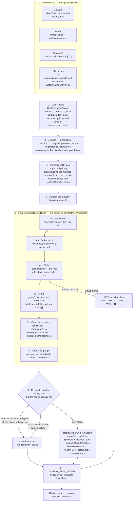
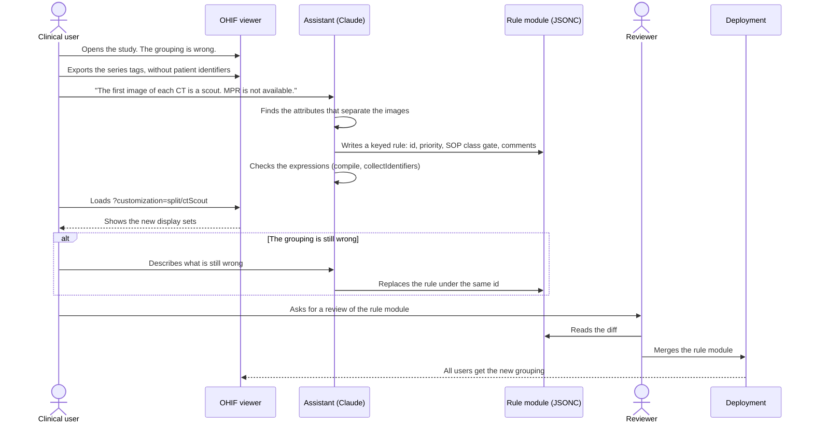
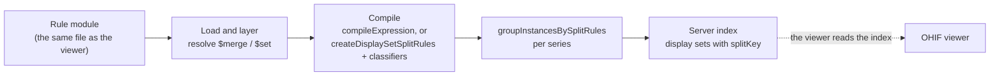

# Display set splitting — requirements

**Prefix:** `SP` (split rules) — *proposed, not yet reserved in the specification register.*
**Source:** [OHIF/Viewers#6137](https://github.com/OHIF/Viewers/pull/6137) — *feat: Add ability to
use new display set split rules*.
**Status:** Draft. §4 is under review. §5 is the recommended approach, and it can change.
**Affects:** `@ohif/core` (`DisplaySetService`, `CustomizationService`), `@ohif/extension-default`,
`@cornerstonejs/metadata`.
**Related:** [Display Set Splitting](../../../platform/services/customization-service/displaySetSplitting.md)
— the reference documentation for the rule format.
[`$function` Expressions](../../../platform/services/customization-service/functionExpressions.md)
— the reference documentation for the expression language.

---

## 1. Purpose

**The goal: allow users to fix the grouping of images into display sets for their specific
data.**

A display set is the unit that the study browser shows and that a viewport displays. The OHIF
defaults group the images of a series well for most data. Some data needs a different grouping:

- a CT series that holds a scout image and an axial volume,
- an MR diffusion series that mixes b-values,
- an ultrasound series that mixes single images and clips,
- a vendor series that puts two acquisitions in one series.

Before this work, a change to the grouping needed a new SOP class handler in TypeScript and a new
build of OHIF. This specification defines a different route. A **split rule** is a short,
declarative text entry. A person can read the rule, a reviewer can check the rule in a diff, and
OHIF applies the rule the same way every time.

Two kinds of person write rules:

1. **An experienced rule author** writes the rule directly.
2. **A clinical user** describes the problem to an AI assistant, for example Claude, in clinical
   words: "the first image of every CT is the scout, and the scout breaks the MPR". The assistant
   writes the rule. The clinical user tests the rule on the study, and a reviewer adds the rule to
   the deployment.

The second route is the more likely route. The rule format is therefore designed so that an
assistant can write a correct rule, and so that a person who did not write the rule can still
read and check it.

The same rule must also work outside the viewer. A server that builds a study index must be able
to read the rule and produce the same display sets. A tool must be able to generate rules again
and again, and each new generation must replace the earlier rule safely.

> The motivating consequence is clinical. A wrong grouping is not only untidy. A scout image in a
> volume makes the volume non-reconstructable, so MPR is not available. Mixed b-values in one
> stack give one window level for images with very different intensities. The user sees a
> problem, but today the user cannot fix it.

## 2. Scope

### 2.1 How to read this specification

§4 states the **user requirements**: what the user must be able to do, or must be able to
determine, to work safely. §5 states the **implementation requirements**: how the work was done,
or the recommended approach.

You can change §5 freely when a better approach appears. You change §4 in two cases only: a
requirement describes the behaviour wrongly, or the intended user-facing behaviour changes. An
implementation that is inconvenient is never a reason to change §4.

### 2.2 In scope

- Split rules for the image instances that the stack SOP class handler owns today.
- The layering of rules from the defaults, a mode, the app config, and a URL module.
- The `$function` expression language that a data-only rule uses.
- The stability of display sets when instances arrive later, or when the rules change during a
  session.
- The authoring route through an AI assistant (§4.2, §5.5).
- Reuse of rules by a server (§4.6, §5.6). The server implementation itself is future work.

### 2.3 Out of scope

- **Secondary objects** — SEG, SR, RT Structure Set, Parametric Map, PDF, video, whole-slide, and
  ECG. Their dedicated extensions keep their SOP class handlers. The result-set specification
  (`RS-DS`) covers display sets for secondary results.
- **One display set from two or more series.** The engine splits one series at a time. See
  `SP-FIX-7` and §6 item 2.
- **A graphical rule editor** in the viewer.
- **Automatic deployment of a generated rule.** A person always applies the rule (`SP-DESC-5`).
- **Hanging protocols.** A hanging protocol selects display sets. A split rule creates display
  sets. The two stay separate, although a rule can set attributes that a hanging protocol reads.

## 3. Definitions

**Display set.** A group of instances that the study browser shows as one item and that one
viewport displays.

**Split rule** (or **rule**). One declarative entry that states which instances it claims, how it
groups them, how it orders them, and what attributes the resulting display sets get.

**Rule set.** The rules that apply to a deployment, keyed by rule id.

**Rule id.** The key of a rule in the rule set. One id names one rule.

**Priority.** A number that sets the evaluation order of the rules. `null` turns a rule off.

**Claim.** An instance is claimed by the first rule, in priority order, that matches the instance.

**Series fact.** A value that a rule computes once from all of the instances of a series, for
example the frame count of the series.

**Split key.** The identity of the group that created a display set. The split key holds the rule
id and the rule's grouping values. The split key holds no position.

**Rule layer.** One source of rule changes: the defaults, a mode, the app config, or a URL module.

**Rule author.** A person who writes a rule directly.

**Clinical user.** A person who knows the data and the clinical problem, and who does not know the
rule syntax.

**Assistant.** An AI assistant that writes a rule from the description of a clinical user.

**Reviewer.** A person who checks a rule before the rule goes into a deployment.

**Server index.** A study-level index that a server builds, for example with Static-DICOMWeb, and
that lists the display sets of a study.

*The system* means the OHIF Viewer, the rule format, and its documentation, unless a requirement
narrows it.

---

## 4. User requirements

> Change these only if a requirement describes the behaviour wrongly, or if the intended
> user-facing behaviour changes.

### 4.1 Fix the grouping — `SP-FIX`

**SP-FIX-1**
The system shall let a deployment change how the instances of a series are grouped into display
sets, without a change to the OHIF source code and without a new build.

**SP-FIX-2**
The system shall let a rule split one series into two or more display sets.

**SP-FIX-3**
The system shall let a rule set the label and the series description that the study browser and
the viewport overlay show for each display set that the rule creates.

**SP-FIX-4**
The system shall let a rule set the order of the images in each display set that the rule creates.

**SP-FIX-5**
The system shall let a deployment turn off, replace, or move one default rule, and keep all of the
other default rules.

**SP-FIX-6**
WHEN no custom rule matches an instance, the system shall group that instance exactly as it would
without the custom rules.

> A rule for CT scouts must not change the MR series of the same study. A user who adds one rule
> must be able to trust that the rest of the study looks as it did before.

**SP-FIX-7** *(deferred)*
WHERE a deployment needs one display set from the instances of two or more series, the system
shall let a rule make that display set.

> Deferred. The engine gets one series at a time today. The requirement stays so that the design
> does not exclude it. See §6 item 2.

### 4.2 Describe the problem, get a rule — `SP-DESC`

**SP-DESC-1**
The rule format shall let a clinical user get a correct rule from a description of the problem in
clinical words, through an assistant, without knowledge of the rule syntax.

**SP-DESC-2**
The documentation shall give an assistant all of the information that a correct rule needs: the
rule fields, the expression language, the priority bands, the ownership test for SOP classes, and
one complete worked example.

**SP-DESC-3**
The rule format shall let a rule carry comments that state the problem the rule fixes and the
series that the rule changes.

**SP-DESC-4**
The system shall let a user apply a new rule to a study that is open in the viewer, and see the
resulting display sets, before the rule goes into a deployment.

**SP-DESC-5**
The system shall not apply a rule from an assistant to a deployment without an action by a person.

**SP-DESC-6**
The system shall let a user give an assistant the attributes that a rule needs, without the
patient identifiers of the study.

> A clinical user who describes a problem will want to show the assistant the data. The data
> carries patient names and identifiers beside the acquisition tags. The route from "this study
> groups wrongly" to "here is a rule" must not need those identifiers.

### 4.3 Readable and reviewable — `SP-READ`

**SP-READ-1**
A rule shall be data that a person can read without a build step and without execution of code.

**SP-READ-2**
A rule shall be text that a code review diff shows line by line.

**SP-READ-3**
A change to one rule shall change only the rule set entry with that rule id.

**SP-READ-4**
The system shall let a user determine which rule created a given display set.

**SP-READ-5**
The system shall let a user determine which attributes an expression reads.

> `SP-READ-5` is for the most common defect: a misspelt attribute. `Modallity === 'CT'` is a
> valid expression that matches nothing.

### 4.4 Deterministic and stable — `SP-DET`

**SP-DET-1**
WHEN the system splits the same complete series with the same rule set, the system shall produce
the same display sets, with the same instances, in the same order, with the same split keys.

**SP-DET-2**
WHEN the system splits a complete series in one pass, the result shall not depend on the order in
which the instances arrived.

**SP-DET-3**
WHILE a series is shown, WHEN new instances of that series arrive, the system shall keep every
existing display set, its instances, and its `displaySetInstanceUID`.

**SP-DET-4**
WHILE a series is shown, WHEN the rule set changes, the system shall keep every existing display
set, its instances, and its `displaySetInstanceUID`.

> `SP-DET-3` and `SP-DET-4` protect viewport state. A display set that disappears, or that loses
> an instance, loses its viewport, its measurements context, and its presentation state. So an
> incremental split can give a different result from a split of the complete series from the
> start. The reference documentation states the difference with an ultrasound example. That
> difference is correct behaviour, not a defect.

### 4.5 Safe — `SP-SAFE`

**SP-SAFE-1**
A rule shall not be able to run code other than the expressions of the rule expression language.

**SP-SAFE-2**
IF a rule has an error, THEN the system shall ignore that rule, keep all of the other rules, and
show a console warning that names the rule.

> The failure must be "my rule did nothing", which a user can diagnose. The failure must never be
> "every series groups wrongly".

**SP-SAFE-3**
IF the rule engine fails for a series, THEN the system shall create the display sets of that
series as it would with no rules.

**SP-SAFE-4**
The default rules shall not claim an instance that a dedicated extension handles.

**SP-SAFE-5**
WHERE a deployment loads rules from a URL, the system shall load rules only from the URL prefixes
that the app config names.

**SP-SAFE-6**
WHERE a deployment denies a rule attribute, the system shall not let any rule compute that
attribute.

> A rule can put any attribute of an instance into a label, and that includes `PatientName`.
> `SP-SAFE-6` lets a deployment keep that text out of the screen, and still let rules split.

### 4.6 Reuse outside the viewer — `SP-REUSE`

**SP-REUSE-1**
A rule shall have the same meaning in the viewer and in a server index.

**SP-REUSE-2**
WHERE a server builds a server index, the server shall produce the same display sets as the
viewer, for the same instances and the same rule set.

**SP-REUSE-3**
A tool that generates a rule shall produce the same rule text for the same input.

**SP-REUSE-4**
WHEN a rule with an existing rule id is applied again, the system shall replace that rule and not
add a second copy.

> `SP-REUSE-3` and `SP-REUSE-4` together make generation repeatable. A tool can generate the rules
> for a data source every night. The result is either no change or a clear diff, and never a
> growing pile of copies.

**SP-REUSE-5**
The system shall let a tool check a rule for errors without a viewer.

---

## 5. Implementation requirements

> Change these freely when a better approach appears. Cite the `SP-*` user requirements that each
> change continues to satisfy.

### 5.1 The rule form — `SP-FORM`

**SP-FORM-1**
The rule set shall be an object keyed by rule id (`SplitRuleSet`), in the `splitRules` field of
the `useMetadataDisplaySet` customization. *Satisfies `SP-READ-3`, `SP-REUSE-4`.*

**SP-FORM-2**
Each rule shall have a numeric `priority`, or `null`. The default rules shall use the priorities
`1..n`. A custom rule that must run before the defaults shall use a priority below `0`. A fallback
rule shall use a priority above `10000`. *Satisfies `SP-FIX-5`.*

**SP-FORM-3**
A rule shall use the fields `matches`, `series`, `groupBy`, `runBy`, `compareInstances`,
`viewportTypes`, and `customAttributes`. The reference documentation shall define each field and
its arguments. *Satisfies `SP-DESC-2`.*

**SP-FORM-4**
A data-only rule shall write each computed value as a `{ "$function": "<expression>" }` marker.
*Satisfies `SP-READ-1`.*

**SP-FORM-5**
A URL rule module shall be JSONC, so that it can carry comments. *Satisfies `SP-DESC-3`,
`SP-READ-2`.*

**SP-FORM-6**
A rule module that needs the splitter shall name `split/enableNewSplit` in its `requires` list.
*Satisfies `SP-DESC-4`.*

> Two data forms exist today. OHIF reads the `$function` form through the customization service.
> `@cornerstonejs/metadata` also defines a pure-JSON form, `RawDisplaySetSelector`, that
> `createDisplaySetSplitRules` compiles with named `classifiers`. The two forms describe the same
> engine rule. §6 item 1 asks which form is the exchange format.

### 5.2 The pipeline — `SP-PIPE`

The flowchart shows every stage that a rule passes through, from its source to a display set. The
numbers match the requirements below. The stages in box 6 are in `@cornerstonejs/metadata`. The
other stages are in OHIF.

**The trace of one rule.** The worked example `split/scoutSeries.jsonc` adds the rule `ctScout`.
This table follows that rule through each stage, for a CT series of 120 single-frame images.

| Stage | What happens to `ctScout` |
| --- | --- |
| 1 | The URL `?customization=split/scoutSeries` loads the module. Its `requires` loads `split/enableNewSplit` first. |
| 2 | `$merge` adds the key `ctScout` with `priority: -1`. The five default rules stay. |
| 3 | `matches` compiles with the signature `['instance', 'context']`. The template `` `SCOUT ${SeriesDescription}` `` compiles. A deployment that denies `customAttributes.SeriesDescription` gets `undefined` here. |
| 4 | The `series` map `{ frameCount, firstInstanceNumber }` becomes one function. The rule is valid, so the rule stays. |
| 6a | The order is `ctScout` (−1), then `singleImageModality` (1) … `defaultImageRule` (5). |
| 6b | `frameCount = 120`, `firstInstanceNumber = 1`. |
| 6c | Instance 1 goes to `ctScout`. Instances 2 to 120 fail `ctScout` and go to `volume3d`. |
| 6d | Two groups: one with the key `["ctScout", <SeriesInstanceUID>]`, and one `volume3d` group. |
| 6e | The scout group has one instance. The volume group is in acquisition order. |
| 6f | The `ctScout` group comes first, because its rule comes first. |
| 7 | Both groups are new. `createDisplaySetFromGroup` makes a display set with the label `SCOUT` and a reconstructable 119-image display set. |
| 8 | The study browser shows two items. The volume is available for MPR. |

**SP-PIPE-1**
The customization service shall merge the rule layers in the order default, mode, global, and a
later layer shall edit a rule by its id. *Satisfies `SP-FIX-5`, `SP-REUSE-4`.*

**SP-PIPE-2**
The customization service shall compile each `$function` marker once, when it reads the
customization. *Satisfies `SP-SAFE-1`, `SP-SAFE-6`.*

**SP-PIPE-3**
`normalizeSplitRules` shall drop a rule whose `matches` or `groupBy` did not compile, and shall
drop an entry whose priority is not a number or `null`. *Satisfies `SP-SAFE-2`.*

> A rule without `matches` matches every instance, and a `groupBy` that did not compile puts
> every instance in one group. So a rule with a compile error in one of these fields is dangerous,
> and the normalizer drops it. A failed `series` fact is safe, because the rule then never
> matches. The normalizer keeps that rule and warns.

**SP-PIPE-4**
The display set service shall give the engine one series at a time. *Satisfies `SP-DET-1`.*

**SP-PIPE-5**
The engine shall give each instance to the first rule, in priority order, whose `matches` is
true. *Satisfies `SP-FIX-6`, `SP-DET-1`.*

**SP-PIPE-6**
The engine shall namespace each split key with the rule id, so that two rules never merge their
groups. *Satisfies `SP-READ-4`, `SP-DET-1`.*

**SP-PIPE-7**
The engine shall order the instances of a group by acquisition order, then by `sortInstances`,
then by the rule's `compareInstances`, then by the host `compareInstances`. A comparator that
returns `0` shall leave the earlier order. *Satisfies `SP-FIX-4`, `SP-DET-2`.*

**SP-PIPE-8**
The engine shall give each instance that no rule claims to the SOP class handlers.
*Satisfies `SP-FIX-6`, `SP-SAFE-4`.*

**SP-PIPE-9**
IF the engine throws for a series, THEN the display set service shall give every instance of that
series to the SOP class handlers. *Satisfies `SP-SAFE-3`.*

**SP-PIPE-10**
The display set service shall put a new instance into the display set that holds the other
instances of its group, else into the display set with the same split key, else into a new
display set. *Satisfies `SP-DET-3`, `SP-DET-4`.*

**SP-PIPE-11**
The display set factory shall record `splitKey` and `splitRuleId` on each display set, and shall
not let `customAttributes` overwrite those two attributes or `extendInstances`.
*Satisfies `SP-READ-4`, `SP-DET-3`.*

> **Gap.** `RESERVED_ATTRIBUTES` in `makeDisplaySetFromInstanceGroup.ts` holds `splitKey` and
> `extendInstances`, but not `splitRuleId`. A rule can therefore overwrite `splitRuleId` through
> `customAttributes`. The reconciliation compares `splitRuleId` with the id of the matched rule,
> to decide if the series facts go to `extendInstances`. So an overwritten `splitRuleId` changes
> the sort of a display set that grows.

**SP-PIPE-12**
The default rules shall gate every match on the SOP class list of the stack SOP class handler
(`isStackHandledInstance`), and shall exclude video, whole-slide, and ECG instances.
*Satisfies `SP-SAFE-4`.*

### 5.3 The expression language — `SP-EXPR`

> The expression language is not specific to split rules. Its reference documentation is the
> [`$function` Expressions](../../../platform/services/customization-service/functionExpressions.md)
> page. The requirements below state only what split rules need from the language.

**SP-EXPR-1**
The expression language shall live in `@cornerstonejs/metadata` (`compileExpression`), and OHIF
shall only add the `$function` marker. *Satisfies `SP-REUSE-1`.*

**SP-EXPR-2**
The compiler shall not use `eval` or `new Function`, and shall reject `__proto__`, `constructor`,
and `prototype` when it parses an expression. *Satisfies `SP-SAFE-1`.*

**SP-EXPR-3**
The code that calls a compiled expression shall declare its parameter names
(`registerFunctionSignatures`). A marker that states different parameters shall use the
registered ones and warn. *Satisfies `SP-DET-1`.*

**SP-EXPR-4**
`customizationFunctionPolicy` shall come from the app config only, and never from a
customization. *Satisfies `SP-SAFE-5`, `SP-SAFE-6`.*

**SP-EXPR-5**
`collectIdentifiers` shall report the attributes that an expression reads. *Satisfies
`SP-READ-5`, `SP-REUSE-5`.*

### 5.4 Rule files in a deployment — `SP-DEPLOY`

**SP-DEPLOY-1**
Example and deployment rule modules shall go in `platform/app/public/customizations/split/`, one
concern per file, named for the problem that the file fixes. *Satisfies `SP-READ-2`.*

**SP-DEPLOY-2**
A rule module shall state in its header comment the problem, the series that the rule changes, and
the URL that loads the module. *Satisfies `SP-DESC-3`.*

**SP-DEPLOY-3**
A rule that must take instances before the defaults shall use a priority below `0`, and shall gate
on `SOPClassUID` or on `Modality`. *Satisfies `SP-FIX-6`, `SP-SAFE-4`.*

### 5.5 The assistant route — `SP-GEN` *(proposed)*

This sequence diagram shows the recommended route from a clinical description to a deployed rule.

**SP-GEN-1**
The repository should hold an agent skill, in `.agents/skills/`, that tells an assistant how to
turn a clinical description into a rule module. The skill should cite the reference
documentation instead of a copy of it. *Satisfies `SP-DESC-1`, `SP-DESC-2`.*

**SP-GEN-2**
The skill should tell the assistant to use a rule id that names the problem, a priority below
`0`, an explicit SOP class or modality gate, and a header comment. *Satisfies `SP-DESC-3`,
`SP-SAFE-4`, `SP-REUSE-3`.*

**SP-GEN-3**
The viewer should give a way to export the tags of a series without the patient identifiers, as
input for the assistant. *Satisfies `SP-DESC-6`.*

**SP-GEN-4**
The skill should tell the assistant to replace a rule under its id, and never to add a rule with a
new id for the same problem. *Satisfies `SP-REUSE-3`, `SP-REUSE-4`.*

**SP-GEN-5**
The repository should give a unit test pattern that feeds exported series tags to
`groupInstancesBySplitRules` with a rule, and checks the resulting groups. *Satisfies `SP-DESC-4`,
`SP-REUSE-5`.*

### 5.6 Reuse by a server — `SP-SRV` *(proposed)*

**SP-SRV-1**
A server shall compile rules with `@cornerstonejs/metadata` only, and shall not need `@ohif/core`.
*Satisfies `SP-REUSE-1`, `SP-REUSE-5`.*

**SP-SRV-2**
A server index shall record the `splitKey` of each display set, so that the viewer can match its
display sets to the index. *Satisfies `SP-REUSE-2`, `SP-DET-3`.*

**SP-SRV-3**
The ownership test for SOP classes shall be a named classifier (`stackImage`), so that a server can
use the same test without OHIF code. *Satisfies `SP-REUSE-2`, `SP-SAFE-4`.*

> Today the OHIF default rules are closures (`ohifDefaultSplitRules.ts`). A closure cannot go to a
> server. The header of that file states the conversion path: every OHIF-specific part reduces to
> the one classifier `isStackHandledInstance`. Until that conversion, a server can reuse a
> custom rule, but not the OHIF defaults.

---

## 6. Open questions

| # | Question | State |
| --- | --- | --- |
| 1 | Which data form is the exchange format for a server: the OHIF `$function` form, or the `@cornerstonejs/metadata` `RawDisplaySetSelector` form? The `$function` form needs the OHIF layer merge (`$merge`, `$set`) and the `$function` marker. The raw form needs `classifiers`. | Open |
| 2 | One display set from two or more series (`SP-FIX-7`). The engine gets one series at a time (`SP-PIPE-4`). A study-level pass must keep `SP-DET-3`. | Deferred |
| 3 | Where does the export of series tags without patient identifiers live (`SP-GEN-3`)? It can be a viewer command, a customization, or a separate tool. | Open |
| 4 | Is the agent skill of `SP-GEN-1` a part of this pull request, or a separate change? | Open |
| 5 | The prefix `SP` must go into §1 of the specification register (`specs/index.md`). The register is on the branch `feat/study-level-segmentation`, and not on this branch. | Open |

## 7. Traceability

| Requirement group | Source |
| --- | --- |
| `SP-FIX`, `SP-DET`, `SP-SAFE` | [OHIF/Viewers#6137](https://github.com/OHIF/Viewers/pull/6137), and the reference documentation *Display Set Splitting* |
| `SP-DESC`, `SP-GEN` | The goal in §1: a clinical user describes the problem, and an assistant writes the rule |
| `SP-REUSE`, `SP-SRV` | The header of `ohifDefaultSplitRules.ts`, and the statement in the reference documentation that "a server building a study index compiles the same rules the viewer does" |
| `SP-FORM`, `SP-PIPE`, `SP-EXPR` | The implementation in #6137 |

## 8. Verification

| Requirement group | Test |
| --- | --- |
| `SP-FIX`, `SP-PIPE-5`..`SP-PIPE-8`, `SP-PIPE-12` | `extensions/default/src/displaySetSplitting/ohifDefaultSplitRules.test.ts` |
| `SP-SAFE-2`, `SP-PIPE-3` | `platform/core/src/services/DisplaySetService/normalizeSplitRules.test.ts` |
| `SP-DET`, `SP-SAFE-3`, `SP-PIPE-4`, `SP-PIPE-9`..`SP-PIPE-11` | `platform/core/src/services/DisplaySetService/DisplaySetService.test.ts` |
| `SP-SAFE-1`, `SP-SAFE-6`, `SP-EXPR` | `platform/core/src/services/CustomizationService/CustomizationService.function.test.ts` |
| `SP-FORM`, `SP-PIPE-1` | `extensions/default/src/customizations/metadataDisplaySetCustomization.test.ts` |
| `SP-DESC-4`, `SP-FIX-3` | *Pending* — a Playwright test that loads `?customization=split/scoutSeries` and checks the `SCOUT` item in the study browser |
| `SP-GEN`, `SP-SRV` | *Pending* — proposed work |
