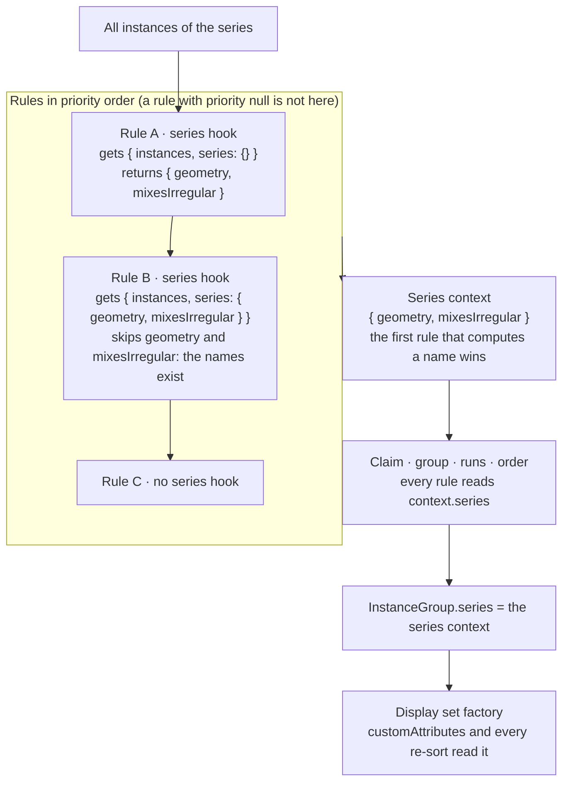

# Display set splitting — series context

**Prefix:** `SP` (split rules), groups `SP-SUM`, `SP-CTX`, `SP-SFN`, and `SP-EXM` — *proposed,
not yet reserved in the specification register.*
**Extends:** [Display set splitting — requirements](./requirements.md). The requirements of that
specification apply here too, in particular `SP-DET`, `SP-SAFE`, and `SP-REUSE`.
**Status:** Draft. §4 is under review. §5 is the recommended approach, and it can change.
**Affects:** `@cornerstonejs/metadata` (the split engine, the rule compiler, the series
functions), `@ohif/core` (`DisplaySetService`), `@ohif/extension-default` (the display set
factory, the example rule modules).
**Related:** [Display Set Splitting](../../../platform/services/customization-service/displaySetSplitting.md#the-series-context)
— the reference documentation for the series context.

---

## 1. Purpose

**The goal: let a rule use a value of the whole series in a decision about one instance.**

A split rule tests one instance at a time. Some data needs a test that depends on the other
instances of the series:

1. **A volume with some irregular images.** A series is a volume, except for some images that are
   not on the regular slice spacing. The regular slices must become one volume display set. The
   other images must stay as they are. To find the regular slices, the system must first find the
   slice spacing of the series. Then each slice is regular when its distance from a start point,
   in units of the spacing, is approximately an integer.
2. **A volume in spatial order.** The slices of a volume must be in order along the normal of the
   image plane, from one origin for the whole series. The order needs the origin and the normal
   first. Then each slice gets its distance along the normal.
3. **Ultrasound sweeps.** An ultrasound series holds the images of several sweeps, and each image
   records its acquisition time. Each run of images with no long gap in time must become one
   display set. The ranges of time must come from all of the times of the series.

The three cases have one shape. The system computes a summary of the series once. Then the
per-instance parts of the rules — the match, the grouping, the order, and the attributes — read
that summary. A summary can be expensive, so the system computes it once, and every rule that
needs it reads the same value.

Before this work, a series fact in the data form was a named boolean only. A rule in data could
ask "does this series mix two kinds of image?", but it could not compute a spacing, an origin, or
a range of time. Such a rule needed code.

## 2. Scope

### 2.1 How to read this specification

§4 states the **user requirements**: what the user must be able to do, or must be able to
determine, to work safely. §5 states the **implementation requirements**: how the work was done,
or the recommended approach.

You can change §5 freely when a better approach appears. You change §4 in two cases only: a
requirement describes the behaviour wrongly, or the intended user-facing behaviour changes. An
implementation that is inconvenient is never a reason to change §4.

### 2.2 In scope

- Series facts that hold any value: a boolean, a number, or a summary object.
- One series context that all rules of a split share.
- Named series functions for the summaries that the expression language cannot compute, and two
  built-in series functions: `planeGeometry` and `timeClusters`.
- The use of the series context in `customAttributes`.
- Three example rule modules, one for each case of §1.

### 2.3 Out of scope

- **A summary of the frames of one multiframe instance.** The engine splits whole instances
  (`SP-FIX-8` in the requirements specification).
- **A summary across two or more series** (`SP-FIX-7`).
- **Vector functions in the expression language**, for example `dot` or `cross`. The geometry is in
  the `planeGeometry` series function. See §6 item 5.

## 3. Definitions

**Series context.** The named values that the rules of one split compute once from all of the
instances of the series. Every rule reads the series context as `context.series`.

**Series fact.** One named value in the series context. This definition replaces the definition
in the requirements specification: a series fact can hold any value, not only a boolean.

**Series function.** A named function that computes one series fact from all of the instances of
the series. Code supplies a series function. A rule names it.

**Slice lattice.** The positions along the normal of the image plane at a fixed spacing from an
anchor position. A slice is **on the lattice** when its position is within a tolerance of a
lattice position.

**Sweep.** A run of images, in time order, with no gap between two images that is longer than a
stated time.

*The system* means the OHIF Viewer, the `@cornerstonejs/metadata` split engine and rule compiler,
and their documentation, unless a requirement narrows it.

---

## 4. User requirements

> Change these only if a requirement describes the behaviour wrongly, or if the intended
> user-facing behaviour changes.

### 4.1 Summaries of a series — `SP-SUM`

**SP-SUM-1**
The system shall let a rule compute a value from all of the instances of a series, and use that
value in the match, the grouping, the order, and the attributes of each display set that the
rule creates.

**SP-SUM-2**
The system shall let a rule claim only the instances of a series that are on a regular slice
lattice, and leave the other instances of the series to the other rules.

> This is case 1 of §1. "Leave to the other rules" means that the other instances get the display
> sets that they get without the rule (`SP-FIX-6`).

**SP-SUM-3**
The system shall let a rule order the images of a display set by their distance along the normal
of the image plane, from one origin for the series.

**SP-SUM-4**
The system shall let a rule split the images of a series into display sets of contiguous
acquisition time, where a gap longer than a time that the rule states starts a new display set.

**SP-SUM-5**
WHEN two rules of a split use a series value of the same name, the system shall give both rules
the same value.

> Two rules can divide one series: "the regular slices" and "the other images". The two rules must
> agree on the lattice, so that each instance goes to exactly one of them. One value also means
> one computation of an expensive summary.

**SP-SUM-6**
A rule shall be able to state every series value that it reads, so that the rule works alone, and
so that a reader of the rule sees where each value comes from.

**SP-SUM-7**
The system shall let a rule put a series value in the label or the series description of a display
set, for example the slice spacing.

**SP-SUM-8**
The system shall let a rule module that is only data, for example a URL module, express
`SP-SUM-2`, `SP-SUM-3`, and `SP-SUM-4`.

> A clinical user gets a rule from an assistant (`SP-DESC-1`). A rule that needs new code for
> each case does not follow that route.

**SP-SUM-9**
IF a rule names a series function that does not exist, THEN the system shall treat the rule as a
rule with an error, as `SP-SAFE-7` states.

> `SP-DET-1` and `SP-DET-2` apply to the series context too: a summary must not depend on the
> order in which the instances arrived. `SP-DET-3` also applies: when a late instance changes a
> summary, for example the slice lattice, the existing display sets keep their instances.

---

## 5. Implementation requirements

> Change these freely when a better approach appears. Cite the `SP-*` user requirements that each
> change continues to satisfy.

### 5.1 The shared series context — `SP-CTX`

The flowchart shows how the engine builds the series context of one split, before it claims any
instance.



**SP-CTX-1**
The engine shall compute one series context for each split. It shall run the `series` hook of each
rule in priority order, and shall add to the context each name that a hook returns and that is not
already in the context. A rule with priority `null` shall compute nothing. *Satisfies `SP-SUM-1`,
`SP-SUM-5`.*

> `computeSeriesFacts` in `groupInstancesBySplitRules.ts`. Before this change, each rule had its
> own facts, and a rule could not read the facts of another rule.

**SP-CTX-2**
A `series` hook shall get `{ instances, series }`, where `series` holds the facts so far. A
compiled data hook shall not evaluate a fact whose name is already in the context. *Satisfies
`SP-SUM-5`.*

**SP-CTX-3**
The engine shall give the same series context to `matches`, to each `groupBy` part, to `runBy`, and
to `compareInstances` of every rule, as `context.series`, and shall store it as
`InstanceGroup.series`. *Satisfies `SP-SUM-1`.*

**SP-CTX-4**
A series fact in the data form shall have one of three forms. A key selects the form. *Satisfies
`SP-SUM-1`, `SP-SUM-8`.*

| Form | Key | Value |
| --- | --- | --- |
| `{ name, scope, when, gate?, minInstances? }` | `scope` | A boolean, as before. `when` and `gate` also read the facts so far. |
| `{ name, expression }` | `expression` | Any value. The expression gets `(instances, series)`. It has no implicit scope: a bare name reads an attribute only inside an aggregate, for example `minOf(instances, InstanceNumber)`. |
| `{ name, function, args? }` | `function` | The value of a named series function, called with `(instances, { series, args })`. |

**SP-CTX-5**
The facts of one `series` list shall run in list order, and each fact shall read the facts before
it. A name that occurs twice in one list shall be a compile error. *Satisfies `SP-SUM-6`,
`SP-SAFE-7`.*

> The second entry of a name never runs, because the first entry wins. An error is better than an
> entry that has no effect.

**SP-CTX-6**
`createDisplaySetSplitRules` shall take named series functions as `options.seriesFunctions`, in
addition to the built-in ones. A series fact that names an unknown function shall be a compile
error that names the rule, the path, and the known functions. OHIF shall pass the
`seriesFunctions` of the `useMetadataDisplaySet` customization. *Satisfies `SP-SUM-9`,
`SP-FORM-4`.*

**SP-CTX-7**
The display set factory shall pass the series context to `customAttributes` as `options.series`,
and a `fromFirstInstance` expression shall read it as `context.series`. *Satisfies `SP-SUM-7`.*

**SP-CTX-8**
`DisplaySetService` shall pass the series context of a re-split to `extendInstances`, whichever
rule placed the new instances. *Satisfies `SP-DET-3`, `SP-SUM-1`.*

> Before this change, the facts went to `extendInstances` only when the rule of the group was the
> rule of the display set, because the facts belonged to one rule. One context belongs to the whole
> split.

**SP-CTX-9**
A series value that holds a result for each instance shall be a map keyed by `SOPInstanceUID`,
else by `imageId`. A rule shall read it with an index, for example
`context.series.geometry.index[SOPInstanceUID]`. *Satisfies `SP-SUM-8`.*

**SP-CTX-10**
A series value that a rule uses in `groupBy` shall not be an ordinal. It shall be a value that
stays the same when a later group gets new instances, for example the start time of a sweep.
*Satisfies `SP-DET-3`.*

> The split key holds the `groupBy` values. An ordinal of a sweep changes when an earlier sweep
> arrives, and the display set then gets a different key. This is the same reason that a `runBy`
> run uses the key of its first instance.

**SP-CTX-11**
A rule should declare each series fact that it reads, also when an earlier rule computes the same
fact. *Satisfies `SP-SUM-6`.*

> The declaration costs nothing when an earlier rule computed the fact. It computes the fact when
> the earlier rule is off. It also makes `orderInstancesForRule` without `options.series` correct,
> because that function computes only the facts of its own rule.

### 5.2 Series functions — `SP-SFN`

**SP-SFN-1**
The series functions shall be in `@cornerstonejs/metadata`, so that a server can use them without
OHIF. *Satisfies `SP-REUSE-1`, `SP-SRV-1`.*

**SP-SFN-2**
A series function shall be pure, and its result shall not depend on the order of the instances.
Its result shall be plain data: numbers, booleans, arrays, and maps. *Satisfies `SP-DET-2`,
`SP-REUSE-2`.*

**SP-SFN-3**
`planeGeometry` shall compute the slice lattice of a series in these steps. *Satisfies
`SP-SUM-2`, `SP-SUM-3`.*

1. The dominant orientation is the most frequent `ImageOrientationPatient`, rounded to 1e-3. A tie
   goes to the smaller text. The normal comes from the instance of that orientation with the
   smallest key.
2. Each instance of that orientation projects its `ImagePositionPatient` on the normal. The
   spacing is the most frequent gap between two consecutive distinct positions, rounded to
   0.01 mm. A tie goes to the smaller gap.
3. The anchor is the position that puts the most positions on the lattice. A tie goes to the lower
   position. So one extra slice at the edge does not move the lattice.
4. A position is on the lattice when its offset from the anchor, in units of the spacing, is
   within `args.tolerance` (default `0.1`) of an integer.
5. Index 0 is the lowest regular position, and `origin` is its position.

The result is `{ normal, origin, spacing, regularCount, irregularCount, positions, complete,
duplicates, distance, index }`. `distance` holds the distance in mm from the origin, for each
instance of the dominant orientation. `index` holds the lattice position of each regular
instance. `complete` is true when no lattice position between the first and the last is empty.

**SP-SFN-4**
`timeClusters` shall read the time of each instance from `AcquisitionDateTime`, else from
`AcquisitionDate` and `AcquisitionTime`, else from `ContentDate` and `ContentTime`. It shall sort
the times, with the key as a tie break, and shall start a new cluster after a gap of more than
`args.maxGap` seconds (default `30`). *Satisfies `SP-SUM-4`.*

The result is `{ time, start, first, clusters, untimedCount }`. `start` holds the start time of
the cluster of each instance, and so satisfies `SP-CTX-10`.

> No public DICOM date and time parser exists in the packages that `@cornerstonejs/metadata`
> uses: `@cornerstonejs/calculate-suv` has `parseDA` and `parseTM`, but its index does not
> export them. So `seriesFunctions.ts` holds a small parser, `dicomDateTimeToSeconds`. It ignores
> the time zone offset of a `DT`, and without a date it gives the time of day.

### 5.3 Example rule modules — `SP-EXM`

Each module is in `platform/app/public/customizations/split/`, and follows `SP-DEPLOY-1` and
`SP-DEPLOY-2`. `urlSplitModules.test.ts` compiles each module, and checks the display sets of one
series for each module.

**SP-EXM-1** — `split/regularVolume.jsonc`. *Satisfies `SP-SUM-2`, `SP-SUM-5`, `SP-SUM-7`.*

```jsonc
"regularVolume": {
  "priority": -2,
  "viewportTypes": ["volume", "volume3d", "stack"],
  "series": [
    { "name": "geometry", "function": "planeGeometry", "args": { "tolerance": 0.1 } },
    {
      "name": "mixesIrregular",
      "expression": "series.geometry.regularCount >= 3 && series.geometry.irregularCount > 0 && series.geometry.complete"
    }
  ],
  "matches": {
    "all": [
      { "classifier": "stackImage" },
      { "attribute": "Modality", "in": ["CT", "MR", "PT", "NM"] },
      { "seriesFact": "mixesIrregular" },
      { "expression": "defined(context.series.geometry.index[SOPInstanceUID])" }
    ]
  },
  "groupBy": ["SeriesInstanceUID"],
  "compareInstances": {
    "expression": "context.series.geometry.distance[a.SOPInstanceUID] - context.series.geometry.distance[b.SOPInstanceUID]"
  },
  "customAttributes": {
    "fromFirstInstance": {
      "SeriesDescription": { "expression": "`${SeriesDescription} (${context.series.geometry.spacing} mm)`" }
    }
  }
}
```

The module also holds the rule `irregularImages`, with priority `null`. With priority `-1`, that
rule puts the other images into one stack. It declares the same two facts, and so reads the
values of `regularVolume` without a second computation (`SP-CTX-1`, `SP-CTX-11`).

**SP-EXM-2** — `split/volumeProjectionOrder.jsonc`. *Satisfies `SP-SUM-3`.*

The module replaces the default `volume3d` rule under its own id, so the rule keeps priority `4`
and claims the same instances. It adds one fact and one comparator:

```jsonc
"series": [
  { "name": "supportsVolume3d", "scope": "first", "when": { "attribute": "Modality", "in": ["CT", "MR", "PT", "NM"] }, "minInstances": 2 },
  { "name": "geometry", "function": "planeGeometry" }
],
"compareInstances": {
  "expression": "context.series.geometry.distance[a.SOPInstanceUID] - context.series.geometry.distance[b.SOPInstanceUID]"
}
```

An image that is not in the dominant plane has no distance. The comparator then gives `NaN`, which
is "no opinion", and OHIF's default order decides for that image (`SP-PIPE-7`).

**SP-EXM-3** — `split/usTimeClusters.jsonc`. *Satisfies `SP-SUM-4`, `SP-SUM-7`, `SP-CTX-10`.*

```jsonc
"usTimeClusters": {
  "priority": -1,
  "viewportTypes": ["stack"],
  "series": [
    { "name": "usTime", "function": "timeClusters", "args": { "maxGap": 20 } },
    { "name": "severalSweeps", "expression": "series.usTime.clusters > 1" }
  ],
  "matches": {
    "all": [
      { "classifier": "stackImage" },
      { "attribute": "Modality", "equals": "US" },
      { "not": { "attribute": "NumberOfFrames", "greaterThan": 1 } },
      { "seriesFact": "severalSweeps" },
      { "expression": "defined(context.series.usTime.start[SOPInstanceUID])" }
    ]
  },
  "groupBy": ["SeriesInstanceUID", { "expression": "context.series.usTime.start[SOPInstanceUID]" }],
  "compareInstances": {
    "expression": "context.series.usTime.time[a.SOPInstanceUID] - context.series.usTime.time[b.SOPInstanceUID]"
  },
  "customAttributes": {
    "fromFirstInstance": {
      "SeriesDescription": {
        "expression": "`${SeriesDescription} +${round(context.series.usTime.start[SOPInstanceUID] - context.series.usTime.first)} s`"
      }
    }
  }
}
```

**The trace of `regularVolume`.** The table follows the rule through the stages of the pipeline
(`SP-PIPE` in the requirements specification), for a CT series of five instances: slices at 0, 2,
4, and 6 mm, and one extra slice at 3.1 mm.

| Stage | What happens |
| --- | --- |
| 6b | `regularVolume` runs first (priority −2). `planeGeometry` finds the normal `[0, 0, 1]`. The gaps are 2, 1.1, 0.9, and 2, so the spacing is 2 mm. The anchor at 0 puts four positions on the lattice. The slice at 3.1 mm is 1.55 steps from the anchor, so it is off the lattice. `index` is `{ 0 mm: 0, 2 mm: 1, 4 mm: 2, 6 mm: 3 }`. `mixesIrregular` is true. The default rules add `supportsVolume3d` and the other default facts. |
| 6c | `regularVolume` claims the four slices with an index. The slice at 3.1 mm has no index, so the default `volume3d` rule claims it. |
| 6d | Two groups: `["regularVolume", <SeriesInstanceUID>]` with four slices, and `["volume3d", <SeriesInstanceUID>]` with one slice. |
| 6e | The four slices are in the order of `distance`: 0, 2, 4, 6 mm. |
| 7 | The series description of the volume display set ends with ` (2 mm)`. |

A series with slices at 0, 2, and 4 mm only has `irregularCount` 0, so `mixesIrregular` is false,
and the series keeps the default `volume3d` display set (`SP-FIX-6`).

---

## 6. Open questions

| # | Question | State |
| --- | --- | --- |
| 1 | Two rules can declare one name with two different definitions. The later rule then reads the value of the earlier definition, and gets no warning. Must the compiler warn when two data declarations of one name differ? | **Open.** A check can compare the JSON text of the two declarations. A declaration that is a function cannot be compared. Until then, the reference documentation tells the author to give a fact a name that says what it computes. |
| 2 | A late instance can change a summary: it can change the slice lattice, or it can join two sweeps. The existing display sets keep their instances (`SP-DET-3`), so the result can differ from a split of the complete series. | **Accepted.** This is the same behaviour as for `runBy` runs. The reference documentation states it. |
| 3 | A series fact sees every instance of the series, also the instances that an earlier rule claims. In `usTimeClusters`, a multi-frame clip counts in the time clusters, and can join two sweeps. Must a fact take a filter of the instances? | **Open.** A possible form is an optional `where` condition on a series fact. |
| 4 | The anchor search of `planeGeometry` takes a time proportional to the square of the number of distinct positions. | **Open.** The time is small for a series of a few thousand slices. A faster search can replace it, and `SP-SFN-3` stays the same. |
| 5 | Must the expression language get vector functions, for example `dot` and `cross`? | **Open.** Not needed for the three cases, because `planeGeometry` gives `distance`. |
| 6 | `DisplaySetService` keeps the compiled rules for one `splitRules` value. A change of `seriesFunctions` alone does not compile the rules again. | **Accepted for now.** `classifiers` have the same limit today. |
| 7 | Before this change, each rule had its own facts. A custom rule set that uses one fact name with two meanings in two rules now behaves differently. | **Accepted.** The default rules use different names (`isMultiFrame`, `mixedBValue`, `supportsVolume3d`), so the defaults do not change. The change must be stated in the release notes of `@cornerstonejs/metadata`. |
| 8 | The prefix groups `SP-SUM`, `SP-CTX`, `SP-SFN`, and `SP-EXM` must go into the specification register (`specs/index.md`). | **Deferred**, as §6 item 5 of the requirements specification. |

## 7. Traceability

| Requirement group | Source |
| --- | --- |
| `SP-SUM` | The three cases of §1: a regular lattice in an irregular series, a spatial order from one origin, and ultrasound sweeps by acquisition time |
| `SP-SUM-5`, `SP-CTX-1`, `SP-CTX-2` | The decision that the series context is shared across the rules, and that the first rule that computes a name wins |
| `SP-SUM-8`, `SP-SFN-1` | `SP-DESC-1`, `SP-REUSE-1`, and `SP-SRV-1` of the requirements specification |

## 8. Verification

The tests fall in two groups: "the API must do this" (`seriesContext.test.ts`), and "the user must
see this" (`urlSplitModules.test.ts`).

| Requirement | Test |
| --- | --- |
| `SP-CTX-1`, `SP-CTX-2`, `SP-SUM-5` | `seriesContext.test.ts` of `@cornerstonejs/metadata`: "lets the first rule that computes a name win, and every rule read it", and "computes a fact in a later rule when the earlier rule is turned off" |
| `SP-CTX-4`, `SP-CTX-5` | `seriesContext.test.ts`: "computes an expression fact over the series, after the earlier facts" |
| `SP-SUM-9`, `SP-CTX-5`, `SP-CTX-6` | `seriesContext.test.ts`: "rejects an unknown series function and a name twice in one list" |
| `SP-SUM-7`, `SP-CTX-7` | `seriesContext.test.ts`: "gives customAttributes the series context that the host passes" |
| `SP-SFN-2`, `SP-SFN-3` | `seriesContext.test.ts`: the `planeGeometry` tests, one of them with the instances in reverse order |
| `SP-SFN-4` | `seriesContext.test.ts`: the `timeClusters` test |
| `SP-SUM-2`, `SP-EXM-1` | `urlSplitModules.test.ts`: "regularVolume makes a volume of the regular slices, and leaves the extra slice", and "regularVolume keeps a fully regular series as the default volume" |
| `SP-SUM-3`, `SP-EXM-2` | `urlSplitModules.test.ts`: "volumeProjectionOrder orders the slices by position, not by InstanceNumber" |
| `SP-SUM-4`, `SP-EXM-3` | `urlSplitModules.test.ts`: "usTimeClusters makes one display set for each sweep, in time order" |
| `SP-CTX-8` | `DisplaySetService.test.ts`: "passes the series facts of the re-split to the display set it extends" |
| `SP-DET-3` with a changed summary | *Pending* — a `DisplaySetService` test that adds a late slice which changes the lattice |
