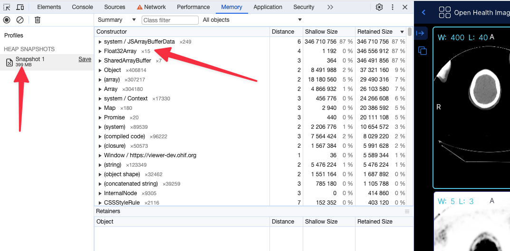

# Technical FAQ


## Why do I keep seeing a Cross Origin Isolation warning
If you encounter a warning while running OHIF indicating that your application is not cross-origin isolated, it implies that volume rendering, such as MPR, will not function properly since they depend on Shared Array Buffers. To resolve this issue, we recommend referring to our comprehensive guide on Cross Origin Isolation available at [our dedicated cors page](../deployment/cors.md).

## What if my setup does not support the Shared Array Buffers API?
You can simply disable that by adding the `useSharedArrayBuffer: 'FALSE'` (notice the string FALSE), and the volumes will only use a regular
array buffer which is a bit slower but will work on all browsers.


## Viewer opens but does not show any thumbnails

Thumbnails may not appear in your DICOMWeb application for various reasons. This guide focuses on one primary scenario, which is you are using
the `supportsWildcard: true` in your configuration file while your sever does not support it.
One

For instance for the following filtering in the worklist tab we send this request


`https://d33do7qe4w26qo.cloudfront.net/dicomweb/studies?PatientName=*Head*&limit=101&offset=0&fuzzymatching=false&includefield=00081030%2C00080060`

Which our server can respond properly. If your server does not support this type of filtering, you can disable it by setting `supportsWildcard: false` in your configuration file,
or edit your server code to support it for instance something like

```js
Pseudocode:
For each filter in filters:
    if filter.value contains "*":
        Convert "*" to SQL LIKE wildcard ("%")
        Add "metadataField LIKE ?" to query
    else:
        Add "metadataField = ?" to query
```


## What are the list of required metadata for the OHIF Viewer to work?


### Mandatory

**All Modalities**

- `StudyInstanceUID`, `SeriesInstanceUID`, `SOPInstanceUID`: Unique identifiers for the study, series, and object.
- `PhotometricInterpretation`: Describes the color space of the image.
- `Rows`, `Columns`: Image dimensions.
- `PixelRepresentation`: Indicates how pixel data should be interpreted.
- `Modality`: Type of modality (e.g., CT, MR, etc.).
- `PixelSpacing`: Spacing between pixels.
- `BitsAllocated`: Number of bits allocated for each pixel sample.
- `SOPClassUID`: Specifies the DICOM service class of the object (though you might be able to render without it for most regular images datasets, but it is pretty normal to have it)

**Rendering**

You need to have the following tags for the viewer to render the image properly, otherwise you should
use the windowing tools to adjust the image to your liking:

- `RescaleIntercept`, `RescaleSlope`: Values used for rescaling pixel values for visualization.
- `WindowCenter`, `WindowWidth`: Windowing parameters for display.

**Some Datasets**

- `InstanceNumber`: Useful for sorting instances (without it the instances might be out of order)

**For MPR (Multi-Planar Reformatting) rendering and tools**

- `ImagePositionPatient`, `ImageOrientationPatient`: Position and orientation of the image in the patient.

**SEG (Segmentation)**

- `FrameOfReferenceUID` for handling segmentation layers.
- sequences
  - `ReferencedSeriesSequence`
  - `SharedFunctionalGroupsSequence`
  - `PerFrameFunctionalGroupsSequence`

**RTSTRUCT (Radiotherapy Structure)**

- `FrameOfReferenceUID` for handling segmentation layers.
- sequences
  - `ROIContourSequence`
  - `StructureSetROISequence`
  - `ReferencedFrameOfReferenceSequence`

**US (Ultrasound)**

- `NumberOfFrames`: Number of frames in a multi-frame image.
- `SequenceOfUltrasoundRegions`: For measurements.
- `FrameTime`: Time between frames if specified.

**SR (Structured Reporting)**

- Various sequences for encoding the report content and template.
  - `ConceptNameCodeSequence`
  - `ContentSequence`
  - `ContentTemplateSequence`
  - `CurrentRequestedProcedureEvidenceSequence`
  - `ContentTemplateSequence`
  - `CodingSchemeIdentificationSequence`

**PT with SUV Correction (Positron Tomography Standardized Uptake Value)**

- Sequences and tags related to radiopharmaceuticals, units, corrections, and timing.
  - `RadiopharmaceuticalInformationSequence`
  - `SeriesDate`
  - `SeriesTime`
  - `CorrectedImage`
  - `Units`
  - `DecayCorrection`
  - `AcquisitionDate`
  - `AcquisitionTime`
  - `PatientWeight`

**PDF**

- `EncapsulatedDocument`: Contains the PDF document.

**Video**

- `NumberOfFrames`: Video frame count .


### Optional
There are various other optional tags that will add to the viewer experience, but are not required for basic functionality. These include:
Patient Information, Study Information, Series Information, Instance Information, and Frame Information.


## How do I handle large volumes for MPR and Volume Rendering

Currently there are two ways to handle large volumes for MPR and Volume Rendering if that does not
fit in the memory of the client machine.

### `useNorm16Texture`

WebGL officially supports only 8-bit and 32-bit data types. For most images, 8 bits are not enough, and 32 bits are too much. However, we have to use the 32-bit data type for volume rendering and MPR, which results in suboptimal memory consumption for the application.

Through [EXT_texture_norm16](https://registry.khronos.org/webgl/extensions/EXT_texture_norm16/) , WebGL can support 16 bit data type which is ideal
for most images. You can look into the [webgl report](https://webglreport.com/?v=2) to check if you have that extension enabled.


This is a flag that you can set in your [configuration file](../configuration/configurationFiles.md) to force usage of 16 bit data type for the volume rendering and MPR. This will reduce the memory usage by half.


For instance for a large pt/ct study


Before (without the flag) the app shows 399 MB of memory usage




After (with flag, running locally) the app shows 249 MB of memory usage


:::note
Using the 16 bit texture (if supported) will not have any effect in the rendering what so ever, and pixelData
would be exactly shown as it is. For datasets that cannot be represented with 16 bit data type, the flag will be ignored
and the 32 bit data type will be used.


Read more about these discussions in our PRs
- https://github.com/Kitware/vtk-js/pull/2058
:::


:::warning
Although the support for 16 bit data type is available in WebGL, in some settings (e.g., Intel-based Macos) there seems
to be still some issues with it. You can read and track bugs below.

- https://bugs.chromium.org/p/chromium/issues/detail?id=1246379
- https://bugs.chromium.org/p/chromium/issues/detail?id=1408247
:::

### `preferSizeOverAccuracy`

This is another flag that you can set in your [configuration file](../configuration/configurationFiles.md) to force the usage of the `half_float` data type for volume rendering and MPR. The main reason to choose this option over `useNorm16Texture` is its broader support across hardware and browsers. However, it is less accurate than the 16-bit data type and may lead to some rendering artifacts.

```js
Integers between 0 and 2048 can be exactly represented (and also between −2048 and 0)
Integers between 2048 and 4096 round to a multiple of 2 (even number)
Integers between 4096 and 8192 round to a multiple of 4
Integers between 8192 and 16384 round to a multiple of 8
Integers between 16384 and 32768 round to a multiple of 16
Integers between 32768 and 65519 round to a multiple of 32
```

As you see in the ranges above 2048 there will be inaccuracies in the rendering.

Memory snapshot after enabling `preferSizeOverAccuracy` for the same study as above


