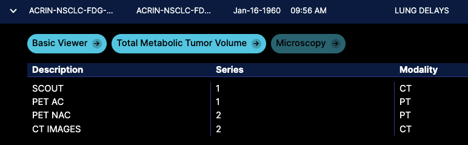
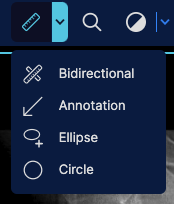

# Migration Guide

On this page, we will provide a guide to migrating from OHIF v2 to v3. Please note
that this document is a work in progress and will be updated as we move forward.
This document is not meant to be used as a migration recipe but as a migration overview.


# Introduction

## Importance of Migration

- Enhanced UX: the new design and UI of OHIF v3 provides a more intuitive and user-friendly experience.
  OHIF v3 adds an improved side panels and toolbar, and a new layout system that lets you customize
  the layout of your application.
- Improved Performance: OHIF v3 leverages the new Cornerstone3D rendering and tooling libraries, which
  significantly improve performance and provide a more robust and stable foundation for your application
  for rendering and interacting with medical images. Some of the new advanced features in Cornerstone3D
  include: OffScreen Rendering and GPU Acceleration for all viewports, streaming of the volume data, 3D annotations and measurements,
  sharing tool states between viewports and more.
- Improved Customizability: With addition of Modes and Extensions, OHIF v3 provides a more modular
  and customizable framework for building medical imaging applications, this will let you
  focus on your use case and not worry about the underlying infrastructure and also have less worry
  to keep up to date with the latest changes.
- Community driven Modes: OHIF v3 provides a gallery of modes that you can use as a starting point
  for your application. These
- Future-Proofing: By migrating to v3, you align your application with the latest advancements in the OHIF framework, ensuring ongoing support, updates, and access to new features.
- Community Support: OHIF v3 benefits from an active community of developers and contributors who provide valuable support, bug fixes, and continuous improvements.

## Migration Timeframe

The duration of the migration process can vary depending on factors such as the complexity of custom changes made in v2, familiarity with v3's architecture, and the size of the codebase.
If you don't have any custom changes in v2, the migration process should be relatively straightforward. If you have custom changes, you will need to update them to work with the new architecture and new
rendering and tooling engines.


## Complexity and Pain Points

Certain scenarios can make the migration process more complex and potentially introduce pain points:

- Extensive Customizations: If your v2 implementation includes extensive custom changes and overrides, adapting those customizations to the new structure and APIs of v3 may require additional effort and careful refactoring.
- UI Customizations: Since in OHIF v3 we moved our component library to Tailwind CSS
  if you have any custom UI components, you will need to migrate them to Tailwind CSS too, and this might be a bit time consuming.
- Hardware requirements: Since Cornerstone3D uses WebGL for rendering volumeViewport (although it has
  a CPU rendering fallback), you need to make sure that your target hardware supports WebGL. You can check
  if your hardware supports WebGL [here](https://get.webgl.org/). Also regarding the GPU requirements, you can check the tier of your GPU [here](https://pmndrs.github.io/detect-gpu/), if it is tier 1 and above, you
  should be good to go.

## Summary of Changes

OHIF v3 is a major re-architecture of the OHIF v2 to make it more modular and
easier to maintain. The main differences are:

- platform/viewer (@ohif/viewer) has been renamed to platform/app (@ohif/app) (explanation below)
- Extensions are available to be used by modes on request, but are still injected as module components.
- To use the modules provided by the extensions, you need to write a [Mode](../platform/modes/index.md). Modes
are configuration objects that will be used by the viewer to load the modules. This lets users to be able to use common extensions with different configurations, and enhances the customizability of the viewer.
- App configuration structure is different, mainly the `servers` is renamed to `dataSources`.
- Apps can be customized significantly more than previously by providing configuration code int he customizationModule section.
- The viewer UI is completely re-written in Tailwind CSS for better maintainability, although it is a WIP but
  already provides a better user experience.
- cornerstone-core and cornerstone-tools are removed and OHIF v3 is using the new Cornerstone3D rendering library and tools. Moving to Cornerstone3D has enabled us to provide a more robust and stable foundation
  for 3D rendering and 3D annotations and measurements. In addition, Cornerstone3D provides APIs to load
  and stream data into a volume which has huge performance benefits.
- A new CLI tool to help you create extensions and modes (more [here]((./development/ohif-cli.md)))
- redux store has been removed and replaced with a simpler state management system via React Context API.

New significant additions that might be useful for you that weren't available in OHIF v2:
- [OHIF CLI](../development/ohif-cli.md)
- [New Rendering Engine and Toolings](https://www.cornerstonejs.org/)
- [Modes](../platform/modes/index.md)
- [Mode Gallery](https://ohif.org/modes)
- [Layouts](../platform/extensions/modules/layout-template.md)
- [Data Sources](../platform/extensions/modules/data-source.md)
- [Hanging Protocols](../platform/services/data/HangingProtocolService.md)
- [URL Params](../configuration/url.md)

## Platform/viewer (@ohif/viewer) -> platform/app (@ohif/app)


To ensure proper versioning of OHIF v3, we have made a decision to rename the platform/viewer to platform/app. Previously, the platform/viewer package followed software engineering versioning (currently at v4.12.51). However, going forward, we aim to align the versioning of platform/app with the product version (e.g., v3.4.0, v3.5.0, etc.).

Since the platform/viewer (@ohif/viewer) is already at v4.12.51, we opted to rename it as platform/app to enable versioning in accordance with the product versioning approach. If you were utilizing any exports from @ohif/viewer, please update them to use @ohif/app instead.


## Configuration

:::tip
There are various configurations available to customize the viewer. Each configuration is represented by a custom-tailored object that should be used with the viewer to work effectively with a specific server. Here are some examples of configuration files found in the platform/app/public/config directory. Some server-specific configurations that you should be aware are: `supportsWildcard`, `bulkDataURI`, `omitQuotationForMultipartRequest`, `staticWado` (Read more about them [here](../configuration/configurationFiles.md)).

- default.js: This is our default configuration designed for our main server, which uses a Static WADO datasource hosted on Amazon S3.
- local_orthanc.js: Use this configuration when working with our local Orthanc server.
- local_dcm4chee.js: This configuration is intended for our local dcm4chee server.
- netlify.js: This configuration is the same as default.js and is used for deployment on Netlify.
- google.js: Use this configuration to run the viewer against the Google Health API.
:::

OHIF v3 has a new configuration structure. The main difference is that the `servers` is renamed to `dataSources` and the configuration is now asynchronous. Datasources are more abstract and
far more capable than servers. Read more about dataSources [here](../platform/extensions/modules/data-source.md).

- `StudyPrefetcher` is not currently supported in OHIF v3.
- The `servers` object has been replaced with a `dataSources` array containing objects representing different data sources.
- The cornerstoneExtensionConfig property has been removed, you should use `customizationService` instead (you can read more [here](../platform/services/ui/customization-service.md))
- The maxConcurrentMetadataRequests property has been removed in favor of `maxNumRequests`
- The hotkeys array has been updated with different command names and options, and some keys have been removed.
- New properties have been added, including `maxNumberOfWebWorkers`, `omitQuotationForMultipartRequest`, `showWarningMessageForCrossOrigin`, `showCPUFallbackMessage`, `showLoadingIndicator`, `strictZSpacingForVolumeViewport`.
- you should see if `supportsWildcard` is supported in your server, some servers don't support it and you need to make it false.

## Modes

As mentioned briefly above, modes are configuration objects that will be used by the viewer to load extensions.
This lets users to be able to use common extensions with different configurations. So as OHIF developers can focus on creating extensions while
you as the user can focus on creating modes having your own use case and configuration/initialization logic in mind.

Separating the configuration from the extensions also makes it so that you can
have multiple modes in a single application each focusing on certain tasks. For example, you can have a mode for segmentation which uses specific panels and tools which you don't need
for a mode that will be used for reading (read more about modes [here](../platform/modes/index.md))

:::info
Previously, the viewer was designed around registered extensions. If you had a specific use case, you had to duplicate the viewer code and incorporate your customizations through extensions. However, with the introduction of a new layer of abstraction called Modes, you no longer need to fork the viewer.

Modes provide a flexible approach where you can create your own mode and utilize the necessary extensions within that mode. This eliminates the need for duplicating the viewer codebase.

Furthermore, Modes offer the advantage of having multiple applications within a single viewer. For instance, you can have a mode dedicated to segmentation tasks and another mode focused on reading. Each mode can have its own unique configuration, initialization logic, layout, tools, and hanging protocols. This ensures a cleaner user interface in the viewer and an improved user experience overall.
:::

Upon entering a mode, the Viewer will register its declared extensions and load them. And you
can specify which modules you need from each extension in the mode configuration. For instance

```js

const ohif = {
  layout: '@ohif/extension-default.layoutTemplateModule.viewerLayout',
  sopClassHandler: '@ohif/extension-default.sopClassHandlerModule.stack',
  measurements: '@ohif/extension-default.panelModule.measure',
  thumbnailList: '@ohif/extension-default.panelModule.seriesList',
};

const cs3d = {
  viewport: '@ohif/extension-cornerstone.viewportModule.cornerstone',
};

const tmtv = {
  hangingProtocol: '@ohif/extension-tmtv.hangingProtocolModule.ptCT',
  petSUV: '@ohif/extension-tmtv.panelModule.petSUV',
  ROIThresholdPanel: '@ohif/extension-tmtv.panelModule.ROIThresholdSeg',
};

function modeFactory({ modeConfiguration }) {
  routes: [
    {
      path: 'tmtv',
      layoutTemplate: ({ location, servicesManager }) => {
        return {
          id: ohif.layout,
          props: {
            // leftPanels: [ohif.thumbnailList],
            rightPanels: [tmtv.ROIThresholdPanel, tmtv.petSUV],
            viewports: [
              {
                namespace: cs3d.viewport,
                displaySetsToDisplay: [ohif.sopClassHandler],
              },
            ],
          },
        };
      },
    },
  ],
}
```

In the example above, we are using the `tmtv` mode which is a mode for reading PET/CT scans
and as you can see we are specifying the layout, the panels and the viewports that we need
for this mode. The `tmtv` mode is using the `cs3d` extension for rendering and the `ohif` extension. As you see you can reference the modules from the extensions using the `namespace` via strings. So for instance, if you need to use the `viewportModule` from the `@ohif/extension-cornerstone` you can use `@ohif/extension-cornerstone.viewportModule.cornerstone` as the namespace.

:::tip
`ExtensionManager` will register and load the modules from the extensions and make them available to the viewer by their namespaces.
:::

Below you can see a screen shot from the demo showcasing 3 modes for the opened study.



:::tip
How do I decide certain thing should go inside a mode or extension, Here are some considerations to help you make the decision:

- **Functionality Scope**: If the functionality is specific to a particular use case or task within your viewer, it is often best suited to be included within a mode. Modes allow you to create customized configurations, layouts, panels, tools, and other components specific to a particular task or workflow. This includes which tool to be active by default, which panels to be displayed, and which layout to be used.

- **Reusability**: If the functionality can be used across multiple modes, it is better to implement it as an extension. Extensions provide a modular approach where you can encapsulate and share functionality across different modes. For instance, if you have a custom panel that you want to use in multiple modes, you can implement it as an extension and include it in
  the mode configuration.

- **Complexity**: If the functionality requires significant customizations, complex logic, or extensive modifications to the viewer's core behavior, it might be better suited as an extension.

- **New Service**: If you are writing a new service, it is preferable to implement it as an extension. Services are used to provide a common interface for interacting with external systems and data sources.
There is a new way to register new services which are extendible by other extensions.

Remember that there is no strict rule for deciding between modes and extensions. It's a matter of understanding the specific requirements of your application.

:::


## Routes

In OHIF v2 a study was loaded and mounted on `/viewer/:studyInstanceUID` route. In OHIF v3
we have reworked the route registration to enable more sophisticated routing. Now, Modes are tied to specific routes in the viewer, and multiple modes/routes can be present within a single application, making "routes" configuration the most important part of mode configuration.

- Routes with a dataSourceName: ${mode.id}/${dataSourceName}
- Routes without a dataSourceName: ${mode.id} which uses the default dataSourceName

This makes a mode flexible enough to be able to connect to multiple datasources
without rebuild of the app for use cases such as reading from one PACS and
writing to another.

<details>
<summary>
Can I register a custom route to OHIF v3?
</summary>

Yes, you can take advantage of the customizationService and register your own routes.
see [custom routes](../platform/services/ui/customization-service.md#customroutes)


</details>


## DICOM Endpoints

In OHIF v3 there is a new end point that your DICOM server should be able to respond to
`WADO-RS GET studies/{studyInstanceUid}/series`

This is used in the viewer for fetching the series list for a study to use for the hanging protocol.

## LifeCycle Hooks

OHIF v2 had `preRegistration` hook for extensions for initialization. In OHIF v3 you have
even more control using `onModeEnter` and `onModeExit` hooks on the extensions and on the modes.

- `preRegistration`: is called before the extension is registered to the viewer. So very early in the lifecycle of the viewer.
- `onModeEnter` is called when the mode is entered (component on the route is mounted, e.g., when you click on the mode to enter it)
- `onModeExit` is called when the mode is exited (component on the route is unmounted, e.g., when you navigate back to the worklist)

## Extensions

Since extensions in OHIF v2 were the main way of customizing the viewer, we will spend some time
below to explain how you can migrate your extensions to OHIF v3.

### Default Extension

Lots of common functionalities in the platform/core has been moved inside
the `@ohif/extension-default` extension. This extension is loaded by default
in the viewer and it provides the following functionalities:

- common datasources such as DICOMWeb, DICOMLocal, and DICOMJSON datasource.
- default measurement panel and panel study browser
- common toolbar button layouts
- common hanging protocol configurations

<details>
<summary>
how can I integrate to my google health api? is there support for that?
</summary>

You can right now, take a look into our google configuration that we use for our QA located at
`config/google.js`. Also we have some exciting UI changes coming up for the next release
that will make it easier to integrate with google health api.
</details>

<details>
<summary>
Is there any recommendation for PACS integration
</summary>

You can take a look at open source PACS such as dcm4chee or orthanc. We have support for them. Also
we have a new static wado datasource that you can use to take benefit of new deduplicated metadata
and caching features.

</details>

### Cornerstone Extension

In OHIF v2, the Cornerstone extension provided modules like Cornerstone ViewportModule, ToolbarModule, and CommandsModule for controlling viewport actions.
It relied on `react-cornerstone-viewport` for rendering viewports, `cornerstone-tools` for tools, and `cornerstone-core` for core functionalities.

However, in OHIF v3, there have been significant changes. The rendering and tooling logic has been migrated to a new library called [`Cornerstone3D`](https://github.com/cornerstonejs/cornerstone3D-beta/). This means that all viewport rendering and tool functionalities are now handled by Cornerstone3D.

Additionally, in OHIF v3, the native support for 3D functionalities previously provided by the `vtk` extension has been integrated into Cornerstone3D. As a result, any vtkjs logic is encapsulated on CS3D. Things now are much more cleaner and simpler.

To migrate from OHIF v2 to OHIF v3:

#### Loading

Previously we used `cornerstone-wado-image-loader` for loading images. However, we have fully switched the a new
library called `@cornerstonejs/dicom-image-loader` which is a fork of `cornerstone-wado-image-loader` with typescript support and bug fixes.
We have deprecated `cornerstone-wado-image-loader` and you should also switch to `@cornerstonejs/dicom-image-loader` as well.
The process is very simple, you can follow this [PR](https://github.com/OHIF/Viewers/pull/3339) to see how we have migrated.

There is also a new loader and package `@cornerstonejs/streaming-image-volume-loader`, which provides streaming of the image data
into a volume using web workers and web assembly. You can look into the cornerstone documentation and read more about the
volumeViewport and volumeLoader.


#### Rendering

The significant difference between cornerstone-core and cornerstone3D is that cornerstone3D fully utilizes
[vtk.js](https://kitware.github.io/vtk-js/) for rendering, however in cornerstone-core we used a mix of webGL and vtk
for rendering. While you don't need to do a migration for this, you should be aware that the rendering is now fully performed in the
world coordinate system and the image is placed in the world coordinate system using the `imagePositionPatient` and `imageOrientationPatient`
attributes of the image. This means that you can now share the tool states between multiple viewports and you can also
use the same tool states for 2D and 3D viewports.

:::tip

In OHIF v3, we have removed the OHIF's vtk extension and migrated all the 3D functionalities to Cornerstone3D.

Also you need to remove any dependencies on `react-cornerstone-viewport`, `cornerstone-tools`, and `cornerstone-core`.
:::

#### Tools

If you don't have any custom tools, you most likely won't need to make any changes as have tried
to migrate all the tools from `cornerstone-tools` to Cornerstone3D (except `ROIWindowLevel` which is work in progress right now).

Cornerstone3D has moved the coordinate system of tools to the world coordinate system enabling sharing
tool states between multiple viewports, and as a result the toolData is now stored in the world coordinate system as well.
So to migrate your tools, you will need to update your toolData to be stored in the world coordinate system. You can look
into the simplest tool for instance LengthTool in both `cornerstone-tools` and `cornerstone3D` to see the difference.


By following these steps, you can leverage the improved rendering and tooling capabilities of Cornerstone3D and eliminate the need for the old ohif's vtk extension in OHIF v3.


<details>
<summary>
Is there any name standard for modes and extensions?
</summary>

No naming standard, you can have your organization name as a prefix for your modes and extensions as we
do for ohif (`@ohif/extension-*` and `@ohif/mode-*`).

</details>


<details>
<summary>
What happens if I have create a mode with same name as existing one
</summary>

You shouldn't. Modes are configuration objects that you can simply. There is no real use case
for creating a mode with same name as existing one. If you do so, the last one will override the previous one


</details>


<details>
<summary>
How to remove an "core" extension/mode?
</summary>

You can use the OHIF cli tool to add/remove/link and unlink extensions and modes. You can find more information
about the cli tool [here](../development/ohif-cli.md)

</details>

<details>
<summary>
If I have vtkjs implementation how can I port it? Should I create a specific extension for that?
</summary>

Cornerstone3D has support for some vtk.js actor and mappers including imageData, polyData and volume. If you have another
implementation of vtk.js actor or mapper, you might be able to use `viewport.addActor` to include it in the rendering
pipeline, but depending on the implementation and how much it interfere with the cornerstone3D rendering pipeline, you might
not get the expected result.

</details>


### DICOM Segmentation & DICOM RT

In OHIF v3, the equivalent extensions for RT and SEG exists with similar logic, but with various improvements such as
enhanced ui/ux for segmentation panel, faster loading and interaction, and better support for multiple viewports,
animations for jump to segment, volumetric rendering, and more. Additionally, OHIF v3 introduces new functionalities with the SEG Viewport and RT Viewport.

:::tip

In OHIF v3, Segmentation objects
are loading using the frame of reference by default which means that if there are two viewports that are using the same frame of reference,
if you load a segmentation (labelmap or RT) which lives in the same frame of reference, it will be loaded in both viewports.
:::

When loading a series that contains SEG (Segmentation) or RT (RT Structure Set) data, the viewport will automatically
switch to the corresponding SEG or RT viewport. The user will then be prompted to decide whether to load the segmentation
or RT structure set into the viewer. This new feature addresses a common use case in which there are multiple segmentation
series in a study, and the user only wants to load specific ones. In OHIF v3, the Segmentations are all loaded
as 3D volumes and as a result a volume viewport is used to display them. (Stack Segmentation in Cornerstone3D is still a
work in progress.)

In OHIF v2, the user had to load all the segmentation series and then manually delete the ones they didn't want to see.
However, in OHIF v3, the user has more control. The temporary SEG or RT viewport does not immediately load (hydrate)
the segmentation or RT structure set. Instead, the user can decide which ones to load, reducing unnecessary
loading and providing a more efficient workflow.

This enhancement in OHIF v3 allows users to selectively load specific segmentations or RT structure sets,
improving the usability and efficiency of the viewer when working with multiple SEG or RT series.


<details>
<summary>
Can I load one seg in one viewport and another in another viewport?
</summary>

If there is another viewport in the grid that is using the same frame of reference, the segmentation will be loaded in that viewport as well.

However, since we split the concept of `load` (`hydration`) and `preview`, you can use the preview (not load), which
makes sure the SEG is contained within the viewport, but it is not hydrated so you cannot edit it.

In future however, we will add more controls over, hiding the segmentation in other viewports via UI, however, you can
right now do it via code.


</details>

<details>
<summary>
Does it support nifti?
</summary>

Nifit support for both image and segmentation is coming soon. We are working on it.


</details>

### DICOM SR

In OHIF v2, DICOM SR functionality was integrated into the Cornerstone extension. However, in OHIF v3, DICOM SR is now a separate extension. The DICOM SR extension in OHIF v3 retains the same loading and hydrating logic using dcmjs adapters. Additionally, it introduces a new type of viewport called the SR Viewport, which is used to display SR data.

Similar to the temporary SEG and RT viewports, when a SR display set is selected in OHIF v3, the user is prompted to decide whether to load the SR data into the viewer and initiate the tracking. The SR viewport allows the user to switch between different measurements within the SR instance by utilizing the arrow buttons located at the top of the viewport.

:::tip
This separation of DICOM SR into its own extension in OHIF v3 provides a dedicated viewport type for SR data and offers enhanced functionality for interacting with SR measurements within the viewer.
:::


### DICOM Tag Browser

In OHIF v2, the DICOM Tag Browser was a separate extension that provided a dedicated user interface for exploring DICOM tags. However, in OHIF v3, we have integrated the DICOM Tag Browser functionality into the `default` extension.

The DICOM Tag Browser is a powerful tool for debugging and inspecting DICOM metadata, and we wanted to make it easily accessible to users. As a result, it is now available as a toolbar icon within the `default` extension. This allows users to conveniently access the DICOM Tag Browser directly from the toolbar, eliminating the need for a separate extension.


<details>
<summary>
Now that dicom tag is integrated back to default extension, how can I port my code that was implemented in the old extension? Should I create an extension or change directly into default?
</summary>

If you have a custom tag browser, you have two options, either modify the default tag browser (if you think the features
you added is useful for everyone, feel free to open a PR!), or create your own extension with your custom tag browser
which then you can add to the toolbar.


</details>


### DICOM HTML

Since we have added graphical overlay of DICOM SR in OHIF v3, we have temporarily downgraded the priority of displaying DICOM HTML within the viewer. While DICOM HTML support is not available in the current version of OHIF v3, we acknowledge its importance and plan to reintroduce this functionality in future updates.


<details>
<summary>
is there any easy way for supporting my own dicom html viewer? Should I use extension?
</summary>

Yes, you can write your own sopClassHandler and custom viewport in your custom extensions.
After, you need to associate that with the viewport that you
will use in the mode configuration, this way when that sopClassUID is requested it will use your custom viewport.


</details>


### DICOM Microscopy

In OHIF v2, the DICOM microscopy engine was based on an older version of the [DICOM microscopy viewer](https://github.com/ImagingDataCommons/dicom-microscopy-viewer) maintained by our friends at IDC (Imaging Data Commons). However, in OHIF v3, we have upgraded to the latest version of the DICOM microscopy viewer. This new version offers significant improvements in terms of robustness and performance, providing users with an enhanced microscopy viewing experience.

One notable addition in the latest DICOM microscopy viewer is the support for annotations within the whole slide images (SM images). This feature allows users to annotate and mark specific regions of interest directly within the microscopy images.

:::tip
Looking ahead, our future plans include adding DICOM SR (Structured Reporting) support for export of annotations in microscopy images. While we will enhance our support for SM images (color profiles etc.), we recommend utilizing the [SLIM Viewer](https://github.com/ImagingDataCommons/slim) developed by IDC for more sophisticated microscopy use cases.
:::


## Extension Modules


v3 Extension is likely the same as in v2. Extensions can (like before) have
modules exported via `get{ModuleName}Module` (e.g., `getViewportModule`).

:::info
There are new
types of modules that can be exported from extensions (such as `HangingProtocolModule`, `LayoutModule`, read more about
modules in v3 [here](../platform/extensions/index.md)).
:::

The main difference between v3 and v2 is that exported modules were represented as a single object, whereas in OHIF v3, they are
represented as an array of objects, each having a name property. This change was implemented to
enable extensions to export multiple named submodules, providing more flexibility and modularity.

To access these modules in OHIF v3, you can use the namespace provided by the `ExtensionManager`. For example, consider the following code snippet


```js
getUtilityModule({ servicesManager }) {
  return [
    {
      name: 'common',
      exports: {
        getCornerstoneLibraries: () => {
          return { cornerstone, cornerstoneTools };
        },
        getEnabledElement,
        dicomLoaderService,
        registerColormap,
      },
    },
    {
      name: 'core',
      exports: {
        Enums: cs3DEnums,
      },
    },
    {
      name: 'tools',
      exports: {
        toolNames,
        Enums: cs3DToolsEnums,
      },
    },
  ];
},
```


In this example, the extension is exporting multiple submodules named 'common',
'core', and 'tools'. To access the 'common' submodule provided by the @ohif/extension-cornerstone extension,
you can use the following code:

```js
extensionManager.getModuleEntry(
  '@ohif/extension-cornerstone.utilityModule.common'
);
```

This allows you to access the specific submodule provided by the extension and utilize its functionalities within your application.


<details>
<summary>
How can I have a lazy-loaded component and import it from another extension?
</summary>

If an extension is exporting a component, you can import it from another extension. For example, if you have an extension that exports a component called `MyComponent`, you can import it from another extension like this:

```js
import { MyComponent } from '@ohif/extension-my-extension';
```


</details>


### ToolbarModule

In OHIF v2, the toolbarModule was used to add buttons to the toolbar. For example, the following code snippet demonstrates adding a zoom tool button to the toolbar:

In OHIF v2

```js
{
  id: 'Zoom',
  label: 'Zoom',
  icon: 'search-plus',
  //
  type: TOOLBAR_BUTTON_TYPES.SET_TOOL_ACTIVE,
  commandName: 'setToolActive',
  commandOptions: { toolName: 'Zoom' },
},
```

However, in OHIF v3, the toolbarModule has been repurposed to define different button types. For instance, OHIF v3 introduces the ohif.radioGroup and ohif.splitButton button types, which provide more flexibility in defining toolbar buttons for each mode.


```js
{
  name: 'ohif.radioGroup',
  defaultComponent: ToolbarButton,
  clickHandler: () => {},
},
{
  name: 'ohif.splitButton',
  defaultComponent: ToolbarSplitButton,
  clickHandler: () => {},
},
```

To use these button types within your modes, you can define the buttons in your mode's configuration. In the onModeEnter hook, you can add the defined buttons to the toolbar using the toolbarService. Here's an example of how to add buttons to the toolbar:


```js
// toolbar button
{
  id: 'Zoom',
  type: 'ohif.radioGroup',
  props: {
    type: 'tool',
    icon: 'tool-zoom',
    label: 'Zoom',
    commands: _createSetToolActiveCommands('Zoom'),
  },
},
```

and in `onModeEnter`

```js
onModeEnter: ({ servicesManager, extensionManager, commandsManager }) => {
  const {
    toolbarService,
    toolGroupService,
  } = servicesManager.services;

  // Init tool groups (see cornerstone3D for more details)
  initToolGroups(extensionManager, toolGroupService, commandsManager);

  toolbarService.addButtons(toolbarButtons);
  toolbarService.createButtonSection('primary', [
    'MeasurementTools',
    'Zoom',
    'WindowLevel',
    'Pan',
    'Capture',
    'Layout',
    'Crosshairs',
    'MoreTools',
  ]);
},
```

By using the updated toolbarModule in OHIF v3, you can define and add toolbar buttons specific to each mode, providing greater flexibility and customization options for the toolbar configuration.

An example of split button icon in v3 is shown below



<details>
<summary>
Is the tool state shared between two different modes?
</summary>
No, the tool state is not shared between different modes in OHIF v3. Each mode operates independently and maintains its own tool state.

</details>

<details>
<summary>
I have a custom icon. How can I add it to the toolbar?
</summary>

You need to first register it via `addIcon` in the src/components/Icon, and then you can
referenced it by name in the toolbar configuration for mode
</details>


<details>
<summary>
Can I change the toolbar's location? Can I add a secondary toolbar?
</summary>
Not in our default layout, but you can write your own layout in your custom extension
and use it instead of the default one.

</details>

<details>
<summary>
Can I have different tool sets for each viewport?
</summary>

We don't have fully support for this yet, but we have plans for it. Basically, the plan
is to use the viewport action bar in the top of the viewport to provide viewport-specific
tool sets.
</details>

<details>
<summary>
Are all tools from v2 support in v3?
</summary>

Almost all with the exception of ROIWindow, but we have plans to add it in the future. However, there are
much more tools in v3 that are not available in v2 such as referenceLines, Stack Image Sync, and
Calibration tool.
</details>

### CommandsModule

The structure of the commands module is the same as before. The only difference is that
we use Cornerstone3D for rendering and tools. So, if you have a custom command that you were
using in the v2, you need to migrate it to the new Cornerstone3D API.

You can visit the migration guide for cornerstone  [here](https://www.cornerstonejs.org/docs/migrationGuides).

### PanelModule

Previously in OHIF v2 you had

```js
return {
  menuOptions: [
    {
      icon: 'list',
      label: 'Segmentations',
      target: 'segmentation-panel',
      stateEvent: SegmentationPanelTabUpdatedEvent,
    },
  ],
  components: [
    {
      id: 'segmentation-panel',
      component: ExtendedSegmentationPanel,
    },
  ],
  defaultContext: ['VIEWER'],
};
```

but in OHIF v3 you have

```js
return [
  {
    name: 'panelSegmentation',
    iconName: 'tab-segmentation',
    iconLabel: 'Segmentation',
    label: 'Segmentation',
    component: wrappedPanelSegmentation,
  },
];
```

<details>
<summary>
How can I add my own custom panel?
</summary>
To add your own custom panel in OHIF v3, you can follow these steps:

- Create a new React component that represents your custom panel.
- Provide it in the getPanelModule of your extension.
- Inside your mode, add the panel namespace to the mode's configuration for the layout module.

</details>

<details>
<summary>
How to enhance an existing panel?
</summary>
To enhance an existing panel in OHIF v3, you can create a new React component that extends or wraps the existing panel component. In your enhanced component, you can add additional functionality, modify the appearance, or incorporate new features specific to your use case. You can also look into the customizationService to see
how you can use the registered points to customize the panel.

</details>

<details>
<summary>
How to change the order of appearance of panels?
</summary>
To change the order of appearance of panels in OHIF v3, you can modify the panel layout configuration in the mode configuration. The panel layout configuration specifies the order and arrangement of panels within the viewer interface.

</details>

<details>
<summary>
Is there a way to change the viewer layout to present right panels on the left and the toolbar on the right?
</summary>
Not with our default layout which the default extension provides. However, you can write a new layout and provide it
in the `getLayoutModule` which you can reference in the `layout` property of the mode configuration.
</details>

### SopClassHandlerModule

The least changed module is the SopClassHandlerModule, although this now returns
an array instead of a single instance. The purpose of this module is to create
a list of displaySets based on the metadata.  OHIF App uses this module to
create one or more displaySets for each series.
The displaySet is then used to then get assigned
on each viewport and the viewport renders the image.

The `DisplaySet` created by the handler can have a member function `addInstances`
which will update the display set with new SOP instance data, allowing the
preservation of the display set UID when required.

Multiple display sets will be returned when different parts of the series are
to be shown separately, for example, to split scout images from volume images.


### ViewportModule

In OHIF v3, viewports are tied to series of SOP Class UIDs (sopClassUIDs). Each extension provides its own viewport for specific SOP Class UIDs, and you can choose which viewports and SOP Class UIDs your mode can handle in the mode configuration.

For example, in the longitudinal mode configuration, there are multiple viewports specified along with their associated SOP Class Handler Modules:


```js
viewports: [
  {
    namespace: '@ohif/extension-measurement-tracking.viewportModule.cornerstone-tracked',
    displaySetsToDisplay: [ '@ohif/extension-default.sopClassHandlerModule.stack'],
  },
  {
    namespace: '@ohif/extension-cornerstone-dicom-sr.viewportModule.dicom-sr',
    displaySetsToDisplay: [ '@ohif/extension-cornerstone-dicom-sr.sopClassHandlerModule.dicom-sr'],
  },
  // additional viewports
],
```

In this example, there are six viewports specified, each identified by a unique namespace. Each viewport is associated with a specific SOP Class Handler Module through the displaySetsToDisplay property.

To add a new viewport, you would need to create a new SOP Class Handler Module and a new Viewport Module. The SOP Class Handler Module handles the logic for loading and handling specific SOP Class UIDs, while the Viewport Module defines the rendering and behavior of the viewport.

In addition to the viewports, the mode configuration should include and register each SOP Class Handler Module that your mode can handle:


```js
sopClassHandlers: [
  '@ohif/extension-default.sopClassHandlerModule.stack',
  '@ohif/extension-cornerstone-dicom-sr.sopClassHandlerModule.dicom-sr',
  '@ohif/extension-dicom-video.sopClassHandlerModule.dicom-video',
  '@ohif/extension-dicom-pdf.sopClassHandlerModule.dicom-pdf',
  '@ohif/extension-cornerstone-dicom-seg.sopClassHandlerModule.dicom-seg',
  '@ohif/extension-cornerstone-dicom-rt.sopClassHandlerModule.dicom-rt',
]
```

Here, each SOP Class Handler Module is specified with its namespace.

By configuring the viewports and SOP Class Handler Modules in your mode, you can define how your mode interacts with different types of DICOM data and specify the appropriate rendering and behavior for each SOP Class UID.

## Metadata Store and Provider

In OHIF v2, we utilized the `platform/core/classes/metadata` module, which included the classes StudyeMetadata, SeriesMetadata, and InstanceMetadata for storing metadata. However, in OHIF v3, we have replaced these classes with a more versatile metadata store called `DICOMMetadataStore`. This new metadata store is used by each datasource to store the metadata associated with studies, series, and instances. The DICOMMetadataStore API allows you to add study/series/instance metadata to the store and retrieve metadata from it.

Although we have transitioned to using DICOMMetadataStore as the primary metadata storage mechanism, you still have access to OHIF's MetadataProvider. The MetadataProvider can be found in the same `platform/core/classes` location. The MetadataProvider is internally used to retrieve instance-based metadata based on UIDs, perform queries, and includes some legacy support for older versions of the loading logic.


## Build

We have recently transitioned from bundling all the extensions and the viewer into a single bundle to a more modular approach. In this new approach, the required extensions are dynamically loaded inside a mode as needed. This change brings several advantages, including:

- Faster build time: Bundling only the necessary extensions reduces the build time, as you no longer need to bundle all extensions upfront.
- Smaller bundle size: By loading extensions on-demand, the initial bundle size is reduced, resulting in faster page load times for users.
- Faster reload for development: During development, the incremental build process allows for faster reloads, improving developer productivity.

This new approach does not impact the deployment process of the viewer. You can continue to follow our deployment guides, such as the [Build for Production](../deployment/build-for-production.md) guide, to deploy the viewer effectively.


### Script tag usage of the OHIF viewer

With the transition to more advanced visualization, loading, and rendering techniques using WebWorkers, WASM, and WebGL, the script tag usage of the OHIF viewer has been deprecated. However, if you still prefer to use the script tag usage, it is theoretically possible to bundle all the required dependencies and utilize the script tag approach.

An alternative option for script tag usage is to employ an `iframe`. You can utilize the iframe element to load the OHIF viewer and establish communication with it using the postMessage API. This allows you to exchange messages and data between the parent window and the iframe, enabling interaction and coordination with the OHIF viewer embedded within the iframe.

Please note that while these alternatives exist, we recommend utilizing modern development practices and incorporating OHIF viewer within your application using a more modular and integrated approach, such as leveraging bundlers, and import statements to ensure better maintainability, extensibility, and compatibility with the OHIF ecosystem.


<details>
<summary>
I use OHIF v2 in an iframe. Is there any impediment for v3?
</summary>
No, there is no impediment for using OHIF v3 in an iframe. OHIF v3 is designed to be compatible with iframe usage, allowing you to embed the viewer within other applications or web pages seamlessly. You can still communicate with the OHIF v3 viewer using the postMessage API to exchange information and trigger actions between the parent window and the embedded iframe.

</details>


<details>
<summary>
Does the build support dynamic imports? How can I use it?
</summary>
Yes, the build configuration in OHIF v3 supports dynamic imports. Dynamic imports allow you to asynchronously load modules or components on demand, improving performance and reducing the initial bundle size. In fact we are using this method for our viewport components. In general you can:

```
import('path/to/module').then((module) => {
  // Use the imported module here
}).catch((error) => {
  // Handle any error that occurs during dynamic import
});
```

By using dynamic imports, you can selectively load modules or components at runtime when they are needed, enhancing the efficiency and responsiveness of your application.  However, note
that these components must be available at BUILD time, and cannot be updated after
build.

</details>

<details>

<summary>
How can I enhance the existing build to consume my own webpack script?
</summary>
You can't enhance the existing build to consume your own webpack script as of now. However, you can
modify the webpack.base.js and webpakc.pwa.js files to add your own webpack script/modules if needed.

</details>

## UI Components

Migrating to Tailwind CSS, OHIF v3 is now able to have a component-oriented styling approach, speeding up development, ensuring consistent styling, making responsive design easier, and enabling extensibility

We have gone through extensive re-design of each part of the UI, and we have also added new components to the OHIF viewer.

<details>
<summary>
I have a huge complex styles using native CSS, how can I reuse them?
</summary>
You can leverage the power of Tailwind CSS (https://TailwindCSS.com/) in OHIF v3 to reuse your existing styles. Tailwind CSS is a utility-first approach, allowing you to create reusable CSS classes by composing utility classes together. You can migrate your existing styles to Tailwind CSS by breaking them down into utility classes and utilizing the extensive set of predefined utilities provided by Tailwind CSS.

</details>

<details>
<summary>
How can I change the page color from being purplish to blueish?
</summary>
In OHIF v3, you can easily modify the page color by customizing the Tailwind CSS configuration. You can locate the tailwind.config.js file in your project and update the theme section, specifically the colors property, to define your desired color palette. By adjusting the values for the colors, you can change the page color to any shade of blue or other colors according to your preference.

</details>

<details>
<summary>
Can I have my own React UI component working in the application? Is there a way to use the current build for it as well?
</summary>
Yes, you can integrate your own React UI components seamlessly into the OHIF v3 application. You can even have external
UI dependencies and by creating your own component inside your extensions and importing it into the application, you can
use it as if it was part of the OHIF v3 application.

</details>

<details>
<summary>
How can I replace the existing component ui/tooltip?
</summary>
You need to write your own component, and inside your mode layout you can replace the existing component with your own.
As of now, for the tooltip component, you need to use the customizationService to customize it; however, the customizationService
requires a registration of the to-be-customized property before you can customize it. Read more about customizationService.

</details>

<details>
<summary>
How can I add/consume logos/images/icons?
</summary>

For logos you can use the whiteLabelling inside the configuration. However, if you need a more complex UI for your toolbar
you need to create you own layout. See `getLayoutModule`.

</details>

## Redux store

In OHIF v3, we made the decision to move away from the Redux store and adopt a new approach utilizing React context providers and services with a pub/sub pattern. This shift was driven by the need for a more flexible and scalable architecture that better aligns with the plugin and extension system of OHIF. This offers

- Modularity and Scalability: Context providers and services enable a modular architecture for easy addition and removal of plugins and extensions.
- Reduced Boilerplate: eliminate Redux boilerplate for simpler development.
- Flexible Pub/Sub Pattern: Services provide a pub/sub pattern for inter-component communication.

<details>

<summary>
Now that redux store is gone, how can I access the user information?
</summary>

You can use the `authenticationService` for that purpose.

</details>
