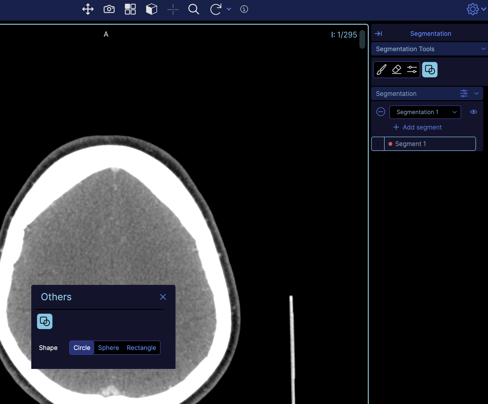

# Module: Toolbar

An extension can register a Toolbar Module by defining a `getToolbarModule`
method. `OHIF-v3`'s `default` extension (`"@ohif/extension-default"`) provides the
following toolbar button `uiTypes`:

- `ohif.radioGroup`: which is a simple button that can be clicked
- `ohif.splitButton`: which is a button with a dropdown menu
- `ohif.divider`: which is a simple divider

## Example Toolbar Module

The Toolbar Module should return an array of `objects`. There are currently a
few different variations of definitions, each one is detailed further down.
There are two things that the toolbar module can provide, first
a component, and second evaluators.

### Components
```js
export default function getToolbarModule({ commandsManager, servicesManager }) {
  return [
    {
      name: 'ohif.radioGroup',
      defaultComponent: ToolbarButton,
      clickHandler: () => {},
    },
    {
      name: 'ohif.splitButton',
      defaultComponent: ToolbarSplitButton,
      clickHandler: () => {},
    },
    {
      name: 'ohif.layoutSelector',
      defaultComponent: ToolbarLayoutSelector,
      clickHandler: (evt, clickedBtn, btnSectionName) => {},
    },
    {
      name: 'ohif.toggle',
      defaultComponent: ToolbarButton,
      clickHandler: () => {},
    },
  ];
}
```

### Custom Components

You can also create your own extension, and add your new custom tool appearance
(e.g., split horizontally instead of vertically for split tool). Simply add
`getToolbarModule` to your extension, and pass your tool react component to its
`defaultComponent` property in the returned object. You can use `@ohif/ui`
components such as `IconButton, Icon, Tooltip, ToolbarButton` to build your own
component.

```js
import myToolComponent from './myToolComponent';

export default function getToolbarModule({ commandsManager, servicesManager }) {
  return [
    {
      name: 'new-tool-type',
      defaultComponent: myToolComponent,
      clickHandler: () => {},
    },
  ];
}
```

Check out how to assemble the toolbar in the [modes](../../modes/index.md) section.


### Evaluators
Buttons may be equipped with evaluators, which are functions invoked by the toolbarService to assess the button's status. These evaluators are expected to return an object of `{className}` and may include additional details, as elaborated in the subsequent section.

Evaluators play a crucial role in determining the button's status based on the viewport. For example, users should be restricted from clicking on the mpr if the displaySet is not reconstructable. Additionally, certain buttons within the toolbar may be associated with specific toolGroups and should remain inactive for certain viewports.

Let's look at one of the evaluators (for `evaluate.cornerstoneTool`)

```js
 {
  name: 'evaluate.cornerstoneTool',
  evaluate: ({ viewportId, button }) => {
    const toolGroup = toolGroupService.getToolGroupForViewport(viewportId);

    if (!toolGroup) {
      return;
    }

    const toolName = getToolNameForButton(button);

    if (!toolGroup || !toolGroup.hasTool(toolName)) {
      return {
        disabled: true,
        className: '!text-common-bright ohif-disabled',
      };
    }

    const isPrimaryActive = toolGroup.getActivePrimaryMouseButtonTool() === toolName;

    return {
      disabled: false,
      className: isPrimaryActive
        ? '!text-black bg-primary-light'
        : '!text-common-bright hover:!bg-primary-dark hover:!text-primary-light',
    };
  },
},
```

as you can see the job of this evaluator is to determine if the button should be disabled or not. It does so by checking the `toolGroup` and the `toolName` and then returns an object with `disabled` and `className` properties.

The following evaluators are provided by us:

- `evaluate.cornerstoneTool`: If assigned to a button (see next), it will make the button react to the active viewport state based on its toolGroup.
-  `evaluate.cornerstoneTool.toggle`: It is designed to consider tools with toggle behavior, such as reference lines and image overlay (either on or off).
-  `evaluate.cornerstone.synchronizer`: This is designed to consider the synchronizer state of the viewport, whether it is synced or not.
-  `evaluate.viewportProperties.toggle`: Some properties of the viewport are toggleable, such as invert, flip, rotate, etc. By assigning this evaluator to those buttons, they will react to the active viewport state based on its properties. This allows for dynamic buttons that change their appearance based on the active viewport state.
- `evaluate.mpr`: special evaluator for MPR since it needs to check if the displaySet is reconstructable or not.


Sometime you want to use the same `evaluator` for different purposes, in that case you can use an object
with `name` and `options` properties. For example, in `'evaluate.cornerstone.segmentation'` we use
this pattern, where multiple toolbar buttons are using the same evaluator but with different options (
  in this case `toolNames`
)

```js
{
  name: 'evaluate.cornerstone.segmentation',
  options: {
    toolNames: ['CircleBrush' , 'SphereBrush']
  },
},
```

#### Group evaluators
Split buttons (see in [ToolbarService](../../services/data/ToolbarService.md) on how to define one) may feature a group evaluator, we provide two of them and you can write your own.


- `evaluate.group.promoteToPrimaryIfCornerstoneToolNotActiveInTheList`: determine the outcome of user interactions with the split buttons on what button should be promoted to the primary section. In the example above, the cornerstone tool's status is checked, and if it is not active in the list of buttons, the button is promoted to the primary section.
- `evaluate.group.promoteToPrimary`: disregarding the cornerstone tool's status and promoting the button to the primary section regardless.

Failure to specify a group evaluator will result in no action, leaving the button in the secondary section.

:::note
As you have learned so far, the extension modules only 'provides' the functionality
and it is the mode's job to consume it. You can next learn how to consume these components
and evaluators to build a toolbar in the
:::


#### Custom Evaluators
You can create your own evaluators. For instance, you have the option to design tri-state buttons, which are buttons with three states such as Show All, Show Some, or Show None of the Viewport Overlays.


## Toolbar buttons consumed in modes
Providing just the components is not enough. You need to add the buttons to the toolbar service and decide which ones are used for each section.

Below we can see a simplified version of the `longitudinal` (basic viewer) mode that shows how
a mode can add buttons to the toolbar by calling
`ToolBarService.addButtons(toolbarButtons)`. `toolbarButtons` is an array of
`toolDefinitions` which we will learn next.

```js
function modeFactory({ modeConfiguration }) {
  return {
    id: 'viewer',
    displayName: 'Basic Viewer',

    onModeEnter: ({ servicesManager, extensionManager }) => {
      const { toolBarService } = servicesManager.services;

      toolbarService.addButtons([...toolbarButtons, ...moreTools]);
      toolbarService.createButtonSection('primary', [
        'MeasurementTools',
        'Zoom',
        'info',
        'WindowLevel',
        'Pan',
        'Capture',
        'Layout',
        'Crosshairs',
        'MoreTools',
      ]);
    },
    routes: [
      {
        path: 'longitudinal',
        layoutTemplate: ({ location, servicesManager }) => {
          return {
            /* */
          };
        },
      },
    ],
  };
}
```


:::note
By default OHIF's default layout (`extensions/default/src/ViewerLayout/index.tsx`) which is used in all modes use a Toolbar component that creates a
`primary` section for tools. That is why we are creating a `primary` section in the example above.

Layouts are also customizable, and you can create your own layout in your extensions and provide it to your modes view `getLayoutTemplateModule` module.

By default we use `@ohif/extension-default.layoutTemplateModule.viewerLayout` to use the default layout which provides a

- Header (with logo on left, toolbar in the middle and user menu on the right)
- Left panel
- Main viewport grid area
- Right panel
:::


## Alternative Toolbar sections

In your UI component, such as panels, you have the option to include a toolbar section template.
This allows you to easily add buttons to it later on. To ensure that the buttons are added properly
to the toolbar, respond to interactions correctly, and evaluate states accurately, simply utilize the `useToolbar` hook.
This hook grants you access to the `onInteraction` function and the `toolbarButtons` array, which you can customize within your UI as needed.

```js

function myCustomPanel({servicesManager}){
  const { onInteraction, toolbarButtons } = useToolbar({
    servicesManager,
    buttonSection: 'myCustomSectionName'
  });

  // map the buttons to the UI
  return (
    <div>
      {toolbarButtons.map((button, index) => {
        return (
          <button
            key={index}
            onClick={() => onInteraction(button)}
          >
            {button.label}
          </button>
        );
      })}
    </div>
  );
}

```

We have provided a common component for toolbar buttons called `Toolbox`.
The Toolbox component serves as a versatile and configurable container for toolbar tools within your application.
It is designed to work in conjunction with the useToolbar hook to manage tool states, handle user interactions, and memorize options
using context API.


The `Toolbox` can be easily integrated into your application UI, requiring only the necessary services (servicesManager, commandsManager) and configuration parameters (buttonSectionId, title). Here's a simple usage scenario:


```js
function MyApplication({ servicesManager, commandsManager }) {
  // Configuration for the toolbox container
  const config = {
    servicesManager,
    commandsManager,
    buttonSectionId: 'customButtonSection',
    title: 'My Toolbox',
  };

  return <Toolbox {...config} />;
}
```

Then in your modes you can edit the tools in that button section.

```js

onModeEnter: ({ servicesManager, extensionManager }) => {
  const { toolBarService } = servicesManager.services;

  toolbarService.addButtons([...toolbarButtons, ...moreTools]);
  toolbarService.createButtonSection('customButtonSection', [
    'MeasurementTools',
    'Zoom',
    'info',
  ]);
},
```

Another example might be you want to open a modal to show some tool options when a button is clicked.
You can use this pattern


```js
// ToolbarButton in mode
 {
    id: 'Others',
    uiType: 'ohif.radioGroup',
    props: {
      icon: 'info-action',
      label: 'Others',
      commands: 'showOthersModal',
    },
  },
```

and inside your mode factory

```js
// adding the 'Others' button to the primary section
toolbarService.createButtonSection('primary', [
  'Others', // --------> this one
]);

// adding the shapes button to the 'Other' section
toolbarService.createButtonSection('other', ['Shapes']);
```

here as you see we are using a command `showOthersModal` which is defined in the commands module.

```js
// inside commandsModule of your extension
 showOthersModal: () => {
      const { uiModalService } = servicesManager.services;
      uiModalService.show({
        content: OthersModal,
        title: 'Others',
        customClassName: 'w-8',
        movable: true,
        contentProps: {
          onClose: uiModalService.hide,
          servicesManager,
          commandsManager,
        },
        containerDimensions: 'h-[125px] w-[300px]',
        contentDimensions: 'h-[125px] w-[300px]',
      });
    },
```

as you see it is opening a modal with `OthersModal` component (below) which contains the
`Toolbox` component.

```js
// Others modal
import { Toolbox } from '@ohif/ui';

function OthersModal({ servicesManager, commandsManager }) {
  return (
    <div className="px-2">
      <Toolbox
        buttonSectionId={'other'}
        commandsManager={commandsManager}
        servicesManager={servicesManager}
        title={'other'}
        useCollapsedPanel={false}
      ></Toolbox>
    </div>
  );
}
```

The result would be a modal with a toolbox inside it when the `Others` button is clicked, and the
state will get synchronized with the toolbar service automatically.





## Change Toolbar with hanging protocols

If you want to change the toolbar based on the hanging protocol, you can do a pattern like this.

```js

 const { unsubscribe } = hangingProtocolService.subscribe(
  hangingProtocolService.EVENTS.PROTOCOL_CHANGED,
  () => {
    toolbarService.createButtonSection('primary', [
      'MeasurementTools',
      'Zoom',
      'WindowLevel',
    ]);
  }
);
```
