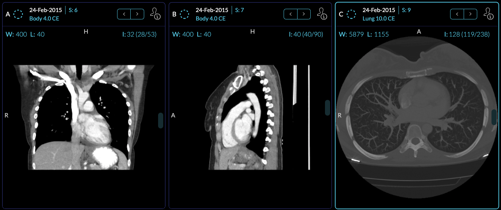

# Module: Viewport

## Overview

Viewports consume a displaySet and display/allow the user to interact with data.
An extension can register a Viewport Module by defining a `getViewportModule`
method that returns a React component. Currently, we use viewport components to
add support for:

- 2D Medical Image Viewing (cornerstone ext.)
- Structured Reports as SR (DICOM SR ext.)
- Encapsulated PDFs as PDFs (DICOM pdf ext.)

The general pattern is that a mode can define which `Viewport` to use for which
specific `SOPClassHandlerUID`, so if you want to fork just a single Viewport
component for a specialized mode, this is possible.

```jsx
// displaySet, dataSource
const getViewportModule = () => {
  const wrappedViewport = props => {
    return (
      <ExampleViewport
        {...props}
        onEvent={data => {
          commandsManager.runCommand('commandName', data);
        }}
      />
    );
  };

  return [{ name: 'example', component: wrappedViewport }];
};
```

## Example Viewport Component

A simplified version of the tracked `OHIFCornerstoneViewport` is shown below, which
creates a cornerstone viewport:


```jsx
function TrackedCornerstoneViewport({
  children,
  dataSource,
  displaySets,
  viewportId,
  servicesManager,
  extensionManager,
  commandsManager,
}) {

  return (
    <div className="viewport-wrapper">
      /** Resize Detector */
      <ReactResizeDetector
        handleWidth
        handleHeight
        skipOnMount={true} // Todo: make these configurable
        refreshMode={'debounce'}
        refreshRate={100}
        onResize={onResize}
        targetRef={elementRef.current}
      />
      /** Div For displaying image */
      <div
        className="cornerstone-viewport-element"
        style={{ height: '100%', width: '100%' }}
        onContextMenu={e => e.preventDefault()}
        onMouseDown={e => e.preventDefault()}
        ref={elementRef}
      ></div>
    </div>
  );
}
```

### Viewport re-mounting and invalidation

Data mounting is orchestrated outside React by a viewport mount controller.
On every render, `OHIFCornerstoneViewport` publishes a *mount intent* (the
displaySets, viewportOptions, displaySetOptions and dataSource it received)
to the `cornerstoneViewportService`; the controller compares intents
(`compareMountIntent`) and only re-runs the mount pipeline when the intent
actually changed. This replaces the old `React.memo` `areEqual` comparator.

We use viewportId to identify a viewport and we use it as a key in React
rendering. This is important because it allows us to keep track of the viewport
and its state, and also let React optimize and move the viewport around in the
grid without re-rendering it. However, there are some cases where we need to
force a re-mount of the viewport data, for example, when the viewport is
hydrated with a new Segmentation. For these cases, call

```js
viewportGridService.bumpComposition(viewportId, 'segmentation-hydrated');
```

which bumps the viewport's `compositionRevision`; the revision is part of the
mount intent, so the next published intent is unequal and the viewport
re-mounts. This replaces the removed `needsRerendering` viewport option, which
is no longer read.


### `@ohif/app`

Viewport components are managed by the `ViewportGrid` Component. Which Viewport
component is used depends on:

- Hanging Protocols
- The Layout Configuration
- Registered SopClassHandlers



<center><i>An example of three cornerstone Viewports</i></center>
