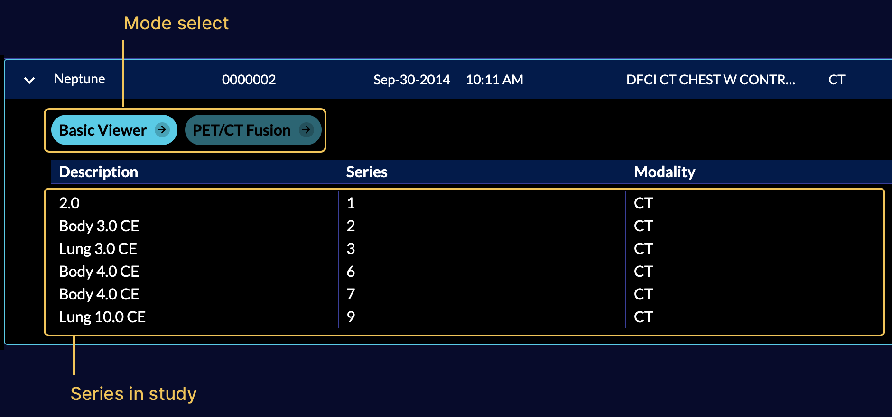

# Modes

## Overview

A mode can be thought of as a viewer app configured to perform a specific task,
such as tracking measurements over time, 3D segmentation, a guided radiological
workflow, etc. Addition of modes enables _application_ with many _applications_
as each mode become a mini _app configuration_ behind the scene.

Upon initialization the viewer will consume extensions and modes and build up
the route desired, these can then be accessed via the study list, or directly
via url parameters.

<!-- > Modes make extensions (features) more reusable and powerful. -->

OHIF-v3 architecture can be seen in the following:


> Note: Templates are now a part of “extensions” Routes are configured by modes
> and/or app

As mentioned, modes are tied to a specific route in the viewer, and multiple
modes/routes can be present within a single application. This allows for
tremendously more flexibility than before you can now:

- Simultaneously host multiple viewers with for different use cases from within
  the same app deploy.
- Make radiological viewers for specific purposes/workflows, e.g.:
  - Tracking the size of lesions over time.
  - PET/CT fusion workflows.
  - Guided review workflows optimized for a specific clinical trial.
- Still host one single feature-rich viewer if you desire.

## Anatomy

A mode configuration has a `route` name which is dynamically transformed into a
viewer route on initialization of the application. Modes that are available to a
study will appear in the study list.



The mode configuration specifies which `extensions` the mode requires, which
`LayoutTemplate` to use, and what props to pass to the template. For the default
template this defines which `side panels` will be available, as well as what
`viewports` and which `displaySets` they may hang.

Mode's config is composed of three elements:
- `id`: the mode `id`
- `modeFactory`: the function that returns the mode specific configuration
- `extensionDependencies`: the list of extensions that the mode requires


that return a config object with certain
properties, the high-level view of this config object is:

```js title="modes/example/src/index.js"
function modeFactory() {
  return {
    id: '',
    version: '',
    displayName: '',
    onModeEnter: () => {},
    onModeExit: () => {},
    validationTags: {},
    isValidMode: () => {},
    routes: [
      {
        path: '',
        init: () => {},
        layoutTemplate: () => {},
      },
    ],
    extensions: extensionDependencies,
    hangingProtocol: [],
    sopClassHandlers: [],
    hotkeys: []
  };
}

const mode = {
  id,
  modeFactory,
  extensionDependencies,
};

export default mode;
```

<table>
  <thead>
    <tr>
      <th align="left">Property</th>
      <th align="left">Description</th>
    </tr>
  </thead>
  <tbody>
    <tr>
      <td align="left">
          id
      </td>
      <td align="left">unique mode id used to refer to the mode</td>
    </tr>
    <tr>
      <td align="left">
          displayName
      </td>
      <td align="left">actual name of the mode being displayed for each study in the study summary panel</td>
    </tr>
    <tr>
      <td align="left">
        <a href="./lifecycle#onModeEnter">
          onModeEnter
        </a>
      </td>
      <td align="left">hook is called when the mode is entered by the specified route</td>
    </tr>
    <tr>
      <td align="left">
        <a href="./lifecycle#onModeExit">
          onModeExit
        </a>
      </td>
      <td align="left">hook is called when the mode exited</td>
    </tr>
    <tr>
      <td align="left">
        <a href="">
          validationTags
        </a>
      </td>
      <td align="left">validationTags</td>
    </tr>
    <tr>
      <td align="left">
        <a href="">
          isValidMode
        </a>
      </td>
      <td align="left">Checks if the mode is valid for a study</td>
    </tr>
    <tr>
      <td align="left">
        <a href="">
          routes
        </a>
      </td>
      <td align="left">route config which defines the route address, and the layout for it</td>
    </tr>
    <tr>
      <td align="left">
        <a href="./index#consuming-extensions">
          extensionDependencies
        </a>
      </td>
      <td align="left">extensions needed by the mode</td>
    </tr>
    <tr>
      <td align="left">
        <a href="">
          hanging protocol
        </a>
      </td>
      <td align="left">list of hanging protocols that the mode should have access to</td>
    </tr>
    <tr>
      <td align="left">
        <a href="">
          sopClassHandlers
        </a>
      </td>
      <td align="left">list of SOPClass modules needed by the mode </td>
    </tr>
    <tr>
      <td align="left">
        <a href="">
          hotkeys
        </a>
      </td>
      <td align="left">hotkeys</td>
    </tr>

  </tbody>
</table>

### Consuming Extensions

As mentioned in the [Extensions](../extensions/index.md) section, in `OHIF-v3`
developers write their extensions to create reusable functionalities that later
can be used by `modes`. Now, it is time to describe how the registered
extensions will get utilized for a workflow mode via its `id`.

Each `mode` has a list of its `extensions dependencies` which are the
the `extension` name and version number. In addition, to use a module element you can use the
`${extensionId}.${moduleType}.${element.name}` schema. For instance, if a mode
requires the left panel with name of `AIPanel` that is added by the
`myAIExtension` via the following `getPanelModule` code, it should address it as
`myAIExtension.panelModule.AIPanel` inside the mode configuration file. In the
background `OHIF` will handle grabbing the correct panel via `ExtensionManager`.

```js title="extensions/myAIExtension/getPanelModule.js"
import PanelAI from './PanelAI.js';

function getPanelModule({
  commandsManager,
  extensionManager,
  servicesManager,
}) {
  const wrappedAIPanel = () => {
    return (
      <PanelAI
        commandsManager={commandsManager}
        servicesManager={servicesManager}
      />
    );
  };

  return [
    {
      name: 'AIPanel',
      iconName: 'list-bullets',
      iconLabel: '',
      label: 'AI Panel',
      isDisabled: studies => {}, // optional
      component: wrappedAIPanel,
    },
  ];
}
```

Now, let's look at a simplified code of the `basic viewer` mode which consumes various functionalities
from different extensions.

```js

const extensionDependencies = {
  '@ohif/extension-default': '^3.0.0',
  '@ohif/extension-cornerstone': '^3.0.0',
  '@ohif/extension-measurement-tracking': '^3.0.0',
};

const id = 'viewer';
const version = '3.0.0';

function modeFactory({ modeConfiguration }) {
  return {
    id,
    // ...
    routes: [
      {
        // ...
        layoutTemplate: ({ location, servicesManager }) => {
          return {
            id: ohif.layout,
            props: {
              leftPanels: ['@ohif/extension-measurement-tracking.panelModule.seriesList'],
              rightPanels: ['@ohif/extension-measurement-tracking.panelModule.trackedMeasurements'],
              viewports: [
                {
                  namespace: '@ohif/extension-measurement-tracking.viewportModule.cornerstone-tracked',
                  displaySetsToDisplay: ['@ohif/extension-default.sopClassHandlerModule.stack'],
                },
              ],
            },
          };
        },
      },
    ],
    extensions: extensionDependencies,
    hangingProtocol: ['@ohif/extension-default.hangingProtocolModule.petCT'],
    sopClassHandlers: ['@ohif/extension-default.sopClassHandlerModule.stack'],
    // ...
  };
}

const mode = {
  id,
  modeFactory,
  extensionDependencies,
}

export default mode
```

### Routes

routes config is an array of route settings, and the overall look and behavior
of the viewer at the designated route is defined by the `layoutTemplate` and
`init` functions for the route. We will learn more about each of the above
properties inside the [route documentation](./routes.md)


### HangingProtocols

Currently, you can pass your defined hanging protocols inside the
`hangingProtocols` property of the mode's config. If you specify the hanging protocol
explicitly by its name (only string and not array), it will be THE hanging protocol
that the mode runs with. However, if you specify an array of hanging protocols,
they will get ranked based on the displaySetSelector requirements and the winner
will be the hanging protocol that the mode runs with.


### SopClassHandlers

Mode's configuration also accepts the `sopClassHandler` modules that have been
added by the extensions. This information will get used to initialize `DisplaySetService` with the provided SOPClass modules which
handles creation of the displaySets.


### Hotkeys

`hotkeys` is another property in the configuration of a mode that can be defined
to add the specific hotkeys to the viewer on the mode route.  Additionally, the
name under which the hotkeys are stored can be configured as `hotkeyName`.
This allows user customization of the mode specific hotkeys.

```js
// default hotkeys
import { utils } from '@ohif/ui';

const { hotkeys } = utils;

const myHotkeys = [
  {
    commandName: 'setToolActive',
    commandOptions: { toolName: 'Zoom' },
    label: 'Zoom',
    keys: ['z'],
    isEditable: true,
  },
  {
    commandName: 'scaleUpViewport',
    label: 'Zoom In',
    keys: ['+'],
    isEditable: true,
  },
]

function modeFactory() {
  return {
    id: '',
    id: '',
    displayName: '',
    /*
    ...
    */
    hotkeys: {
      // The name in preferences to use for this set of hotkeys
      // Allows defining different sets for different modes
      name: 'custom-hotkey-name',
      // And the actual custom values here.
      hotkeys:[..hotkeys.defaults.hotkeyBindings, ...myHotkeys]
    },
  }
}

// exports
```


## Registration

Similar to extension registration, `viewer` will look inside the `pluginConfig.json` to
find the `modes` to register.


```js title=platform/app/pluginConfig.json
// Simplified version of the `pluginConfig.json` file
{
  "extensions": [
    {
      "packageName": "@ohif/extension-cornerstone",
      "version": "3.4.0"
    },
    // ...
  ],
  "modes": [
    {
      "packageName": "@ohif/mode-longitudinal",
      "version": "3.4.0"
    }
  ]
}
```

:::note Important
You SHOULD NOT directly register modes in the `pluginConfig.json` file.
Use the provided `cli` to add/remove/install/uninstall modes. Read more [here](../../development/ohif-cli.md)
:::

The final registration and import of the modes happen inside a non-tracked file `pluginImport.js` (this file is also for internal use only).


:::note
You can stack multiple panel components on top of each other by providing an array of panel components in the `rightPanels` or `leftPanels` properties.

For instance we can use

```
rightPanels: [[dicomSeg.panel, tracked.measurements], [dicomSeg.panel, tracked.measurements]]
```

This will result in two panels, one with `dicomSeg.panel` and `tracked.measurements` and the other with `dicomSeg.panel` and `tracked.measurements` stacked on top of each other.

:::
