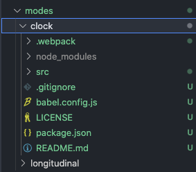

# Mode: Installation

> Note: This is a temporary documentation for installation. In the future, we
> will update this page with more information of how you can install a mode at
> runtime. In the following you will find a simple example, and you can follow
> the steps below to add your mode to OHIF. More complex modes follow the same
> steps.

Imagine you find a new mode that you want to add to OHIF. You can follow the
steps below to add the mode to OHIF. For instnace, someone has created a mode
called ["Clock" mode](https://github.com/sedghi/OHIF-mode-clock) which uses one
tool to show the current time, and has a panel that updates the time every
second.

## Mode

### Mode Files Copy

As you can see in the mode repository, each mode has a folder structure that is
similar to the OHIF-maintained modes. Let's look at the Clock mode:

- src/index.js: The most important file in the mode. This file is where the
  developer has defined the mode configurations such as which layout to use,
  which panels for left and right side, etc.
- Other files/folders: .webpack, LICENSE, README.md, babel.config.js

Note: It is highly recommended to copy and paste the code for `babel.config.js`
and `.webpack` files from the OHIF longitudinal mode.

#### Package.json

Mode name is defined in the `package.json` file. The `package.json` file is a
JSON file that defines the mode name, version, and dependencies. For instance
for the Clock mode, the `package.json` file looks like this:

```js {2} title="clockMode/package.json"
{
  "name": "@ohif/mode-clock",
  "version": "0.0.1",
  "description": "A test mode for installation demonstration",
  ...
}
```

Note 1: We will use the `@ohif/mode-clock` inside OHIF to let it know about
existence of this mode.

Note 2: You don't need to use the `@ohif` scope for your modes/extensions.



### Configuring OHIF

There are couple of places inside OHIF which we need to modify in order to add
the mode.

The following lines of code have been added to the OHIF:

#### App.jsx

```js {2} title="Viewers/platform/viewer/src/App.jsx"
import '@ohif/mode-longitudinal';
import '@ohif/mode-clock';
```

#### appInit.js

```js {3} title="Viewers/platform/viewer/src/appInit.js"
if (!appConfig.modes.length) {
  appConfig.modes.push(window.longitudinalMode);
  appConfig.modes.push(window.clockMode);
}
```

#### Viewer package.json

```js {6} titl="Viewers/platform/viewer/package.json"
// ...
"dependencies": {
  // ...
  "@ohif/i18n": "^0.52.8",
  "@ohif/mode-longitudinal": "^0.0.1",
  "@ohif/mode-clock": "^0.0.1",
  "@ohif/ui": "^2.0.0",
  "@types/react": "^16.0.0",
  // ...
}
```

### Required OHIF Extensions for Mode

How did we understand that a mode requires an extension? Good question! The
answer is that the mode is a configuratoin file that defines the layout, panels,
viewport, and tools that are used to render a route. By looking inside the mode
configuration file (`index.js`), you can actually see that the Clock mode
requires a panel called `ClockPanel` from `extension.clock`'s panel module.

```js {10} title="clockMode/src/index.js"
// ....
routes: [
  {
    path: "clock",
    layoutTemplate: ({ location, servicesManager }) => {
      return {
        id: ohif.layout,
        props: {
          leftPanels: [],
          rightPanels: ["extension.clock.panelModule.clockPanel"],
          viewports: [
            {
              namespace: "org.ohif.cornerstone.viewportModule.cornerstone",
              displaySetsToDisplay: ["org.ohif.default.sopClassHandlerModule.stack"],
            },
          ],
        },
      };
    },
  },
],
// ....
```

Let's add this extension to OHIF as well.

## Adding Extension

### Extension Files Copy

### Configuring OHIF

### Dependencies
