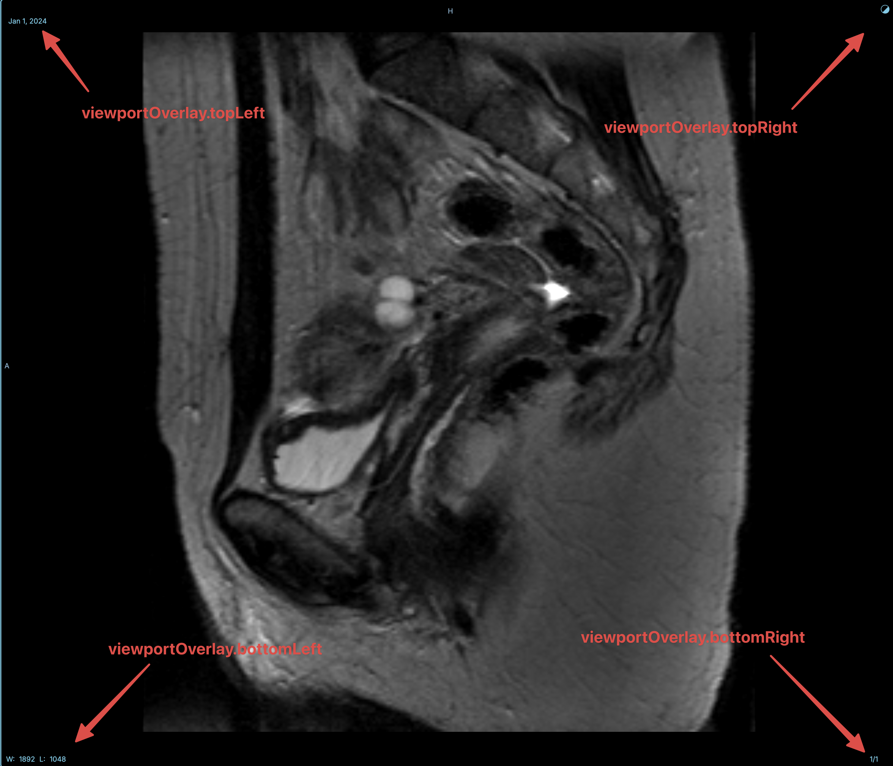

import { viewportOverlayCustomizations , TableGenerator } from './sampleCustomizations';

# Viewport Overlay

Viewport Overlays are the information that is displayed on the viewport.

There are 4 viewport overlays customization end points

- `viewportOverlay.topRight`
- `viewportOverlay.topLeft`
- `viewportOverlay.bottomLeft`
- `viewportOverlay.bottomRight`

{TableGenerator(viewportOverlayCustomizations)}
