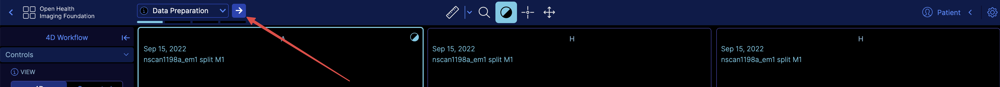

# Workflow Step Service

This service allows you to manage your workflow in smaller steps. It provides a structured way to define and navigate through different stages
or phases of a larger process or workflow. Each step can have its own configuration, layout, toolbar buttons, and other settings tailored to the specific requirements of that stage.

## Anatomy of a Workflow Step

The anatomy of a workflow step refers to the different components or properties that define and configure each individual step within the workflow. Each step can be customized with various settings to tailor the user interface, available tools, and behavior of the application for that specific stage of the workflow. Here are the key components that make up a workflow step:

- `id`: A unique identifier for the step
- `name`: A human-readable name or title for the step, which can be displayed in the user interface to help users understand the current stage of the workflow.
- `hangingProtocol`:  The hanging protocol configuration specifies the protocol and stage ID to be used for displaying the images. This ensures that the appropriate data viewports and presentation are used for the current workflow step.
- `layout`: The layout configuration defines the arrangement and visibility of various panels or viewports within the application's user interface for the specific step. This can include specifying which panels should be visible on the left or right side of the screen, as well as any options for panel visibility or behavior.
- `toolbarButtons`: Each step can define a set of toolbar buttons that should be available and displayed in the application's toolbar during that step. Remember the button definitions should already be registered to toolbarService beforehand, here we are just referencing the buttons id in each section.
- `info` : An optional description or additional information about the current workflow step can be provided. which
will be displayed as tooltip in the UI.

- Step Callbacks or Commands: Some workflow steps may require specific actions or commands to be executed when the step is entered or exited. These callbacks or commands can be defined within the step configuration and can be used to update the application's state, perform data processing, or trigger other relevant actions. For instance you have access to `onEnter` hook to run a command right after the step is entered.

For instance, a simplified example of our pre-clinical 4D workflow steps configuration might look like this:

```js
const dynamicVolume = {
  sopClassHandler:
    "@ohif/extension-cornerstone-dynamic-volume.sopClassHandlerModule.dynamic-volume",
  leftPanel:
    "@ohif/extension-cornerstone-dynamic-volume.panelModule.dynamic-volume",
  toolBox:
    "@ohif/extension-cornerstone-dynamic-volume.panelModule.dynamic-toolbox",
  export:
    "@ohif/extension-cornerstone-dynamic-volume.panelModule.dynamic-export",
}

const cs3d = {
  segmentation:
    "@ohif/extension-cornerstone-dicom-seg.panelModule.panelSegmentation",
}


const steps = [
  {
    id: "dataPreparation",
    name: "Data Preparation",
    layout: {
      panels: {
        left: [dynamicVolume.leftPanel],
      },
    },
    toolbarButtons: {
      buttonSection: "primary",
      buttons: ["MeasurementTools", "Zoom", "WindowLevel", "Crosshairs", "Pan"],
    },
    hangingProtocol: {
      protocolId: "default4D",
      stageId: "dataPreparation",
    },
    info: "In the Data Preparation step...",
  },
  {
    id: "roiQuantification",
    name: "ROI Quantification",
    layout: {
      panels: {
        left: [dynamicVolume.leftPanel],
        right: [
          [dynamicVolume.toolBox, cs3d.segmentation, dynamicVolume.export],
        ],
      },
      options: {
        leftPanelClosed: false,
        rightPanelClosed: false,
      },
    },
    toolbarButtons: [
      {
        buttonSection: "primary",
        buttons: [
          "MeasurementTools",
          "Zoom",
          "WindowLevel",
          "Crosshairs",
          "Pan",
        ],
      },
      {
        buttonSection: "dynamic-toolbox",
        buttons: ["BrushTools", "RectangleROIStartEndThreshold"],
      },
    ],
    hangingProtocol: {
      protocolId: "default4D",
      stageId: "roiQuantification",
    },
    info: "The ROI quantification step ...",
  },
  {
    id: "kineticAnalysis",
    name: "Kinetic Analysis",
    layout: {
      panels: {
        left: [dynamicVolume.leftPanel],
        right: [],
      },
    },
    toolbarButtons: {
      buttonSection: "primary",
      buttons: ["MeasurementTools", "Zoom", "WindowLevel", "Crosshairs", "Pan"],
    },
    hangingProtocol: {
      protocolId: "default4D",
      stageId: "kineticAnalysis",
    },
    onEnter: [
      {
        commandName: "updateSegmentationsChartDisplaySet",
        options: { servicesManager },
      },
    ],
    info: "The Kinetic Analysis step ...",
  },
]

```

## Integration

After you have defined your workflow steps, you can integrate them into your application by using the `workflowStepsService`.

These steps should be called on `onSetupRouteComplete` in your mode factory.


Note: onModeEnter is too soon to call these steps as the mode is not yet fully initialized.


```js
onSetupRouteComplete: ({ servicesManager }) => {
  workflowStepsService.addWorkflowSteps(workflowSettings.steps);
  workflowStepsService.setActiveWorkflowStep(workflowSettings.steps[0].id);
},
```

check out the `modes/preclinical-4d/src/index.tsx` for a complete example.


## User Interface

We have developed a simple dropdown UI element that you can use to navigate between the different steps of your workflow. This dropdown can be added to the toolbar like below:

```js
toolbarService.addButtons([
  {
    id: 'ProgressDropdown',
    uiType: 'ohif.progressDropdown',
  },
])
toolbarService.createButtonSection('secondary', ['ProgressDropdown']);
```

It will appear in the `secondary` location in the toolbar.



:::note
if you like to place the progressbar in a different location, you can use the Toolbox component
to create a button section and place the progress bar there.

Read more in the [Toolbar module](../../extensions//modules/toolbar.md)
:::
