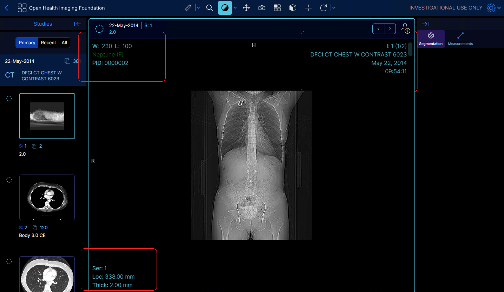

# Customization Service

There are a lot of places where users may want to configure certain elements
differently between different modes or for different deployments.  A mode
example might be the use of a custom overlay showing mode related DICOM header
information such as radiation dose or patient age.

The use of this service enables these to be defined in a typed fashion by
providing an easy way to set default values for this, but to allow a
non-default value to be specified by the configuration or mode.

This service is a UI service in that part of the registration allows for registering
UI components and types to deal with, but it does not directly provide an UI
displayable elements unless customized to do so.

<b>Note:</b> Customization Service itself doesn't implement the actual customization,
but rather just provide mechanism to register reusable prototypes, to configure
those prototypes with actual configurations, and to use the configured objects
(components, data, whatever).
Actual implementation of the customization is totally up to the component that
supports customization. (for example, `CustomizableViewportOverlay` component uses
`CustomizationService` to implement viewport overlay that is easily customizable
from configuration.)

## Global, Default and Mode customizations
There are various customization sets that define the lifetime/setup of the
customization.  The global customizations are those used for overriding
customizations defined elsewhere, and allow replacing a customization.

Mode customizations are only registered for the lifetime of the mode, allowing
the mode definition to update/modify the underlying behaviour.  This is related
to default customizations, which provide a fallback if the mode or global customization
isn't defined.  Default customizations may only be defined once, otherwise throwing
an exception.

## Append and Merge Customizations
In addition to the replace a customization, there is the ability to merge or append
a customization.  The merge customization simply applies the lodash merge functionality
to the existing customization, with the new one, while the append customization
modifies the customization by appending to the value.

### Append Behaviour
When a list is found in the destination object, the append source object is
examined to see how to handle the change.  If the source is simply a list,
then the list object is appended, and no additional changes are performed.
However, if the source is an object other than a list, then the iterable
attributes of the object are examined to match child objects to the destination list,
according to the following table:

* Natural or zero number value - match the given index location and merge at the point
* Fractional number value - insert at a new point in the list, starting from the end or beginning
* keyword - match a value having the same id as the keyword, inserting at the end, or at _priority as defined in the keywords above.

#### Example Append

```javascript
const destination = [
  1,
  {id: 'two', value: 2},
  {id: 'three', value: 3}
]

const source = {
  two: { value: 'updated2' },
  1: { extraValue: 2 },
  1.0001: { id: 'inserted', value: 1.0001 },
  -1: { value: -3 },
}
```

Results in two updates to `destination[1]`, the first using an id match on 'two', while the second one
does a positional match on `1`, resulting in the value `{id: 'two', value: 'updated2', extraValue: 2 }`

Then, it inserts the id 'inserted' after position 1.

Finally, position -1 (the end position) is updated from value 3 to value -3.

The ordering is not specified on any of these insertions, so can happen out of order.  Use multiple updates to perform order specific inserts.

## Registering customizable modules (or defining customization prototypes)

Extensions and Modes can register customization templates they support.
It is done by adding `getCustomizationModule()` in the extension or mode definition.

Below is the protocol of the `getCustomizationModule()`, if defined in Typescript.

```typescript
  getCustomizationModule() : { name: string, value: any }[]
```

If the name is 'default', it is the a default customization, while if it
is 'global', then it is a priority/over-riding customization.

In the `value` of each customizations, you will define customization prototype(s).
These customization prototype(s) can be considered like "Prototype" in Javascript.
These can be used to extend the customization definitions from configurations.
Default customizations will be often used to define all the customization prototypes,
Default customizations will be often used to define all the customization prototypes,
as they will be loaded automatically along with the defining extension or mode.


For example, the `@ohif/extension-default` extension defines,

```js
  getCustomizationModule: () => [
    //...

    {
      name: 'default',
      value: [
        {
          id: 'ohif.overlayItem',
          content: function (props) {
            if (this.condition && !this.condition(props)) return null;

            const { instance } = props;
            const value =
              instance && this.attribute
                ? instance[this.attribute]
                : this.contentF && typeof this.contentF === 'function'
                ? this.contentF(props)
                : null;
            if (!value) return null;

            return (
              <span
                className="overlay-item flex flex-row"
                style={{ color: this.color || undefined }}
                title={this.title || ''}
              >
                {this.label && (
                  <span className="mr-1 shrink-0">{this.label}</span>
                )}
                <span className="font-light">{value}</span>
              </span>
            );
          },
        },
      ],
    },

    //...
  ],
```

And this `ohif.overlayItem` object will be used as a prototype (and template) to define items
to be displayed on `CustomizableViewportOverlay`. See how we use the `ohif.overlayItem` in
the example below.

## Configuring customizations

There are several ways to register customizations.  The
`APP_CONFIG.customizationService`
field is used as a per-configuration entry.  This object can list single
configurations by id, or it can list sets of customizations by referring to
the `customizationModule` in an extension.

NOTE that these definitions from APP_CONFIG will be loaded by default, just like
extension/modes default customization.

Below is the example configuration for `CustomizableViewportOverlay` component
customization, using the customization prototype `ohif.overlayItem` defined in
`ohif/extension-defaul` extension.:

```js
window.config = {
  //...

  // in the APP_CONFIG file set the top right area to show the patient name
  // using PN: as a prefix when the study has a non-empty patient name.
  customizationService: {
    cornerstoneOverlayTopRight: {
      id: 'cornerstoneOverlayTopRight',
      items: [
        {
          id: 'PatientNameOverlay',
          // Note below that here we are using the customization prototype of
          // `ohif.overlayItem` which was registered to the customization module in
          // `ohif/extension-default` extension.
          customizationType: 'ohif.overlayItem',
          // the following props are passed to the `ohif.overlayItem` prototype
          // which is used to render the overlay item based on the label, color,
          // conditions, etc.
          attribute: 'PatientName',
          label: 'PN:',
          title: 'Patient Name',
          color: 'yellow',
          condition: ({ instance }) =>
            instance &&
            instance.PatientName &&
            instance.PatientName.Alphabetic,
          contentF: ({ instance, formatters: { formatPN } }) =>
            formatPN(instance.PatientName.Alphabetic) +
            ' ' +
            (instance.PatientSex ? '(' + instance.PatientSex + ')' : ''),
        },
      ],
    },
  },

  //...
}
```

In the customization configuration, you can use `customizationType` fields to
define the prototype that customization object should inherit from.
The `customizationType` field is simply the id of another customization object.


## Implementing customization using CustomizationService

### Mode Customizations

Mode-specific customizations are no different from the global ones,
except that the mode customizations are specific to one mode and
are not globally applied. Mode-specific customizations are also cleared
before the mode `onModeEnter` is called, and they can have new values registered in the `onModeEnter`

Following on our example above to customize the overlay, we can now add a mode customization
with a bottom-right overlay.

```js
// Import the type from the extension itself
import OverlayUICustomization from "@ohif/cornerstone-extension";

// In the mode itself, customizations can be registered:
onModeEnter: {
  // Note how the object can be strongly typed
  const bottomRight: OverlayUICustomization =     {
      id: 'cornerstoneOverlayBottomRight',
      // Note the type is the previously registered ohif.cornerstoneOverlay
      customizationType: 'ohif.cornerstoneOverlay',
      // The cornerstoneOverlay definition requires an items list here.
      items: [
        // Custom definitions for the context menu here.
      ],
    };
  customizationService.addModeCustomizations(bottomRight);
}
```

The mode customizations are retrieved via the `getModeCustomization` function,
providing an id, and optionally a default value.  The retrieval will return,
in order:

1. Global customization with the given id.
2. Mode customization with the id.
3. The default value specified.

The return value then inherits the `customizationType` instance, so that the
value can be typed and have default values and functionality provided.  The object
can then be used in a way defined by the extension provided that customization
point.

```ts
const cornerstoneOverlay = customizationService.getModeCustomization(
  "cornerstoneOverlay",
  { customizationType: "ohif.cornerstoneOverlay" },
);

const { component: overlayComponent, props } =
  customizationService.getComponent(cornerstoneOverlay);

return (
  <defaultComponent {...props} overlay={cornerstoneOverlay}></defaultComponent>
);
```

This example shows fetching the default component to render this object.  The
returned object would be a sub-type of ohif.cornerstoneOverlay if defined.  This
object can be a React component or other object such as a commands list, for
example (this example comes from the context menu customizations as that one
uses commands lists):

```ts
cornerstoneContextMenu = customizationService.get(
  "cornerstoneContextMenu",
  defaultMenu,
);
commandsManager.run(cornerstoneContextMenu, extraProps);
```

### Global Customizations

Global customizations are retrieved in the same was as mode customizations, except
that the `getGlobalCustomization` is called instead of the mode call.

### Types

Some types for the customization service are provided by the `@ohif/ui` types
export.  Additionally, extensions can provide a Types export with custom
typing, allowing for better typing for the extension specific capabilities.
This allows for having strong typing when declaring customizations, for example:

```ts
import { Types } from '@ohif/ui';

const customContextMenu: Types.ContextMenu.Menu =
    {
      id: 'cornerstoneContextMenu',
      customizationType: 'ohif.contextMenu',
      // items will be type checked to be in accordance with UIContextMenu.items
      items: [ ... ]
    },
```

### Inheritance

JavaScript  property inheritance can be supplied by defining customizations
with id corresponding to the customizationType value.  For example:

```js
getCustomizationModule = () => ([
  {
    name: 'default',
    value: [
      {
        id: 'ohif.overlayItem',
        content: function (props) {
          return (<p><b>{this.label}</b> {props.instance[this.attribute]}</p>)
        },
      },
    ],
  }
])
```

defines an overlay item which has a React content object as the render value.
This can then be used by specifying a `customizationType` of `ohif.overlayItem`, for example:

```js
const overlayItem: Types.UIOverlayItem = {
  id: 'anOverlayItem',
  customizationType: 'ohif.overlayItem',
  attribute: 'PatientName',
  label: 'PN:',
};
```

# Customizations

This section can be used to specify various customization capabilities.

## Text color for StudyBrowser tabs

This is the recommended pattern for deep customization of class attributes,
making it fine grained, and have it apply a set of attributes, mostly from
tailwind.  In this case it is a double indirection, as the buttons class
uses it's own internal class names.

* Name: 'class:StudyBrowser'
* Attributes:
** `true` for the is active true text color
** `false` for the is active false text color.
** Values are button colors, from the Button class, eg default, white, black

## customRoutes

* Name: `customRoutes`  global
* Attributes:
** `routes` of type List of route objects (see `route/index.tsx`) is a set of route objects to add.
** Should any element of routes match an existing baked in element, the baked in one will be replaced.
** `notFoundRoute` is the route to display when nothing is found (this has to be at the end of the overall list, so can't be added to routes)

### Example

```js
{
  id: 'customRoutes',
  routes: [
    {
      path: '/myroute',
      children: MyRouteReactFunction,
    }
  ],
}
```

There is a usage of this example commented out in config/default.js that
looks like the code below.  This example is provided by the default extension,
again with commented out code.  Uncomment the getCustomizationModule customRoutes
code in the default module to activate this, and then go to: `http://localhost:3000/custom`
to see the custom route.

Note the name of this is the customization module name, which usually won't match
the id, and in fact there can be multiple customization objects defined for a single
customization module, to allow for customizing sets of related values.

```js
customizationService: [
    // Shows a custom route -access via http://localhost:3000/custom
    '@ohif/extension-default.customizationModule.helloPage',
],
```

## Customizable Viewport Overlay

Below is the full example configuration of the customizable viewport overlay and the screenshot of the result overlay.

There are working examples that can be run with:
```
set APP_CONFIG=config/customization.js
yarn dev
```

```javascript
// this is part of customization.js, an example customization dataset
window.config = {

   // This shows how to append to the customization data
   customizationService: [
    {
      id: '@ohif/cornerstoneOverlay',
      // Append recursively, rather than replacing
      merge: 'Append',
      topRightItems: {
        id: 'cornerstoneOverlayTopRight',
        items: [
          {
            id: 'PatientNameOverlay',
            // Note below that here we are using the customization prototype of
            // `ohif.overlayItem` which was registered to the customization module in
            // `ohif/extension-default` extension.
            customizationType: 'ohif.overlayItem',
            // the following props are passed to the `ohif.overlayItem` prototype
            // which is used to render the overlay item based on the label, color,
            // conditions, etc.
            attribute: 'PatientName',
            label: 'PN:',
            title: 'Patient Name',
            color: 'yellow',
            condition: ({ instance }) => instance?.PatientName,
            contentF: ({ instance, formatters: { formatPN } }) =>
              formatPN(instance.PatientName) +
              (instance.PatientSex ? ' (' + instance.PatientSex + ')' : ''),
          },
        ],
      },

      topLeftItems: {
        items: {
          // Note the -10000 means -10000 + length of existing list, which is
          // much before the start of hte list, so put the new value at the start.
          '-10000':
          {
            id: 'Species',
            customizationType: 'ohif.overlayItem',
            label: 'Species:',
            color: 'red',
            background: 'green',
            condition: ({ instance }) =>
              instance?.PatientSpeciesDescription,
            contentF: ({ instance }) =>
              instance.PatientSpeciesDescription +
              '/' +
              instance.PatientBreedDescription,
          },
        },
      },
    },
...
```



## Context Menus

Context menus can be created by defining the menu structure and click
interaction, as defined in the `ContextMenu/types`.  There are examples
below specific to the cornerstone context, because the actual click
handler and attributes used to decide when and how to display the menu
are specific to the context used for where the menu is displayed.

##  Cornerstone Context Menu

The default cornerstone context menu can be customized by setting the
`cornerstoneContextMenu`.  For a full example, see `findingsContextMenu`.

## Customizable Cornerstone Viewport Click Behaviour

The behaviour on clicking on the cornerstone viewport can be customized
by setting the `cornerstoneViewportClickCommands`.  This is intended to
support both the cornerstone 3D internal commands as well as things like
context menus.  Currently it supports buttons 1-3, as well as modifier keys
by associating a commands list with the button to click.  See `initContextMenu`
for more details.

## Please add additional customizations above this section
> 3rd Party implementers may be added to this table via pull requests.

<!--
  LINKS
-->

<!-- prettier-ignore-start -->
[interface]: https://github.com/OHIF/Viewers/blob/master/platform/core/src/services/UIModalService/index.js
[modal-provider]: https://github.com/OHIF/Viewers/blob/master/platform/ui/src/contextProviders/ModalProvider.js
[modal-consumer]: https://github.com/OHIF/Viewers/tree/master/platform/ui/src/components/ohifModal
[ux-article]: https://uxplanet.org/best-practices-for-modals-overlays-dialog-windows-c00c66cddd8c
<!-- prettier-ignore-end -->
