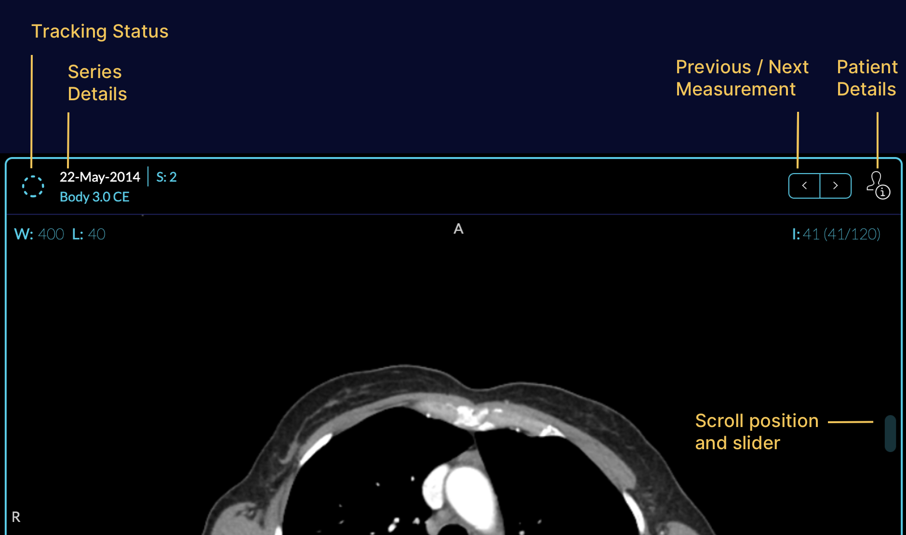
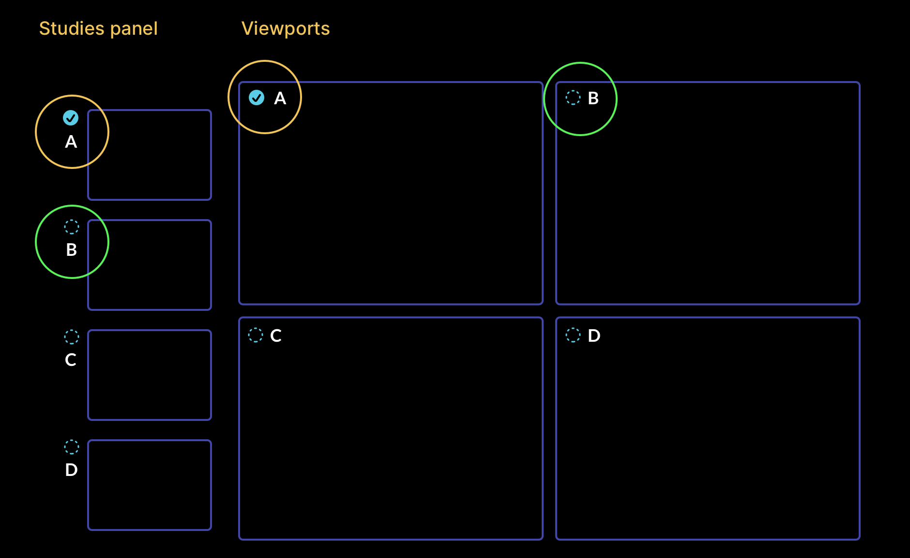

# Viewport

Image visualization happens at the viewport which contains canvas or canvases that
renders series.

By default, you can modify:

- Zoom: right click dragging up or down
- Contrast/brightness: left click dragging up/down to change contrast, and left/right for changing brightness
- Pan: middle click dragging

## Changing Series for display
To change the displayed series, you can drag and drop the desired series from the left panel. Start, by dragging the thumbnail of the series, and drop it on the viewport.

## Changing Layout
If you click on the layout icon on the toolbar, you can use the layout selector UI. After changing the layout, you can select studies for each new viewport by dragging and dropping in to the viewport.

After changing the layout from 1x1, you will see each viewport gets tagged by a letter,
which matches its series section in the study list.

## Overview Video
An overview of viewport layout change, and manipulation can be seen below:

    <iframe src="https://player.vimeo.com/video/843233651?badge=0&amp;autopause=0&amp;player_id=0&amp;app_id=58479" frameBorder="0" allow="autoplay; fullscreen; picture-in-picture" allowFullScreen style= {{ position:"absolute",top:0,left:0,width:"100%",height:"100%"}} title="measurement-report"></iframe>

