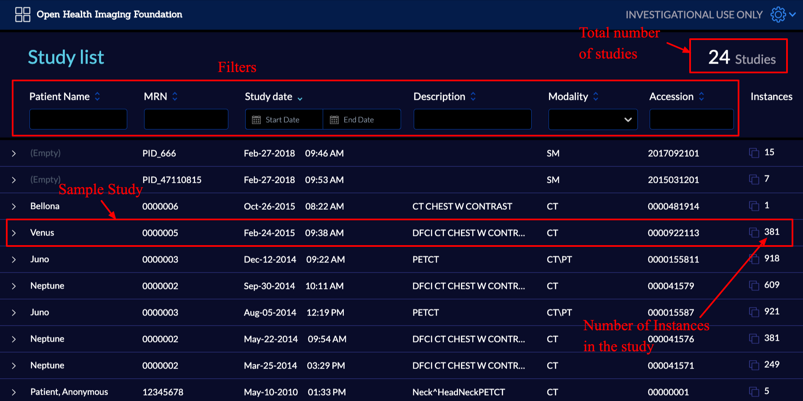
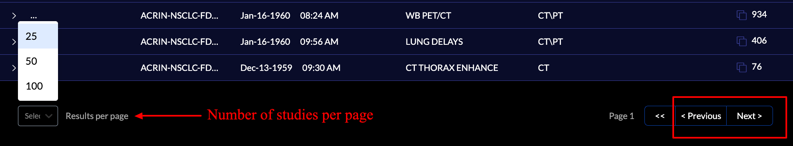
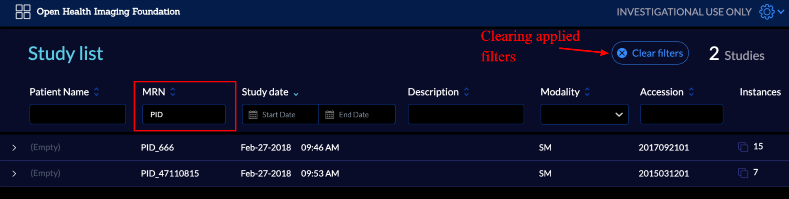
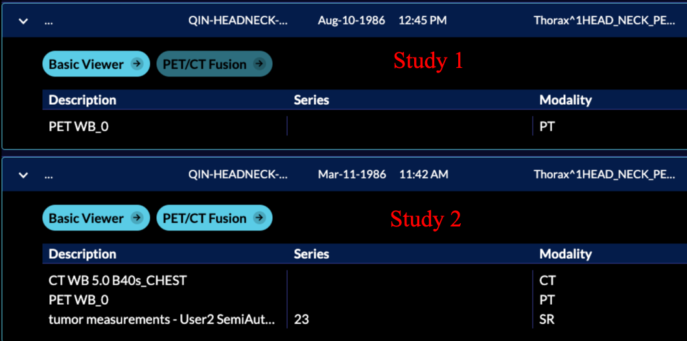
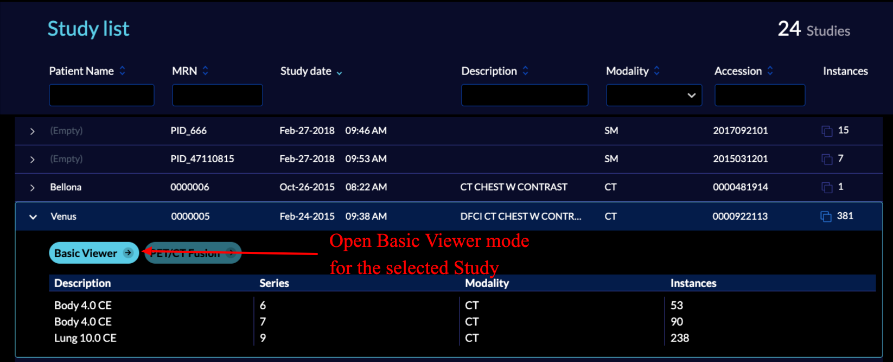

# Study list
- [Study List](./index.md)
  - [Filters](./index.md#filters)
  - [Study Summary](./index.md#study-summary)
  - [Study-specific modes](./index.md#study-specific-modes)
  - [View Study](./index.md#view-study)

## Overview
The first page you will see when the viewer is loaded is called `Study List`.
In this page you can explore all the studies that are stored on the configured
server for the `OIHF Viewer`.

At the end of the page you can navigate to the next/previous page or change the
default number of studies that are shown

## Filters
There are certain filters that can be used to limit the study list to the desired
criteria.

- Patient Name: Searches between patients names
- MRN: Searches between patients Medical Record Number
- Study Data: Filters the date of the acquisition
- Description: Searches between study descriptions
- Modality: Filters the modalities
- Accession: Searches between patients accession number

An example of using study list filter is shown below:

## Study Summary
If you you click on one of the studies, the panel for displaying the summary
of the study will shows up.

As you can see, a summary of series available in the study is shown, which contains
the series description, series number, modality of the series, and instances in the series.

Next, We will discuss the modes, and their enabled/disabled states.

## Study Specific Modes
As seen for each study, all the available modes will get shown. What is a mode?
Modes define the higher-level functionalities and appearance for the viewer.
For instance, as seen, there are two modes shown for the selected study

- Basic Viewer: Default mode that enables rendering and measurement tracking

- PET/CT Fusion: Mode for visualizing the PET CT study in a 3x3 format.

However, based on the mode configurations (e.g., available modalities), they can be
enabled or disabled.

Below, you can see two studies, In Study 1, Basic Viewer mode is enabled and
ready to be used; however, the PET/CT fusion is disabled by the viewer since
only PET images are found in the study.

## View Study
You can click on the `Basic Viewer` to open the viewer for the selected study.

