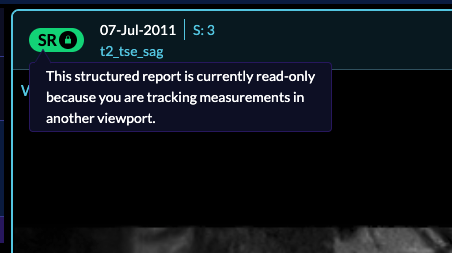
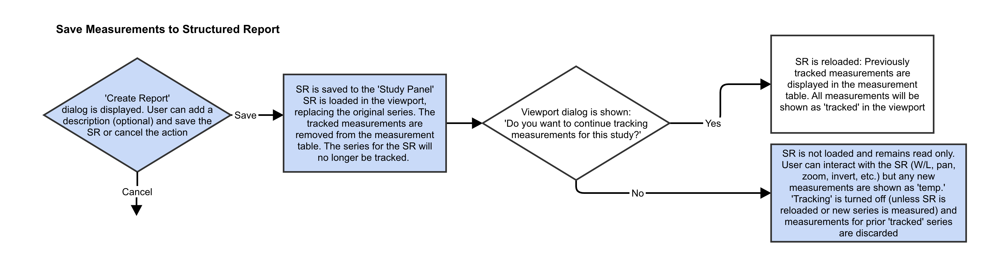

# Measurement Tracking

## Introduction

### Tracked Icon
Each viewport has a left icon indicating whether the series within the viewport
contains:

- tracked measurement OR
- untracked measurement OR
- Structured Report OR
- Locked (uneditable) Structured Report

when you export an SR you will see, and also draggin and dropping SR inside viewer

If you say no and later decide to say yes, click on the SR button the prompt will come again

click to restore measurements

Locked SR

Workflow for tracking can be found below. You can click on the image to have a zoomed in
version pop up or you can also right click on the image
and click `Open image in new tab` to have a better experience reading the details.

