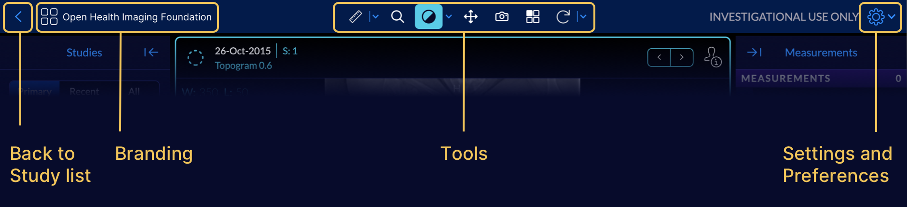
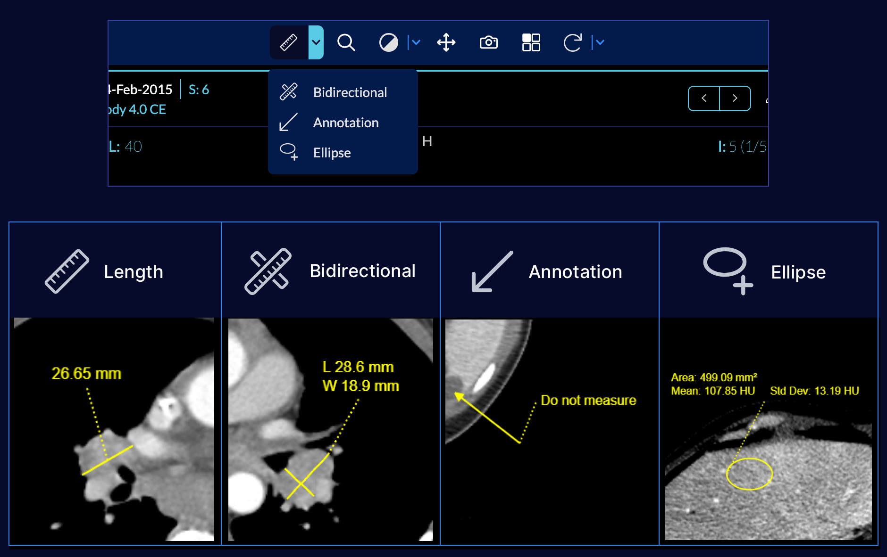
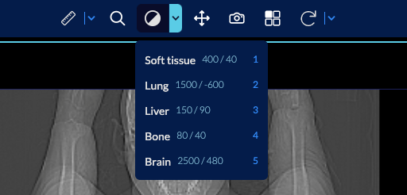
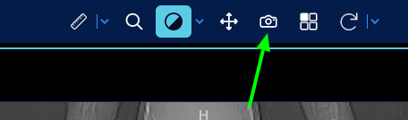

# Toolbar

The four main components of the toolbar are:

- Navigation back to the [Study List](../../studyList/index.md)
- Logo and white labelling
- [Tools](#tools)
- [Preferences](#preferences)

# Tools
This section displays all the available tools inside the mode.

## Measurement tools
They can be used to measure the area of interest. This measurement can be performed
via:

- Length Tool: Calculated the distance between two points
- Bidirectional Tool: A 2D Length tool in two main axis
- Annotation: To label and point to an area
- Ellipse: Calculates statistics on a ellipse area
- Rectangle: Calculates statistics on a rectangle area
- Probe: To read the intensity value at a location

To draw a measurement you can select it from the toolbar and click and drag mouse
to reach the desired shape, size and direction.

A sample tool drawing is shown below

# Presets
Preset tool enables manipulating the window level and window width of the rendered
image, which basically modifies the contrast and brightness.

You can also choose from the list of pre-defined presets by clicking on the triangle.

# Download High Quality Image
By clicking on the Camera icon you can open the window for downloading the image as
common image formats (png, jpg)

In the opened modal, you can set the filename, image's width and height, and filetype and press download for downloading the image to your local computer.

# Extra tools
Lots of other tools are also available in the last tool icon drawer. If you
click on the triangle they will get appeared.

# Overview
An overview of tool usage can been seen below:

<iframe src="https://player.vimeo.com/video/545989422?badge=0&amp;autopause=0&amp;player_id=0&amp;app_id=58479" frameborder="0" allow="autoplay; fullscreen; picture-in-picture" allowfullscreen style="position:absolute;top:0;left:0;width:100%;height:100%;" title="Toolbar-annotation"></iframe>

