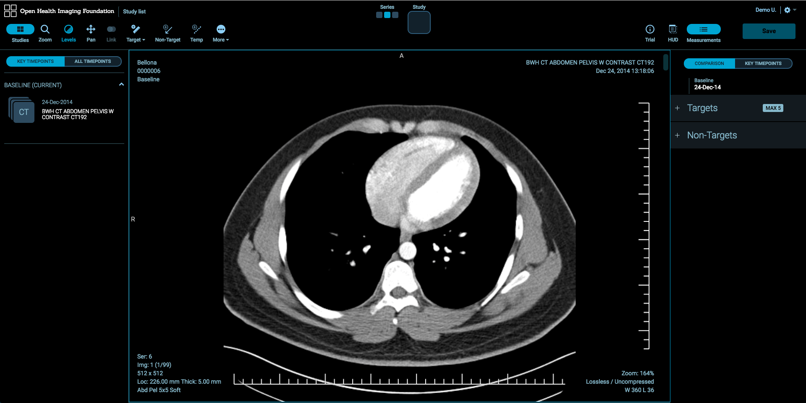

# Lesion Tracker - Using the Viewer

After you double-click a study, the Lesion Tracking imaging application will be launched. The basic patient and study data is displayed in the Image Viewer.

### Switching Studies and Series
There are two methods to switch studies and series inside each viewport:

#### Studies Panel

Studies Panel at the left side of the workspace allows you to change studies and series. Click **Studies** button to toggle Studies Panel. You can view images in two ways:

1. Double-click the desired series thumbnail.
2. Drag and drop the desired series thumbnail on the image viewer.

#### Quick Switch Tool

Quick Switch Tool in the top-middle of the workspace allows you to switch studies and series for the active image viewer easily. Selected series will be colored by the theme colors.

## Image Manipulation Tools
Image Manipulation Tools are available in the toolbar at the top of the workspace.

### Zoom Tool

There are a couple of ways to zoom the image:

1. Select **Zoom Tool** and down on the image with the left mouse button.
2. Down on the image the right mouse button without selecting Zoom Tool.

### Window Width & Level

There are a couple of ways to change the window/level of the image:

1. Select **Levels Tool** and drag on the image with the left mouse button. Dragging up decreases the level and dragging left decreases the window width.

  

2. Alternatively, you can use default Window/Level Presets which are defined in User Preferences dialog or create your window level values.

  

### Pan Tool

There are a couple of ways to pan the image:
1. Select **Pan Tool** and move the image around the screen with the left mouse button.
2. Move the image around the screen with the middle mouse button without selecting Pan Tool.

### Stack Scroll Tool

There are a number of ways to scroll images:
1. Scroll up and down the mouse wheel.
2. Drag the scroll bar at the right side of the image viewer.
3. Use Up and Down buttons on the keyboard.

## Lesion Tracking Basics
### View Case Response Criteria

LesionTracker supports Conformance Checks for RECIST 1.1 and click **Trial** to view Response Criteria details.

_Note:_ Trial button is available if the study is associated with a timepoint.

### Measurements Table

To view measurements and manipulate the lesions, click **Measurements** button at the top-right of the workspace. The Measurements table will be displayed at the right side of the workspace. To hide the Measurements the table, click Measurements button.

_Note:_ Measurements button is available if the study is associated with a timepoint.

### Target Tool

1. To create a target, select **Target Tool** and click on the image.
2. Hold, drag and release the mouse button to create the target.

  

3. To label the target, click **Add Label** button.

  

4. To resize the measurement, hover the mouse over the end points of the target then click and drag.
5. To rename the lesion, click the lesion number in the Measurements table then click **Rename**

  

6. To delete the lesion, click the lesion number in the Measurements table then click **Delete**. It will delete the lesion from the Measurements table and the image.

  

#### Completely Resolved (CR) Target Tool
To make a lesion completely resolved, click Target Tool and select **CR Target** from Target Tool pop up.

#### Unknown (UN) Target Tool
To mark a lesion as unknown, click Target Tool and select ** UN Target** from Target Tool pop up.

### Non-Target Tool

1. To create a non-target, select **Non-Target Tool** and click on the image.
2. Hold, drag and release the mouse button to create a non-target.

  

3. Select Lesion Location and Lesion Location Response then click **Confirm**.

  

4. To resize the measurement, hover the mouse over the end points of the non-target then click and drag.
5. To rename the lesion, click the lesion number in the Measurements table then click **Rename**
6. To delete the lesion, click the lesion number in the Measurements table then click **Delete**. It will delete the lesion from the Measurements table and the image.

### View Lesion

To view the lesion on the image, click the measurement record in the Measurements table then the image which includes the lesion will be displayed by activating the selected lesion.

### Conformance Checks

Any lesion that will conflict with Response Criteria for RECIST 1.1 will be flagged in the Measurements table. To view criteria non-conformities, click the icon at the left of the lesion record in the Measurements table.

### Generating PDF Reports

1. To generate reports of measurements, click **Generate Report** button at the bottom of the Measurements table.

2. A PDF file which includes target and non-target measurements with annotated image snapshots will be created.

### Saving Measurements

There a couple of ways to save changes:
1. Click **Save** button at the top-right of the workspace.

   

2. Click **Study list** to save changes and go back to Study List.

   

### Timepoint Comparison

LesionTracker allows to compare time points and manipulate the measurements on the timepoint images. To launch the compare mode:

1. Associate a study with Follow-up timepoint then double-click Follow-up study. Follow-up and Baseline studies will be displayed in 1x2 layout and Baseline study will show the image which includes the first target measurement as default.
2. Measurements in the Follow-up must be created in the same order as they were on Baseline.

   

#### Comparison

&nbsp; &nbsp; **Comparison** tab in the Measurements table allows you to display lesions in the timepoint compared.

#### Key Timepoints

**Key Timepoints** tab in the Measurements table allows you to display the lesions by the timepoints at the same time.

#### Image Review

To compare the lesions in Baseline and Follow-up, click the lesion record in the Measurements table. The recorded lesions will be displayed on the Baseline and Follow-up images

#### Stack Scroll Tool**

To scroll between two series synchronously, click More button and select **Stack Scroll Tool**.

#### Case Progress

Case Progress icon displays the progress of target and non-target lesions which are assessed out of total lesions. Number in the middle of the icon shows the number of lesions which are not assessed.

#### Heads Up Display (HUD) Panel

To have a quick view of the Measurements table, click **HUD** button at the top-right of the workspace. You can easily move and resize the HUD Panel on the workspace.

Note: HUD button is only available if the study is associated with a timepoint.

### Additional Tools
#### Temporary Length Measurement
To check the size of a lesion without adding to the Measurements table, select **Temp Tool**.

#### Stack Scroll Tool
To scroll images:

1. Click More button and select **Stack Scroll Tool**.
2. Drag down and up on the image viewer with the left mouse button.

#### Reset Image Tool
To reset the geometric orientation, position and magnification of the image in the active image viewer, click More button and select **Reset Tool**.

#### Rotate Right Tool
To rotate the image in the active image viewer 90 degree clockwise, click More button and select **Rotate Right Tool**.

#### Flip H Tool
To flip the image in the active image viewer horizontally, click More button and select **Flip H Tool**.

#### Flip V Tool
To flip the image in the active image viewer vertically, click More button and select **Flip V Tool**.

#### Invert Tool
To invert the image in the active image viewer, click More button and select **Invert Tool**.

#### Magnify Tool
Magnify Tool allows to zoom in a part of the image without changing zoom level of the whole image.

1. Click More button and select **Magnify Tool**.
2. Click and drag around the image with the left mouse button.

#### 3.7.9. Ellipse Tool
Ellipse Tool allows you to draw elliptical annotation with mean and standard deviation values.

1. Click More button and select **Ellipse Tool** then click on the image.
2. Hold, move and release the mouse button to create the annotation.

#### Save Screenshot
To save a screenshot of the current active viewport:

1. Click More button and click **Save Screenshot**.
2. Set image name and sizes and click Download.

#### CINE Tool
CINE Tool allows to play through stacks of images in the active viewport.

1. Click More button and click **CINE Tool**. The CINE dialog will pop up.
2. Click the desired media options from the CINE dialog.
3. To close CINE dialog, click **CINE Tool**.

