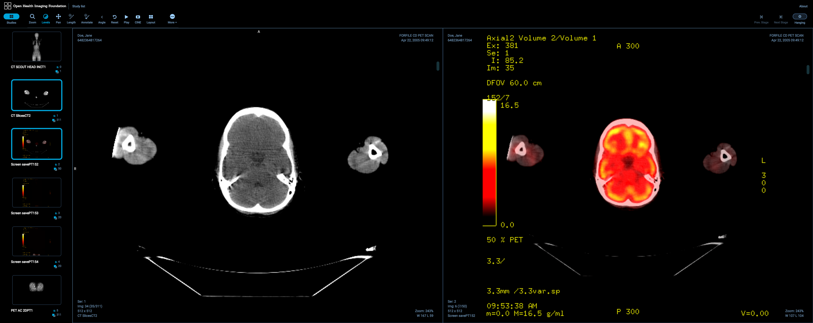
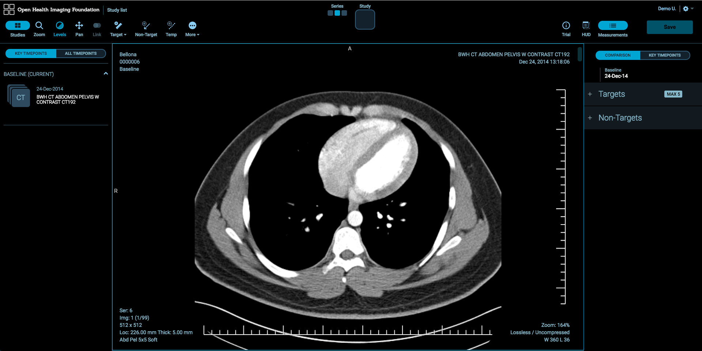
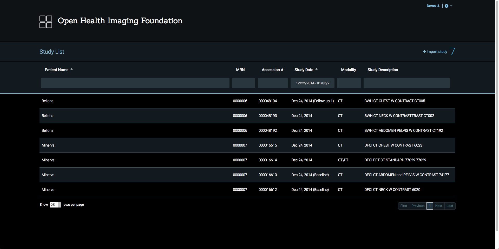

##### Looking for your Deploy Preview? - <a onClick="function redirect() { window.location.href='/demo/'; } redirect();">Deploy Preview for Viewer</a>

The [Open Health Imaging Foundation](https://www.ohif.org) is developing an open
source framework for constructing web-based medical imaging applications. The
application framework is built using modern HTML / CSS / JavaScript and uses
[Cornerstone](https://cornerstonejs.org/) at its core to display and manipulate
medical images. It is built with Meteor, a Node.js-based full-stack JavaScript
platform.

This documentation concerns the OHIF framework itself and its three example
applications: the OHIF Viewer, Lesion Tracker, and the Standalone Viewer.

## The **OHIF Viewer**: A general purpose DICOM Viewer ([demo](http://viewer.ohif.org/))

The Open Health Imaging Foundation intends to provide a simple general purpose
DICOM Viewer which can be easily extended for specific uses. The primary purpose
of the OHIF Viewer is to serve as a testing ground for the underlying packages
and the [Cornerstone](https://cornerstonejs.org/) family of libraries.

## **Lesion Tracker**: An oncology-focused imaging application ([demo](http://lesiontracker.ohif.org/))

The Lesion Tracker is designed to facilitate quantitative assessments of tumour
burden over time. It is similar in scope to the ePAD Imaging Platform
(https://epad.stanford.edu/), developed at Stanford Medicine.

## Study List & DICOM Connectivity

The solution provides a study list and other resources for connecting to PACS
and other Image Archives through standard communication approaches (DICOM Web,
DICOM Messages).

## Standalone Viewer ([demo](https://ohif-viewer.s3-website.eu-central-1.amazonaws.com/?url=https://raw.githubusercontent.com/OHIF/Viewers/master/StandaloneViewer/etc/sampleDICOM.json))

The Standalone Viewer offers only the client-side portions of the OHIF Viewer
with the Study List pages removed. This single-page viewer can be hosted as a
static site (e.g. on Amazon S3, Azure Blob Storage, or Github Pages), and easily
integrated with existing back-end DICOM storage systems. Alternative
[Cornerstone](https://cornerstonejs.org/) Image Loaders can be included to allow
your viewer to support non-DICOM objects (e.g. PNG, JPEG).
