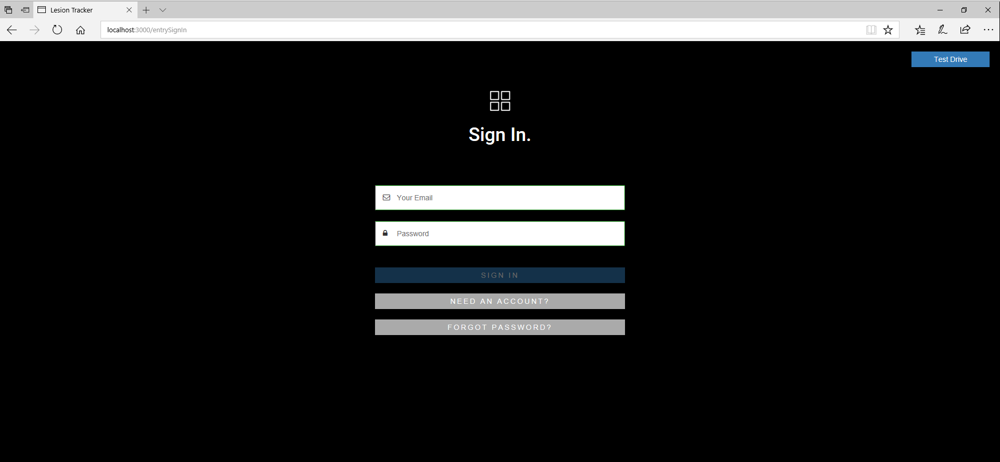
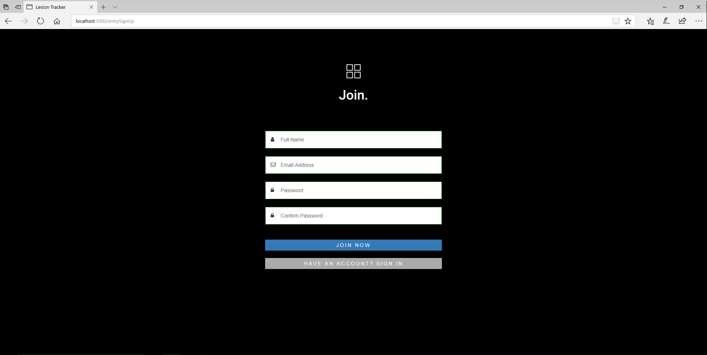
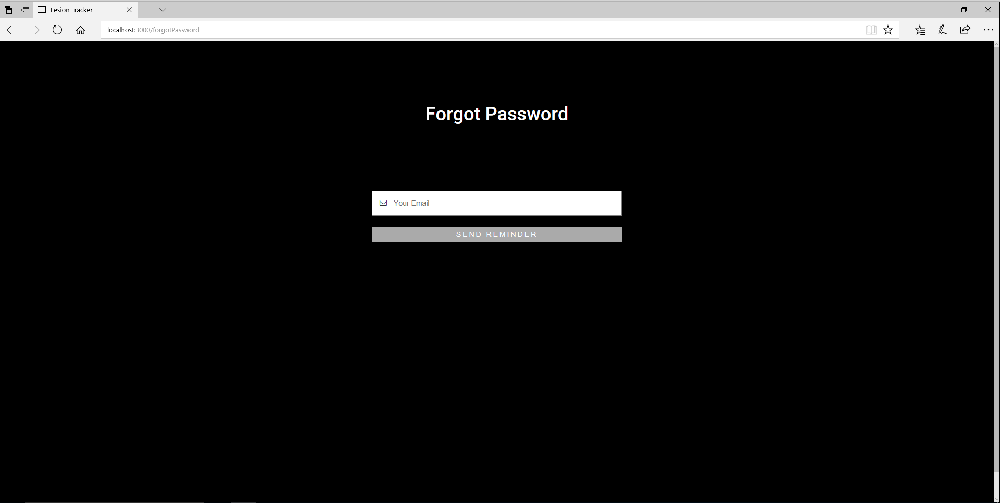
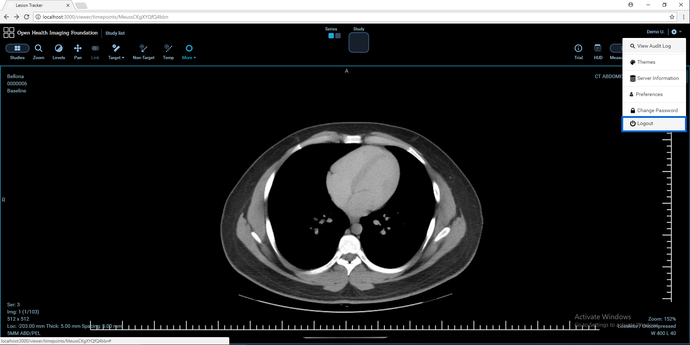

# User Accounts

## Sign In

LesionTracker requires authentication to access the viewer.
If you are already a registered user, enter Your Email and Password and click **Sign In**

## Register An Account

If you are a new user, click **Need An Account** and fill the all fields and click **Join Now**

Note: There is a Test Drive button on the top-right of Login page. Test Drive is used to skip registration process and allows to use LesionTracker with a test account. This will be removed in the next versions.

## Forgot Password

To reset the password, enter Your Email and click **Send Reminder**. An email that includes a link to reset your password will be sent to your email address.

## Change Password

To change password:

1. Click Configuration menu icon at the top-right of the workspace then select **Change Password**
2. Enter your password and click **Change Password**

## Logout

To logout, click **Logout** on the Configuration menu.

