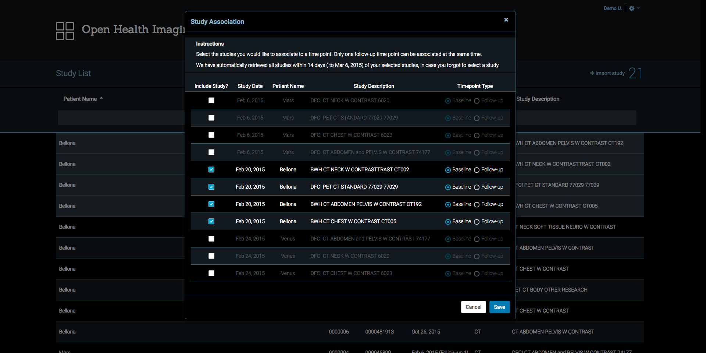

# Study and Timepoint Management

1. Study List allows to sort each column. To sort studies, click the desired
   column header.
2. Study List is filterable for each column and you can filter by more than one
   column by typing in the column field. To filter a column, type the text in
   the desired column header field and press Enter.
3. Pagination is provided for the Study List at the bottom of the page. You can
   change the number of rows per page or the current page.

## Study List Context Menu

When you right-click on the study row, Study Context Menu will pop up. Study
Context Menu includes operations at the study level.

There are a couple of ways to view a study:

- Simply double-click on the study row.
- Select **View** option on the Study Context Menu, then you will be redirected
  to Viewer page.

### Timepoint Association

1. To link a study with a timepoint, right-click on the study row and select
   **Associate** option on the Study Context Menu. You will see Study
   Association dialog.
2. To link multiple studies at the same time, hold Shift key and select studies
   you would like to associate, then right-click and select Associate on the
   Study Context Menu

The Study Association dialog allows you to select and unselect Timepoint Type
for the selected study or studies. Also, it will include all studies within 14
days of your selected studies, in case you forgot to select a study. After you
identify timepoints for the selected study or studies, click **Save** to save
the association.

### Remove Timepoint Association

To unlink a timepoint association with a study, right-click on the study row and
select **Remove Association** option on the Study Context Menu. Remove
Association will be disabled if the study is already dissociated.

### View Series Details

To view details of related series, right-click on the study row and select
**View Series Details** option on the Study Context Menu, then Series Details
dialog will pop up. Series Details dialog gives a summary of the selected study.

### Anonymize (Under Development)

...

### Send (Under Development)

...

### Export (Under Development)

...

### Delete (Under Development)

...
