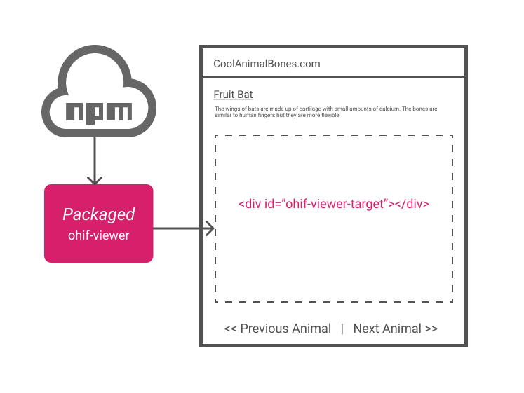

# Deployment

The OHIF Viewer can be embedded in other web applications via it's [packaged
script source][viewer-npm], or served up as a stand-alone PWA ([progressive web
application][pwa-url]) by building and hosting a collection of static assets. In
either case, you will need to configure your instance of the Viewer so that it
can connect to your data source (the database or PACS that provides the data
your Viewer will display).


Our goal is to make deployment as simple and painless as possible; however,
there is an inherent amount of complexity in configuring and deploying web
applications. If you find yourself a little lost, please don't hesitate to
[reach out for help](/help.md)

## Deployment Scenarios

### Embedded Viewer

The quickest and easiest way to get the OHIF Viewer up and running is to embed
it into an existing web application. It allows us to forego a "build step", and
add a powerful medical imaging viewer to an existing web page using only a few
include tags.

- Read more about it here: [Embedded Viewer](./recipes/embedded-viewer.md)
- And check out our [live demo on CodeSandbox][code-sandbox]




### Stand-alone Viewer

Deploying the OHIF Viewer as a stand-alone web application provides many
benefits, but comes at the cost of time and complexity. Some benefits include:

_Today:_

- Leverage [extensions](/extensions/index.md) to drop-in powerful new features
- Add routes and customize the viewer's workflow
- Finer control over styling and whitelabeling

_In the future:_

- The ability to package the viewer for [App Store distribution][app-store]
- Leverage `service-workers` for offline support and speed benefits from caching

#### Hosted Static Assets

At the end of the day, a production OHIF Viewer instance is a collection of
HTML, CSS, JS, Font Files, and Images. We "build" those files from our
`source code` with configuration specific to our project. We then make those
files publicly accessible by hosting them on a Web Server.

If you have not deployed a web application before, this may be a good time to
[reach out for help](/help.md), as these steps assume prior web development and
deployment experience.

##### Part 1 - Build Production Assets

"Building", or creating, the files you will need is the same regardless of the
web host you choose. You can find detailed instructions on how to configure and
build the OHIF Viewer in our
["Build for Production" guide](./recipes/build-for-production.md).

##### Part 2 - Host Your App

There are a lot of [benefits to hosting static assets][host-static-assets] over
dynamic content. You can find instructions on how to host your build's output
via one of these guides:

_Drag-n-drop_

- [Netlify: Drop](/deployment/recipes/static-assets.md#netlify-drop)

_Easy_

- [Surge.sh](/deployment/recipes/static-assets.md#surgesh)
- [GitHub Pages](/deployment/recipes/static-assets.md#github-pages)

_Advanced_

- [AWS S3 + Cloudfront](/deployment/recipes/static-assets.md#aws-s3--cloudfront)
- [GCP + Cloudflare](/deployment/recipes/static-assets.md#gcp--cloudflare)
- [Azure](/deployment/recipes/static-assets.md#azure)

## Data

The OHIF Viewer is able to connect to any data source that implements the [DICOM
Web Standard][dicom-web-standard]. [DICOM Web][dicom-web] refers to RESTful
DICOM Services -- a recently standardized set of guidelines for exchanging
medical images and imaging metadata over the internet. Not all archives fully
support it yet, but it is gaining wider adoption.

### Configure Connection

If you have an existing archive and intend to host the OHIF Viewer at the same
domain name as your archive, then connecting the two is as simple as following
the steps laid out in our
[Configuration Essentials Guide](./../configuring/index.md).

#### What if I don't have an imaging archive?

We provide some guidance on configuring a local image archive in our
[Data Source Essentials](./../configuring/data-source.md) guide. Hosting an
archive remotely is a little trickier. You can check out some of our
[advanced recipes](#recipes) for modeled setups that may work for you.

#### What if I intend to host the OHIF Viewer at a different domain?

There are two important steps to making sure this setup works:

1. Your Image Archive needs to be exposed, in some way, to the open web. This
   can be directly, or through a `reverse proxy`, but the Viewer needs _some
   way_ to request it's data.
2. \* Your Image Archive needs to have appropriate CORS (Cross-Origin Resource
   Sharing) Headers

> \* Cross-Origin Resource Sharing (CORS) is a mechanism that uses additional
> HTTP headers to tell a browser to let a web application running at one origin
> (domain) have permission to access selected resources from a server at a
> different origin. - [MDN Web Docs: Web - Http - CORS][cors]

Most image archives do not provide either of these features "out of the box".
It's common to use IIS, Nginx, or Apache to route incoming requests and append
appropriate headers. You can find an example of this setup in our
[Nginx + Image Archive Deployment Recipe](./recipes/nginx--image-archive.md).

#### What if my archive doesn't support DicomWeb?

It's possible to supply all Study data via JSON format, in the event you do not have a DicomWeb endpoint.
You can host all of the relevant files on any web accessible server (Amazon S3, Azure Blob Storage, Local file server etc.)

This JSON is supplied via the '?url=' query parameter.
It should reference an endpoint that returns **application/json** formatted text.

If you do not have an API, you can simply return a text file containing the JSON from any web server.


You tell the OHIF viewer to use JSON by appending the `'?url='` query to the `/Viewer` route:

eg. `https://my-test-ohif-server/viewer?url=https://my-json-server/study-uid.json`

The returned JSON object must contain a single root object with a 'studies' array.


*Sample JSON format:*
```json
{
    "studies": [
      {
        "StudyInstanceUID": "1.2.840.113619.2.5.1762583153.215519.978957063.78",
        "StudyDescription": "BRAIN SELLA",
        "StudyDate": "20010108",
        "StudyTime": "120022",
        "PatientName": "MISTER^MR",
        "PatientId": "832040",
        "series": [
          {
            "SeriesDescription": "SAG T-1",
            "SeriesInstanceUID": "1.2.840.113619.2.5.1762583153.215519.978957063.121",
            "SeriesNumber": 2,
            "SeriesDate": "20010108",
            "SeriesTime": "120318",
            "Modality": "MR",
            "instances": [
              {
                "metadata": {
                    "Columns": 512,
                    "Rows": 512,
                    "InstanceNumber": 3,
                    "AcquisitionNumber": 0,
                    "PhotometricInterpretation": "MONOCHROME2",
                    "BitsAllocated": 16,
                    "BitsStored": 16,
                    "PixelRepresentation": 1,
                    "SamplesPerPixel": 1,
                    "PixelSpacing": [0.390625, 0.390625],
                    "HighBit": 15,
                    "ImageOrientationPatient": [0,1,0,0,0,-1],
                    "ImagePositionPatient": [11.600000,-92.500000, 98.099998],
                    "FrameOfReferenceUID": "1.2.840.113619.2.5.1762583153.223134.978956938.470",
                    "ImageType": ["ORIGINAL","PRIMARY","OTHER"],
                    "Modality": "MR",
                    "SOPInstanceUID": "1.2.840.113619.2.5.1762583153.215519.978957063.124",
                    "SeriesInstanceUID": "1.2.840.113619.2.5.1762583153.215519.978957063.121",
                    "StudyInstanceUID": "1.2.840.113619.2.5.1762583153.215519.978957063.78"
                },
                "url": "dicomweb://s3.amazonaws.com/lury/MRStudy/1.2.840.113619.2.5.1762583153.215519.978957063.124.dcm"
             }
           ]
         }
       ]
     }
   ]
}
```
More info on this JSON format can be found here [Issue #1500](https://github.com/OHIF/Viewers/issues/1500)


**Implementation Notes:**

1. When hosting the viewer, you will also need to host a /viewer route on the server - or the browser may not be able to find the route.
2. For each instance url (dicom object) in the returned JSON, you must prefix the `url` with `dicomweb:` in order for the cornerstone image loader to retrieve it correctly.
 eg. `https://image-server/my-image.dcm` ---> `dicomweb:https://image-server/my-image.dcm`
3. The JSON format above is compatible with >= v3.7.8 of the application. Older versions of the viewer used a different JSON format. As of 20/04/20 the public [https://viewer.ohif.org/] is a pre 3.0 version that does not support this format yet.
4. The JSON format is case-sensitive. Please ensure you have matched casing with the naturalised Dicom format referenced in [Issue #1500](https://github.com/OHIF/Viewers/issues/1500).

*CORS Issues (Cross-Origin Resource Sharing)*

If you host a JSON API or Images on a different domain from the the app itself, you will likely have CORS issues. This will also happen when testing from Localhost and reaching out to remote servers.
Even if the domain is the same, different ports, subdomains or protocols (https vs http) will also cause CORS errors.
You will to need add a configuration on each server hosting these assets to allow your App server origin.

For example:

Lets assume your application is hosted on `https://my-ohif-server.com`.

Your JSON API is hosted on `https://my-json-api.aws.com`

And your images are stored on Amazon S3 at `https://my-s3-bucket.aws.com`

When you first start your application, browsing to `https://my-ohif-server.com/viewer?url=https://my-json-api.aws.com/api/my-json-study-info.json`, you will likely get a CORS error in the browser console as it tries to connect to `https://my-json-api.aws.com`.

Adding a setting on the JSON server to allow the CORS origin = `https://my-ohif-server.com` should solve this.

Next, you will likely get a similar CORS error, as the browser tries to go to `https://my-s3-bucket.aws.com`.
You will need to go to the S3 bucket configuration, and add a CORS setting to allow origin = `https://my-ohif-server.com`.

Essentially, whenever the application connects to a remote resource, you will need to add the applications url to the allowed CORS Origins on that resource. Adding an origin similar to https://localhost:3000 will also allow for local testing.


### Securing Your Data

> Feeling lost? Securing your data is important, and it can be hard to tell if
> you've gotten it right. Don't hesitate to work with professional auditors, or
> [enlist help from experts](./../help.md).

The OHIF Viewer can be configured to work with authorization servers that
support one or more of the OpenID-Connect authorization flows. The Viewer finds
it's OpenID-Connect settings on the `oidc` configuration key. You can set these
values following the instructions laid out in the
[Configuration Essentials Guide](./../configuring/index.md).

_Example OpenID-Connect Settings:_

```js
window.config = {
  ...
  oidc: [
    {
      // ~ REQUIRED
      // Authorization Server URL
      authority: 'http://127.0.0.1/auth/realms/ohif',
      client_id: 'ohif-viewer',
      redirect_uri: 'http://127.0.0.1/callback', // `OHIFStandaloneViewer.js`
      response_type: 'code', // "Authorization Code Flow"
      scope: 'openid', // email profile openid
      // ~ OPTIONAL
      post_logout_redirect_uri: '/logout-redirect.html',
    },
  ],
}
```

You can find an example of this setup in our
[User Account Control Deployment Recipe](./recipes/user-account-control.md).

#### Choosing a Flow for the Viewer

In general, we recommend using the "Authorization Code Flow" ( [see
`response_type=code` here][code-flows]); however, the "Implicit Flow" ( [see
`response_type=token` here][code-flows]) can work if additional precautions are
taken. If the flow you've chosen produces a JWT Token, it's validity can be used
to secure access to your Image Archive as well.

### Recipes

We've included a few recipes for common deployment scenarios. There are many,
many possible configurations, so please don't feel limited to these setups.
Please feel free to suggest or contribute your own recipes.

- Script Include
  - [Embedding the Viewer](./recipes/embedded-viewer.md)
- Stand-Alone
  - [Build for Production](./recipes/build-for-production.md)
  - [Static](./recipes/static-assets.md)
  - [Nginx + Image Archive](./recipes/nginx--image-archive.md)
  - [User Account Control](./recipes/user-account-control.md)

<!--
  Links
  -->

<!-- prettier-ignore-start -->
[viewer-npm]: https://www.npmjs.com/package/@ohif/viewer
[pwa-url]: https://developers.google.com/web/progressive-web-apps/
[static-assets-url]: https://www.maxcdn.com/one/visual-glossary/static-content/
[app-store]: https://medium.freecodecamp.org/i-built-a-pwa-and-published-it-in-3-app-stores-heres-what-i-learned-7cb3f56daf9b
[dicom-web-standard]: https://www.dicomstandard.org/dicomweb/
[dicom-web]: https://en.wikipedia.org/wiki/DICOMweb
[host-static-assets]: https://www.netlify.com/blog/2016/05/18/9-reasons-your-site-should-be-static/
[cors]: https://developer.mozilla.org/en-US/docs/Web/HTTP/CORS
[code-flows]: https://medium.com/@darutk/diagrams-of-all-the-openid-connect-flows-6968e3990660
[code-sandbox]: https://codesandbox.io/s/viewer-script-tag-tprch
<!-- prettier-ignore-end -->
