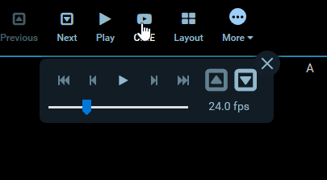
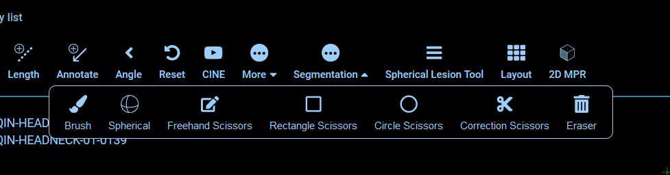

# Module: Toolbar

An extension can register a Toolbar Module by defining a `getToolbarModule`
method. This module is commonly used to define:

- [Module: Toolbar](#module-toolbar)
  - [Example Toolbar Module](#example-toolbar-module)
  - [Button Definitions](#button-definitions)
  - [Nested Toolbar Menus](#nested-toolbar-menus)
  - [Custom Components](#custom-components)



<center><i>Example toolbar button using the Dialog Service to show CINE controls.</i></center>

## Example Toolbar Module

The Toolbar Module should return an array of `definitions` and a
`defaultContext`. There are currently a few different variations of definitions,
each one is detailed further down.

```js
export default {
  id: 'example-toolbar-module',

  /**
   * @param {object} params
   * @param {ServicesManager} params.servicesManager
   * @param {CommandsManager} params.commandsManager
   */
  getToolbarModule({ servicesManager, commandsManager }) {
    return {
      definitions: [
        /* Array of definitions */
      ],
      defaultContext: ['ROUTE:VIEWER'],
    };
  },
};
```

## Button Definitions

The simplest definition has the following properties:

```js
{
  id: 'StackScroll',
  label: 'Stack Scroll',
  icon: 'bars',
  type: 'setToolActive',
  commandName: 'setToolActive',
  commandOptions: { toolName: 'StackScroll' },
},
```

| property         | description                                                       | values                                    |
| ---------------- | ----------------------------------------------------------------- | ----------------------------------------- |
| `id`             | Unique string identifier for the definition                       | \*                                        |
| `label`          | User/display friendly to show in UI                               | \*                                        |
| `icon`           | A string name for an icon supported by the consuming application. | \*                                        |
| `type`           | Used to determine the button's component and behavior             | `"setToolActive"`, `"command"`            |
| `commandName`    | (optional) The command to run when the button is used.            | Any command registered by a `CommandModule` |
| `commandOptions` | (optional) Options to pass the target `commandName`               | \*                                        |
| `context`        | (optional) Overrides module's `defaultContext`                    | Array of string context names             |

Where a button with a `type` of `setToolActive` has an "active" styling applied
when clicked; removing the active styling from all other buttons.

## Nested Toolbar Menus

You can indicate that buttons should be grouped and nested in a submenu by
including `buttons` property in a definition:

```js
{
  id: 'More',
  label: 'More',
  icon: 'ellipse-circle',
  buttons: [
    {
      id: 'cstInvert',
      label: 'Invert',
      icon: 'circle',
      type: 'command',
      commandName: 'invertViewport',
    },
  ],
},
```



<center><i>Example toolbar button demonstrating nested buttons.</i></center>

## Custom Components

The Toolbar Modules supports rendering custom components in place of the
application's default. In place of the `type`, `commandName`, and
`commandOptions` properties, we instead specify a `CustomComponent`.

```js
{
  id: 'Custom',
  label: 'Custom',
  icon: 'custom-icon',
  CustomComponent: CustomToolbarComponent,
}

```

The `CustomComponent` components will receive the following props:

```html
<CustomComponent
  parentContext="{parentContext}"
  toolbarClickCallback="{_handleToolbarButtonClick.bind(this)}"
  button="{button}"
  key="{button.id}"
  activeButtons="{activeButtonsIds}"
  isActive="{isActive}"
/>
```

| Property               | Type     | Description                     |
| ---------------------- | -------- | ------------------------------- |
| `activeButtons`        | string[] | list of active buttons          |
| `button`               | object   | its own definition object       |
| `key`                  | string   | React key prop                  |
| `isActive`             | boolean  | If current button is active     |
| `parentContext`        | ?        | The parent component's context? |
| `toolbarClickCallback` | func     | Callback method for clicks      |
