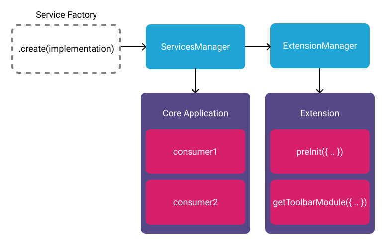

# Services (default)

- [Services (default)](#services-default)
  - [Overview](#overview)
  - [Example](#example)

## Overview

Services are a work in progress. As we are still in the progress of creating a
non-ui maintained service, this usage may change.

<!-- <div style="text-align: center;">
  <a href="/assets/img/services.png">
    
  </a>
  <div><i>Diagram showing relationship between React Context and UI Service</i></div>
</div> -->



## Example

The simplest service return a new object that has a `name` property, and
methods/properties that give the service its functionality. The "Factory
Function" that creates the service is provided with the implementation (this is
slightly different for UI Services).

```js
const _speak = () => {
  console.warn('Speak is not implemented');
};

/**
 * Factory function to create `HelloWorldService`
 *
 * @param {object} implementation
 * @param {function} implementation.speak - Speak's implementation
 * @returns HelloWorldService
 */
export default function createHelloWorldService({ speak }) {
  return {
    name: 'HelloWorldService',
    speak: speak || _speak,
  };
}
```

A service, once created, can be registered with the `ServicesManager` to make it
accessible to extensions. Similarly, the application code can access named
services from the `ServicesManager`.

```js
// In the application
const speak = () => {
  window.alert('HELLO WORLD');
};
const HelloWorldService = createHelloWorldService({ speak });
const servicesManager = new ServicesManager();

servicesManager.registerService(HelloWorldService);

// In an extension
const { HelloWorldService } = servicesManager.services;

if (HelloWorldService) {
  HelloWorldService.speak();
}
```
