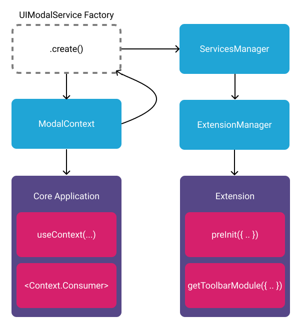

# UI Services

A typical web application will have components and state for common UI like
modals, notifications, dialogs, etc. A UI service makes it possible to leverage
these components from an extension.

<!-- <div style="text-align: center;">
  <a href="/assets/img/ui-services.png">
    
  </a>
  <div><i>Diagram showing relationship between React Context and UI Service</i></div>
</div> -->


<!-- <span style={{"textAlign": 'center', 'fontStyle': 'italic', 'paddingBottom':'10px'}}>Diagram showing relationship between React Context and UI Service</span> -->


In `@ohif/core`, we have a collection of service factories. We select one we
would like our application to support, create an instance of it, and pass that
instance to our `ServicesManager` AND to a React component (in this example,
`ModalContext`'s provider).

The `ModalContext`'s provider:

- Exposes context values
- Exposes methods that leverage `useCallback` hooks
- Sets the service's implementation in a `useEffect` hook

The `ServicesManager` is:

- Passed to the `ExtensionManager`
- The `ExtensionManager` makes the `ServicesManager` available to:
  - All of it's lifecycle hooks (`preRegistration`)
  - Each "getModuleFunction" (`getToolbarModule`, `getPanelModule`, etc.)

## Example

That's all fine and good, but it's still a little too abstract. What does this
translate to in practice?

```js
// In the application
import UINotificationService from '@ohif/core';
const servicesManager = new ServicesManager();

servicesManager.registerService(UINotificationService);

// UI Service Provider
useEffect(() => {
  if (service) {
    service.setServiceImplementation({ hide, show });
  }
}, [service, hide, show]);

// In an extension
const { UINotificationService } = servicesManager.services;

if (UINotificationService) {
  UINotificationService.show('Hello from the other side 👋');
}
```

<!-- <div style="text-align: center;">
  <a href="/assets/img/notification-example.gif">
    
  </a>
  <div><i>GIF showing successful call of UINotificationService from an extension.</i></div>
</div> -->


<span style={{"textAlign": 'center', 'fontStyle': 'italic'}}>GIF showing successful call of UINotificationService from an extension.</span>

## Tips & Tricks

It's important to remember that all we're doing is making it possible to control
bits of the application's UI from an extension. Here are a few non-obvious
takeaways worth mentioning:

- Your application code should continue to use React context
  (consumers/providers) as it normally would
- You can substitute our "out of the box" UI implementations with your own
- You can create and register your own UI services
- You can choose not to register a service or provide a service implementation
- In extensions, you can provide fallback/alternative behavior if an expected
  service is not registered
  - No `UIModalService`? Use the `UINotificationService` to notify users.
- While we don't have an examples of this, you can technically register a
  service in an extension and expose it to the core application

> Note: These are recommended patterns, not hard and fast rules. Following them
> will help reduce confusion and interoperability with the larger OHIF
> community, but they're not silver bullets. Please speak up, create an issue,
> if you would like to discuss new services or improvements to this pattern.

## Maintained Services

Our `@ohif/viewer` project is an example of how to glue together the different
parts and pieces of the OHIF Platform to create a polished and powerful product.
To accomplish that, we maintain several UI Services that you can use in your own
project, or provide alternative implementations for:

| Name                  | Docs                                 |
| --------------------- | ------------------------------------ |
| UIDialogService       | [Here](./ui-dialog-service.md)       |
| UIModalService        | [Here](./ui-modal-service.md)        |
| UINotificationService | [Here](./ui-notification-service.md) |
